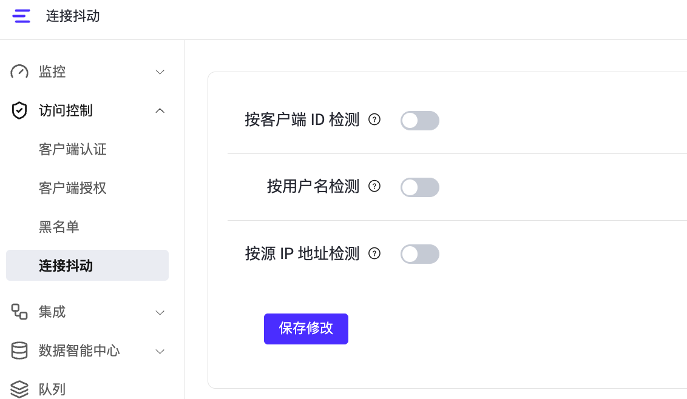

# 连接抖动检测

连接抖动检测用于识别指定时间窗口内重复发送的 `CONNECT` 报文。为避免大量连接尝试占用 EMQX 资源，当客户端 ID、用户名或源 IP 地址达到配置的阈值时，EMQX 会临时封禁对应的标识或地址。

从 EMQX 6.3.0 开始，连接抖动检测支持独立评估以下任意维度组合：

- 客户端 ID：统计使用同一客户端 ID 的连接尝试。
- 用户名：统计使用同一用户名的客户端连接尝试。未提供用户名的连接不计入此维度。
- 源 IP 地址：统计来自同一源 IP 地址的连接尝试。

每个已启用的维度都有独立的检测时间窗口、连接次数阈值和封禁时长。当客户端 ID、用户名或源 IP 地址达到阈值时，EMQX 会在认证前拒绝匹配该标识或地址的新连接，但不会断开已建立的连接。

连接抖动检测默认关闭。您可以通过 EMQX Dashboard 或配置文件启用并配置该功能。

## 通过 Dashboard 配置连接抖动检测

1. 在 Dashboard 中，点击**访问控制** -> **连接抖动**。
2. 启用一个或多个检测维度：
   - **按客户端 ID 检测**
   - **按用户名检测**
   - **按源 IP 地址检测**
3. 为每个已启用的维度配置以下参数：
   - **检测时间窗口**：EMQX 统计连接尝试的时间窗口。默认值为 `1` 分钟。
   - **最大连接次数**：在检测时间窗口内触发封禁的连接尝试次数。默认值为 `15`。
   - **封禁时长**：封禁客户端 ID、用户名或源 IP 地址的时长。默认值为 `5` 分钟。
4. 点击**保存修改**。



连接抖动检测创建的封禁记录会自动过期。您也可以在[黑名单](./blacklist.md)页面或通过 `/banned` REST API 查看或提前删除这些记录。

## 通过配置文件配置连接抖动检测

以下 HOCON 示例启用按客户端 ID 和用户名检测，并关闭按源 IP 地址检测：

```hocon
flapping_detect {
  by_clientid {
    window_time = 1m
    max_count = 15
    ban_time = 5m
  }

  by_username {
    window_time = 1m
    max_count = 15
    ban_time = 5m
  }

  by_peerhost = none
}
```

为维度配置检测参数即可启用该维度；将其设置为 `none` 可关闭。您也可以为各个 Zone 单独配置这些参数。

从 EMQX 6.3.0 开始，扁平字段 `flapping_detect.enable`、`flapping_detect.window_time`、`flapping_detect.max_count` 和 `flapping_detect.ban_time` 已弃用。EMQX 仍接受这些字段，并将其映射到 `flapping_detect.by_clientid`，因此 EMQX 6.3.0 之前创建的配置保持兼容。已弃用的字段仅影响按客户端 ID 检测；`by_username` 和 `by_peerhost` 仍为 `none`，需要显式配置才能启用。有关完整配置结构和优先级规则，参见[连接抖动配置](../configuration/flapping.md)。
