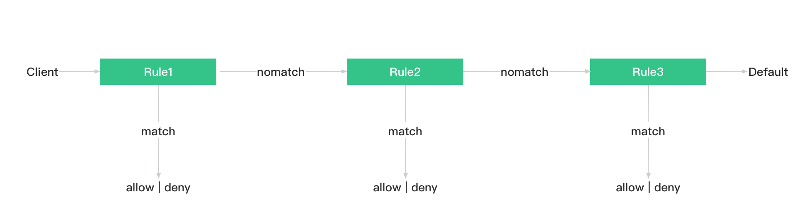

---
# 编写日期
date: 2020-02-19 09:15:26
# 作者 Github 名称
author: hjianbo
# 关键字
keywords:
# 描述
description:
# 分类
category: 
# 引用
ref:
---

# 发布订阅 ACL

**发布订阅 ACL** 指对 **发布 (PUBLISH)/订阅 (SUBSCRIBE)** 操作的 **权限控制**。例如拒绝用户名为 `Anna` 向 `open/elsa/door` 发布消息。

EMQ X 支持通过客户端发布订阅 ACL 进行客户端权限的管理，本章节介绍了 EMQ X 支持的发布订阅 ACL 以及对应插件的配置方法。


## ACL 插件

EMQ X 支持使用配置文件、外部主流数据库和自定义 HTTP API 作为 ACL 数据源。

连接数据源、进行访问控制功能是通过插件实现的，使用前需要启用相应的插件。

客户端订阅主题、发布消息时插件通过检查目标主题（Topic）是否在指定数据源允许/禁止列表内来实现对客户端的发布、订阅权限管理。


**配置文件/内置数据源**



* [内置数据库 认证/访问控制](../modules/mnesia_authentication.md)





* [内置 ACL](./acl-file.md)
* [Mnesia ACL](./acl-mnesia.md)



使用配置文件提供认证数据源，适用于变动较小的 ACL 管理。


**外部数据库**



* [MySQL 认证/访问控制](../modules/mysql_authentication.md)
* [PostgreSQL 认证/访问控制](../modules/pgsql_authentication.md)
* [Redis 认证/访问控制](../modules/redis_authentication.md)
* [MongoDB 认证/访问控制](../modules/mongo_authentication.md)
* [LDAP 认证/访问控制](../modules/ldap_authentication.md)





* [MySQL ACL](./acl-mysql.md)
* [PostgreSQL ACL](./acl-postgres.md)
* [Redis ACL](./acl-redis.md)
* [MongoDB ACL](./acl-mongodb.md)



外部数据库可以存储大量数据、动态管理 ACL，方便与外部设备管理系统集成。


**其他**



* [HTTP 认证/访问控制](../modules/http_authentication.md)





* [HTTP ACL](./acl-http.md)



HTTP ACL 能够实现复杂的 ACL 管理。

::: tip 

ACL 功能包含在认证鉴权插件中，更改插件配置后需要**重启插件**才能生效，

:::

## 规则详解

ACL 是允许与拒绝条件的集合，EMQ X 中使用以下元素描述 ACL 规则：

```bash
## Allow-Deny Who Pub-Sub Topic

"允许(Allow) / 拒绝(Deny)"  "谁(Who)"  "订阅(Subscribe) / 发布(Publish)" "主题列表(Topics)"
```

同时具有多条 ACL 规则时，EMQ X 将按照规则排序进行合并，以 [ACL 文件](./acl-file.md) 中的默认 ACL 为例，ACL 文件中配置了默认的 ACL 规则，规则从下至上加载：

1. 第一条规则允许客户端发布订阅所有主题
2. 第二条规则禁止全部客户端订阅 `$SYS/#` 与 `#` 主题
3. 第三条规则允许 ip 地址为 `127.0.0.1` 的客户端发布/订阅 `$SYS/#` 与 `#` 主题，为第二条开了特例
4. 第四条规则允许用户名为 `dashboard` 的客户端订阅 `$SYS/#` 主题，为第二条开了特例

```erlang
{allow, {user, "dashboard"}, subscribe, ["$SYS/#"]}.

{allow, {ipaddr, "127.0.0.1"}, pubsub, ["$SYS/#", "#"]}.

{deny, all, subscribe, ["$SYS/#", {eq, "#"}]}.

{allow, all}.
```


## 授权结果

任何一次 ACL 授权最终都会返回一个结果：

- 允许：经过检查允许客户端进行操作
- 禁止：经过检查禁止客户端操作
- 忽略（ignore）：未查找到 ACL 权限信息，无法显式判断结果是允许还是禁止，交由下一 ACL 插件或默认 ACL 规则来判断


## 全局配置

默认配置中 ACL 是开放授权的，即授权结果为**忽略（ignore）**时**允许**客户端通过授权。

通过 `etc/emqx.conf` 中的 ACL 配置可以更改该属性：

```bash
# etc/emqx.conf

## ACL 未匹配时默认授权
## Value: allow | deny
acl_nomatch = allow
```

配置默认 [ACL 文件](./acl-file.md)，使用文件定义默认 ACL 规则：

```bash
# etc/emqx.conf

acl_file = etc/acl.conf
```

配置 ACL 授权结果为**禁止**的响应动作，为 `disconnect` 时将断开设备：

```bash
# etc/emqx.conf

## Value: ignore | disconnect
acl_deny_action = ignore
```

::: tip
在 MQTT v3.1 和 v3.1.1 协议中，发布操作被拒绝后服务器无任何报文错误返回，这是协议设计的一个缺陷。但在 MQTT v5.0 协议上已经支持应答一个相应的错误报文。
:::


## 超级用户（superuser）

客户端可拥有“超级用户”身份，超级用户拥有最高权限不受 ACL 限制。

1. 认证鉴权插件启用超级用户功能后，发布订阅时 EMQ X 将优先检查客户端超级用户身份
2. 客户端为超级用户时，通过授权并跳过后续 ACL 检查


## ACL 缓存

ACL 缓存允许客户端在命中某条 ACL 规则后，便将其缓存至内存中，以便下次直接使用，客户端发布、订阅频率较高的情况下开启 ACL 缓存可以提高 ACL 检查性能。

在 `etc/emqx.conf` 可以配置 ACL 缓存大小与缓存时间：

```bash
# etc/emqx.conf

## 是否启用
enable_acl_cache = on

## 单个客户端最大缓存规则数量
acl_cache_max_size = 32

## 缓存失效时间，超时后缓存将被清除
acl_cache_ttl = 1m
```


### 清除缓存

在更新 ACL 规则后，某些客户端由于已经存在缓存，则无法立即生效。若要立即生效，则需手动清除所有的 ACL 缓存：

参见 [HTTP API - 清除 ACL 缓存](http-api.md#endpoint-get-acl-cache)


## ACL 鉴权链

当同时启用多个 ACL 插件时，EMQ X 将按照插件开启先后顺序进行链式鉴权：
- 一通过授权，终止链并允许客户端通过验证
- 一旦授权失败，终止链并禁止客户端通过验证
- 直到最后一个 ACL 插件仍未通过，根据**默认授权**配置判定
  - 默认授权为允许时，允许客户端通过验证
  - 默认授权为禁止时，禁止客户端通过验证
  



<!-- replace -->

::: tip 

同时只启用一个 ACL 插件可以提高客户端 ACL 检查性能。

:::


