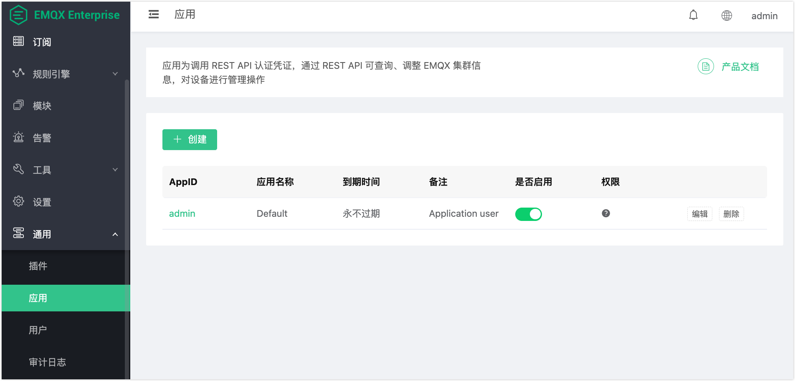

# API Key

EMQX Enterprise 提供管理 API（默认端口 8081），用于通过程序方式访问集群管理操作。API Key 由 AppID 和 AppSecret 组成，用于对管理 API 的请求进行认证。每个 Key 可以限定为只访问特定的 API 类别，从而精细控制每个集成应用或自动化工具的操作权限。

本文介绍 API Key 的创建、权限控制和认证方式。



## 快速开始

本节展示 API Key 的基本使用流程，包括创建 API Key 并调用管理 API。

1. 在 Dashboard 左侧导航栏点击 **管理** -> **应用**，点击**创建**。

2. 填写必要信息（如名称、权限等）并保存。记录生成的 AppID 和 AppSecret。

3. 使用该 Key 调用管理 API（8081 端口）：

   ```bash
   curl -u <app_id>:<app_secret> "http://127.0.0.1:8081/api/v4/clients"
   ```

4. 按需通过[权限类别](#权限类别)配置该 Key 可以执行的写入操作。例如，仅允许访问规则引擎相关写操作，可在权限设置中将 `rule_engine` 设为 `true`。

## 管理 API 的认证方式

调用管理 API（端口 `8081`）时，必须使用 API Key 进行认证。

API Key 由 `AppID` 和 `AppSecret` 组成，认证方式为 HTTP Basic Auth：

```
Authorization: Basic base64(AppID:AppSecret)
```

大多数 HTTP 客户端可通过 `-u` 参数自动设置认证信息：

```bash
curl -u my_app_id:my_app_secret "http://127.0.0.1:8081/api/v4/clients"
```

### 认证失败

在以下情况下，请求将返回 HTTP `401`：

- `AppID` 或 `AppSecret` 无效
- API Key 已被禁用（`status: false`）
- API Key 已过期

## 创建 API Key

创建用于访问管理 API 的 API Key：

1. 在左侧导航栏中，点击**管理**，再点击**应用**（HTTP API）。
2. 点击**添加应用**。
3. 填写各字段并配置所需权限。有关权限详情，见[权限模型](#权限模型)。
4. 点击**确认**保存。

::: warning 注意

AppSecret 仅在创建时显示，请妥善保管。

:::

## 权限模型

API Key 权限控制的是对应接口的写入操作（`PUT`、`POST`、`DELETE`）。所有 API 的查询（`GET`）请求始终允许，不受权限设置影响。

**新建 API Key 默认拒绝所有写操作，按需开启。**

### 权限类别

每个 API Key 对以下五个类别各有独立的布尔权限。

将某类别设为 `true` 则允许该 Key 对对应接口执行写入操作，设为 `false` 则拒绝写入（GET 请求仍然允许）。

| 类别 | 权限键 | 覆盖的接口 |
|------|--------|-----------|
| 黑名单 | `banned` | `/api/v4/banned/` （客户端黑名单管理） |
| 规则引擎 | `rule_engine` | `/api/v4/rules/`、`/api/v4/actions/`、`/api/v4/rule_events/` |
| 资源 | `resources` | `/api/v4/resources/`、`/api/v4/resource_types/` |
| 插件 | `plugins` | `/api/v4/plugins/` |
| 模块 | `modules` | `/api/v4/modules/`、`/api/v4/trace/`、`/api/v4/topic-metrics/`、`/api/v4/quota/`、`/api/v4/client_tags/` |

新创建的 API Key 默认将所有五个类别设为 `false`，遵循最小权限原则。按需开启所需的写入权限。所有 Key 始终可以对任意接口执行查询（GET）操作。

### `fallback` 设置

许多常用接口不属于上述五个命名类别，例如：

- `/api/v4/clients/`
- `/api/v4/subscriptions/`
- `/api/v4/stats/`
- `/api/v4/metrics/`
- `/api/v4/nodes/`

`fallback` 参数控制 Key 对这些接口执行**写入操作**时的行为：

- `false`（默认）：拒绝写入访问。
- `true`：允许写入访问。

无论 `fallback` 如何设置，对这些接口的查询（GET）请求始终允许。

::: tip

大多数只读监控类接口（客户端、订阅、统计、指标、节点）均属于 `fallback` 管控的"未覆盖"类别。由于 GET 请求始终允许，无需将 `fallback` 设为 `true` 即可读取监控数据。只有当需要对未分类接口执行写入操作时，才需要开启 `fallback`。

:::

### 兼容模式

在权限系统引入之前创建的 API Key 会以兼容模式运行。兼容模式下的 Key 拥有所有 API 的完整读写权限，等同于所有类别设为 `true` 且 `fallback` 设为 `true`。

若要对兼容模式 Key 应用权限限制，可在 Dashboard 中编辑该 Key 并设置具体权限。此操作会退出兼容模式，并按照指定权限运行。

::: warning 注意

退出兼容模式后不可逆。退出兼容模式后，该 Key 将在正常权限体系下运行。

:::

## 管理 API Key

可以在 Dashboard 的**管理** -> **应用**（HTTP API）页面管理所有 API Key，包括查看、更新、禁用和删除操作。

- **查看详情**：点击 Key 名称可查看 AppID、权限、状态和过期时间。
- **更新**：点击**编辑**可修改名称、描述、状态、过期时间或权限。
- **禁用**：将 Key 状态设为禁用。禁用后的 Key 在任何 API 请求中都将返回 HTTP `401`。
- **删除**：点击**删除**可永久移除该 Key。

## 使用引导文件预配置 API Key

可以在 EMQX 启动之前通过引导文件（Bootstrap File）预配置 API Key。这对于初始部署或容器化环境尤为实用，在任何 API 调用可用之前就能确保凭证已就绪。

**配置方式：**

设置环境变量，指向文件路径：

```bash
EMQX_API_KEY__BOOTSTRAP_FILE=/path/to/bootstrap_keys.txt
```

**文件格式：**

每行一个 Key，AppID 和 AppSecret 以冒号分隔：

```
my_app_id:my_app_secret
another_app:another_secret
```

引导文件中创建的 Key 具有完全访问权限，不设任何权限限制，`fallback` 为 `true`，描述标签为 `Bootstrapped From File`。EMQX 启动后，可通过 Dashboard 对这些 Key 进行权限限制。

::: tip

建议使用引导文件创建初始管理 Key。启动后通过 Dashboard 管理所有后续 Key。

:::

## 安全建议

- **最小权限原则：** 只授予 Key 实际所需的写入权限。仅管理规则引擎的 CI/CD 流水线只需开启 `rule_engine: true`，其余保持 `false`。所有 Key 始终可以对任意接口执行查询（GET）操作。
- **谨慎管理 `fallback`：** 除非该 Key 明确需要对未分类接口执行写入操作，否则将 `fallback` 保持为 `false`。查询（GET）请求始终允许。
- **设置过期时间：** 对临时 Key 或短期流水线 Key，设置到期时间。
- **定期轮换密钥：** 通过 Dashboard 定期删除并重建 Key。
- **引导文件用于初始化，Dashboard 用于日常管理：** 用引导文件创建初始管理 Key，后续所有 Key 通过 Dashboard 管理。
