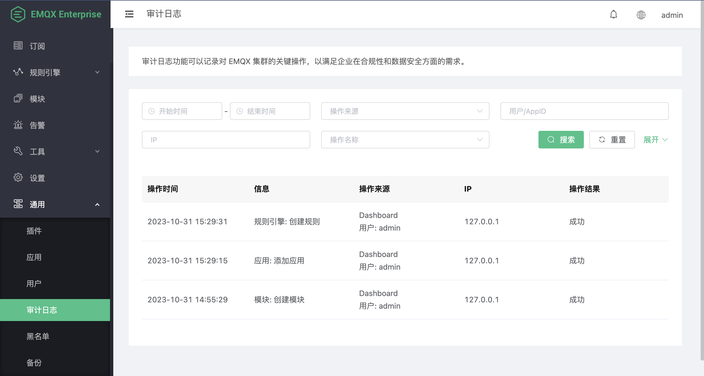

# 审计日志

审计日志（Audit Log）功能让您实时跟踪 EMQX 集群的重要操作变更，是企业用户遵守合规要求、确保数据安全的关键工具。EMQX 审计日志支持记录来自 [Dashboard](../getting-started/dashboard-ee.md) 、[REST API](../advanced/http-api.md) 以及 [命令行](../advanced/cli.md) 的变更性操作，例如 Dashboard 用户登录，对客户端、访问控制以及数据集成等资源的修改。而指标获取、客户端列表查询等只读操作则不会被记录。通过审计日志，企业用户可以方便地查看谁通过何种方式，在何时执行了哪些关键操作，以实现运营过程中的合规性和安全性审计。

::: warning 注意

命令行操作的审计日志可能包含敏感信息，在发送到日志收集器时需要谨慎操作。建议过滤日志内容或使用加密传输方式，避免未经授权的信息泄露。

:::

## 启用审计日志

审计日志默认是禁用的，您可以在**通用** -> **审计日志**页面中启用审计日志，也可以通过[模块](../modules/audit-log.md)进行管理。

启用时需要配置以下参数：

- **单节点储存最大日志条数**：储存的日志条数上限，默认值为 `5000`。一旦存储的日志条数达到预设的上限，将自动删除该节点内最早记录的一条日志，以腾出位置存储新的日志。通过这种方式控制每个节点内日志数量，防止日志占用过多资源影响性能。
- **忽略上报高频事件**：忽略部分场景下的高频操作，默认值为 `true`。高频事件包括订阅/发布/取消订阅以及踢除指定客户端，这些操作可能通过 REST API 频繁调用，导致审计日志数量过多。启用后，EMQX 将忽略这些高频事件，不记录到审计日志中，以减少日志数量。如果您需要记录这些高频事件，可以将该参数设置为 `false`。

## 在 Dashboard 中查看审计日志

审计日志启用后，EMQX 将记录所有变更性操作，记录可通过 Dashboard 上的操作列表进行查看，或通过 REST API 查询与获取。同时，操作记录也会同步写入到 `data/audit/audit.log.1` 日志文件中。

操作列表中包含以下信息：

- **操作时间**：该条操作记录发生的时间。
- **信息**：操作的简要信息，包括操作的组件、操作名称。
- **操作来源**：包括操作来源以及操作者，操作来源有**Dashboard**，**REST API**，**CLI**。对应的操作者分别为 Dashboard 登录用户，调用 REST API 的 AppID（应用 ID），以及发起操作的节点。
- **IP**：操作发起者的 IP 地址。如果操作来源为 CLI，该字段为空。
- **操作结果**：操作是否成功或失败。

操作列表页面如下图所示：



## 审计日志格式

当您通过 REST API 获取审计日志或通过日志文件查看日志内容，您会发现对于来自不同操作方式的操作记录，审计日志消息的格式中包含的字段有所不同。

### Dashboard 或 REST API 操作记录

记录来自 Dashboard 或 REST API 操作的审计日志包含操作用户、操作对象和操作结果等信息。通过 REST API 与日志文件获取的操作记录示例如下：

:::: tabs type:card

::: tab REST API

REST API 获取的记录示例：

```json
{
  "source_type": "dashboard",
  "source_ip": "127.0.0.1",
  "source": "admin",
  "operation_type": "apps",
  "operation_result": "success",
  "operation_name": "update_app",
  "node": "emqx@127.0.0.1",
  "http_user_agent": "Mozilla/5.0 (Macintosh; Intel Mac OS X 10_15_7) AppleWebKit/537.36 (KHTML, like Gecko) Chrome/118.0.0.0 Safari/537.36",
  "http_status_code": 200,
  "http_request": {
    "version": "HTTP/1.1",
    "scheme": "http",
    "qs": "",
    "port": 18083,
    "path": "/api/v4/apps/19e0bbf77174",
    "params": {
      "status": false,
      "name": "my-server",
      "expired": "undefined",
      "desc": "",
      "app_id": "19e0bbf77174"
    },
    "method": "PUT",
    "host": "localhost",
    "headers": {},
    "has_body": true,
    "body_length": 91,
    "bindings": {
      "appid": "19e0bbf77174"
    }
  },
  "http_method": "PUT",
  "failure_reason": "",
  "duration_ms": 1,
  "created_at": "2023-10-31T15:36:51.081452+08:00",
  "cli_args": ""
}
```

:::

::: tab 日志文件

日志文件记录示例：

```bash
2023-10-31T15:36:51.081452+08:00 {"source_type":"dashboard","source_ip":"127.0.0.1","source":"admin","operation_type":"apps","operation_result":"success","operation_name":"update_app","node":"emqx@127.0.0.1","http_user_agent":"Mozilla/5.0 (Macintosh; Intel Mac OS X 10_15_7) AppleWebKit/537.36 (KHTML, like Gecko) Chrome/118.0.0.0 Safari/537.36","http_status_code":200,"http_request":{"version":"HTTP/1.1","scheme":"http","qs":"","port":18083,"path":"/api/v4/apps/19e0bbf77174","params":{"status":false,"name":"my-server","expired":"undefined","desc":"","app_id":"19e0bbf77174"},"method":"PUT","host":"localhost","headers":{},"has_body":true,"body_length":91,"bindings":{"appid":"19e0bbf77174"}},"http_method":"PUT","duration_ms":1,"created_at":1698737811081452}
```

:::

::::

### 命令行操作记录

记录命令行操作的审计日志包含执行的命令、调用参数等信息。通过 REST API 与日志文件获取的操作记录示例如下：

:::: tabs type:card

::: tab REST API

REST API 获取的记录示例：

```json
{
  "source_type": "cli",
  "source_ip": "",
  "source": "",
  "operation_type": "listeners",
  "operation_result": "success",
  "operation_name": "emqx_mgmt_cli-listeners",
  "node": "emqx@127.0.0.1",
  "http_user_agent": "",
  "http_status_code": "",
  "http_request": "",
  "http_method": "",
  "failure_reason": "ok",
  "duration_ms": 14,
  "created_at": "2023-10-31T15:35:50.280458+08:00",
  "cli_args": ["listeners", "stop", "mqtt:ssl:external"]
}
```

:::

::: tab 日志文件

日志文件记录示例：

```bash
2023-10-31T15:35:50.280458+08:00 {"source_type":"cli","operation_type":"listeners","operation_result":"success","operation_name":"emqx_mgmt_cli-listeners","node":"emqx@127.0.0.1","failure_reason":"ok","duration_ms":14,"created_at":1698737750280458,"cli_args":["listeners","stop","mqtt:ssl:external"]}
```

:::

::::
