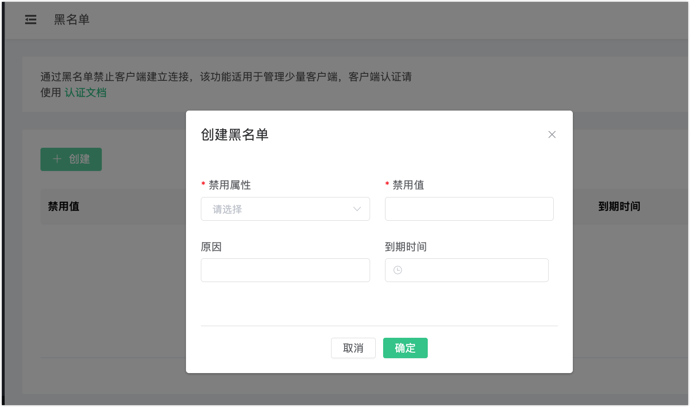

---
# 编写日期
date: 2020-02-25 17:15:26
# 作者 Github 名称
author: tigercl
# 关键字
keywords:
# 描述
description:
# 分类
category: 
# 引用
ref:
---

# 黑名单和连接抖动

## 黑名单

EMQX 为用户提供了黑名单功能，用户可以通过相关的 HTTP API 将指定客户端加入黑名单以拒绝该客户端访问，除了客户端标识符以外，还支持直接封禁用户名甚至 IP 地址。

封禁还可以通过规则来实现，这些规则包括：

- 使用正则表达式匹配客户端 ID 和用户名。

  ::: tip

  通过使用正则表达式进行封禁不会对已连接的客户端生效。

  :::

- 使用 CIDR 范围匹配源 IP 地址。

::: tip

请注意，如果匹配规则的数量很大，可能会对性能产生负面影响。这是因为系统需要检查每个尝试连接的客户端是否符合所有规则，与直接封禁相比，这一过程更为复杂。

:::

相关 HTTP API 的具体使用方法，请参见 [HTTP API - 黑名单](http-api.md#endpoint-banned)。

::: tip
黑名单只适用于少量客户端封禁需求，如果有大量客户端需要认证管理，请使用 [认证](./auth.md) 功能。
:::

## 创建黑名单

1. 在 EMQX Dashboard 页面，点击左侧导航栏的**通用** -> **黑名单**。点击页面中的**创建**。
2. 在弹出的**创建**页面，按照页面提示配置：
   - **禁用属性**：通过下拉列表选择封禁客户端的方式，可以指定 `clientid`、`username`、`peerhost`，然后提供相应的**禁用值**。
   - **原因**（可选）：说明为该对象设置黑名单的原因。
   - **到期时间**（可选）：设置该规则的到期时间。
3. 点击**确定**完成配置。



## 移除黑名单

您可以通过点击**操作**列中的**删除**按钮来移除单个被封禁客户端记录。

## 连接抖动

在黑名单功能的基础上，EMQX 支持自动封禁那些被检测到短时间内频繁登录的客户端，并且在一段时间内拒绝这些客户端的登录，以避免此类客户端过多占用服务器资源而影响其他客户端的正常使用。

需要注意的是，自动封禁功能只封禁客户端标识符，并不封禁用户名和 IP 地址，即该机器只要更换客户端标识符就能够继续登录。

此功能默认关闭，用户可以在 `emqx.conf` 配置文件中将 `enable_flapping_detect` 配置项设为 `on` 以启用此功能。

```bash
zone.external.enable_flapping_detect = off
```

用户可以为此功能调整触发阈值和封禁时长，对应配置项如下：

```bash
flapping_detect_policy = 30, 1m, 5m
```

此配置项的值以 `,` 分隔，依次表示客户端离线次数，检测的时间范围以及封禁时长，因此上述默认配置即表示如果客户端在 1 分钟内离线次数达到 30 次，那么该客户端使用的客户端标识符将被封禁 5 分钟。当然你也可以使用其他诸如秒、小时在内的时间单位，关于这部分内容，请参见 [配置说明](../getting-started/config.md#)。
