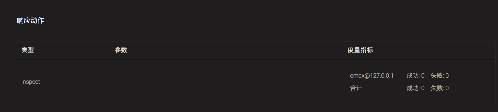

---
# 编写日期
date: 2020-02-07 17:15:26
# 作者 Github 名称
author: wivwiv
# 关键字
keywords:
# 描述
description:
# 分类
category: 
# 引用
ref:
---

# 命令行接口

EMQ X 提供了 `./bin/emqx_ctl` 的管理命令行，用于用户对 EMQ X 进行管理、配置、查询。

## status 命令

查询 EMQ X 运行状态:

```bash
$ ./bin/emqx_ctl status
Node 'emqx@127.0.0.1' is started
emqx v4.0.0 is running
```

## mgmt 命令

mgmt 命令查询应用程序。

| 命令                             | 描述                         |
| -------------------------------- | ---------------------------- |
| `mgmt list                       ` | 列出应用程序列表             |
| `mgmt insert <AppId> <Name>   `| 添加允许访问 HTTP API 的应用程序     |
| `mgmt update <AppId> <status>` | 更新允许访问 HTTP API 的应用程序     |
| `mgmt lookup <AppId>         ` | 获取允许访问 HTTP API 的应用程序详情 |
| `mgmt delete <AppId>           ` | 删除允许访问 HTTP API 的应用程序     |

### mgmt list

列出应用程序列表:

```bash
$ ./bin/emqx_ctl mgmt list
app_id: 901abdba8eb8c, secret: MjgzMzQ5MjM1MzUzMTc4MjgyMjE3NzU4ODcwMDg0NjQ4OTG, name: hello, desc: , status: true, expired: undefined
```

### mgmt insert <AppId> <Name>

添加 HTTP API 的应用程序:

```bash
$ ./bin/emqx_ctl mgmt insert dbcb6e023370b world
AppSecret: MjgzMzQ5MjYyMTY3ODk4MjA5NzMwODExODMxMDM1NDk0NDA
```

### mgmt update <AppId> <status>

更新 HTTP API 的应用程序:

```bash
$ ./bin/emqx_ctl mgmt update dbcb6e023370b stop
update successfully.
```

### mgmt lookup <AppId>

获取 HTTP API 的应用程序详情:

```bash
$ ./bin/emqx_ctl mgmt lookup dbcb6e023370b
app_id: dbcb6e023370b
secret: MjgzMzQ5MjYyMTY3ODk4MjA5NzMwODExODMxMDM1NDk0NDA
name: world
desc: Application user
status: stop
expired: undefined
```

### mgmt delete <AppId>

删除 HTTP API 的应用程序:

```bash
$ ./bin/emqx_ctl mgmt delete dbcb6e023370b
ok
```

## broker 命令

broker 命令查询服务器基本信息，启动时间，统计数据与性能数据。

| 命令           | 描述                                                         |
| -------------- | ------------------------------------------------------------ |
| `broker` | 查询 EMQ X 描述、版本、启动时间                    |
| `broker stats` | 查询连接 (Connection)、会话 (Session)、主题 (Topic)、订阅 (Subscription)、路由 (Route) 统计信息 |
| `broker metrics` | 查询 MQTT 报文 (Packet)、消息 (Message) 收发统计             |

查询 EMQ X 基本信息，包括版本、启动时间等:

```bash
$ ./bin/emqx_ctl broker
sysdescr  : EMQ X Broker
version   : 4.0.0
uptime    : 4 minutes, 52 seconds
datetime  : 2020-02-21 09:39:58
```

### broker stats

查询服务器客户端连接 (Connections)、主题 (Topics)、订阅 (Subscriptions)、路由 (Routes) 统计:

```bash
$ ./bin/emqx_ctl broker stats
actions.count                 : 5
actions.max                   : 5
channels.count                : 0
channels.max                  : 0
connections.count             : 0
connections.max               : 0
resources.count               : 0
resources.max                 : 0
retained.count                : 3
retained.max                  : 3
routes.count                  : 0
routes.max                    : 0
rules.count                   : 0
rules.max                     : 0
sessions.count                : 0
sessions.max                  : 0
suboptions.count              : 0
suboptions.max                : 0
subscribers.count             : 0
subscribers.max               : 0
subscriptions.count           : 0
subscriptions.max             : 0
subscriptions.shared.count    : 0
subscriptions.shared.max      : 0
topics.count                  : 0
topics.max                    : 0
```

### broker metrics

查询服务器流量 (Bytes)、MQTT 报文 (Packets)、消息 (Messages) 收发统计:

```bash
$ ./bin/emqx_ctl broker metrics
actions.success               : 0
bytes.received                : 0
bytes.sent                    : 0
client.auth.anonymous         : 0
client.authenticate           : 0
client.check_acl              : 0
client.connack                : 0
client.connect                : 0
client.connected              : 0
client.disconnected           : 0
client.subscribe              : 0
client.unsubscribe            : 0
delivery.dropped              : 0
delivery.dropped.expired      : 0
delivery.dropped.no_local     : 0
delivery.dropped.qos0_msg     : 0
delivery.dropped.queue_full   : 0
delivery.dropped.too_large    : 0
messages.acked                : 0
messages.delayed              : 0
messages.delivered            : 0
messages.dropped              : 0
messages.dropped.expired      : 0
messages.dropped.no_subscriber: 0
messages.forward              : 0
messages.publish              : 0
messages.qos0.received        : 0
messages.qos0.sent            : 0
messages.qos1.received        : 0
messages.qos1.sent            : 0
messages.qos2.received        : 0
messages.qos2.sent            : 0
messages.received             : 0
messages.retained             : 3
messages.sent                 : 0
packets.auth.received         : 0
packets.auth.sent             : 0
packets.connack.auth_error    : 0
packets.connack.error         : 0
packets.connack.sent          : 0
packets.connect.received      : 0
packets.disconnect.received   : 0
packets.disconnect.sent       : 0
packets.pingreq.received      : 0
packets.pingresp.sent         : 0
packets.puback.inuse          : 0
packets.puback.missed         : 0
packets.puback.received       : 0
packets.puback.sent           : 0
packets.pubcomp.inuse         : 0
packets.pubcomp.missed        : 0
packets.pubcomp.received      : 0
packets.pubcomp.sent          : 0
packets.publish.auth_error    : 0
packets.publish.dropped       : 0
packets.publish.error         : 0
packets.publish.received      : 0
packets.publish.sent          : 0
packets.pubrec.inuse          : 0
packets.pubrec.missed         : 0
packets.pubrec.received       : 0
packets.pubrec.sent           : 0
packets.pubrel.missed         : 0
packets.pubrel.received       : 0
packets.pubrel.sent           : 0
packets.received              : 0
packets.sent                  : 0
packets.suback.sent           : 0
packets.subscribe.auth_error  : 0
packets.subscribe.error       : 0
packets.subscribe.received    : 0
packets.unsuback.sent         : 0
packets.unsubscribe.error     : 0
packets.unsubscribe.received  : 0
rules.matched                 : 0
session.created               : 0
session.discarded             : 0
session.resumed               : 0
session.takeovered            : 0
session.terminated            : 0
```

## cluster 命令

cluster 命令可以管理由多个 EMQ X 节点（进程）组成的集群:

| 命令                         | 描述           |
| ---------------------------- | -------------- |
| `cluster join <Node>        `| 加入集群       |
| `cluster leave              `| 离开集群       |
| `cluster force-leave <Node> `| 从集群删除节点 |
| `cluster status             `| 查询集群状态   |

示例:

为更好地展示 cluster 命令，我们先在本机启动两个节点并组成集群，为避免端口冲突，我们对 emqx2 节点的监听端口做出了调整，例如 MQTT/TCP 监听端口由默认的 1883 改为了 2883，详情请参见 [配置说明](../getting-started/config.md) 与 [配置项](../configuration/configuration.md)。

启动 emqx1 :

```bash
$ cd emqx1 && ./bin/emqx start
```

启动 emqx2 :

```bash
$ cd emqx2 && ./bin/emqx start
```

使用 `cluster join <Node>` 将两个节点组成集群：

```bash
$ cd emqx2 && ./bin/emqx_ctl cluster join emqx1@127.0.0.1
 
Join the cluster successfully.
Cluster status: [{running_nodes,['emqx1@127.0.0.1','emqx2@127.0.0.1']}]
```

任意节点目录下查询集群状态:

```bash
$ ./bin/emqx_ctl cluster status
Cluster status: [{running_nodes,['emqx2@127.0.0.1','emqx1@127.0.0.1']}]
```

集群消息路由测试:
MQTT 命令行工具使用由 EMQ X 团队开发的 [emqtt](https://github.com/emqx/emqtt/releases) 客户端。

```bash
# emqx1 节点（1883 端口）订阅主题 x
$ ./bin/emqtt sub -t x -q 1 -p 1883
Client emqtt-a7de8fffbe2fbeb2fadb sent CONNECT
Client emqtt-a7de8fffbe2fbeb2fadb subscribed to x

# 向 emqx2 节点（2883 端口 ）发布消息
$ ./bin/emqtt pub -t x -q 1 -p 2883 --payload hello
Client emqtt-0898fa447676e17479a5 sent CONNECT
Client emqtt-0898fa447676e17479a5 sent PUBLISH (Q1, R0, D0, Topic=x, Payload=...(5 bytes))
Client emqtt-0898fa447676e17479a5 sent DISCONNECT

# emqx1 节点（1883 端口）收到消息
$ ./bin/emqtt sub -t x -q 1 -p 1883
hello
```

emqx2 节点离开集群:

```bash
$ cd emqx2 && ./bin/emqx_ctl cluster leave
```

强制 emqx2 节点离开集群，需要在集群下的目标节点以外的节点上进行操作:

```bash
$ cd emqx1 && ./bin/emqx_ctl cluster force-leave emqx2@127.0.0.1
```

注意，EMQ X 不支持一个已经在一个集群中的节点加入另外一个集群，因为这会导致两个集群数据不一致，但支持加入过集群的节点在离开该集群后加入另一个集群。

## acl 命令

重新加载 acl 规则:

```bash
$ ./bin/emqx_ctl acl reload
ok
```

## clients 命令

clients 命令查询连接的 MQTT 客户端。

| 命令                      | 描述                     |
| ------------------------- | ------------------------ |
| `clients list           ` | 列出所有客户端连接       |
| `clients show <ClientId>` | 查询指定 ClientId 的客户端 |
| `clients kick <ClientId>` | 踢除指定 ClientId 的客户端，连接与会话将一并终结。 |

### clients list

列出所有客户端连接:

```bash
$ ./bin/emqx_ctl clients list
Client (mosqsub/43832-airlee.lo, username=test1, peername=127.0.0.1:62135, clean_start=true, keepalive=60, session_expiry_interval=0, subscriptions=0, inflight=0, awaiting_rel=0, delivered_msgs=0, enqueued_msgs=0, dropped_msgs=0, connected=true, created_at=1582249657, connected_at=1582249657)
Client (mosqsub/44011-airlee.lo, username=test2, peername=127.0.0.1:64961, clean_start=true, keepalive=60, session_expiry_interval=0, subscriptions=0, inflight=0, awaiting_rel=0, delivered_msgs=0, enqueued_msgs=0, dropped_msgs=0, connected=true, created_at=1582249657, connected_at=1582249657, disconnected_at=1582249702)
    ...
```

返回 Client 对象的属性:

| Name | 描述 |
| ------------------------- | ------------------------- |
| username                  | 用户名                       |
| peername                  | 客户端 IP 与端口                |
| clean\_start              | MQTT Clean Start          |
| keepalive                 | MQTT KeepAlive            |
| session\_expiry\_interval | 会话过期间隔                    |
| subscriptions             | 当前订阅数量                    |
| inflight                  | 当前正在下发的 QoS 1 和 QoS 2 的消息总数     |
| awaiting\_rel             | 等待客户端发送 PUBREL 的 QoS2 消息数 |
| delivered\_msgs           | EMQ X 向此客户端转发的消息数量 (包含重传)  |
| enqueued\_msgs            | 消息队列当前长度                  |
| dropped\_msgs             | 消息队列达到最大长度后丢弃的消息数量        |
| connected                 | 是否在线                      |
| created\_at               | 会话创建时间戳                |
| connected\_at             | 客户端连接时间戳                |
| disconnected_at | 客户端断开连接时间戳（仅当断开连接还保留会话时才会出现） |

### clients show <ClientId>

查询指定 ClientId 的客户端:

```bash
$ ./bin/emqx_ctl clients show "mosqsub/43832-airlee.lo"
Client (mosqsub/43832-airlee.lo, username=test1, peername=127.0.0.1:62747, clean_start=false, keepalive=60, session_expiry_interval=7200, subscriptions=0, inflight=0, awaiting_rel=0, delivered_msgs=0, enqueued_msgs=0, dropped_msgs=0, connected=true, created_at=1576479557, connected_at=1576479557)
```

### clients kick <ClientId>

踢除指定 ClientId 的客户端:

```bash
$ ./bin/emqx_ctl clients kick "clientid"
ok
```

## routes 命令

routes 命令用于查询路由信息。

EMQ X 中路由是指主题与节点的映射关系，用于在多个节点之间路由消息。

| 命令                  | 描述                |
| --------------------- | ------------------- |
| `routes list        ` | 列出所有路由        |
| `routes show <Topic>` | 查询指定 Topic 的路由 |

### routes list

列出所有路由:

```bash
$ ./bin/emqx_ctl routes list
t2/# -> emqx2@127.0.0.1
t/+/x -> emqx2@127.0.0.1,emqx@127.0.0.1
```

### routes show <Topic>

查询指定 Topic d的路由:

```bash
$ ./bin/emqx_ctl routes show t/+/x
t/+/x -> emqx2@127.0.0.1,emqx@127.0.0.1
```

## subscriptions 命令

subscriptions 命令查询消息服务器的订阅 (Subscription) 表。

| 命令                                         | 描述                     |
| -------------------------------------------- | ------------------------ |
| `subscriptions list                        ` | 列出所有订阅             |
| `subscriptions show <ClientId>             ` | 查询指定 ClientId 客户端的订阅 |
| `subscriptions add <ClientId> <Topic> <QoS>` | 手动添加静态订阅         |
| `subscriptions del <ClientId> <Topic>      ` | 手动删除静态订阅         |

### subscriptions list

列出所有订阅:

```bash
$ ./bin/emqx_ctl subscriptions list
mosqsub/91042-airlee.lo -> t/y:1
mosqsub/90475-airlee.lo -> t/+/x:2
```

### subscriptions show <ClientId>

查询某个 Client 的订阅:

```bash
$ ./bin/emqx_ctl subscriptions show 'mosqsub/90475-airlee.lo'
mosqsub/90475-airlee.lo -> t/+/x:2
```

### subscriptions add <ClientId> <Topic> <QoS>

手动添加订阅关系:

```bash
$ ./bin/emqx_ctl subscriptions add 'mosqsub/90475-airlee.lo' '/world' 1
ok
```

### subscriptions del <ClientId> <Topic>

手动删除订阅关系:

```bash
$ ./bin/emqx_ctl subscriptions del 'mosqsub/90475-airlee.lo' '/world'
ok
```

## plugins 命令

plugins 命令用于加载、卸载、查询插件应用。EMQ X 通过插件扩展认证、定制功能，插件配置位于 `etc/plugins/` 目录下。

| 命令 | 描述 |
| ------------------------- | -------------- |
| `plugins list            `| 列出全部插件 (Plugin) |
| `plugins load <Plugin>   `| 加载插件 (Plugin)   |
| `plugins unload <Plugin> `| 卸载插件 (Plugin)   |
| `plugins reload <Plugin> `| 重载插件 (Plugin)   |

 当配置文件发生更改，如果需要配置立即生效，你可以执行 `emqx_ctl reload <Plugin\> 命令，即使插件在配置修改时并未处于运行状态，你也应当使用此命令而不是 `emqx_ctl load <Plugin\>，因为 `emqx_ctl load <Plugin\> 不会编译新的配置文件。

### plugins list

列出全部插件:

```bash
$ ./bin/emqx_ctl plugins list
Plugin (emqx_auth_clientid, version=v4.0.0, description=EMQ X Authentication with ClientId/Password, active=false)
Plugin (emqx_auth_http, version=v4.0.0, description=EMQ X Authentication/ACL with HTTP API, active=false)
Plugin (emqx_auth_jwt, version=v4.0.0, description=EMQ X Authentication with JWT, active=false)
Plugin (emqx_auth_ldap, version=v4.0.0, description=EMQ X Authentication/ACL with LDAP, active=false)
Plugin (emqx_auth_mongo, version=v4.0.0, description=EMQ X Authentication/ACL with MongoDB, active=false)
Plugin (emqx_auth_mysql, version=v4.0.0, description=EMQ X Authentication/ACL with MySQL, active=false)
Plugin (emqx_auth_pgsql, version=v4.0.0, description=EMQ X Authentication/ACL with PostgreSQL, active=false)
Plugin (emqx_auth_redis, version=v4.0.0, description=EMQ X Authentication/ACL with Redis, active=false)
Plugin (emqx_auth_username, version=v4.0.0, description=EMQ X Authentication with Username and Password, active=false)
Plugin (emqx_bridge_mqtt, version=v4.0.0, description=EMQ X Bridge to MQTT Broker, active=false)
Plugin (emqx_coap, version=v4.0.0, description=EMQ X CoAP Gateway, active=false)
Plugin (emqx_dashboard, version=v4.0.0, description=EMQ X Web Dashboard, active=true)
Plugin (emqx_delayed_publish, version=v4.0.0, description=EMQ X Delayed Publish, active=false)
Plugin (emqx_lua_hook, version=v4.0.0, description=EMQ X Lua Hooks, active=false)
Plugin (emqx_lwm2m, version=v4.0.0, description=EMQ X LwM2M Gateway, active=false)
Plugin (emqx_management, version=v4.0.0, description=EMQ X Management API and CLI, active=true)
Plugin (emqx_plugin_template, version=v4.0.0, description=EMQ X Plugin Template, active=false)
Plugin (emqx_psk_file, version=v4.0.0, description=EMQX PSK Plugin from File, active=false)
Plugin (emqx_recon, version=v4.0.0, description=EMQ X Recon Plugin, active=true)
Plugin (emqx_reloader, version=v4.0.0, description=EMQ X Reloader Plugin, active=false)
Plugin (emqx_retainer, version=v4.0.0, description=EMQ X Retainer, active=true)
Plugin (emqx_rule_engine, version=v4.0.0, description=EMQ X Rule Engine, active=true)
Plugin (emqx_sn, version=v4.0.0, description=EMQ X MQTT SN Plugin, active=false)
Plugin (emqx_statsd, version=v4.0.0, description=Statsd for EMQ X, active=false)
Plugin (emqx_stomp, version=v4.0.0, description=EMQ X Stomp Protocol Plugin, active=false)
Plugin (emqx_web_hook, version=v4.0.0, description=EMQ X Webhook Plugin, active=false)
```

插件属性:

| Name        | 描述       |
| ----------- | ---------- |
| version     | 插件版本   |
| description | 插件描述   |
| active      | 是否已加载 |

### plugins load <Plugin>

加载插件:

```bash
$ ./bin/emqx_ctl plugins load emqx_lua_hook
Plugin emqx_lua_hook loaded successfully.
```

### plugins unload <Plugin>

卸载插件:

```bash
$ ./bin/emqx_ctl plugins unload emqx_lua_hook
Plugin emqx_lua_hook unloaded successfully.
```

### plugins reload <Plugin>

重载插件:

```bash
$ ./bin/emqx_ctl plugins reload emqx_lua_hook
Plugin emqx_lua_hook reloaded successfully.
```

## modules 命令

modules 命令用于加载、卸载和查询内置模块。

| 命令 | 描述 |
| ------------------------- | ---------------------- |
| `modules list            `| 列出全部内置模块 (Module) |
| `modules load <Module>   `| 加载内置模块 (Module) |
| `modules unload <Module> `| 卸载内置模块 (Module) |
| `modules reload <Module> `| 重载内置模块 (Module) |

### modules list

列出全部内置模块:

```bash
$ ./bin/emqx_ctl modules list
Module(emqx_mod_delayed, description=EMQ X Delayed Publish Module, active=false)
Module(emqx_mod_topic_metrics, description=EMQ X Topic Metrics Module, active=false)
Module(emqx_mod_subscription, description=EMQ X Subscription Module, active=false)
Module(emqx_mod_acl_internal, description=EMQ X Internal ACL Module, active=true)
Module(emqx_mod_rewrite, description=EMQ X Topic Rewrite Module, active=false)
Module(emqx_mod_presence, description=EMQ X Presence Module, active=true)
```

### modules load

加载内置模块:

```bash
$ ./bin/emqx_ctl modules load emqx_mod_delayed
Module emqx_mod_delayed loaded successfully.
```

### modules unload

卸载内置模块:

```bash
$ ./bin/emqx_ctl modules unload emqx_mod_delayed
Module emqx_mod_delayed unloaded successfully.
```

### modules reload

重载内置模块:

```bash
$ ./bin/emqx_ctl modules reload emqx_mod_acl_internal
Module emqx_mod_acl_internal reloaded successfully.
```

## vm 命令

vm 命令用于查询 Erlang 虚拟机负载、内存、进程、IO 信息。

| 命令        | 描述                    |
| ----------- | ----------------------- |
| `vm        `| 等同于 vm all           |
| `vm all    `| 查询 VM 全部信息        |
| `vm load   `| 查询 VM 负载            |
| `vm memory `| 查询 VM 内存            |
| `vm process`| 查询 VM Erlang 进程数量 |
| `vm io     `| 查询 VM io 最大文件句柄 |
| `vm ports  `| 查询 VM 的端口          |

### vm all

查询 VM 全部信息，包括负载、内存、Erlang 进程数量等:

```bash
$ ./bin/emqx_ctl vm all
cpu/load1               : 4.22
cpu/load5               : 3.29
cpu/load15              : 3.16
memory/total            : 99995208
memory/processes        : 38998248
memory/processes_used   : 38938520
memory/system           : 60996960
memory/atom             : 1189073
memory/atom_used        : 1173808
memory/binary           : 100336
memory/code             : 25439961
memory/ets              : 7161128
process/limit           : 2097152
process/count           : 315
io/max_fds              : 10240
io/active_fds           : 0
ports/count             : 18
ports/limit             : 1048576
```

### vm load

查询 VM 负载:

```bash
$ ./bin/emqx_ctl vm load
cpu/load1               : 2.21
cpu/load5               : 2.60
cpu/load15              : 2.36
```

### vm memory

查询 VM 内存:

```bash
$ ./bin/emqx_ctl vm memory
memory/total            : 23967736
memory/processes        : 3594216
memory/processes_used   : 3593112
memory/system           : 20373520
memory/atom             : 512601
memory/atom_used        : 491955
memory/binary           : 51432
memory/code             : 13401565
memory/ets              : 1082848
```

### vm process

查询 Erlang 进程数量及其限制:

```bash
$ ./bin/emqx_ctl vm process
process/limit           : 2097152
process/count           : 314
```

### vm io

查询文件描述符数量及其限制:

```bash
$ ./bin/emqx_ctl vm io
io/max_fds              : 10240
io/active_fds           : 0
```

### vm ports

查询端口占用数量及其限制:

```bash
$ ./bin/emqx_ctl vm ports
ports/count           : 18
ports/limit           : 1048576
```

## mnesia 命令

查询 mnesia 数据库系统状态。

## log 命令

log 命令用于设置日志等级。访问 [Documentation of logger](http://erlang.org/doc/apps/kernel/logger_chapter.html) 以获取详细信息

|                     命令                     |                  描述                  |
| -------------------------------------------- | -------------------------------------- |
| `log set-level <Level>`                      | 设置主日志等级和所有 Handlers 日志等级 |
| `log primary-level`                          | 查看主日志等级                         |
| `log primary-lelvel <Level>`                 | 设置主日志等级                         |
| `log handlers list`                          | 查看当前安装的所有 Handlers            |
| `log handlers start <HandlerId>`             | 启动某个已停止的 Handler               |
| `log handlers stop <HandlerId>`              | 停止某个 Handler                       |
| `log handlers set-level <HandlerId> <Level>` | 设置指定 Handler 的日志等级            |

日志的等级由低到高分别为：`debug | info | notice | warning | error | critical | alert | emergency`，日志等级越低，系统输出的日志数量越多，消耗的系统资源越大。为提高系统运行性能，默认的主日志等级是 error。

### log set-level <Level>

设置主日志等级和所有 Handlers 日志等级:

```bash
$ ./bin/emqx_ctl log set-level debug
debug
```

### log primary-level

查看主日志等级:

```bash
$ ./bin/emqx_ctl log primary-level
debug
```

### log primary-level <Level>

设置主日志等级:

```bash
$ ./bin/emqx_ctl log primary-level info
info
```

### log handlers list

查看当前安装的所有 Handlers:

```bash
$ ./bin/emqx_ctl log handlers list
LogHandler(id=ssl_handler, level=debug, destination=console, status=started)
LogHandler(id=file, level=warning, destination=log/emqx.log, status=started)
LogHandler(id=default, level=warning, destination=console, status=started)
```

### log handlers start <HandlerId>

启动 log handler `'default'`:

```bash
$ ./bin/emqx_ctl log handlers start default
log handler default started
```

### log handlers stop <HandlerId>

停止 log handler `'default'`:

```bash
$ ./bin/emqx_ctl log handlers stop default
log handler default stopped
```

### log handlers set-level <HandlerId> <Level>

设置指定 Handler 的日志等级:

```bash
$ ./bin/emqx_ctl log handlers set-level emqx_logger_handler error
error
```

## trace 命令

trace 命令用于追踪某个 Client 或 Topic，打印日志信息到文件，详情请查看 [日志与追踪](../getting-started/log.md)。

| 命令                                              | 描述                                       |
| ------------------------------------------------ | ------------------------------------------ |
| `trace list                                    ` | 列出所有开启的追踪                         |
| `trace start client <ClientId> <File> [<Level>]` | 开启 Client 追踪，存储指定等级的日志到文件 |
| `trace stop client <ClientId>                  ` | 关闭 Client 追踪                           |
| `trace start topic <Topic> <File> [<Level>]    ` | 开启 Topic 追踪，存储指定等级的日志到文件  |
| `trace stop topic <Topic>                      ` | 关闭 Topic 追踪                            |

### trace start client <ClientId> <File> [ <Level> ]

开启 Client 追踪:

```bash
$ ./bin/emqx_ctl log primary-level debug
debug
    
$ ./bin/emqx_ctl trace start client clientid log/clientid_trace.log
trace clientid clientid successfully
    
$ ./bin/emqx_ctl trace start client clientid2 log/clientid2_trace.log error
trace clientid clientid2 successfully
```

### trace stop client <ClientId>

关闭 Client 追踪:

```bash
$ ./bin/emqx_ctl trace stop client clientid
stop tracing clientid clientid successfully
```

### trace start topic <Topic> <File> [ <Level> ]

开启 Topic 追踪:

```bash
$ ./bin/emqx_ctl log primary-level debug
debug

$ ./bin/emqx_ctl trace start topic topic log/topic_trace.log
trace topic topic successfully

$ ./bin/emqx_ctl trace start topic topic2 log/topic2_trace.log error
trace topic topic2 successfully
```

### trace stop topic <Topic>

关闭 Topic 追踪:

```bash
$ ./bin/emqx_ctl trace topic topic off
stop tracing topic topic successfully
```

### trace list

列出所有开启的追踪:

```bash
$ ./bin/emqx_ctl trace list
Trace (clientid=clientid2, level=error, destination="log/clientid2_trace.log")
Trace (topic=topic2, level=error, destination="log/topic2_trace.log")
```

## listeners

listeners 命令用于查询开启的 TCP 服务监听器。

| 命令                            | 描述                      |
| ------------------------------- | ------------------------- |
| `listeners `                    | 查询开启的服务监听器      |
| `listeners stop <Identifier> `  | 停止一个监听器，`Identifier` 式为 `<Protocol>[:<Transport>]:<Name>`, 例如 `mqtt:tcp:internal`，`http:management` |

### listeners list

查询开启的 TCP 服务监听器:

```bash
$ ./bin/emqx_ctl listeners
mqtt:ssl:external
  listen_on       : 0.0.0.0:8883
  acceptors       : 16
  max_conns       : 102400
  current_conn    : 0
  shutdown_count  : []
mqtt:tcp:external
  listen_on       : 0.0.0.0:1883
  acceptors       : 8
  max_conns       : 1024000
  current_conn    : 0
  shutdown_count  : []
mqtt:tcp:internal
  listen_on       : 127.0.0.1:11883
  acceptors       : 4
  max_conns       : 1024000
  current_conn    : 0
  shutdown_count  : []
http:dashboard
  listen_on       : 0.0.0.0:18083
  acceptors       : 4
  max_conns       : 512
  current_conn    : 0
  shutdown_count  : []
http:management
  listen_on       : 0.0.0.0:8081
  acceptors       : 2
  max_conns       : 512
  current_conn    : 0
  shutdown_count  : []
mqtt:ws:external
  listen_on       : 0.0.0.0:8083
  acceptors       : 4
  max_conns       : 102400
  current_conn    : 0
  shutdown_count  : []
mqtt:wss:external
  listen_on       : 0.0.0.0:8084
  acceptors       : 4
  max_conns       : 16
  current_conn    : 0
  shutdown_count  : []
```

listener 参数说明:

| Name            | 描述                |
| --------------- | ------------------- |
| acceptors       | TCP Acceptor 池     |
| max\_conns      | 最大允许连接数      |
| current\_conns  | 当前连接数          |
| shutdown\_count | 连接关闭原因统计 |

### listeners stop

停止监听端口:

```bash
$ ./bin/emqx_ctl listeners stop mqtt:tcp:external
Stop mqtt:tcp:external listener on 0.0.0.0:1883 successfully.
```

## recon 命令

EMQ X 的 recon 命令基于 Erlang Recon 库实现，用于帮助 DevOps 人员诊断生产节点中的问题，普通用户无需关心。使用 recon 命令会耗费一定的性能，请谨慎使用。

| 命令                    | 描述                                                         |
| ----------------------- | ------------------------------------------------------------ |
| `recon memory            `| [recon\_alloc:memory/2](http://ferd.github.io/recon/recon_alloc.html#memory-2) |
| `recon allocated         `| [recon\_alloc:memory (allocated\_types, current/max)](http://ferd.github.io/recon/recon_alloc.html#memory-2) |
| `recon bin_leak         `| [recon:bin\_leak (100)](http://ferd.github.io/recon/recon.html#bin_leak-1) |
| `recon node_stats       `| [recon:node\_stats_print(10, 1000)](http://ferd.github.io/recon/recon.html#node_stats_print-2) |
| `recon remote_load Mod  `| [recon:remote\_load (Mod)](http://ferd.github.io/recon/recon.html#remote_load-1) |
| `recon proc_count Attr N `| [recon:proc_count(Attr, N)](http://ferd.github.io/recon/recon.html#proc_count-2) |

访问 [Documentation for recon](http://ferd.github.io/recon/) 以获取详细信息。

## retainer 命令

| 命令                     | 描述                         |
| ------------------------ | ---------------------------- |
| `retainer info         ` | 显示保留消息的数量           |
| `retainer topics       ` | 显示当前存储的保留消息的所有主题       |
| `retainer clean        ` | 清除所有保留的消息           |
| `retainer clean <Topic>` | 清除指定的主题下的保留的消息 |

### retainer info

显示保留消息的数量:

```bash
$ ./bin/emqx_ctl retainer info
retained/total: 3
```

### retainer topics

显示当前存储的保留消息的所有主题:

```bash
$ ./bin/emqx_ctl retainer topics
$SYS/brokers/emqx@127.0.0.1/version
$SYS/brokers/emqx@127.0.0.1/sysdescr
$SYS/brokers
```

### retainer clean

清除所有保留的消息:

```bash
$ ./bin/emqx_ctl retainer clean
Cleaned 3 retained messages
```

### retainer clean <Topic>

清除指定的主题下的保留的消息:

```bash
$ ./bin/emqx_ctl retainer clean topic
Cleaned 1 retained messages
```

## admins 命令

用于创建、删除管理员账号，重置管理员密码。

| 命令                                       | 描述            |
| ----------------------------------------- | --------------- |
| `admins add <Username> <Password> <Tags> `| 创建 admin 账号 |
| `admins passwd <Username> <Password>     `| 重置 admin 密码 |
| `admins del <Username>                   `| 删除 admin 账号 |

### admins add <Username> <Password> <Tags>

创建 admin 账户:

```bash
$ ./bin/emqx_ctl admins add root public test
ok
```

### admins passwd <Username> <Password>

重置 admin 账户密码:

```bash
$ ./bin/emqx_ctl admins passwd root private
ok
```

### admins del <Username>

删除 admin 账户:

```bash
$ ./bin/emqx_ctl admins del root
ok
```

## 规则引擎(rule engine) 命令

### rules 命令

| 命令                                          | 描述            |
| --------------------------------------------- | --------------- |
| `rules list`                                  | List all rules |
| `rules show <RuleId>`                         | Show a rule    |
| `rules create <sql> <actions> [-d [<descr>]]` | Create a rule  |
| `rules delete <RuleId>`                       | Delete a rule  |

#### rules create

创建一个新的规则。参数:

- *`<sql>`*: 规则 SQL
- *`<actions>`*: JSON 格式的动作列表
- *`-d <descr>`*: 可选，规则描述信息

使用举例:
```bash
## 创建一个测试规则，简单打印所有发送到 't/a' 主题的消息内容
$ ./bin/emqx_ctl rules create \
    'select * from "t/a"' \
    '[{"name":"inspect", "params": {"a": 1}}]' \
    -d 'Rule for debug'

Rule rule:9a6a725d created
```
上例创建了一个 ID 为 `rule:9a6a725d` 的规则，动作列表里只有一个动作：动作名为 inspect，动作的参数是
`{"a": 1}`。

#### rules list

列出当前所有的规则:
```bash
$ ./bin/emqx_ctl rules list

rule(id='rule:9a6a725d', for='['t/a']', rawsql='select * from "t/a"', actions=[{"metrics":...,"name":"inspect","params":...}], metrics=..., enabled='true', description='Rule for debug')
```
#### rules show

查询规则:
```
## 查询 RuleID 为 'rule:9a6a725d' 的规则
$ ./bin/emqx_ctl rules show 'rule:9a6a725d'

rule(id='rule:9a6a725d', for='['t/a']', rawsql='select * from "t/a"', actions=[{"metrics":...,"name":"inspect","params":...}], metrics=..., enabled='true', description='Rule for debug')
```
#### rules delete

删除规则:
```bash
## 删除 RuleID 为 'rule:9a6a725d' 的规则
$ ./bin/emqx_ctl rules delete 'rule:9a6a725d'

ok
```
### rule-actions 命令

| 命令                           | 描述            |
| ------------------------------ | --------------- |
| `rule-actions list`            | List actions |
| `rule-actions show <ActionId>` | Show a rule action |


::: tip
动作可以由 EMQ X 内置(称为系统内置动作)，或者由 EMQ X 插件编写，但不能通过 CLI/API 添加或删除。
:::

#### rule-actions show

查询动作:
```bash
    ## 查询名为 'inspect' 的动作
$ ./bin/emqx_ctl rule-actions show 'inspect'

action(name='inspect', app='emqx_rule_engine', types=[], title ='Inspect (debug)', description='Inspect the details of action params for debug purpose')
```
#### rule-actions list

列出符合条件的动作:
```bash
## 列出当前所有的动作
$ ./bin/emqx_ctl rule-actions list

action(name='data_to_rabbit', app='emqx_bridge_rabbit', types=[bridge_rabbit], title ='Data bridge to RabbitMQ', description='Store Data to Kafka')
action(name='data_to_timescaledb', app='emqx_backend_pgsql', types=[timescaledb], title ='Data to TimescaleDB', description='Store data to TimescaleDB')
...
```
### resources 命令

| 命令                                                          | 描述            |
| ------------------------------------------------------------ | --------------- |
| `resources create <type> [-c [<config>]] [-d [<descr>]]`     | Create a resource |
| `resources list [-t <ResourceType>]`                         | List resources    |
| `resources show <ResourceId>`                                | Show a resource   |
| `resources delete <ResourceId>`                              | Delete a resource |

#### resources create

创建一个新的资源，参数:

- type: 资源类型
- \-c config: JSON 格式的配置
- \-d descr: 可选，资源的描述
```bash
$ ./bin/emqx_ctl resources create 'web_hook' -c '{"url": "http://host-name/chats"}' -d 'forward msgs to host-name/chats'

Resource resource:a7a38187 created
```
#### resources list

列出当前所有的资源:
```bash
$ ./bin/emqx_ctl resources list

resource(id='resource:a7a38187', type='web_hook', config=#{<<"url">> => <<"http://host-name/chats">>}, status=#{is_alive => false}, description='forward msgs to host-name/chats')
```
列出当前某个类型的资源:
```bash
$ ./bin/emqx_ctl resources list --type='web_hook'

resource(id='resource:a7a38187', type='web_hook', config=#{<<"url">> => <<"http://host-name/chats">>}, status=#{is_alive => false}, description='forward msgs to host-name/chats')
```
#### resources show

查询资源:
```bash
$ ./bin/emqx_ctl resources show 'resource:a7a38187'

resource(id='resource:a7a38187', type='web_hook', config=#{<<"url">> => <<"http://host-name/chats">>}, status=#{is_alive => false}, description='forward msgs to host-name/chats')
```
#### resources delete

删除资源:
```bash
$ ./bin/emqx_ctl resources delete 'resource:a7a38187'

ok
```
### resource-types 命令

| 命令                          | 描述            |
| ---------------------------- | --------------- |
| resource-types list          | List all resource-types |
| resource-types show `<Type>` | Show a resource-type    |

::: tip
资源类型可以由 EMQ X 内置(称为系统内置资源类型)，或者由 EMQ X 插件编写，但不能通过 CLI/API 添加或删除。
:::

#### resource-types list

列出当前所有的资源类型:
```bash
./bin/emqx_ctl resource-types list

resource_type(name='backend_mongo_rs', provider='emqx_backend_mongo', title ='MongoDB Replica Set Mode', description='MongoDB Replica Set Mode')
resource_type(name='backend_cassa', provider='emqx_backend_cassa', title ='Cassandra', description='Cassandra Database')
...
```
#### resource-types show

查询资源类型:
```bash
$ ./bin/emqx_ctl resource-types show backend_mysql

resource_type(name='backend_mysql', provider='emqx_backend_mysql', title ='MySQL', description='MySQL Database')
```
## 与规则引擎相关的状态、统计指标和告警

### 规则状态和统计指标


- 已命中: 规则命中(规则 SQL 匹配成功)的次数，
- 命中速度: 规则命中的速度(次/秒)
- 最大命中速度: 规则命中速度的峰值(次/秒)
- 5分钟平均速度: 5分钟内规则的平均命中速度(次/秒)

### 动作状态和统计指标



- 成功: 动作执行成功次数
- 失败: 动作执行失败次数

### 资源状态和告警


- 可用: 资源可用
- 不可用: 资源不可用(比如数据库连接断开)
