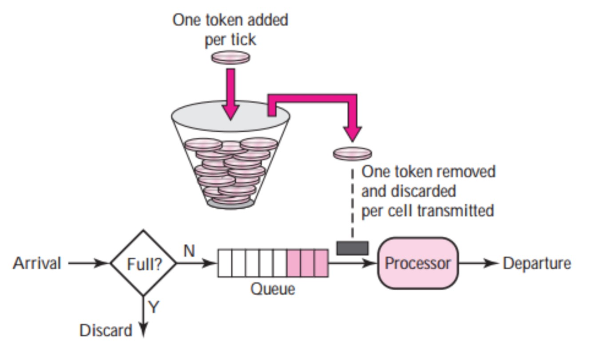

---
# 编写日期
date: 2020-02-21 11:06:13
# 作者 Github 名称
author: HJianBo & terry-xiaoyu
# 关键字
keywords: rate-limit
# 描述
description:
# 分类
category: 
# 引用
ref:
---

# 速率限制
EMQ X 提供对接入速度、消息速度的限制：当客户端连接请求速度超过指定限制的时候，暂停新连接的建立；当消息接收速度超过指定限制的时候，暂停接收消息。

速率限制是一种 *backpressure* 方案，从入口处避免了系统过载，保证了系统的稳定和可预测的吞吐。速率限制可在 `etc/emqx.conf` 中配置：

|               配置项                |      类型       | 默认值 |                 描述                 |
| ----------------------------------- | --------------- | ------ | ------------------------------------ |
| listener.tcp.external.max_conn_rate | Number          | 1000   | 本节点上允许的最大连接速率 (conn/s)  |
| zone.external.rate_limit.conn_messagess_in | Number,Duration | 无限制 | 单连接上允许的最大发布速率 (msg/s)   |
| zone.external.rate_limit.conn_bytes_in | Size,Duration | 无限制 | 单连接上允许的最大报文速率 (bytes/s) |

- **max_conn_rate** 是单个 emqx 节点上连接建立的速度限制。`1000` 代表秒最多允许 1000 个客户端接入。
- **conn_messages_in** 是单个连接上接收 PUBLISH 报文的速率限制。`100,10s` 代表每个连接上允许收到的最大 PUBLISH 消息速率是每 10 秒 100 个。
- **conn_bytes_in** 是单个连接上接收 TCP数据包的速率限制。`100KB,10s` 代表每个连接上允许收到的最大 TCP 报文速率是每 10 秒 100KB。

`conn_messages_in` 和 `conn_bytes_in` 提供的都是针对单个连接的限制，EMQ X 目前没有提供全局的消息速率限制。

## 速率限制原理
EMQ X 使⽤[令牌桶 (Token Bucket)](https://en.wikipedia.org/wiki/Token_bucket) 算法来对所有的 Rate Limit 来做控制。 令牌桶算法 的逻辑如下图:



- 存在一个可容纳令牌(Token) 的最大值 burst 的桶(Bucket)，最大值 burst 简记为 b 。
- 存在一个 rate 为每秒向桶添加令牌的速率，简记为 r 。当桶满时则不不再向桶中加⼊入令牌。
- 每当有 1 个(或 N 个)请求抵达时，则从桶中拿出 1 个 (或 N 个) 令牌。如果令牌不不够则阻塞，等待令牌的⽣生成。

由此可知该算法中:

- 长期来看，所限制的请求速率的平均值等于 rate 的值。

- 记实际请求达到速度为 M，且 M > r，那么，实际运⾏中能达到的最大(峰值)速率为 M = b + r，证明：

  容易想到，最大速率 M 为：能在1个单位时间内消耗完满状态令牌桶的速度。而桶中令牌的消耗速度为 M - r，故可知：b / (M - r) = 1，得 M = b + r

### 令牌桶算法在 EMQ X 中的应用

当使用如下配置做报文速率限制的时候：

```
zone.external.rate_limit.conn_bytes_in = 100KB,10s
```

EMQ X 将使用两个值初始化每个连接的 rate-limit 处理器：

- rate = 100 KB / 10s = 10240 B/s
- burst = 100 KB = 102400 B

根据 [消息速率限制原理](#rate-limit-explanation) 中的算法，可知：

- 长期来看允许的平均速率限制为 10240 B/s
- 允许的峰值速率为 102400 + 10240 = 112640 B/s

为提高系统吞吐，EMQ X 的接入模块不会一条一条的从 socket 读取报文，而是每次从 socket 读取 N 条报文。rate-limit 检查的时机就是在收到这 N 条报文之后，准备继续收取下个 N 条报文之前。故实际的限制速率不会如算法一样精准。EMQ X 只提供了一个大概的速率限制。`N` 的值可以在 `etc/emqx.conf` 中配置：

|             配置项             |  类型  | 默认值 |               描述               |
| ------------------------------ | ------ | ------ | -------------------------------- |
| listener.tcp.external.active_n | Number | 100    | emqx 每次从 TCP 栈读取多少条消息 |
