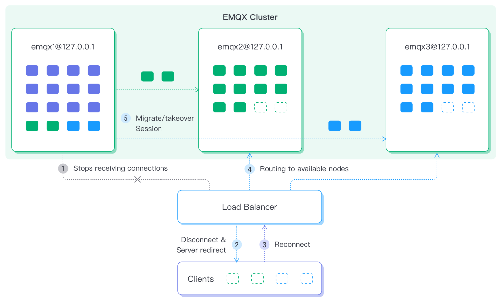

# 节点疏散与集群负载重平衡

MQTT 是有状态的长连接接入协议，这为 EMQX 集群运维带来了一些困难，节点疏散与集群负载重平衡应运而生。

## 节点疏散

某些情况下您需要对集群中某个节点进行维护或升级操作，如果此时节点上存在连接和会话，关闭节点可能会导致数据丢失，以及短时间内大量设备下线重连，造成服务器负载过高从而影响整体业务。

为此 EMQX 提供了一种优雅关闭节点的方式即节点疏散，以帮助您在关闭节点前将节点所有连接与会话数据迁移到集群其他节点。

### 疏散流程

指定需要停机维护的节点以启动节点疏散，疏散节点会执行以下流程：

1. 停止接收新的连接请求；
2. 按照预设的速度（由 `conn-evict-rate` 指定）逐渐断开当前连接的客户端，已断开的客户端会通过重连机制连接到集群其他节点，重连成功后会话将迁移到新节点上。不同协议版本重连机制不同：
   1. 对于 MQTT v3.1/v3.1.1 客户端，通过负载均衡策略指定，需要客户端开启重连机制；
   2. 对于 MQTT v5.0 客户端，由 `redirect-to` 参数指定重连节点。

3. 由于客户端重连需要一定时间，在所有客户端连接断开后节点将继续等待一段时间（由 `wait-takeover` 指定），以等待客户端完成重连并接管会话；
4. 超过 3 中设置的等待时间后，节点将剩余未被接管的会话迁移至其他节点：
   1. 由 `migrate-to` 指定会话迁移到的节点；
   2. 由 `sess-evict-rate` 指定会话迁移的速度。


您可以随时停止疏散流程，如果节点在疏散进行中被关闭，节点启动成功后仍将继续执行疏散过程。

### CLI 操作命令

您可以通过如下命令执行节点的疏散任务：

``` bash
emqx_ctl rebalance start --evacuation \
    [--redirect-to "Host1:Port1 Host2:Port2 ..."] \
    [--conn-evict-rate CountPerSec] \
    [--migrate-to "node1@host1 node2@host2 ..."] \
    [--wait-takeover Secs] \
    [--sess-evict-rate CountPerSec]
```

| 配置项       | 类型           | 描述 |
|---------------------|------------------|-------------|
| `--redirect-to` | 字符 | 具体可参考 [MQTT 5.0 协议 - 服务器重定向(Server redirection) ](https://docs.oasis-open.org/mqtt/mqtt/v5.0/os/mqtt-v5.0-os.html#_Toc3901255)章节。MQTT 5.0 协议的客户端使用该属性重连 |
| `--conn-evict-rate` | 正整数 | 客户端每秒断开连接速度。 |
| `--migrate-to` | 字符 | 目标节点列表，多个节点以逗号或空格分隔。 |
| `--wait-takeover` | 正整数 | 所有连接断开后，等待客户端重连以接管会话的时间（单位为 秒）。 |
| `--sess-evict-rate` | 正整数 | `wait-takeover` 之后每秒会话疏散速度。 |

<!-- TODO 参数默认值-->

#### 示例

如果您想将 `emqx@127.0.0.1` 节点的客户端迁移到 `emqx2@127.0.0.1` 与 `emqx3@127.0.0.1` 节点，需要在 `emqx@127.0.0.1` 节点执行：

```bash
./bin/emqx_ctl rebalance start --evacuation \
	--wait-takeover 200 \
	--conn-evict-rate 30 \
	--sess-evict-rate 30 \
	--migrate-to "emqx2@127.0.0.1 emqx3@127.0.0.1"
Rebalance(evacuation) started
```

该命令会以每秒 `30` 个连接的速度断开现有客户端，所有连接断开后将等待 `200` 秒，之后以每秒 `30` 个会话的速度迁移现有会话到 `emqx2@127.0.0.1` 与 `emqx3@127.0.0.1` 节点。


获取疏散状态的命令如下：

```bash
emqx_ctl rebalance node-status
```

执行结果：

```bash
./bin/emqx_ctl rebalance node-status
Rebalance type: rebalance
Rebalance state: evicting_conns
Coordinator node: 'emqx2@127.0.0.1'
Connection eviction rate: 5 connections/second
Session eviction rate: 5 sessions/second
Connection goal: 504.0
Recipient nodes: ['emqx2@127.0.0.1']
Channel statistics:
  current_connected: 960
  current_disconnected_sessions: 35
  current_sessions: 995
  initial_connected: 1000
  initial_sessions: 1000
```

停止疏散任务的命令如下：

```
emqx_ctl rebalance stop
```

执行结果：

```
./bin/emqx_ctl rebalance stop
Rebalance(evacuation) stopped
```


## 集群负载重平衡

MQTT 连接一旦建立就不会轻易断开，当进行节点扩容后，如果没有大量的新客户端接入，新加入的节点会长时间处于负载不足的状态。

为解决这一问题，您需要手动将连接从高负载节点迁移到低负载节点，实现集群负载均衡。



### 

### 重平衡流程

重平衡涉及多个节点，因此比节点疏散要复杂。

您可以在任何节点上启动集群负载重平衡任务，任务将根据每个节点当前连接负载情况，自动计算得到达成平衡所需的连接迁移方案。然后将对应数量的连接和会话从高负载节点迁移到低负载节点，从而实现节点间的负载均衡。

您可以在任意节点上启动重平衡任务，任务会执行以下流程：

1. 计算迁移方案，根据方案将参与重平衡的节点（由 `--nodes` 指定）分为源节点和目标节点：
   1. 源节点：连接数超量的节点；
   2. 目标节点：连接数不足的节点。

2. 源节点停止接收新的连接；
3. 等待一段时间（由 `wait-health-check` 指定），确保 LB 已经将源节点从活跃后端节点列表中移除；
4. 源节点逐步断开已连接的客户端，直到平均连接数与目标节点相同；
5. 由于客户端重连需要一定时间，在所有客户端连接断开后，源节点将继续等待一段时间（由 `wait-takeover` 指定），以等待客户端完成重连并接管会话；
6. 超过 5 中设置的等待时间后，源节点将剩余未被接管的会话迁移至目标节点：
   1. 由 `sess-evict-rate` 指定会话迁移的速度。
7. 最后，重平衡任务结束，源节点切回正常状态。

重平衡是一项临时性任务，期间任一参与重平衡的节点崩溃将结束整个任务。

### CLI 操作命令 

您可以通过如下命令启动重平衡任务：

```bash
rebalance start \
    [--nodes "node1@host1 node2@host2"] \
    [--wait-health-check Secs] \
    [--conn-evict-rate ConnPerSec] \
    [--abs-conn-threshold Count] \
    [--rel-conn-threshold Fraction] \
    [--conn-evict-rate ConnPerSec] \
    [--wait-takeover Secs] \
    [--sess-evict-rate CountPerSec] \
    [--abs-sess-threshold Count] \
    [--rel-sess-threshold Fraction]
```

| 配置项                 | 类型             | 描述                                                         |
| ---------------------- | ---------------- | ------------------------------------------------------------ |
| `--nodes` | 字符 | 参与负载重平衡的节点列表，以空格或逗号分隔，调度节点（即运行命令的节点）可以不在列表中。 |
| `--wait-health-check` | 正整数 | 等待 LB 将源节点从活跃的后端节点列表中移除的时间（单位为 秒），超过指定等待时间后，重平衡任务将启动。 |
| `--conn-evict-rate` | 正整数 | 源节点客户端每秒断开连接速度。 |
| `--abs-conn-threshold` | 正整数 | 用于检查连接平衡的绝对阈值。                                 |
| `--rel-conn-threshold` | 数字<br/>> 1.0 | 用于检查连接平衡的相对阈值。                                 |
| `--wait-takeover` | 正整数 | 所有连接断开后，等待客户端重连以接管会话的时间（单位为 秒）。 |
| `--sess-evict-rate` | 正整数 | `wait-takeover` 之后源节点每秒会话疏散速度。 |
| `--abs-sess-threshold` | 正整数 | 用于检查会话连接平衡的绝对阈值。                             |
| `--rel-sess-threshold` | 数字<br/>> 1.0 | 用于检查会话连接平衡的相对阈值。                             |

<!-- TODO 参数默认值，*conn_threshold 对结果的影响，详细的计算过程-->

### 连接平衡判断条件

当满足以下条件时，我们认为连接是平衡的：

```bash
avg(源节点连接数) < avg(目标节点连接数) + abs_conn_threshold
或 
avg(源节点连接数) < avg(目标节点连接数) * rel_conn_threshold
```

类似的规则也适用于会话的连接断开。

#### 示例

如果您想将 `emqx@127.0.0.1`、`emqx2@127.0.0.1` 与 `emqx3@127.0.0.1` 三个节点实现重平衡，可以执行：

```bash
./bin/emqx_ctl rebalance start \
	--wait-health-check 10 \
	--wait-takeover 60  \
	--conn-evict-rate 5 \
	--sess-evict-rate 5 \
	--abs-conn-threshold 30 \
	--abs-sess-threshold 30 \
	--nodes "emqx1@127.0.0.1 emqx2@127.0.0.1 emqx3@127.0.0.1"
Rebalance started
```

获取重平衡状态的命令如下：

```
emqx_ctl rebalance node-status
```

示例：

```bash
./bin/emqx_ctl rebalance node-status
Node 'emqx1@127.0.0.1': rebalance coordinator
Rebalance state: evicting_conns
Coordinator node: 'emqx1@127.0.0.1'
Donor nodes: ['emqx2@127.0.0.1','emqx3@127.0.0.1']
Recipient nodes: ['emqx1@127.0.0.1']
Connection eviction rate: 5 connections/second
Session eviction rate: 5 sessions/second
Connection goal: 0.0
Current average donor node connection count: 300.0
```

停止重平衡任务的命令如下：

```bash
emqx_ctl rebalance stop
```

示例：

```bash
./bin/emqx_ctl rebalance stop
Rebalance stopped
```


## 集成负载均衡器

在执行疏散/重平衡时，如果是用了负载均衡器，需要用户自行配置健康检查参数。断开的客户端尝试重连时，负载均衡器会基于当前后端节点状态将其合理重定向。如果没有配置健康检查可能出现多次断开的问题。

为方便用户配置，EMQX 提供了健康检查功能：

```
GET /api/v4/load_rebalance/availability_check
```

执行健康检查后，EMQX 会针对源节点/待疏散节点返回 HTTP 状态码 503，对于正常运行及接收连接请求的节点，返回 HTTP 状态码 200。

比如，对于 HAProxy 和一个三节点集群，配置文件应如下所示：

```
defaults
  timeout connect 5s
  timeout client 60m
  timeout server 60m

listen mqtt
  bind *:1883
  mode tcp
  maxconn 50000
  timeout client 6000s
  default_backend emqx_cluster

backend emqx_cluster
  mode tcp
  balance leastconn
  option httpchk
  http-check send meth GET uri /api/v4/load_rebalance/availability_check hdr Authorization "Basic YWRtaW46cHVibGlj"
  server emqx1 127.0.0.1:3001 check port 5001 inter 1000 fall 2 rise 5 weight 1 maxconn 1000
  server emqx2 127.0.0.1:3002 check port 5002 inter 1000 fall 2 rise 5 weight 1 maxconn 1000
  server emqx3 127.0.0.1:3003 check port 5003 inter 1000 fall 2 rise 5 weight 1 maxconn 1000
```

我们有三个节点，对应的 MQTT 监听器分别位于  3001、3002 和 3003 端口，HTTP 监听器则分别位于 5001、5002 和 5003 端口。


## REST API

集群负载重平衡和节点疏散也可通过 API 完成，此时需要在参数中指定操作节点。

### 开启疏散任务

```
curl -v -u admin:public -H "Content-Type: application/json" -X POST 'http://127.0.0.1:8081/api/v4/load_rebalance/emqx1@127.0.0.1/evacuation/start' -d '{"conn_evict_rate": 5, "sess_evict_rate": 5, "migrate_to": ["emqx3@127.0.0.1", "emqx2@127.0.0.1"]}'

{"data":[],"code":0}
```

请求体中应该以下字段：

- `nodes`
- `redirect_to`
- `conn_evict_rate`
- `migrate_to`
- `wait_takeover`
- `sess_evict_rate`

字段含义同对应的[命令行命令](#evacuation)相同。

### 停止疏散任务

```
curl -v -u admin:public -H "Content-Type: application/json" -X POST 'http://127.0.0.1:8081/api/v4/load_rebalance/emqx1@127.0.0.1/evacuation/stop'

{"data":[],"code":0}
```

### 开启重平衡任务

```
curl -v -u admin:public -H "Content-Type: application/json" -X POST 'http://127.0.0.1:8081/api/v4/load_rebalance/emqx1@127.0.0.1/start' -d '{"conn_evict_rate": 5, "sess_evict_rate": 5, "nodes": ["emqx1@127.0.0.1", "emqx2@127.0.0.1"]}'

{"data":[],"code":0}
```

请求体中应该以下字段： 

- `nodes`
- `conn_evict_rate`
- `sess_evict_rate`
- `wait_takeover`
- `wait_health_check`
- `abs_conn_threshold`
- `rel_conn_threshold`
- `abs_sess_threshold` 
- `rel_sess_threshold`

字段含义同对应的[命令行命令](#evacuation)相同。

### 停止重平衡任务

```
curl -v -u admin:public -H "Content-Type: application/json" -X POST 'http://127.0.0.1:8081/api/v4/load_rebalance/emqx1@127.0.0.1/stop'

{"data":[],"code":0}
```

### 获取当前请求节点状态

```
curl -s -u admin:public -H "Content-Type: application/json" -X GET 'http://127.0.0.1:8081/api/v4/load_rebalance/status'

{
  "status": "enabled",
  "stats": {
    "initial_sessions": 0,
    "initial_connected": 0,
    "current_sessions": 0,
    "current_connected": 0
  },
  "state": "waiting_takeover",
  "session_recipients": [
    "emqx3@127.0.0.1",
    "emqx2@127.0.0.1"
  ],
  "session_goal": 0,
  "session_eviction_rate": 5,
  "process": "evacuation",
  "connection_goal": 0,
  "connection_eviction_rate": 5
}
```

### 获取集群状态

```
curl -s -u admin:public -H "Content-Type: application/json" -X GET 'http://127.0.0.1:8081/api/v4/load_rebalance/global_status'
{
  "rebalances": [],
  "evacuations": [
    {
      "node": "emqx1@127.0.0.1",
      "stats": {
        "initial_sessions": 0,
        "initial_connected": 0,
        "current_sessions": 0,
        "current_connected": 0
      },
      "state": "waiting_takeover",
      "session_recipients": [
        "emqx3@127.0.0.1",
        "emqx2@127.0.0.1"
      ],
      "session_goal": 0,
      "session_eviction_rate": 5,
      "connection_goal": 0,
      "connection_eviction_rate": 5
    }
  ]
}
```

