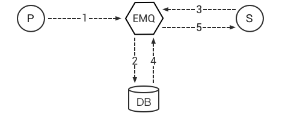

# 数据存储

数据存储的主要使用场景包括将客户端上下线状态，订阅主题信息，消息内容，消息抵达后发送消息回执等操作记录到 Redis、MySQL、PostgreSQL、MongoDB、Cassandra 等各种数据库中。用户也可以通过订阅相关主题的方式来实现类似的功能，但是在企业版中内置了对这些持久化的支持；相比于前者，后者的执行效率更高，也能大大降低开发者的工作量。

::: danger
数据存储是 EMQ X Enterprise 专属功能。
:::

## 数据存储设计

### 一对一消息存储

1.  Publish 端发布一条消息；
2.  Backend 将消息记录数据库中；
3.  Subscribe 端订阅主题；
4.  Backend 从数据库中获取该主题的消息；
5.  发送消息给 Subscribe 端；
6.  Subscribe 端确认后 Backend 从数据库中移除该消息；

### 一对多消息存储

1.  Publish 端发布一条消息；
2.  Backend 将消息记录在数据库中；
3.  Subscribe1 和 Subscribe2 订阅主题；
4.  Backend 从数据库中获取该主题的消息；
5.  发送消息给 Subscribe1 和 Subscribe2；
6.  Backend 记录 Subscribe1 和 Subscribe2 已读消息位置，下次获取消息从该位置开始。

### 客户端在线状态存储

支持将设备上下线状态，直接存储到 Redis 或数据库。

### 客户端代理订阅

支持代理订阅功能，设备客户端上线时，由存储模块直接从数据库，代理加载订阅主题。

### 存储插件列表

EMQ X 支持 MQTT 消息直接存储 Redis、MySQL、PostgreSQL、MongoDB、Cassandra、DynamoDB、InfluxDB、OpenTSDB 数据库:

| 存储插件                    | 配置文件                         | 说明              |
| ----------------------- | ---------------------------- | --------------- |
| emqx_backend_redis    | emqx_backend_redis.conf    | Redis 消息存储      |
| emqx_backend_mysql    | emqx_backend_mysql.conf    | MySQL 消息存储      |
| emqx_backend_pgsql    | emqx_backend_pgsql.conf    | PostgreSQL 消息存储 |
| emqx_backend_mongo    | emqx_backend_mongo.conf    | MongoDB 消息存储    |
| emqx_backend_cassa    | emqx_backend_cassa.conf    | Cassandra 消息存储  |
| emqx_backend_dynamo   | emqx_backend_dynamo.conf   | DynamoDB 消息存储   |
| emqx_backend_influxdb | emqx_backend_influxdb.conf | InfluxDB 消息存储   |
| emqx_backend_opentsdb | emqx_backend_opentsdb.conf | OpenTSDB 消息存储   |

### 配置步骤

EMQ X 中支持不同类型的数据库的持久化，虽然在一些细节的配置上有所不同，但是任何一种类型的持久化配置主要做两步操作：

- 数据源连接配置：这部分主要用于配置数据库的连接信息，包括服务器地址，数据库名称，以及用户名和密码等信息，针对每种不同的数据库，这部分配置可能会有所不同；
- 事件注册与行为：根据不同的事件，你可以在配置文件中配置相关的行为（action），相关的行为可以是函数，也可以是SQL语句。
