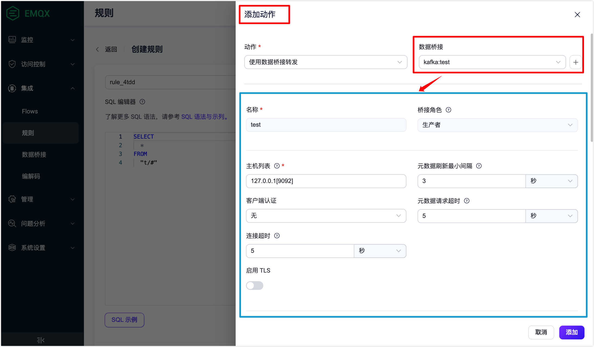
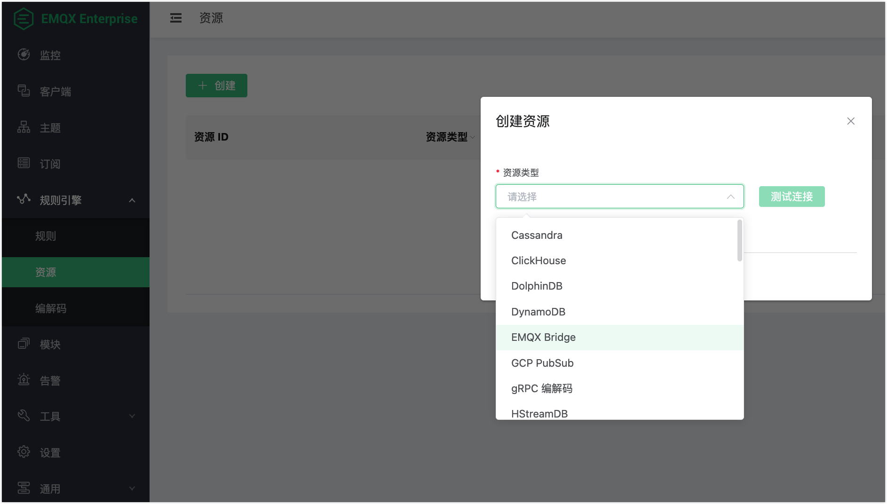

# 数据集成从 EMQX 4.4 到 EMQX 5.1 的不兼容变更

数据集成的整个概念在 EMQX 5.1 中得到了升级。

- 之前的 **规则** -> **动作** -> **资源** 流程已改为 **规则** -> **数据桥接**。

   在 EMQX 4.4 中，有一个针对动作的配置实体，但是在EMQX 5.1中，为某个规则添加动作时，您必须首先创建一个数据桥接，并修改桥接的 SQL 模板以适应规则输出。

   在 EMQX 5.1 中为规则配置动作（桥接）：

   

- **模块** -> **消息下发** 被移至**数据桥接**。

   EMQX 4.4 中的消息下模块：

   

- 在 EMQX 4.4 中的[保存离线消息](https://docs.emqx.com/zh/enterprise/v4.4/rule/offline_msg_to_redis.html)功能已被移除。

- 在 EMQX 4.4 中的[获取订阅关系](https://docs.emqx.com/zh/enterprise/v4.4/rule/get_subs_from_redis.html)功能已被移除。

- Tablestore，DolphinDB，Lindorm 和 SAP Event Mesh 的数据桥接不再支持，但 SAP Event Mesh 在[产品路线图](../getting-started/roadmap.md)中。

- 作为资源类型的 `EMQX Bridge` 不再受支持。

  

## 通用的不兼容变更

- 所有与 SSL 相关的配置选项（`ssl`，`cafile`，`keyfile`，`certfile`，`verify`）已更改为统一的结构和名称。例如，`ssl.cacertfile`，`ssl.certfile`，`ssl.keyfile`，`ssl.verify`等。
- 没有与保存离线消息等效的功能，如将离线消息保存到外部数据库并在客户端订阅主题时检索它们（通过 `$events/session_subscribed` 事件和桥接规则动作）。

## 功能和配置项的不兼容变更

本节列出了每个数据桥接的功能和配置项更改。

### Cassandra

配置名称 `nodes` 更改为 `servers`。

### Kafka 生产者

- 更改的配置项：
  - `servers` 改为 `bootstrap_hosts`。
  - `authentication_mechanism` 改为 `authentication`。
  - `sync_timeout` 改为 `sync_query_timeout`。
  - `send_buffer` 改为 `socket_opts.sndbuf`。
  - `tcp_keepalive` 改为 `socket.tcp_keepalive`。
  - `strategy` 改为 `partition_strategy`。
  - `cache_mode` 改为 `kafka.buffer.mode`。
  - Buffer 模式枚举 `memory+disk` 改为 `hybrid`。
  - `highmem_drop` 改为 `kafka.buffer.memory_overload_protection`。
- EMQX 5.1 中没有与以下配置项等同的配置项：
  - `query_api_versions`
  - `kafka_ext_headers`
- `replayq` 相关选项（例如：`max_batch_bytes`）在 `kafka` 键下嵌套。
- 现在，消息键是可以进行模板化，而之前它只能是少数几个选项。

### Kafka 消费者

- 更改的配置项：
  - `servers` 改为 `bootstrap_hosts`。
  - `max_bytes` 改为 `kafka.max_batch_bytes`。
  - `offset_reset_policy` 枚举：`{reset_to_latest, reset_by_subscriber}` 改为 `{latest, earliest}`。
- EMQX 5.1 中没有 `pool_size`：数据桥连接的数量由库根据主题中的分区数量自动设置。
- 在 EMQX 4.4 中，仅支持用于身份验证的纯 SASL。 在 EMQX 5.1 中，支持与 Kafka 生产者相同的机制。

### Pulsar 消费者

在 EMQX 5.1.0 中没有 Pulsar 消费者桥接。

### Pulsar 生产者

- 在 EMQX 5.1 中，桥接只使用驱动程序的异步 API 生成消息，没有同步 API 的选项。
- 现在，有一个用于消息键的模板。之前，只有少数几个选项。
- 更改的配置项：
  - Buffer 模式枚举 `memory+disk` 改为 `hybrid`。
  - `max_total_bytes` 改为 `buffer.per_partition_limit`。
  - `segment_bytes` 改为 `buffer.segment_bytes`。

### Redis

- 配置项 `cmd` 更改为 `command_template`（适用于所有 3 种 Redis 模式）。

  "Cluster" 模式的更改：

  - EMQX 5.1中没有 `database` 字段。
  - EMQX 5.1中没有等效于 `ttl`（来自EMQX 4.4 的离线消息）的项。

### Postgres

- 连接器没有变化。
- 批处理配置已移至动作配置中的 `resource_opts.*`。
  - `enable_batch = true` (EMQX 4.4) 改为 `resource_opts.batch_size > 1` (EMQX 5.1)。
  - EMQX 5.1中 `batch_time` 被隐藏并默认为 `0`。
  - `sql ` 改为 `prepare_statement`。

### MySQL

- `user` 更改为 `username`。
- 批处理配置已移至动作配置中的`resource_opts.*`。
  - `enable_batch = true` (EMQX 4.4) 改为 `resource_opts.batch_size > 1` (EMQX 5.1)。
  - EMQX 5.1中 `batch_time`被隐藏并默认为 `0`。
  - `sql` 改为 `prepare_statement`。

### MQTT

- 更改的配置项：
  - `address` 改为 `server`。
  - `pool_size` 改为 `{egress,ingress}.pool_size`。
  - `reconnect_interval` 改为 `resource_opts.health_check_interval`。
- 以下配置项在 EMQX 5.1 中没有对应的项：
  - `append`
  - `mountpoint`
- `disk_cache = on` (在 EMQX 4.4 中)可以被视为类似于设置 `resource_opts.buffer_mode = volatile_offload`，但后者是一个隐藏的配置选项，默认为 `memory_only`。
- EMQX 5.1 中没有与 RPC MQTT 桥接等效的项。
- 在动作中更改的配置项：
  - `forward_topic` 改为 `egress.remote.topic`。
  - `payload_tmpl` 改为 `payload`。

### InfluxDB

以下更改适用于 API v1 和 API v2。

- 更改的桥接配置项：
  - `host` 和 `port` 改为 `server`。
  - `https_enabled` 和例如 `tls_version` 的 ssl 选项改为 `ssl`。

- 在动作中更改的配置项：
  - EMQX 5.1 中没有与 `int_suffix` 对应的配置项； 类型直接在 `write_syntax` 中指定。
  - `measurement`，`timestamp`，`fields`，`tags` 改为 `write_syntax`。

### Tablestore, DolphinDB, Lindorm, SAP Event Mesh

在 EMQX 5.1 中没有对应的数据桥接。

### Clickhouse

更改的配置项：
- `server` 改为 `url`。
- `user` 改为 `username`。
- `key` 改为 `password`。

### Dynamo

- EMQX 5.1中没有与 `region` 对应的配置项。
- 现在有 `payload_template`。

### HStreamDB

- 配置项 `server` 更改为 `url`。
- 以下配置项在EMQX 5.1中没有对应的配置项：
  - `grpc_timeout`
  - `partition_key`
  - `grpc_flush_timeout`

### IoTDB

更改的配置项：
- `host`, `rest_port` 改为 `base_url`。
- `request_timeout` 改为 `resource_opts.request_ttl`。

### MongoDB

更改的配置项：
- `login` 改为 `username`。
- `connectTimeoutMS` 改为 `connect_timeout_ms`。
- `rs_set_name` 改为 `replica_set_name`。
- `payload_tmpl` 改为 `payload_template`。

### OpenTSDB

`sync` 改为 `resource_opts.query_mode = sync`。

### Oracle

`user` 改为 `username`。

### TDengine

更改的配置项：
- `host`, `port` 改为 `server`。
- `dbname` 改为 `database`。

### GCP PubSub 生产者

弃用的配置项：
- `flush_mode`
- `flush_period_ms`

### RabbitMQ 生产者

- 更改的配置项：
  - `server` 改为 `host` 和 `port`。
  - `payload_tmpl` 改为 `payload_template`。
  - `durable`  改为 `delivery_mode`。
- `exchange_type` 在 EMQX 5.1 中没有对应的配置项。

### RocketMQ

- 以下配置项在 EMQX 5.1 中没有对应的配置项：
  - `namespace`
  - `strategy`
  - `key`
- 更改的配置项：
  - `type` 改为 `resource_opts.query_mode`。
  - `payload_tmpl` 改为 `payload_template`。
