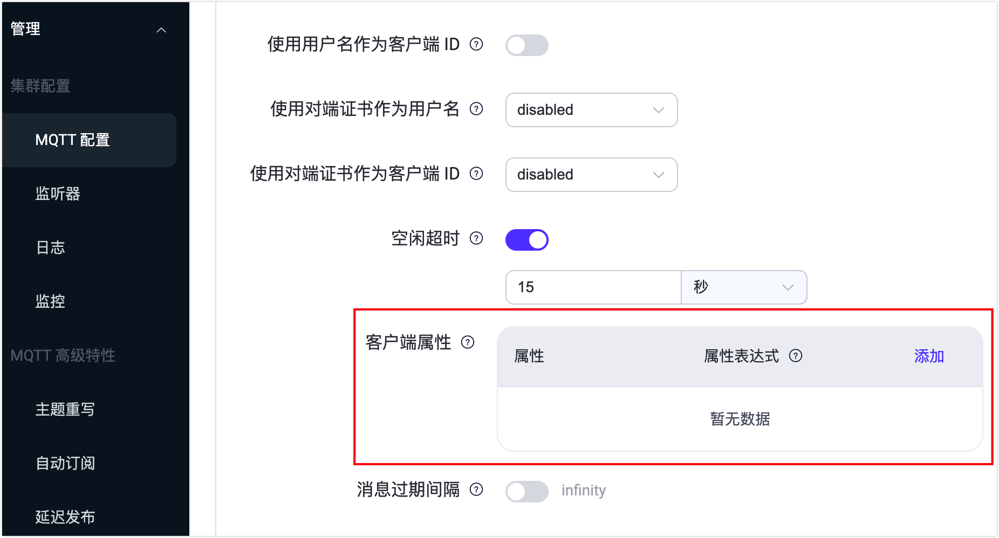

# 客户端属性

客户端属性是 EMQX 提供的一种机制，允许开发人员根据不同的应用场景需求，为 MQTT 客户端设置额外的属性。这些属性可以用于 EMQX 的认证授权、数据集成和 MQTT 扩展功能等功能中，在实现灵活开发中发挥重要作用。通过利用客户端元数据，此功能还支持 MQTT 客户端识别的灵活模板化，这对于个性化客户端配置和简化的认证过程至关重要，增强了开发工作的适应性和效率。

## 工作流程

客户端属性的设置、存储和使用流程如下：

**1. 设置客户端属性：**

当客户端成功连接到 EMQX 时，EMQX 会触发连接与认证事件，并在此过程中根据预先定义的配置来[设置客户端属性](#设置客户端属性)。

**2. 客户端属性存储与销毁：**

一旦设定了属性，它们会以键值对的形式存储在客户端会话的 `client_attrs` 字段中。当客户端会话结束时，这些属性会被删除。

对于保留会话，客户端接管时，会替换覆盖会话中已有的客户端属性。除此之外，无法通过其他方式修改或删除客户端属性。

**3. 使用客户端属性：**

EMQX 的其他功能允许在相关配置项中使用 `${client_attrs.NAME}` 占位符，动态提取属性值，并将其配置或数据的一部分来使用。

## 设置客户端属性

当客户端成功连接到 EMQX 时，EMQX 会触发连接和认证事件，并根据预先定义的配置来设置客户端属性。目前支持以下两种设置方式：

- 从客户端元数据中提取
- 在客户端认证过程中设置

### 从客户端元数据中提取

通过预设的配置，从客户端连接时的用户名、客户端 ID 等元数据中提取并处理生成子串，并将其设置为客户端属性。这个过程是在认证之前发生的，确保了属性可以在认证过程中使用。您可以通过配置文件或 Dashboard 配置客户端属性功能。

想要在 Dashboard 中配置客户端属性，点击左侧导航中的**管理** -> **MQTT 配置**，在**客户端属性**配置中点击**添加**，填写属性名称和属性表达式。



其中，**属性**为属性的名称，**属性表达式**为属性的提取配置。

属性表达式支持使用 [Variform 表达式](../configuration/configuration.md#variform-表达式)以及其中的[预定义的函数](../configuration/configuration.md#预定义函数)对值进行动态处理。例如:

- 要提取由点分隔的客户端 ID 的前缀：`nth(1, tokens(clientid, '.'))`
- 要截取用户名部分信息：`substr(username, 0, 5)`

对应的配置文件如下：

```bash
mqtt {
    client_attrs_init = [
        {
            expression = "nth(1, tokens(clientid, '.'))"
            set_as_attr = clientid_prefix
        },
        {
            expression = "substr(username, 0, 5)"
            set_as_attr = sub_username
        }
    ]
}
```

在属性表达式中支持配置以下值：

- `clientid`：客户端 ID
- `username`：用户名
- `cn`：TLS 证书的 CN 字段
- `dn`：TLS 证书的 DN 字段
- `user_property.*`：从 MQTT CONNECT 数据包的 User-Property 中提取属性值，例如 `user_property.foo`
- `zone`：继承自 MQTT 监听器的 zone 名称

更多客户端属性配置的详细信息，请参见 [EMQX 开源版配置手册](https://docs.emqx.com/zh/emqx/v@CE_VERSION@/hocon/)和 [EMQX 企业版配置手册](https://docs.emqx.com/zh/enterprise/v@EE_VERSION@/hocon/)。

### 在客户端认证过程中设置

在客户端认证过程中，可以通过认证器返回的信息设置客户端属性，目前支持：

- [JWT 认证](../access-control/authn/jwt.md)：签发 Token 时，在 Payload 中通过 `client_attrs` 字段设置客户端属性。
- [HTTP 认证](../access-control/authn/http.md)：在认证成功的 HTTP 响应中，通过 `client_attrs` 字段设置客户端属性。

属性的键值均要求是字符串。这种方式允许根据认证结果动态地设置属性，增加了使用的灵活性。

### 合并认证数据

当同时通过 2 种设置方式，或使用多个认证器设置客户端属性时，EMQX 会按照属性名称以及设置的先后顺序对属性进行合并：

- 从客户端元数据中提取的属性将被认证器中设置的属性覆盖。
- 认证链中多个认证器设置属性时，后设置的属性将覆盖前面的属性。

## 客户端属性的应用

在其他 EMQX 功能中，客户端属性可以通过 `${client_attrs.NAME}` 占位符提取，并作为配置或数据的一部分来使用。目前仅支持用于客户端认证与授权，更多功能将来后续开放。

### 客户端认证

通过[认证占位符](../access-control/authn/authn.md#认证占位符)用于 SQL 语句、查询命令或 HTTP 请求体中的动态参数，例如：

```sql
# MySQL/PostgreSQL - 认证查询 SQL
SELECT password_hash, salt, is_superuser FROM mqtt_user WHERE sn = ${client_attrs.sn} LIMIT 1

# HTTP - 认证请求 Body
{ 
 "sn": "${client_attrs.sn}",
 "password": "${password}"
}
```

具体使用方式请参考每个认证器对应的文档。

::: tip
客户端认证仅能使用从客户端元数据中提取设置的属性。
:::

### 客户端授权

通过[数据查询占位符](../access-control/authz/authz.md#数据查询占位符)与[主题占位符](../access-control/authz/authz.md#主题占位符)，用于 SQL 语句、查询命令，以及主题当中。

#### 示例场景：

通过客户端属性，为每个客户端设置了各自的 `role`, `productId`, `deviceId` 属性。需要将这些属性用于授权检查中：

- **role**: 用来限制客户端的访问权限，只允许 role 为 `admin` 的客户端订阅和发布管理消息，如匹配 `admin/#` 的主题。
- **productId**: 用来限制客户端只能订阅适用于当前产品的 OTA 消息，如 `OTA/{prodoctId}`。
- **deviceId**: 用来限制客户端只能在属于自己的主题上发布和订阅消息：
  - 发布：`up/{productId}/{deviceId}`
  - 订阅：`down/{productId}/{deviceId}`


可以使用[授权-内置数据库](../access-control/authz/mnesia.md)配置如下规则实现：

| 权限 | 操作 | 主题 |
| --- |  --- |  --- |
| 允许 | 订阅和发布 | `${client_attrs.role}/#` |
| 允许 | 订阅 | `OTA/${client_attrs.productId}` |
| 允许 | 发布 | `up/${client_attrs.productId}/${client_attrs.deviceId}` |
| 允许 | 订阅 | `down/${client_attrs.productId}/${client_attrs.deviceId}` |

相较于直接使用客户端 ID 等静态属性，更灵活地管理客户端的授权。这种灵活性使得我们能够基于不同的角色、产品和设备来细粒度地控制客户端的访问权限。
