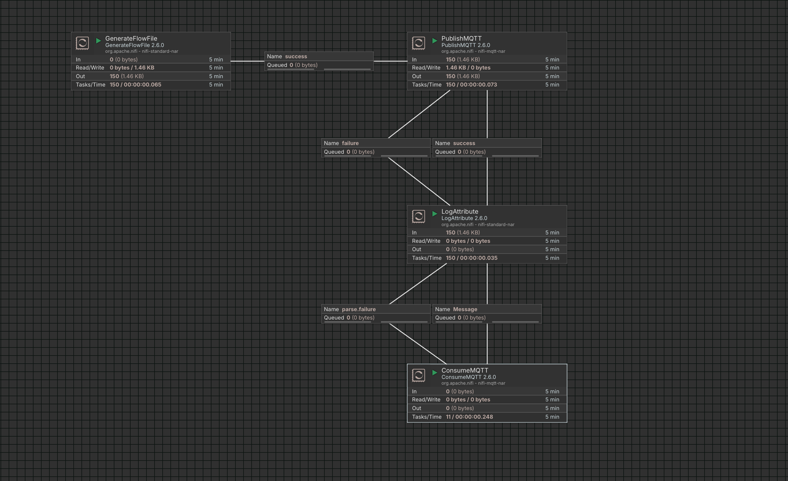
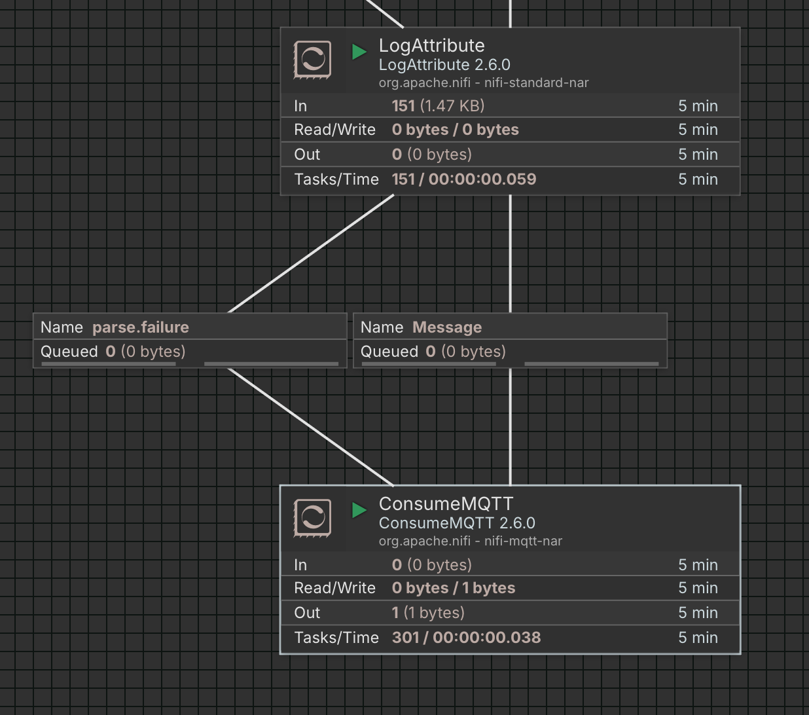
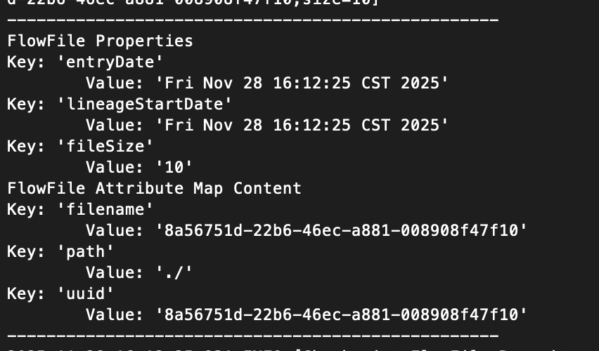

# 与 Apache NiFi 集成

Apache NiFi 是一款可视化数据流管理工具，专为在不同系统之间可靠、高效地传输、转换和处理数据而设计。它支持实时数据流、拖拽式流程设计、数据溯源和安全控制等功能。

本文介绍如何将 Apache NiFi 连接到 EMQX，并使用 Apache NiFi 执行基本的数据流处理任务。

## 前置条件

在将 Apache NiFi 连接到 EMQX 之前，请确保以下准备工作已完成：

- EMQX 已安装并运行。详情请参阅[安装说明](../deploy/install.md)。
- 安装 JDK
- 部署 Apache NiFi

### 安装 JDK

部署 Apache NiFi 2.6.0 需要安装 JDK 21（或更高版本）以正常运行 Apache NiFi。

#### Debian / Ubuntu

```bash
sudo apt update
sudo apt install openjdk-21-jdk
java -version
```

#### CentOS 8+ / Fedora 8+ / RHEL

```bash
sudo dnf install temurin-21-jdk
java -version
```

#### Arch Linux / Manjaro

```bash
sudo pacman -S jdk-openjdk
```

### 部署 Apache NiFi

#### 下载并启动 Apache NiFi

1. 从 [Apache 官方网站](https://nifi.apache.org/download/)下载安装包并解压。以部署 Apache NiFi 2.6.0 为例：

   ```bash
   # 从 apache.org 下载 Apache NiFi 2.6.0
   wget https://dlcdn.apache.org/nifi/2.6.0/nifi-2.6.0-bin.zip

   # 解压文件
   unzip nifi-2.6.0-bin.zip

   # 解压完成后删除压缩包
   rm nifi-2.6.0-bin.zip
   ```

2. 进入 `bin` 目录，配置用户名和密码，然后启动 Apache NiFi。

   ```bash
   cd nifi-2.6.0/bin
   
   # 设置用户名和密码，密码至少 12 个字符
   ./nifi.sh set-single-user-credentials <YOUR_USERNAME> <YOUR_PASSWORD>
   
   # 在后台启动 NiFi 服务
   ./nifi.sh start
   
   # 如需在前台运行 NiFi，请使用以下命令
   # ./nifi.sh run
   ```

#### 访问 Apache NiFi

Apache NiFi 2.x 默认使用 HTTPS 访问，且内置证书仅支持本地访问。

- 如果将 Apache NiFi 部署在本地机器上，可在浏览器中访问 `https://localhost:8443/nifi`。
- 如果部署在远程服务器上，可参考以下三种方法解决访问错误。

##### 方法一：启用 HTTP 访问（仅限开发环境）

1. 修改配置文件以通过 HTTP 访问（仅适用于开发环境，生产环境建议使用 HTTPS）。

   ```bash
   # 进入配置目录
   cd ~/nifi-2.6.0/conf
   # 使用文本编辑器打开 nifi.properties，例如 Vim
   vim nifi.properties
   ```

2. 找到并修改以下配置项：

   - `nifi.remote.input.secure=false`
   - `nifi.web.http.host=192.168.31.9`（根据实际情况调整）
   - `nifi.web.http.port=8080`
   - `nifi.web.https.host=`
   - `nifi.web.https.port=`

3. 重启 Apache NiFi，然后在浏览器中通过 `http://<服务器IP>:8080/nifi` 访问。

##### 方法二：配置 HTTPS 证书以实现远程访问

参照 [Stack Overflow: Apache NIFI 2+ HTTP ERROR 400 Invalid SNI](https://stackoverflow.com/questions/78985347/apache-nifi-2-http-error-400-invalid-sni) 配置证书和内网访问。

##### 方法三：通过 SSH 隧道访问（临时调试）

1. 打开终端，输入以下命令：

   ```bash
   ssh -L 8443:localhost:8443 <your-username>@<your-server-IP>
   ```

2. 验证成功后，在浏览器中访问 `https://localhost:8443/nifi`。

看到登录界面后，说明 Apache NiFi 已部署完成。使用配置的用户名和密码登录。


## 将 Apache NiFi 连接到 EMQX

在 Apache NiFi 中，可以使用多种处理器通过 MQTT 与 EMQX 通信。常用处理器包括：

- **PublishMQTT**：用于将数据流发送到 EMQX。
- **ConsumeMQTT**：用于从 EMQX 接收数据流。

### 前置条件

在配置 Apache NiFi 之前，请确保已在 EMQX 中完成以下配置：

- 在 EMQX Dashboard 的**访问控制** -> **认证**中创建客户端凭证，供 Apache NiFi 连接使用。
- 如果启用了授权功能，在**访问控制** -> **授权**中为该客户端授予相应的发布和订阅权限。

### 数据流示例

以下示例演示了一个简单的日志数据处理流程：

- **GenerateFlowFile** 生成模拟日志数据并发送给 **PublishMQTT** 处理器。
- **PublishMQTT** 将日志数据发布到 EMQX。
- **ConsumeMQTT** 订阅相同的主题并从 EMQX 接收日志数据。
- **LogAttribute** 将数据流中的属性记录到本地 NiFi 日志以供验证。



### 配置 MQTT 处理器

**PublishMQTT** 和 **ConsumeMQTT** 均需要配置 MQTT 连接参数，主要配置项说明如下。

#### 1. Broker URI

Broker URI 必须遵循以下格式：

```
<协议: 'tcp' | 'ssl' | 'ws' | 'wss'>://<broker 地址>:<端口>
```

示例：

```
ssl://your-emqx-host:8883
```

生产环境强烈建议使用 SSL 或 WSS 以确保通信加密。使用加密协议时，必须在 NiFi 中配置 **SSL Context Service**。

##### 配置 SSL Context Service

1. 从 EMQX 部署中获取 CA 证书。如果使用自签名证书，请从 EMQX 的 TLS 配置中导出 CA 证书。

2. 将证书文件上传到部署 Apache NiFi 的服务器。

3. 运行以下命令将证书导入 Java 信任库：

   ```bash
   keytool -importcert \
   -alias myca \
   -file <your-ca-cert>.crt \
   -keystore truststore.jks \
   -storepass <ReplaceWithYourStorepass>
   ```

4. 将生成的 `truststore.jks` 放置在 Apache NiFi 可访问的目录中。

5. 点击 **SSL Context Service** 旁的 `...`，选择 **Create new service**，选择 `StandardRestrictedSSLContextService`，然后点击 **Add**。

6. 再次点击 **SSL Context Service** 旁的 `...`，选择 **Go to service**。

7. 选择新创建的服务并点击 **Edit**。

8. 将 **Truststore Filename** 设置为 `truststore.jks` 的存放路径，将 **Truststore Password** 设置为对应的密码，将 **Truststore Type** 设置为 `JKS`。

9. 退出后，点击 `...` 并选择 **Enable** 以启用该服务。

启用后，SSL Context Service 可被其他处理器复用，无需重复配置。

#### 2. MQTT 协议版本

根据需求选择 MQTT 协议版本。新部署建议使用 MQTT v5.0。

#### 3. 认证

将 **Username** 和 **Password** 设置为在 EMQX 中创建的客户端凭证。

#### 4. 其他设置

根据实际使用场景，配置其他必填或可选字段。

### 启动数据流

完成配置后：

1. 点击每个处理器中的 **Verify（✅）** 按钮验证配置。
2. 将处理器状态从 **Stopped** 切换为 **Start**。
3. 启动流程中的所有处理器。

所有处理器运行后，Apache NiFi 数据处理流水线即配置完成并正式运行。

## 验证 Apache NiFi 与 EMQX 之间的 MQTT 数据流

完成配置后，使用 MQTT 客户端验证数据流。推荐使用 [MQTTX](https://mqttx.app) 进行调试。

1. **验证 PublishMQTT 输出。**

   使用 MQTTX 订阅 **PublishMQTT** 处理器中配置的主题，您应能看到 **GenerateFlowFile** 持续发布的模拟日志消息。

   

2. **验证 ConsumeMQTT 输入。**

   通过 MQTTX 向 **ConsumeMQTT** 处理器中配置的主题手动发布日志消息，您应能观察到 **ConsumeMQTT** 的输出计数随消息接收而增加。

   

3. **验证 NiFi 日志。**

   查看 Apache NiFi 应用日志（默认位于 `logs/nifi-app.log`），您应能看到 **LogAttribute** 生成的以下日志条目：

   - **GenerateFlowFile** 产生的模拟日志。
   - 通过 MQTTX 手动发布的日志。

   

如果以上步骤均符合预期，说明 Apache NiFi 与 EMQX 的集成已正常运行。

## 进阶使用

完成基本配置后，您可以根据业务需求灵活调整流程结构。更多不同语言的示例请参考 [GitHub](https://github.com/emqx/MQTT-Client-Examples)。

## 参考资料

- [Getting Started with MQTT in Apache NiFi](https://medium.com/cloudera-inc/getting-started-with-mqtt-in-apache-nifi-64e8cde1de91)
