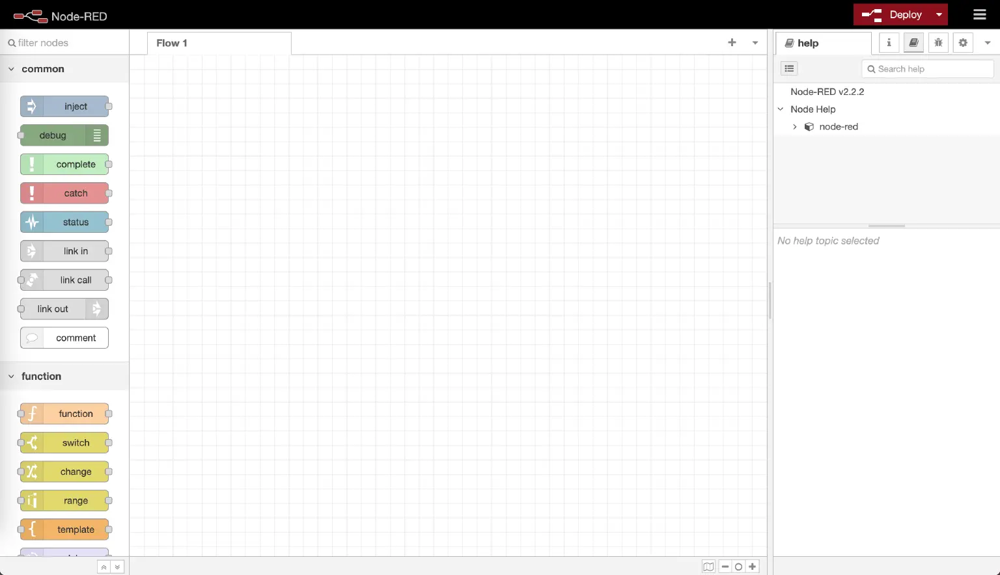
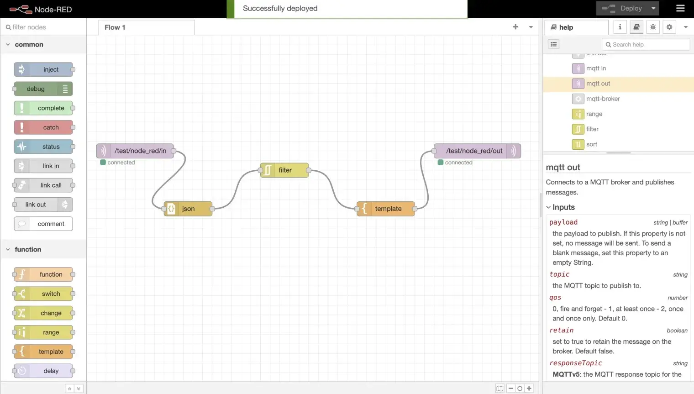
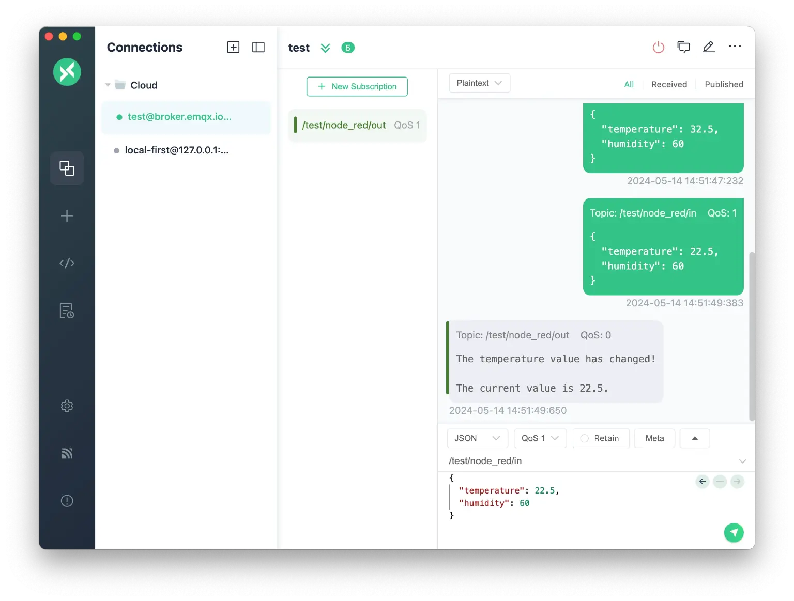

# 使用 Node-RED 连接 EMQX

[Node-RED](https://nodered.org/) 是一款基于流程的编程工具，提供浏览器端编辑器，用于将硬件设备、API 与在线服务连接在一起。它采用可视化节点界面，通过连接预置节点来创建数据流，无需编写大量代码。Node-RED 通过内置的 `mqtt-in`（订阅）和 `mqtt-out`（发布）节点原生支持 MQTT 协议，是处理来自 EMQX 的物联网数据的常用工具。

本页面介绍如何安装 Node-RED、将其连接到 EMQX，并构建一个能够解析、过滤和转换 MQTT 消息的数据处理流程。

## 前提条件

- Node.js 14 或更高版本（使用 NPM 安装时需要）
- 已部署的 EMQX 实例，或使用 EMQX 公共 Broker 进行测试
- [MQTTX](https://mqttx.app/zh) 或其他 MQTT 客户端，用于发送测试消息

## 安装 Node-RED

**通过 NPM 安装：**

```bash
npm install -g --unsafe-perm node-red
```

然后启动 Node-RED：

```bash
node-red
```

**通过 Docker 安装：**

```bash
docker run -it -p 1880:1880 --name mynodered nodered/node-red
```

启动后，在浏览器中访问 `http://127.0.0.1:1880` 即可打开 Node-RED 编辑器。



> 如需了解更多安装方式（包括树莓派和云端部署），请参阅 [Node-RED 官方文档](https://nodered.org/docs/getting-started/)。

## MQTT Broker 设置

您需要一个 MQTT Broker 供 Node-RED 连接。本指南使用 EMQX，它支持 MQTT 3.1、3.1.1 和 5.0。

### EMQX 公共 Broker（测试用途）

若您希望快速测试且不部署自己的 Broker，可以使用 EMQX 公共 Broker。

| 参数             | 值               |
| ---------------- | ---------------- |
| Broker 地址      | `broker.emqx.io` |
| TCP 端口         | `1883`           |
| SSL/TLS 端口     | `8883`           |
| WebSocket 端口   | `8083`           |
| 加密 WebSocket 端口 | `8084`        |

该公共 Broker 仅用于测试与演示目的。

### EMQX Enterprise 部署

在生产场景中，请使用您环境中定义的 Broker 地址、端口及认证凭据，将 Node-RED 连接到您自己的 EMQX Enterprise 部署。

典型配置包括：

- 自定义 Broker 主机名或 IP 地址
- 用户名/密码认证或双向 TLS
- 对主题应用访问控制规则（ACL）

配置 Node-RED Broker 连接时，请参考您 EMQX Enterprise 的监听器与认证配置。

> 除自托管的 EMQX Enterprise 部署外，您也可以将 Node-RED 连接到全托管 MQTT 服务 [EMQX Cloud](https://docs.emqx.com/zh/cloud/latest/overview.html)（Serverless 或 Dedicated）。请使用 EMQX Cloud 提供的 Broker 地址、端口和认证信息。

## 构建基础 MQTT 流程

以下步骤将创建一个最简流程，用于订阅某个主题并将接收到的消息转发到另一个主题。

### 步骤 1：添加 MQTT 订阅节点

1. 在 Node-RED 编辑器中，从左侧节点面板将 **mqtt-in** 节点拖至画布。

2. 双击该节点，打开其属性面板。

3. 点击 **Server** 字段旁的铅笔图标，创建新的 Broker 连接。

4. 在 **Server** 地址栏输入 `broker.emqx.io`，点击 **Add**。

   

5. 将 **Topic** 设置为 `test/node_red/in`。

6. 按需设置 **QoS** 级别，然后点击 **Done**。

   

### 步骤 2：添加 MQTT 发布节点

1. 将 **mqtt-out** 节点拖至画布。

2. 双击该节点，打开其属性面板。

3. 在 **Server** 下拉列表中选择步骤 1 中配置的 Broker。

4. 将 **Topic** 设置为 `test/node_red/out`。

5. 按需配置 **QoS** 和 **Retain**，然后点击 **Done**。

   

### 步骤 3：连接节点并部署

1. 从 **mqtt-in** 节点的输出端口拖线至 **mqtt-out** 节点的输入端口。
2. 点击右上角的 **Deploy** 按钮。
3. 确认两个节点均显示绿色 **connected** 状态指示器。

至此，您已创建一个将 `test/node_red/in` 上接收到的所有消息转发至 `test/node_red/out` 的流程。


## 构建进阶数据处理流程

Node-RED 的强大之处在于可以将多个节点串联，在重新发布数据之前对其进行过滤和转换。以下示例构建了一条处理管道，实现以下功能：

1. 通过 MQTT 接收 JSON 格式的传感器数据。
2. 将原始消息体解析为 JavaScript 对象。
3. 过滤重复的温度数据。
4. 对结果进行格式化后重新发布。

完整流程为：**mqtt-in** → **json** → **rbe** → **template** → **mqtt-out**

### 步骤 1：添加 JSON 节点

1. 从节点面板将 **json** 节点拖至画布。
2. 双击进行配置，将 **Action** 设置为 **Always Convert to JavaScript Object**。
3. 点击 **Done**。
4. 将 **mqtt-in** 的输出连接到 **json** 节点的输入。

此步骤确保传入的消息体被解析为 JavaScript 对象，以便下游节点可以访问各字段，例如 `msg.payload.temperature`。


### 步骤 2：添加过滤节点

1. 从节点面板将 **rbe**（report by exception，异常上报）节点拖至画布。
2. 双击进行配置：
   - 将 **Mode** 设置为 **block unless value changes**（仅在值变化时通过）。
   - 将 **Property** 设置为 `msg.payload.temperature`。
3. 点击 **Done**。
4. 将 **json** 节点的输出连接到 **rbe** 节点的输入。

当 `temperature` 字段与上一条消息相比未发生变化时，该过滤节点将阻断消息，从而减少重复数据造成的冗余流量。


### 步骤 3：添加模板节点

1. 将 **template** 节点拖至画布。

2. 双击进行配置，使用 Mustache 语法输入所需的输出格式，例如：

   ```
   {"temperature": {{payload.temperature}}, "humidity": {{payload.humidity}}}
   ```

3. 点击 **Done**。

4. 将 **rbe** 节点的输出连接到 **template** 节点的输入。


### 步骤 4：连接输出节点并部署

1. 将 **template** 节点的输出连接到 **mqtt-out** 节点的输入。
2. 点击 **Deploy**。
3. 确认所有节点均显示绿色 **connected** 状态。

> 如果不需要对过滤后的数据进行格式化，可以省略 **template** 节点，直接将 **rbe** 连接到 **mqtt-out**。



## 测试流程

使用 MQTTX 或其他 MQTT 客户端测试该处理管道：

1. 订阅 `test/node_red/out` 以观察处理结果。

2. 向 `test/node_red/in` 发布一条 JSON 格式的测试消息，例如：

   ```json
   {"temperature": 25, "humidity": 60}
   ```

3. 确认消息出现在输出主题上。

4. 再次发布相同的消息。**rbe** 过滤节点应拦截此重复消息，输出主题上不应有任何输出。

5. 发布一条温度值不同的消息：

   ```json
   {"temperature": 26, "humidity": 60}
   ```

6. 确认该消息通过过滤节点并出现在输出主题上。



## 故障排查

### 节点显示 "disconnected" 状态

**现象**

- **mqtt-in** 或 **mqtt-out** 节点在部署后显示红色 **disconnected** 状态指示器。

**可能原因**

- Broker 地址或端口配置错误
- 网络防火墙阻止了端口 `1883` 或 `8883`
- Broker 未运行

**解决方法**

- 双击节点，点击 **Server** 旁的铅笔图标，检查 Broker 地址和端口配置。
- 使用 MQTTX 等其他 MQTT 客户端测试与 Broker 的基本连通性。
- 如果使用 TLS，请确保已配置正确的端口（`8883`）和 CA 证书。

### 订阅主题上未收到消息

**现象**

- **mqtt-in** 节点已连接，但没有消息到达。

**可能原因**

- 发布方与订阅方的主题名称不一致
- QoS 级别不兼容
- Broker 上的 ACL 规则阻止了该订阅

**解决方法**

- 确认发布方发送到的主题与 **mqtt-in** 节点中配置的主题（`test/node_red/in`）完全一致。
- 在流程各阶段添加 **debug** 节点，以检查消息内容。
- 检查 Broker 的认证与 ACL 配置。

### 过滤节点阻断所有消息

**现象**

- 即使温度值发生变化，输出主题上也没有任何消息出现。

**可能原因**

- **rbe** 节点的属性路径配置不正确
- **json** 节点未在过滤节点之前解析消息体

**解决方法**

- 确认 **json** 节点位于 **rbe** 节点之前，且已设置为 **Always Convert to JavaScript Object**。
- 确认 **rbe** 节点的属性设置为 `msg.payload.temperature`（而非 `payload.temperature`）。
- 在 **json** 节点之后添加 **debug** 节点，检查 `msg.payload` 的结构是否符合预期。

### 认证失败

**现象**

- 节点在部署后立即显示 **disconnected** 状态，Broker 日志显示认证错误。

**可能原因**

- Broker 配置中缺少或填写了错误的用户名/密码
- 主题受到 ACL 限制

**解决方法**

- 双击节点，打开 Broker 配置，在 **Security** 标签页中输入正确的用户名和密码。
- 在 EMQX 中检查认证配置。

## 更多信息

如需了解详细的操作步骤、背景知识和更多示例，请参阅博客文章：[使用 Node-RED 处理 MQTT 数据](https://www.emqx.com/zh/blog/using-node-red-to-process-mqtt-data)。
