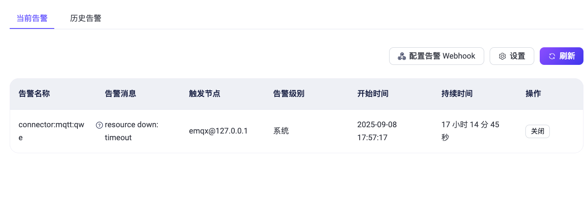

# 告警

EMQX Dashboard 的**告警**页面展示了当前正在触发的告警和历史告警（已清除的告警），便于管理员实时监控并管理系统异常。

每条告警记录包含以下信息：

- **名称**：触发告警的资源或组件标识（例如 connector、插件等）
- **消息**：具体的错误信息或描述（例如 `resource down: timeout`）
- **触发节点**：报告该告警的 EMQX 节点
- **级别**：告警的严重级别（例如 Warning、Critical）
- **激活时间**：告警被触发的时间戳
- **持续时间**：告警处于激活状态的时长

## 当前告警

在**当前告警**标签页中，可以查看系统中所有当前处于激活状态的告警。

### 可用操作

- **刷新**：点击右上角的**刷新**按钮，以获取最新的告警数据。
- **设置**：点击**设置**按钮，跳转到[监控设置](./cluster_settings.md#监控)页面，配置告警的触发阈值及检测周期。
- **配置告警 Webhook**：点击**配置告警 Webhook**，启用基于 Webhook 的告警通知机制。详细配置说明请参考[集成 Webhook 发送告警事件通知](../observability/alarms.md#集成-webhook-发送告警事件通知)。
- **手动清除**：某些情况下（如客户端断开连接、资源超时等），告警可能不会自动解除。可点击**操作**栏中的**关闭**按钮，手动关闭该告警。

> **提示**：只有在系统未能自动恢复的情况下（如客户端已断开、连接器已失效且无法恢复），才建议使用手动清除功能。

**示例**

下图展示了一个由于资源超时导致的 MQTT 连接器告警（`connector:mqtt:qwe`）。如有需要，可通过右侧的**关闭**按钮手动解除该告警。

::: tip 提示

目前，告警是基于节点的。您只能关闭当前登录节点上触发的告警。例如：若您登录的节点为 `emqx@10.50.0.12`，则无法关闭 `emqx@127.0.0.1` 上的告警。此限制仅适用于集群模式，单节点部署不受影响。

:::

## 历史告警

切换到**历史告警**标签页，可以查看已解除的历史告警记录。点击右上角的**清除历史告警**按钮，可删除历史告警数据。

## 更多信息

有关支持的告警类型、触发机制、Webhook 通知内容等的详细信息，请参见[告警文档](../observability/alarms.md)。