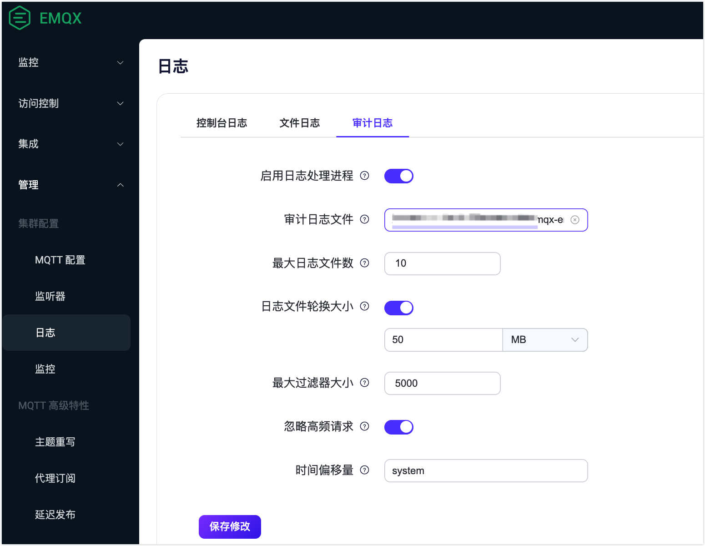

# 审计日志

审计日志（Audit Log）功能让您实时跟踪 EMQX 集群的重要操作变更，是企业用户遵守合规要求、确保数据安全的关键工具。EMQX 审计日志支持记录来自 [Dashboard](../dashboard/introduction.md) 、[REST API](../admin/api.md) 以及 [命令行](../admin/cli.md) 的变更性操作，例如 Dashboard 用户登录，对客户端、访问控制以及数据集成等资源的修改。而指标获取、客户端列表查询等只读操作则不会被记录。通过审计日志，企业用户可以方便地查看谁通过何种方式，在何时执行了哪些关键操作，以实现运营过程中的合规性和安全性审计。

::: warning 注意

命令行操作的审计日志可能包含敏感信息，在发送到日志收集器时需要谨慎操作。建议过滤日志内容或使用加密传输方式，避免未经授权的信息泄露。

:::

## 查看审计日志

用当审计日志在 EMQX 中启用，变更性操作记录将以日志形式保存在 `./log/audit.log.1` 文件中，方便企业用户深入分析审计记录，并集成到现有的日志管理系统中，满足合规和数据安全需求。 后续版本 EMQX 还将支持在 Dashboard 上直接查看，或通过 REST API 查询与获取审计日志，方便检查操作记录。<!-- TODO 未来版本支持 --> <!-- 通过这两种方法，EMQX 提供了灵活且全面的审计日志支持，使企业用户能够根据自己的需求选择最适合的方式来管理和查看审计日志。 -->

## 配置审计日志

您可以通过配置文件和 Dashboard 启用审计日志并设置审计日志的配置参数。 

### 通过配置文件配置

您可以在 `emqx.conf` 文件中通过修改 `log.audit ` 下的配置项启用审计日志并设置审计日志的配置参数，参见下面示例。

```bash
log.audit {
  enable = true
  level = info
  path = "./log/audit.log"
  rotation_count = 10
  rotation_size = 50MB
  time_offset = system
}
```

### 通过 Dashboard 配置

您还可以在 Dashboard **管理** -> **日志** -> **审计日志**页面中启用并设置审计日志的配置参数。

 

审计日志配置选项：

- **启用日志处理进程**：单击切换开关以启用或禁用审计日志处理进程。默认为禁用。
- **审计日志文件**：填写审计日志文件路径和名称。默认值为 `${EMQX_LOG_DIR}/audit.log`，其中 `${EMQX_LOG_DIR}` 是一个变量，默认为`./log`，意味着最终默认保存在 `./log/audit.log.1`  文件中。
- **最大日志文件数**：轮换的最大日志文件数。默认值为`10`。
- **日志文件轮换大小**：设置日志文件大小，达到设定的值时日志文件将进行轮换。如果禁用，则日志文件将无限增长。可在文本框输入设定的值，在下拉列表中选择单位，可选值为：`MB`, `GB`, `KB`。默认值为 `50MB`。
- **日志级别**：从下拉列表中选择要使用的日志级别。可选值为：`debug`, `info`, `notice`, `warning`, `error`, `critical`, `alert`, `emergency` 。默认值为：`info`。
- **时间偏移量**：定义日志中时间戳的格式。默认情况下为 `system`。

## 审计日志格式

对于来自不同操作方式的操作记录，审计日志消息的格式中包含的字段有所不同。

### Dashboard 或 REST API 操作记录

记录来自 Dashboard 或 REST API 操作的审计日志包含操作用户、操作对象和操作结果等信息。日志消息格式示例如下：

```bash
{"time":1695865935099311,"level":"info","msg":"from_api","username":"admin","query_string":{},"operate_id":"/mqtt/retainer/message/:topic","node":"emqx@127.0.0.1","method":"delete","headers":{"user-agent":"Mozilla/5.0 (Macintosh; Intel Mac OS X 10_15_7) AppleWebKit/537.36 (KHTML, like Gecko) Chrome/116.0.0.0 Safari/537.36","sec-fetch-site":"same-origin","sec-fetch-mode":"cors","sec-fetch-dest":"empty","sec-ch-ua-platform":"\"macOS\"","sec-ch-ua-mobile":"?0","sec-ch-ua":"\"Chromium\";v=\"116\", \"Not)A;Brand\";v=\"24\", \"Google Chrome\";v=\"116\"","referer":"http://localhost:18083/","origin":"http://localhost:18083","host":"localhost:18083","connection":"keep-alive","authorization":"******","accept-language":"zh-CN,zh;q=0.9,zh-TW;q=0.8,en;q=0.7","accept-encoding":"gzip, deflate, br","accept":"*/*"},"from":"dashboard","duration_ms":1,"code":204,"body":{},"bindings":{"topic":"t/1"},"auth_type":"jwt_token"}
```

下面的表格中列出并解释了在以上日志示例中包含的字段：

| 字段名称     | 类型 | 描述                                                         |
| ------------ | ---- | ------------------------------------------------------------ |
| time         | 整数 | 时间戳，表示日志记录的时间，以微秒为单位。                   |
| level        | 字符 | 日志级别。                                                   |
| msg          | 字符 | 操作描述。                                                   |
| from         | 字符 | 请求来源，`dashboard`、`rest`、`cli`、`erlang_shell` 分别表示来自 Dashboard、REST API、 CLI 以及 Erlang Shell 的操作。 |
| node         | 字符 | 节点名称，表示执行操作的节点或服务器。                       |
| username     | 字符 | 执行操作的用户，当来源为 `from_api` 时存在该字段。           |
| method       | 字符 | HTTP 请求方法，`post`, `put`, `delete` 对应创建、更新、删除操作。 |
| operate_id   | 字符 | 请求的 REST API 路径，请参考 [REST API](../admin/api.md)。   |
| bindings     | 对象 | 具体的请求对象信息，对应 `operate_id` 中的占位符。           |
| auth_type    | 字符 | 认证类型，表示用于身份验证的方法或机制，固定为 `jwt_token`。 |
| query_string | 对象 | HTTP 请求中的 URL 查询参数。                                 |
| code         | 整数 | HTTP 响应码，表示操作的结果状态。                            |
| headers      | 对象 | HTTP 请求头信息，包括客户端标识、请求来源等。                |
| duration_ms  | 整数 | 操作执行时间，以毫秒为单位。                                 |
| body         | 对象 | HTTP 请求体，包含操作的详细信息。                            |

### REST API 操作记录

请求来源，`dashboard`、`rest`、`cli`、`erlang_shell` 分别表示来自 Dashboard、REST API、 CLI 以及 Erlang Shell 的操作。


### 命令行操作记录

记录命令行操作的审计日志包含执行的命令、调用参数等信息。日志消息格式示例如下：

```bash
{"time":1695866030977555,"level":"info","msg":"from_cli","from": "cli","node":"emqx@127.0.0.1","duration_ms":0,"cmd":"retainer","args":["clean", "t/1"]}
```

下面的表格中列出并解释了在以上日志示例中包含的字段：

| 字段名称    | 类型 | 描述                                                         |
| ----------- | ---- | ------------------------------------------------------------ |
| time        | 整数 | 时间戳，表示日志记录的时间，以微秒为单位。                   |
| level       | 字符 | 日志级别。                                                   |
| msg         | 字符 | 操作描述。                                                   |
| from        | 字符 | 请求来源，`dashboard`、`cli` 分别表示来自 Dashboard 与 CLI 的操作。 |
| node        | 字符 | 节点名称，表示执行操作的节点或服务器。                       |
| duration_ms | 整数 | 操作执行时间，以毫秒为单位。                                 |
| cmd         | 字符 | 执行的具体命令操作，支持的命令请参考 [CLI](../admin/cli.md)。 |
| args        | 数组 | 命令附加的参数，多个参数使用数组分割。                       |
