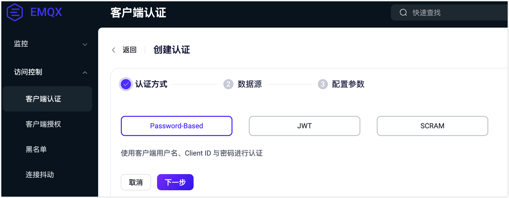
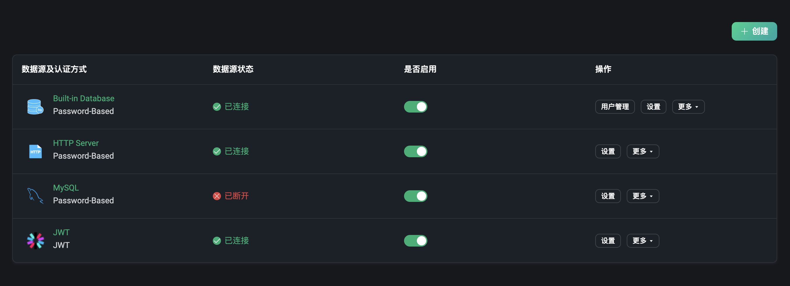
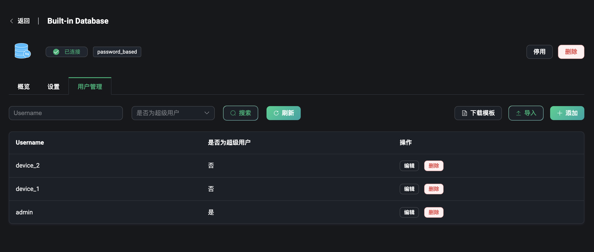
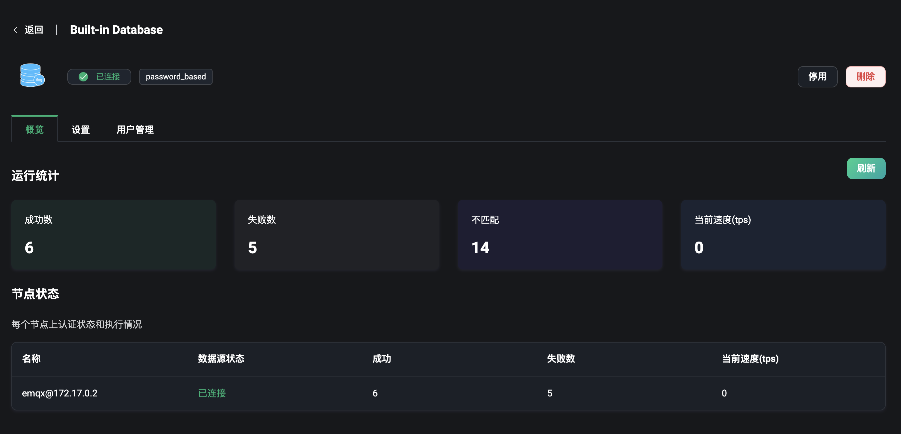
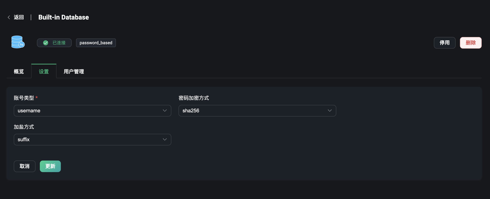

# 客户端认证

EMQX Dashboard 提供了开箱即用的认证与权限管理功能，用户仅通过用户界面，就可以快速实现客户端认证机制的配置，无需编写代码或手动编辑配置文件，即可对接各类数据源与认证服务，实现各个级别与各类场景下的安全配置，以更高的开发效率获得更安全的保障。在**客户端认证**页面中您可以快速创建和管理各类认证资源。

:::tip 提示
配置好认证资源后，设备或 MQTT 客户端需要配置对应的认证信息，才可以安全连接到 EMQX。
:::

## 创建认证

在客户端认证页面的右上角，点击**创建**按钮，即可进入到创建认证的页面。创建一个认证需要选择一种认证方式，选择完成后需要选择一个存储或获取认证信息的数据源（JWT 认证方式除外），认证数据可以从这些数据源包括数据库或 HTTP 服务中获取。最后，您需要配置连接到该数据源的连接信息。

### 认证方式

目前 EMQX 提供了以下 3 种认证方式：

1. Password-Based：使用客户端 ID 或用户名加密码的认证方式。
2. JWT：客户端可以在用户名或密码字段中携带 JWT token 来进行认证。
3. SCRAM：MQTT 5.0 中的增强认证，可以实现对客户端和服务器的双向认证。

### 数据源

在这一步中您可以根据上一步所选的认证方式选择数据源。注意，您无法再次选择正在使用的认证数据源。关于数据源的全面介绍，参阅 [EMQX 认证器](../access-control/authn/authn.md#emqx-认证器)。

#### Password-Based

当选择 `Password-Based` 的认证方式后，用户可以选择存储认证数据的数据库或提供认证数据功能的 HTTP 服务器，数据库包含两类：

- EMQX 的内置数据库，即选择 `Built-in Database`。
- 外部数据库，支持选择并连接到一些主流数据库，包括：`MySQL`、`PostgreSQL`、`MongoDB`、`Redis` 等。

除数据库外，还可以直接使用能够提供认证数据的 HTTP 服务，即选择 `HTTP Server`。

#### JWT

如果选择了 JWT 的认证方式，将无需选择数据源。

#### SCRAM

MQTT 5.0 中的增强认证功能，如果选择了该认证方式的话，目前仅提供了使用 `Built-in Database` 数据源，即使用 EMQX 的内置数据库来存储和获取认证数据。

增强认证包含质询/响应风格的认证，可以实现对客户端和服务器的双向认证，服务器可以验证连接的客户端是否是真正的客户端，客户端也可以验证连接的服务器是否是真正的服务器，从而提供了更高的安全性。

更多关于 MQTT 5.0 增强认证的介绍与使用方式，参阅 [SCRAM 认证](../access-control/authn/scram.md)和 [MQTT 5.0 增强认证](../access-control/authn/kerberos.md)。

### 配置参数

每一个数据源都有一些连接或使用时的配置信息需要用户手动配置。选择了数据源之后，点击**下一步**继续配置选择好的数据源。完成配置后，点击**创建**即可快速完成认证配置。

#### 内置数据库

例如使用内置数据库的话需要选择使用用户名还是客户端 ID，选择密码的加密方式等；如果是选择了 MQTT 5.0 的增强认证，使用内置数据库的话，只需要配置加密方式即可。更多关于内置数据库的配置详情，参阅[使用内置数据库（Mnesia）的密码认证](../access-control/authn/mnesia.md)。

#### 外部数据库

选择外部数据库的话，需要配置能访问到的数据库地址、数据库名称、用户名密码，以及认证相关配置，填写如何从数据库中获取数据的 SQL 语句或其它查询语句等。更多关于 MySQL 或其它外部数据库的配置详情，参阅[使用 MySQL 的密码认证](../access-control/authn/mysql.md)或查看其它数据库的配置文档。

#### HTTP Server

如果选择使用 HTTP 服务，需要配置请求该 HTTP 服务的请求方式（POST 或 GET 方法）和请求地址 URL，注意 URL 内需要填写协议是 http 或 https，如果有端口号的话需要在 URL 中携带端口号。还需配置 HTTP 请求的 Headers，携带认证信息的内容需要和请求 HTTP 服务的数据格式相同，然后配置到 `Body` 字段中，例如将 `username` 和 `password` 填写到 JSON 数据中。

更多关于 HTTP Server 的配置详情，参阅[使用 HTTP 的密码认证](../access-control/authn/http.md)。

#### JWT & JWKS

如果选择使用 JWT 的认证方式，则无需选择数据源，可直接配置 JWT 的相关信息。设置 JWT 所需要的 Token 来源于客户端的 `username` 还是 `password` 字段。这样客户端连接时只需要将 Token 填充到对应的字段上，即可进行 JWT 认证。然后选择 JWT 的加密方式，根据加密方式不同来设置 `Secret` 或 `Public Key`，是否设置 `Secret` 为 Base64 编码，最后输入需要校验获取的信息在 `Payload` 中，就可以完成对 JWT 认证的配置。

选择 JWKS 可以从 `JWKS Endpoint` 上定期获取最新的 JWKS，JWKS 本质上就是一组公钥，它们将被用于验证授权服务器颁发并使用 RSA 或者 ECDSA 算法签名的任何 JWT，并配置 JWKS 的刷新间隔时间（单位为秒）。最后再配置 `Payload` 项即可完成 JWKS 的配置。

更多关于 JWT 的配置详情，参阅 [JWT 认证](../access-control/authn/jwt.md)。

## 认证列表

创建认证器成功后，可以在认证列表中查看和管理。列表中我们可以查看到认证器的数据源及认证方式，数据源状态，比如外部数据库没有正常部署成功和连接到的话，可看到目前数据源状态为已断开。鼠标悬浮到该字段的话，可以查看更多 EMQX 集群内所有节点连接到该数据源的状态。点击**是否启用**开关，可以快速开启和关闭该认证配置。

认证列表的每一栏都可以通过鼠标来拖动调整顺序，或通过**操作**列调整列表顺序，顺序对于认证列表来说有一定的重要性，因为 EMQX 允许创建多个认证器，这些认证器将按照在认证链中的位置顺序运行，如果在当前认证器中未检索到匹配的认证信息，将会切换至链上的下一个认证器继续认证过程。

在**操作**列中还可以点击设置或删除认证器等。

:::tip 注意
关闭认证器后，EMQX 将不再对客户端进行认证，所有客户端都可以连接到 EMQX。请谨慎操作。
:::

## 用户管理

对于使用内置数据库的用户来说，在认证列表页点击**用户管理**，可以管理认证信息，例如添加或删除用户名和密码，也可以通过下载模版，在模版内填充好相关的认证信息，点击**导入**来批量创建认证相关的用户信息。

## 认证概览

点击列表页中**数据源及认证方式**列中的认证器名称，可以进入到认证器的概览页面。该页面提供了 EMQX 集群中认证器的一些数据指标，例如认证的成功和失败数，不匹配数和当前正在连接认证的速率等。

页面最下方的节点状态，可以从列表中查看每个节点下的指标数据。

## 认证设置

当需要修改认证配置时，可以点击列表页中的**设置**，在设置页面可以修改当前认证器的配置信息，如当外部数据库的一些连接信息发生变化时，需要修改内置数据库的账号类型是用户名还是客户端 ID 的时候，或修改认证密码的加密方式等。

:::tip 注意
当使用内置数据库时，更新密码「加密方式」或「加盐方式」将导致已添加的认证数据不可用，请谨慎操作。
:::

## 更多内容

更多关于认证的详细解释与使用，参阅[认证](../access-control/authn/authn.md)。
