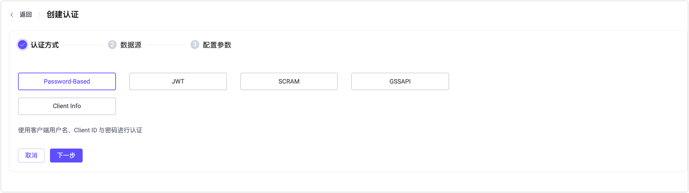
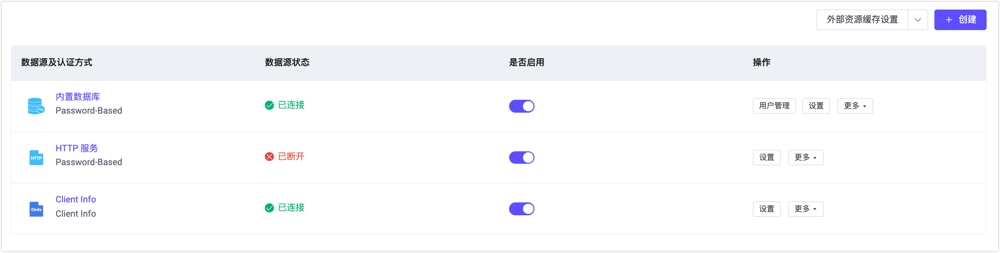
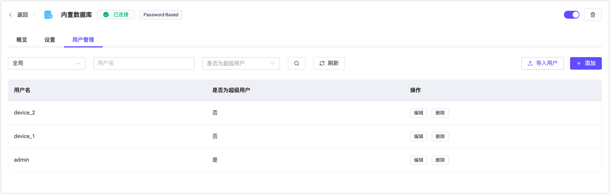
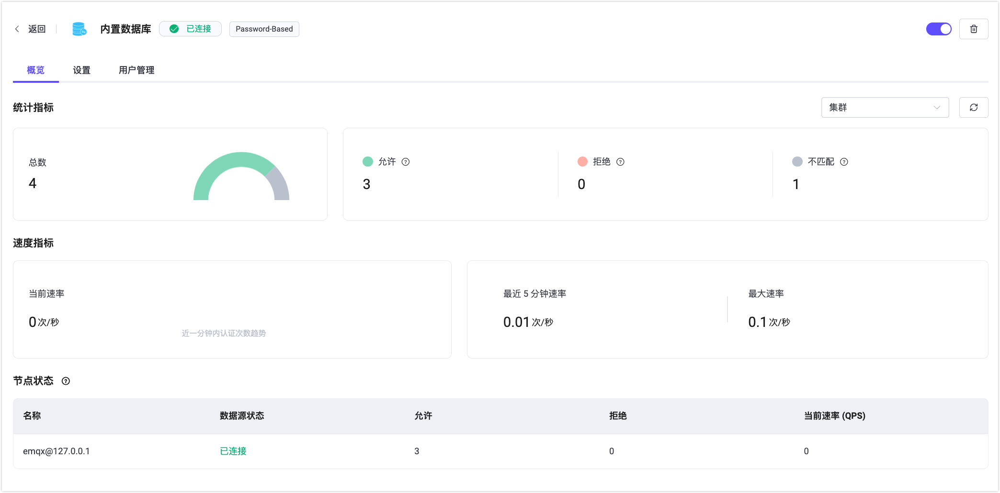
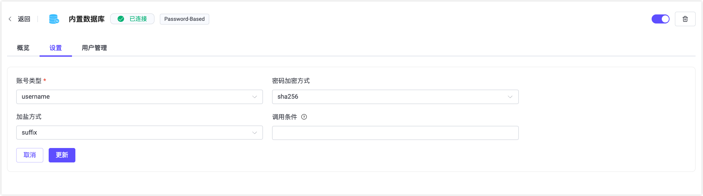

# 客户端认证

EMQX Dashboard 提供了开箱即用的认证与权限管理功能，用户仅通过用户界面，就可以快速实现客户端认证机制的配置，无需编写代码或手动编辑配置文件，即可对接各类数据源与认证服务，实现各个级别与各类场景下的安全配置，以更高的开发效率获得更安全的保障。在**客户端认证**页面中您可以快速创建和管理各类认证资源。

:::tip 提示
配置好认证资源后，设备或 MQTT 客户端需要配置对应的认证信息，才可以安全连接到 EMQX。
:::

## 创建认证

在客户端认证页面的右上角，点击**创建**按钮，即可进入到创建认证的页面。创建一个认证需要选择一种认证方式，选择完成后需要选择一个存储或获取认证信息的数据源（JWT 认证方式除外），认证数据可以从这些数据源包括数据库或 HTTP 服务中获取。最后，您需要配置连接到该数据源的连接信息。

### 认证方式

EMQX 支持以下认证机制：

- **密码认证**：使用用户名或客户端 ID 与密码对客户端进行认证，认证数据可从数据库或 HTTP 后端进行校验。
- **JWT**：使用 JSON Web Token 对客户端进行认证。客户端通过用户名或密码字段携带 Token，EMQX 使用密钥、公钥或 JWKS 对 Token 进行校验，无需配置后端。
- **SCRAM**：MQTT 5.0 的增强认证机制，通过挑战-响应方式实现客户端与服务端的双向认证，避免明文密码传输。
- **GSSAPI**：MQTT 5.0 的增强认证机制，通过集成 Kerberos 实现基于票据的安全认证。
- **客户端信息（Client Info）**：基于客户端连接元数据进行认证，例如客户端 ID、用户名、IP 地址或 TLS 证书信息。

### 认证数据源

在此步骤中，你需要根据上一步选择的认证机制来选择对应的数据源。

::: tip

已被某个认证器使用的数据源，不能再次被选择。

:::

关于数据源的完整介绍，请参见 [EMQX 认证器](../access-control/authn/authn.md#emqx-认证器)。

#### 密码认证

当选择**密码认证**机制时，可以选择以下数据源之一：

- **内置数据库**：使用 EMQX 内置数据库存储用户名、客户端 ID 以及加密后的密码。
- **外部数据库**：将认证数据存储在外部数据源中。EMQX 支持多种主流数据库，包括 `MySQL`、`PostgreSQL`、`MongoDB` 和 `Redis` 等。
- **HTTP 服务**：通过外部 HTTP 服务获取认证结果。EMQX 会将客户端凭据发送至配置的 HTTP 接口，并根据接口返回结果完成认证。

#### JWT

当选择 **JWT** 认证机制时，无需配置数据源。所有认证逻辑均通过校验 Token 本身完成，校验方式包括使用密钥、公钥或 JWKS。

#### SCRAM

当选择 **SCRAM** 认证机制时，支持以下数据源：

- **内置数据库**：使用 EMQX 内置数据库存储 SCRAM 凭据（如加盐后的密码校验值）。
- **HTTP 服务**：通过外部 HTTP 服务获取 SCRAM 认证数据，使 SCRAM 凭据可以在 EMQX 之外进行管理。

SCRAM 提供客户端与服务端的双向认证，确保通信双方身份可信，并防止凭据泄露。

更多信息请参见：

- [SCRAM 认证](../access-control/authn/scram.md)
- [基于 REST API 的 SCRAM 认证](../access-control/authn/scram_restapi.md)

#### GSSAPI

当选择 **GSSAPI** 认证机制时，使用的数据源为：

- **Kerberos**：EMQX 通过集成 Kerberos 密钥分发中心（KDC），使用 Kerberos 票据对客户端进行认证，实现集中式身份管理和高安全性的认证能力。

更多信息请参见 [MQTT 5.0 增强认证 – Kerberos](../access-control/authn/kerberos.md)。

#### Client-Info 认证

当选择 **Client-Info** 认证机制时，无需配置外部数据源。EMQX 会根据配置的规则，对客户端的连接信息进行评估并完成认证，例如客户端 ID、用户名、IP 地址或 TLS 证书信息。

更多信息请参见[客户端信息认证](../access-control/authn/cinfo.md)。

### 配置参数

每一个数据源都有一些连接或使用时的配置信息需要用户手动配置。选择了数据源之后，点击**下一步**继续配置选择好的数据源。完成配置后，点击**创建**即可快速完成认证配置。

详细的配置指导，参见各[认证器](../access-control/authn/authn.md#emqx-认证器)文档。

## 认证列表

创建认证器成功后，可以在认证列表中查看和管理。列表中我们可以查看到认证器的数据源及认证方式，数据源状态，比如外部数据库没有正常部署成功和连接到的话，可看到目前数据源状态为已断开。鼠标悬浮到该字段的话，可以查看更多 EMQX 集群内所有节点连接到该数据源的状态。点击**是否启用**开关，可以快速开启和关闭该认证配置。

认证列表的每一栏都可以通过鼠标来拖动调整顺序，或通过**操作**列调整列表顺序，顺序对于认证列表来说有一定的重要性，因为 EMQX 允许创建多个认证器，这些认证器将按照在认证链中的位置顺序运行，如果在当前认证器中未检索到匹配的认证信息，将会切换至链上的下一个认证器继续认证过程。

在**操作**列中还可以点击设置或删除认证器等。

:::tip 注意
关闭认证器后，EMQX 将不再对客户端进行认证，所有客户端都可以连接到 EMQX。请谨慎操作。
:::

## 用户管理

对于使用**内置数据库**的认证器，可以在**用户管理**页签中管理用户凭据。

你可以通过以下任一方式进入该页面：

- 在**认证器列表**页面中，点击**内置数据库**认证器对应**操作**列下的**用户**。
- 点击**内置数据库**进入其详情页面，然后切换到**用户管理**页签。

在**用户管理**页面中，你可以创建、编辑和删除用户，设置超级用户权限，并通过下载模板、填写必要字段后点击**导入用户**批量导入用户。

在添加用户时，可以选择**命名空间**，将用户关联到特定的作用范围。

## 认证概览

点击列表页中**数据源及认证方式**列中的认证器名称，可以进入到认证器的概览页面。该页面提供了 EMQX 集群中认证器的一些数据指标，例如认证的成功和失败数，不匹配数和当前正在连接认证的速率等。

页面最下方的节点状态，可以从列表中查看每个节点下的指标数据。

## 认证设置

当需要修改认证配置时，可以点击列表页中的**设置**，在设置页面可以修改当前认证器的配置信息，如当外部数据库的一些连接信息发生变化时，需要修改内置数据库的账号类型是用户名还是客户端 ID 的时候，或修改认证密码的加密方式等。

:::tip 注意
当使用内置数据库时，更新密码**加密方式**或**加盐方式**将导致已添加的认证数据不可用，请谨慎操作。
:::

## 更多内容

更多关于认证的详细解释与使用，参阅[认证](../access-control/authn/authn.md)。
