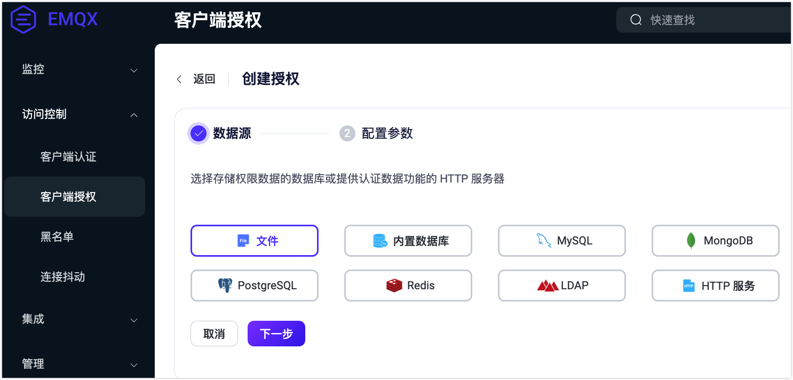
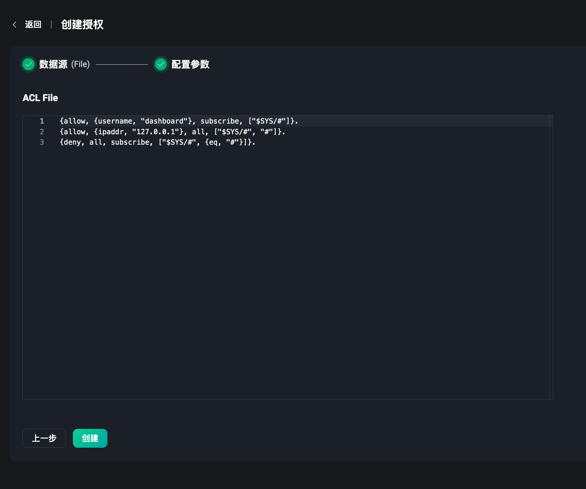
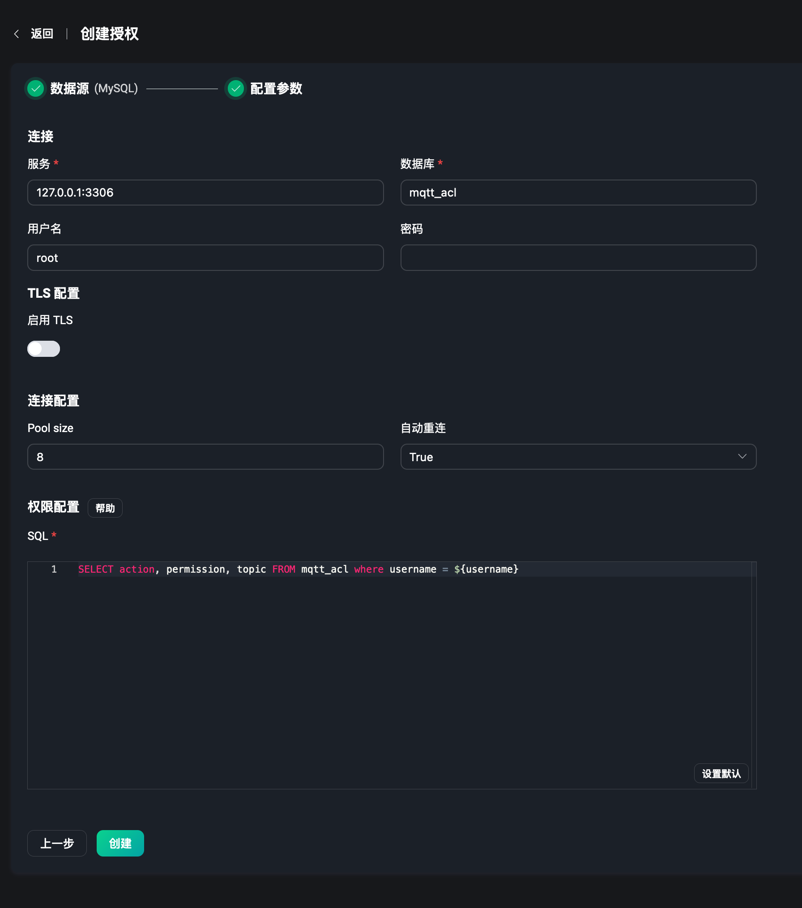
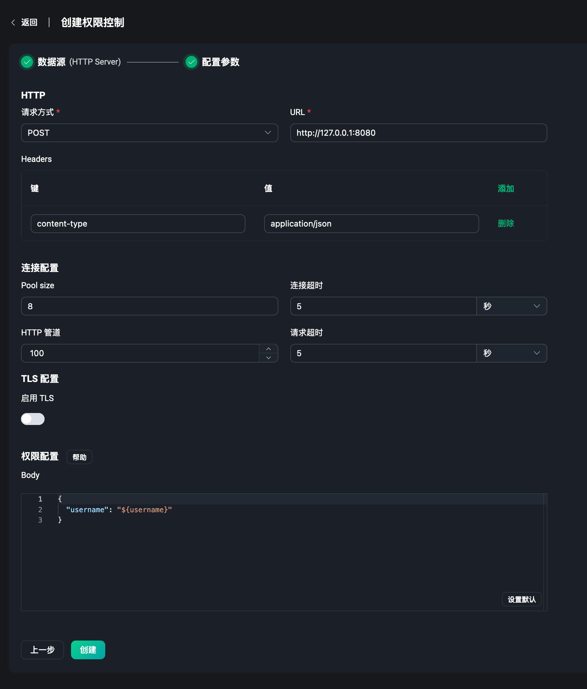
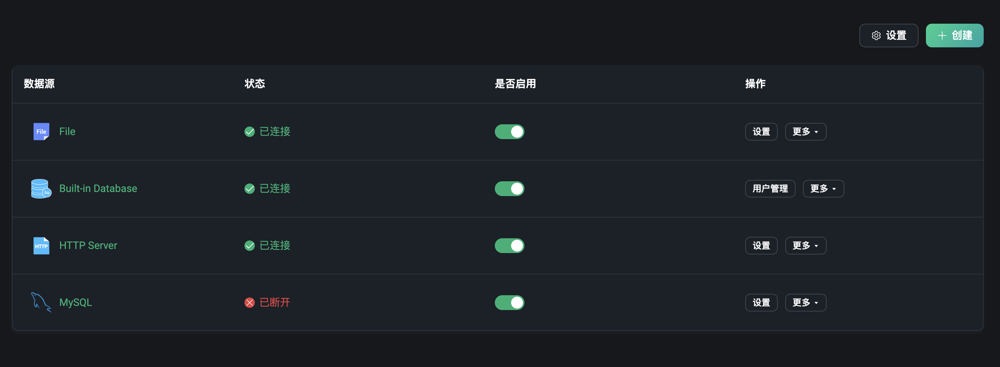
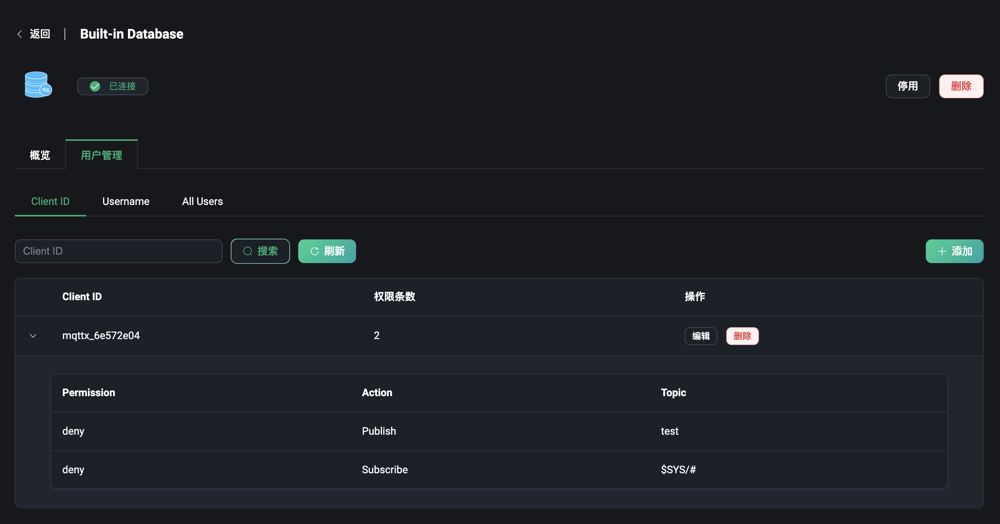
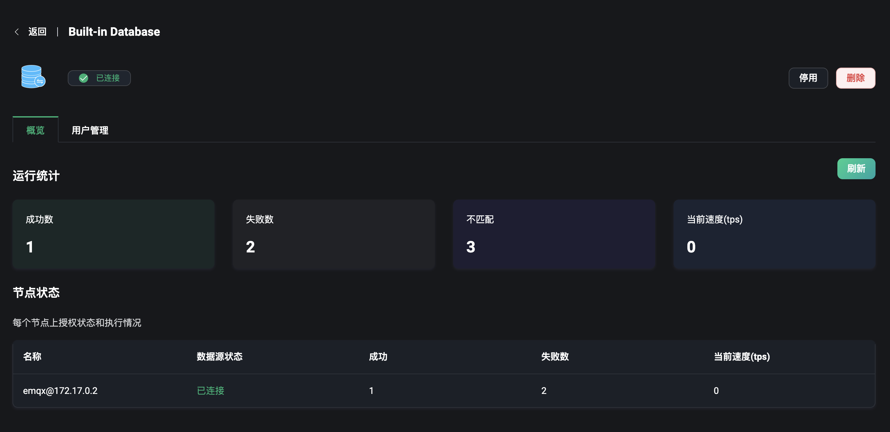
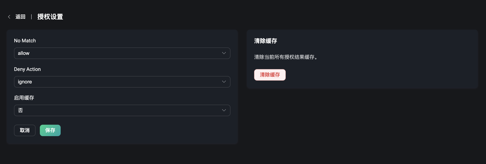

# 授权

EMQX 提供了强大的权限控制能力，而 EMQX Dashboard 提供了开箱即用的授权管理功能，通过可视化页面来快速配置 EMQX 的授权机制，无需编写代码或手动编辑配置文件，即可实现对 MQTT 客户端连接后的发布和订阅操作进行权限控制，实现各个级别与各类场景下的安全配置。

在左侧的访问控制菜单下，用户可以进入到授权页面，授权页面中用户可以快速创建和管理创建好的各类授权的配置资源。

## 创建授权

在授权页面的右上角，点击 `创建` 按钮，即可进入到创建授权的页面，配置数据源，以便 EMQX 查询权限数据和进行权限检查。

### 数据源

数据源包含了选择使用文件，内置数据库，外部数据库或外部的 HTTP 服务。

选择使用 ACL 文件来编辑和保存授权的规则内容，通过为每个发布或订阅请求扫描文件中定义的一系列规则来确定该请求是否有权限执行想要的操作。

选择使用 EMQX 内置数据库，除支持配置和存储认证数据外，同样可以使用其来配置和存储授权规则。

使用外置数据库来存储授权规则，支持以下主流数据库：`MySQL`、`PostgreSQL`、`MongoDB`、`Redis`。

使用预先定义好的 HTTP 服务，将授权的请求委托给外部 HTTP 服务器。外部的 HTTP 服务需要包含了验证权限的能力。

### 配置参数

选择完后端后就到了创建授权的最后一步，配置选择好的后端，每一个后端都有一些连接或使用时的配置信息需要用户手动配置，或编辑权限规则保存到文件内。

#### 文件

选择使用 ACL 文件后，在配置参数页面提供了一个文本编辑框，需要编辑文件的授权规则内容，是一个 Erlang 元组数据的列表。（注意每条规则后面必需有一个点号 .）元组是用花括号包起来的一个列表，各个元素用逗号分隔。

更多关于文件授权规则内容的编辑方法，请访问 [File](../access-control/authz/file.md)。

#### 内置数据库

对于选择使用内置数据库来进行授权配置的，无需配置额外参数，创建成功后在用户管理中配置权限规则。

#### 外部数据库

选择外部数据库的话，需要配置能访问到的数据库地址，数据库名称，用户名密码，以及认证相关配置，填写如何从数据库中获取授权数据的 SQL 语句或其它查询语句等。当发布和订阅操作时，会从数据库中查询相关的授权数据来判断是否能通过权限规则。以 MySQL 为例：

更多关于 MySQL 或其它外部数据库的配置详情，请访问 [MySQL](../access-control/authz/mysql.md) 或查看使用其它数据库。

#### HTTP Server

选择使用 HTTP 服务后，我们需要先有一个预设好支持授权数据比对的 HTTP 服务。当订阅和发布时，EMQX 将数据转发到 HTTP 服务上，通过 HTTP 返回的结果来判断，该操作是否能够通过权限规则。

因此我们需要配置请求服务的地址和方法包括 POST 或 GET 方法，请求服务的 Headers，将发布订阅时需要的授权信息配置到 `Body` 字段中，例如将 `username`、`topic` 和 `action` 填写到 JSON 数据中。

更多关于 HTTP Server 授权规则的配置方法，请访问 [HTTP](../access-control/authz/http.md)。

完成配置后，点击创建即可快速完成授权配置。注意：无法再次选择使用过的授权数据源。

## 授权列表

当授权配置创建完成后，我们可以在授权列表中查看和管理。列表中我们可以查看授权的数据源，数据源状态，比如外部数据库没有正常部署成功和连接到的话，可看到目前数据源状态为已断开。鼠标悬浮到该字段的话，可以查看更多 EMQX 集群内所有节点连接到该数据源的状态。点击是否启用开关，可以快速开启和关闭该授权配置。

授权列表与认证列表相似，每一栏都可以通过鼠标来拖动调整顺序，或通过操作栏调整列表顺序，因为 EMQX 允许创建多个授权机制，当一个客户端进行发布或者订阅操作的时候，EMQX 会按顺序逐个检查， 如果一个授权配置能够找到该客户端的授权规则（ACL），那么就会对这个规则进行匹配。 匹配的结果要么是允许（allow），要么是拒绝（deny）。如果没有找到适用于该客户端的规则， 那么就会继续到授权链中的下一个授权配置中进行检查。

在操作栏中还可以点击设置或删除授权配置等。

## 权限管理

对于使用内置数据库的用户来说，在授权列表页点击 `权限管理`，可以来到用户管理页面，在该页面，可以管理和配置授权规则。可以通过 `Client ID` 或 `Username` 来区分客户端，或为所有的用户都添加授权规则。

使用方法为，输入一个需要配置授权规则的主题，选择是在订阅该主题时或向该主题发布消息时，配置其权限是允许还是拒绝。

更多关于内置数据库的授权规则的配置方法，请访问[内置数据库](../access-control/authz/mnesia.md)。

:::warning
禁用授权将影响客户端发布/订阅时的权限操作，请谨慎操作。
:::

## 授权概览

点击列表页中的数据源，可以进入到该授权配置的概览页面。该页面提供了 EMQX 集群中授权相关的一些指标数据，例如运行时的授权的成功和失败数，不匹配数和当前的速率等。

页面最下方的节点状态，可以从列表中查看每个节点下的授权指标数据。

## 授权设置

当需要修改授权配置的数据源时，可以点击列表页中的 `设置`，在设置页面可以修改配置信息，如需要修改 ACL 的权限规则内容时，或当外部数据库的一些连接信息发生或查询语句发生变化时。

## 全局设置

在列表页右上角点击 `设置` 按钮，可以对授权进行全局配置。

设置当授权不匹配时的操作，允许或拒绝，拒绝后是忽略消息还是断开连接。是否开启授权数据的缓存，开启后可以减少对授权数据后端产生访问压力。右侧点击 `清除缓存`，可以快速清除当前所有授权结果缓存。

更多关于授权的详细解释与使用，请访问[授权](../access-control/authz/authz.md)。
