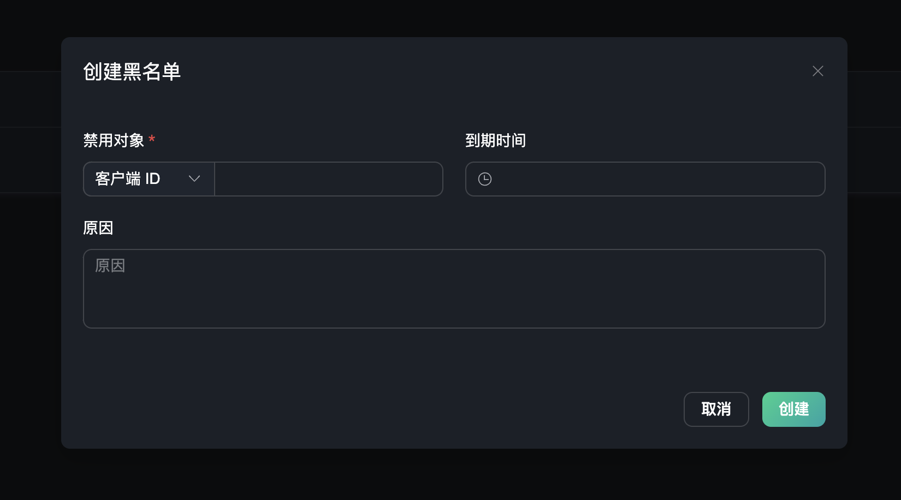
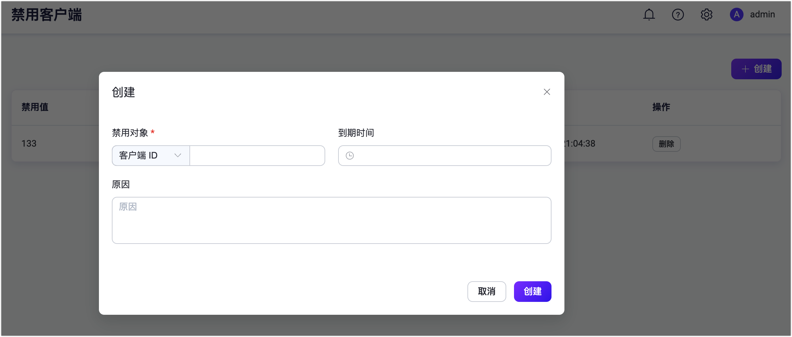

# 黑名单

EMQX 除认证授权外，还提供了黑名单功能，可以直接拒绝对于有恶意性或攻击性的客户端连接们。黑名单适合对于少量的客户端连接的封禁。

在左侧的访问控制菜单下，用户可以进入到黑名单页面，在该页面下，用户可以创建和管理黑名单。

## 创建黑名单

点击右上角的 `创建` 按钮，可以打开创建黑名单的弹出框。用户可以设置禁用对象，选择是通过客户端 ID，用户名还是 IP 地址的禁用属性，并输入对应的禁用值，设置一个到期时间，并输入创建该黑名单的原因。注意：到期时间和原因为非必填项。

## 黑名单列表

创建成功后，我们可以在黑名单列表中查看到已创建的黑名单。列表包含黑名单的禁用值和禁用属性，原因与到期时间。可在操作栏内直接删除黑名单。

