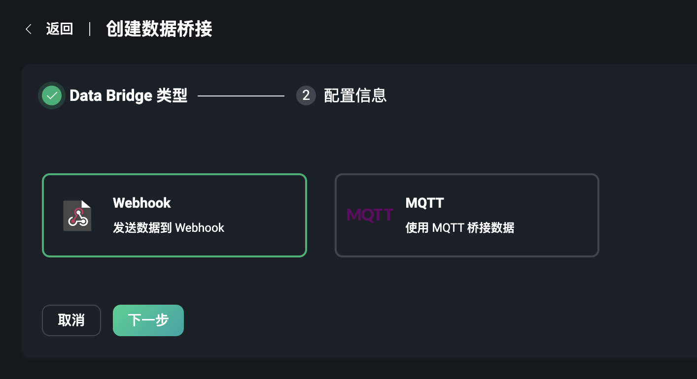
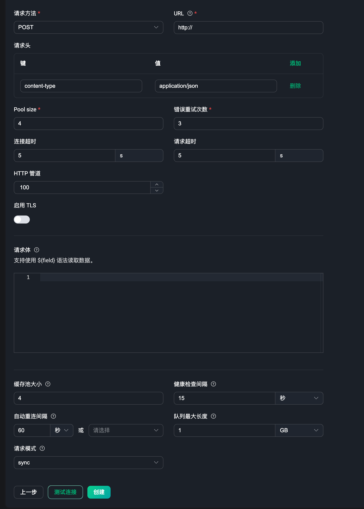
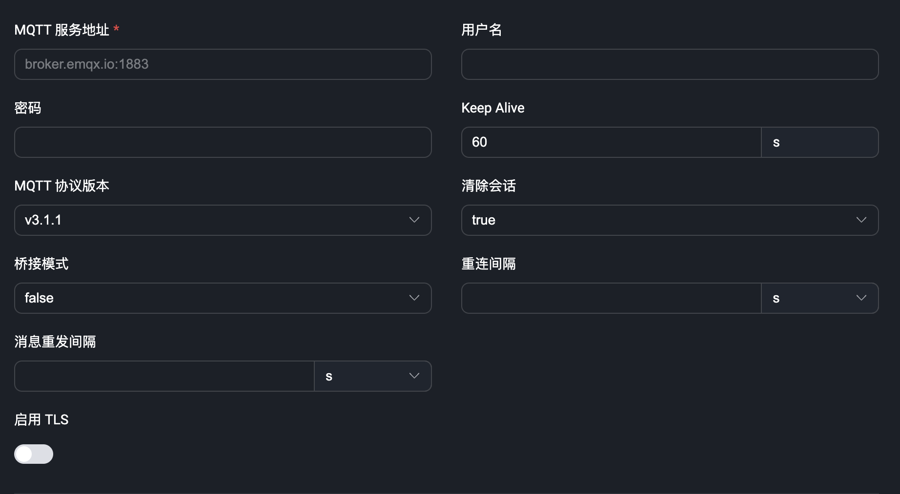
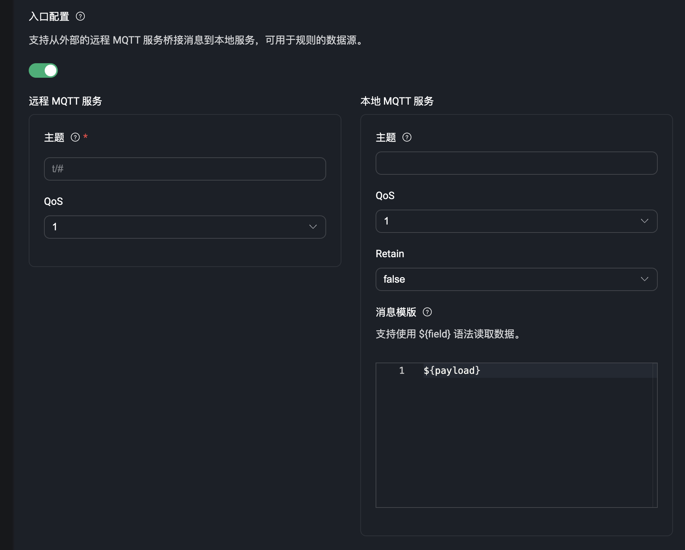
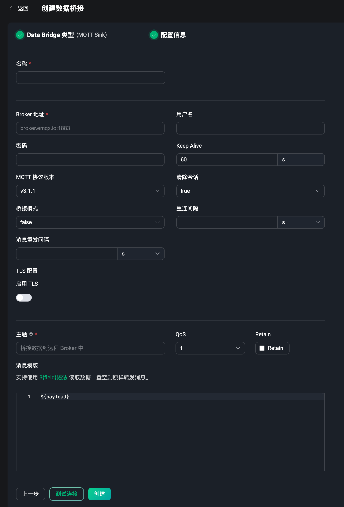
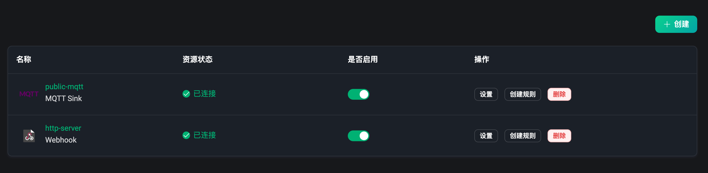
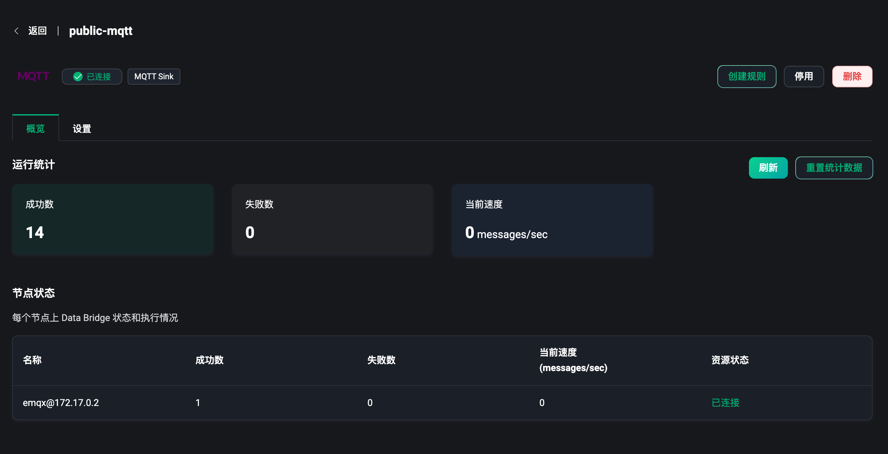

# 数据桥接

作为 EMQX 为物联网数据基础设施构建提供的最重要能力之一，数据集成帮助用户将所有的业务数据无需额外编写代码即可快速完成处理与分发。数据集成能力由数据桥接和规则两部分组成，用户可以使用数据桥接或 MQTT 主题来接入数据，使用规则处理数据后，再通过数据桥接将数据发送到外部应用系统中。详情请查看[数据集成简介](../data-integration/introduction.md)。

通过数据桥接，用户可以实时地将消息从 EMQX 发送到外部数据系统，或者从外部数据系统拉取数据并发送到 EMQX 的某个主题。而 EMQX Dashboard 提供了可视化创建数据桥接的能力，只需在页面中配置相关资源即可。详情请查看[数据桥接简介](../data-integration/data-bridges.md)。

在左侧的数据集成菜单下，用户可以进入到数据桥接页面，数据桥接页面中用户可以快速创建和管理创建好的数据桥接。

## 创建数据桥接

点击数据桥接页面的右上角的 `创建` 按钮，即可进入到创建数据桥接的页面。创建桥接需要先选择一个数据桥接的类型，最后再完成对于该类型数据桥接的相关配置即可。

目前数据桥接类型包含：

- Webhook，使用 Webhook 来转发数据到 HTTP 服务；
- MQTT，使用 MQTT 服务作为数据源来获取外部 MQTT 消息，或将 EMQX 的消息发送到外部 MQTT 服务；

### Webhook

使用 Webhook 其实就是将 EMQX 接收并处理后的数据发送到一个 HTTP 服务上，再根据预设好的 HTTP 服务来处理和集成业务数据。

同样用户需要有一个预先搭建好的 HTTP 服务，我们需要在配置信息页面填写 HTTP 请求的服务地址，选择一个请求方法 POST、GET、PUT 或 DELETE，配置请求头，将需要发送的数据使用模板语法填写到请求体（body）中即可。

更多关于 Webhook 类型的数据桥接的使用详情，请访问 [Webhook](../data-integration/data-bridge-webhook.md)

## MQTT

使用 MQTT 数据桥接，用户可以将 EMQX 的 MQTT 消息发送到外部的 MQTT 服务上，或者从外部的 MQTT 服务上拉取数据并发送到 EMQX 的某个主题上。

在 MQTT 数据桥接中，用户首先需要配置 MQTT 服务的连接信息，包括服务地址、端口、用户名、密码等信息。

然后，用户可以按需配置该 MQTT 服务的入口或出口配置，如果需要将该服务作为数据源的话，则手动打开入口配置，如果是数据目标则手动打开出口配置。例如，如果配置了入口，则表示从外部 MQTT 服务上拉取数据并发送到 EMQX 的某个主题上，如果配置了出口，则表示将 EMQX 的 MQTT 消息发送到外部的 MQTT 服务上。

注意：创建时，至少选择一个入口或出口进行配置，也可以同时都配置。

### 入口配置

当开启入口配置后，该 MQTT 数据桥接可以作为一个数据源，用户需要配置一个远程 MQTT 服务下的主题和 QoS 等级，远程 MQTT 服务则为上述中配置连接的 MQTT 服务。当用户向该远程服务的主题发送消息时，EMQX 就可以接收到该消息，用户可以在**规则的 SQL 语句**中使用该数据桥接，来接收并处理接收到的消息数据。

除远程 MQTT 服务外，还有一个本地 MQTT 服务配置，即 EMQX，用户可以配置该服务的下的主题，QoS，retain 标识和消息内容模版（这些配置项都支持模版语法）。如果当用户配置了本地的 MQTT 服务主题后，用户则不需要使用规则，连接到 EMQX 并订阅该本地主题后，也可以接收到远程服务的消息。

### 出口配置

当开启了出口配置后，该 MQTT 数据桥接可以作为一个数据目标，用户需要配置一个远程 MQTT 服务的主题和 QoS 等级，retain 标识和消息的内容模版（这些配置项都支持模版语法），远程 MQTT 服务则为上述中配置连接的 MQTT 服务。当用户使用规则接收和处理了消息数据后，只需要把该数据桥接添加到**规则的动作列表**中，EMQX 就可以将处理过的消息数据发送到该远程 MQTT 服务上。

除远程 MQTT 服务外，还有一个本地 MQTT 服务配置，即 EMQX，用户可以配置该服务的下的主题。如果当用户配置了本地的 MQTT 服务主题后，用户则不需要使用规则，连接到 EMQX 并向本地主题发送消息时，也可以将消息转发到该远程服务上。

无论是入口配置，还是出口配置，本地 MQTT 服务都为可选配置，用户需要根据业务需求来判断是否需要。对于需要使用规则来处理复杂数据的场景，用户则不需要配置本地 MQTT 服务，可直接在规则中来使用该数据桥接，否则，用户可以直接订阅，或向本地 MQTT 服务的主题发送消息，来完成接收远程服务的消息或发送消息数据到远程服务上。

创建前，无论选择了何种类型下的数据桥接，用户都可以在创建按钮旁，点击「测试连接」按钮，来测试当前配置的资源是否可用。

创建完成后，可以选择返回到数据桥接列表或直接使用该数据桥接来创建一条规则。

更多关于 MQTT 数据桥接的使用详情，请访问 [MQTT Bridge](../data-integration/data-bridge-mqtt.md)。

:::tip
注意：每个数据桥接都需要输入一个数据桥接的名称，可以用来自定义标识和区分当前数据桥接的功能
:::

## 数据桥接列表

在数据桥接列表，我们可以查看到已经创建成功的数据桥接的名称，桥接内配置的资源的状态，已连接或已断开，点按是否启用开关可以开启或停用该数据桥接，在操作栏可以快速删除数据桥接，点击 `创建规则`，可以使用该数据桥接快速创建一个规则，即进入到创建规则页面后，自动添加好该数据桥接。

## 数据桥接概览

在数据桥接列表页，点击数据桥接 `名称` 可以进入到数据桥接的概览页面，我们可以在概览页面内查看到的当前数据桥接的一些运行的数据统计。包含成功数、失败数和当前速率等。点击右上角 `刷新` 按钮可以实时的查看到最新的数据统计，点击 `重置统计数据` 可以将当前的数据清空为 0，并重新观察数据指标的变化。

页面最下方的节点状态，可以从列表中查看每个节点下的指标数据。

## 数据桥接设置

在数据桥接列表页，在操作栏点击 `设置` 可以进入到数据桥接的设置页面，该页面与创建时参数配置页面一致，当数据桥接的资源发生变化时可以到设置页面进行修改，或需要修改 MQTT 桥接的主题等。每次完成设置更新后，桥接内的资源将重新连接。注意：数据桥接的名称不可在设置页面内重新修改。

