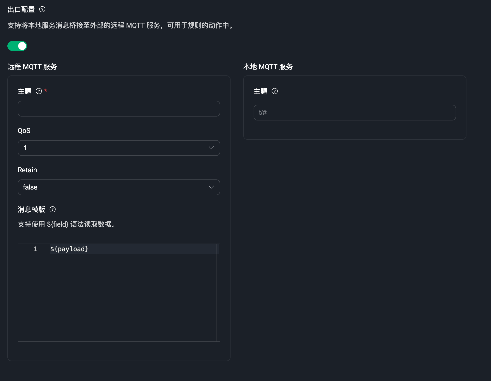
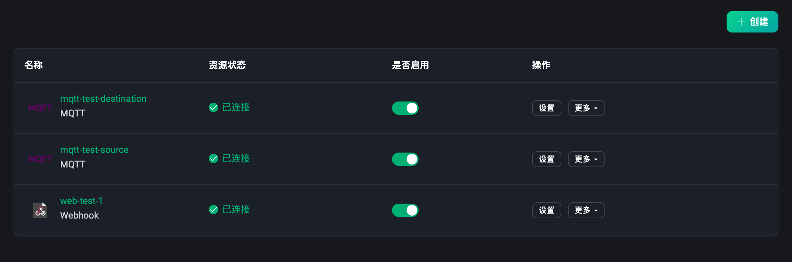
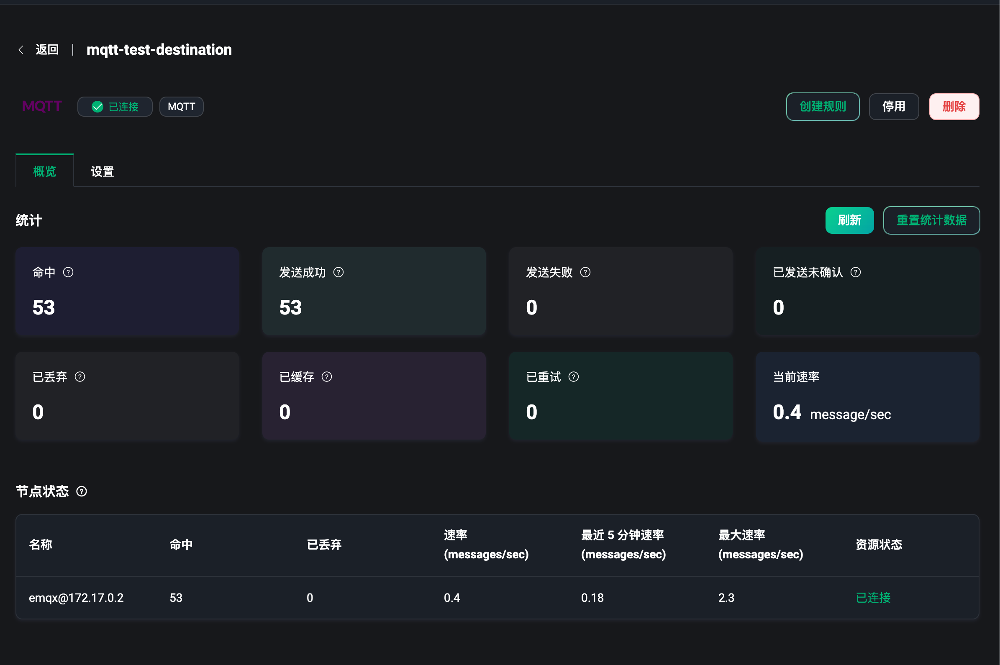
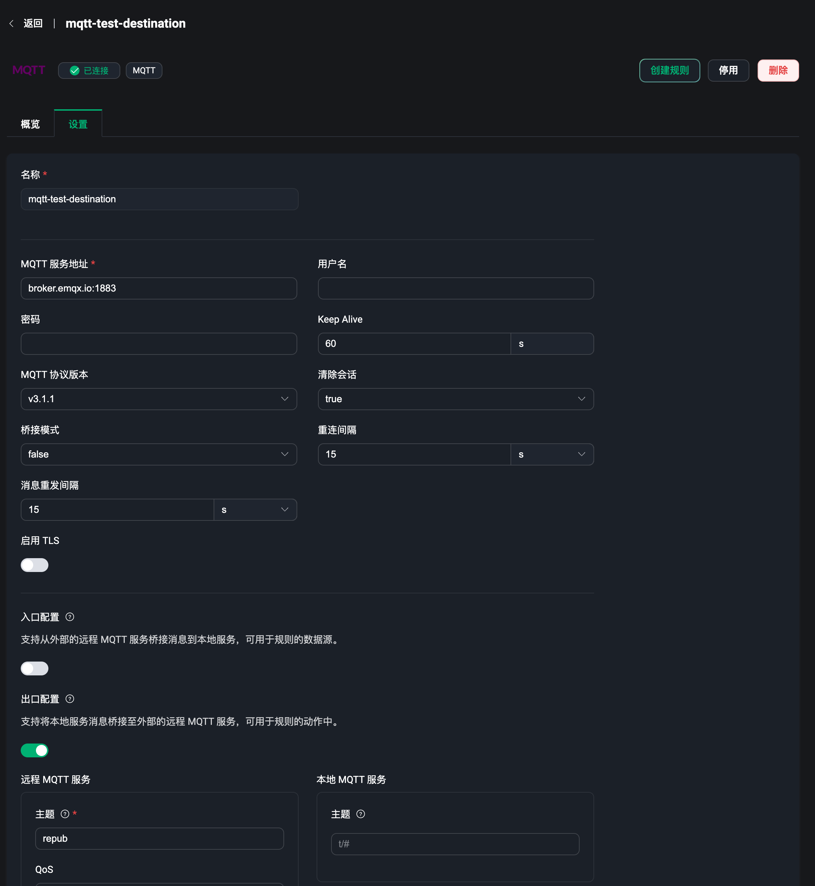

# 数据桥接

作为 EMQX 为物联网数据基础设施构建提供的最重要能力之一，数据集成帮助用户将所有的业务数据无需额外编写代码即可快速完成处理与分发。数据集成能力由数据桥接和规则两部分组成，用户可以使用数据桥接或 MQTT 主题来接入数据，使用规则处理数据后，再通过数据桥接将数据发送到外部应用系统中。详情请查看[数据集成简介](../data-integration/introduction.md)。

通过数据桥接，用户可以实时地将消息从 EMQX 发送到外部数据系统，或者从外部数据系统拉取数据并发送到 EMQX 的某个主题。而 EMQX Dashboard 提供了可视化创建数据桥接的能力，只需在页面中配置相关资源即可。详情请查看[数据桥接简介](../data-integration/data-bridges.md)。

在左侧的数据集成菜单下，用户可以进入到数据桥接页面，数据桥接页面中用户可以快速创建和管理创建好的数据桥接。

## 创建数据桥接

点击数据桥接页面的右上角的 `创建` 按钮，即可进入到创建数据桥接的页面。创建桥接需要先选择一个数据桥接的类型，最后再完成对于该类型数据桥接的相关配置即可。

目前数据桥接类型包含：

- Webhook，使用 Webhook 来转发数据到 HTTP 服务；
- MQTT Source, 使用 MQTT 服务作为数据源来获取外部 MQTT 消息；
- MQTT Sink, 将 MQTT 数据转发到外部的 MQTT 服务。

### Webhook

使用 Webhook 其实就是将 EMQX 接收并处理后的数据发送到一个 HTTP 服务上，再根据预设好的 HTTP 服务来处理和集成业务数据。

同样用户需要有一个预先搭建好的 HTTP 服务，我们需要在配置信息页面填写 HTTP 请求的服务地址，选择一个请求方法 POST、GET、PUT 或 DELETE，配置请求头，将需要发送的数据使用模板语法填写到请求体（body）中即可。

更多关于 Webhook 类型的数据桥接的使用详情，请访问 [Webhook](../data-integration/data-bridge-webhook.md)

### MQTT source

使用 MQTT Source 可以将数据从外部的 MQTT 服务中获取数据。用户可以用该类型的数据桥接将外部 MQTT 服务的数据桥接到 EMQX 内来做数据处理。

在 MQTT Source 配置页面，用户需要配置获取数据的外部 MQTT 服务的连接信息，包括连接地址，用户名密码和 MQTT 协议版本等。最后的关键是需要输入远程主题，表示从外部 MQTT 服务中指定的主题来获取数据，当有消息向该 MQTT 服务的该主题发送消息时，EMQX 就能获取到该服务下的数据。注意：该主题支持使用主题通配符。

### MQTT Sink

使用 MQTT Sink 可以将 EMQX 接收并处理后的数据发送到一个外部的 MQTT 服务上。

在 MQTT Sink 配置页面，用户同样需要配置获取数据的外部 MQTT 服务的连接信息，包括连接地址，用户名密码和 MQTT 协议版本等。最后同样还是需要输入一个远程主题，表示将数据发送到外部的 MQTT 服务的该主题上，远程 MQTT 服务就可以通过该主题获取到 EMQX 发送出来处理过的数据了。

MQTT Source 和 MQTT Sink 适用于在多个 MQTT 服务之间转发数据，当完成配置后，都可以先点击 `测试连接` 来测试连接资源的连通性。

更多关于 MQTT 类型的数据桥接的使用详情，请访问 [MQTT Bridge](../data-integration/data-bridge-mqtt.md)

:::tip
注意：每个数据桥接都需要输入一个自定义的名称，用来标识和区分当前数据桥接的功能
:::

创建完成后，可以选择返回到数据桥接列表或直接使用该数据桥接来创建一条规则。

## 数据桥接列表

在数据桥接列表，我们可以查看到已经创建成功的数据桥接的名称，桥接内配置的资源的状态，已连接或已断开，点按是否启用开关可以开启或停用该数据桥接，在操作栏可以快速删除数据桥接，点击 `创建规则`，可以使用该数据桥接快速创建一个规则，即进入到创建规则页面后，自动添加好该数据桥接。

## 数据桥接概览

在数据桥接列表页，点击数据桥接 `名称` 可以进入到数据桥接的概览页面，我们可以在概览页面内查看到的当前数据桥接的一些运行的数据统计。包含成功数、失败数和当前速率等。点击右上角 `刷新` 按钮可以实时的查看到最新的数据统计，点击 `重置统计数据` 可以将当前的数据清空为 0，并重新观察数据指标的变化。

页面最下方的节点状态，可以从列表中查看每个节点下的指标数据。

## 数据桥接设置

在数据桥接列表页，在操作栏点击 `设置` 可以进入到数据桥接的设置页面，该页面与创建时参数配置页面一致，当数据桥接的资源发生变化时可以到设置页面进行修改，或需要修改 MQTT 桥接的主题等。每次完成设置更新后，桥接内的资源将重新连接。注意：数据桥接的名称不可在设置页面内重新修改。

