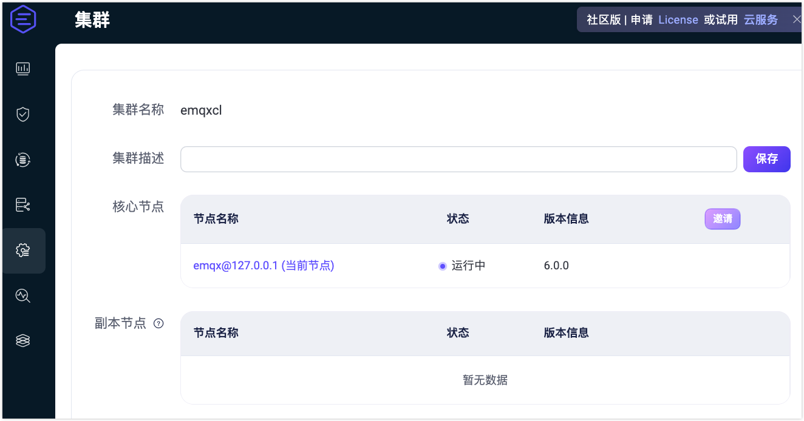
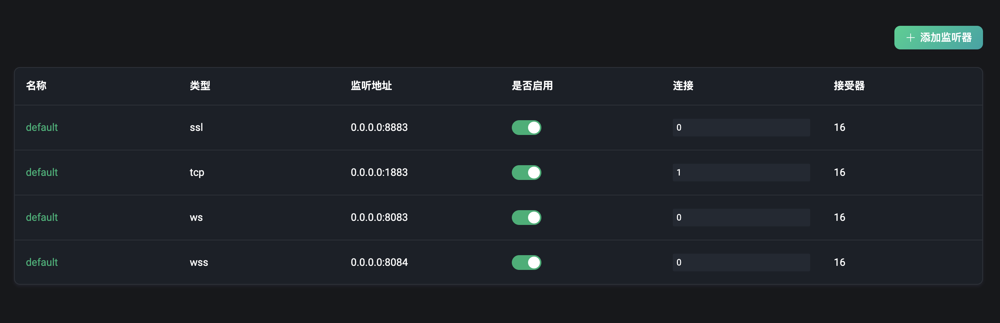
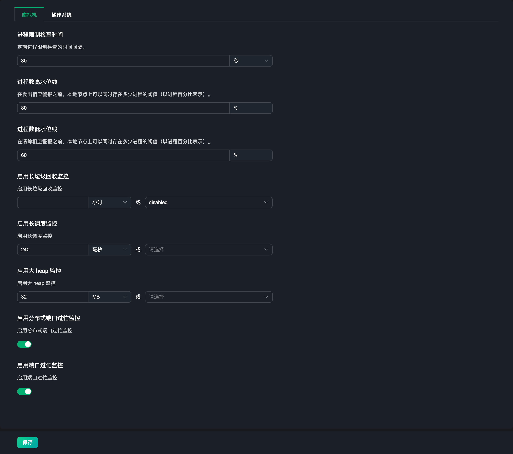

# 集群配置

EMQX 提供了热配置能力，可以在运行时动态修改配置，无需重启 EMQX 节点。EMQX Dashboard 针对热配置功能，提供了一个可视化配置页面。通过该页面，可以方便地修改 EMQX 的配置。目前提供了以下配置项：

- MQTT 配置
- 集群
- 命名空间
- 规则引擎安全
- 监听器
- 日志
- 监控
- 集群连接

## MQTT 配置

在**管理** -> **MQTT 配置**页面中，您可以配置 MQTT 协议相关的配置项，包括：

### 通用

通用菜单下为 MQTT 协议的通用基础配置项，包括类似于配置空闲超时，最大报文大小，最大 Client ID 长度，主题层级和 QoS 等级等配置项。

### 会话

会话菜单下为 MQTT 协议的会话相关配置项，包括会话过期间隔（仅支持非 MQTT 5.0 连接，MQTT 5.0 连接需在客户端配置），最大订阅数量，最大飞行窗口，是否存储QoS 0 消息等相关配置。

### 会话持久化

会话持久化菜单下为 [MQTT 会话持久化](../durability/durability_introduction.md)功能的相关配置项，包括消息保留时长，消息查询批大小，空闲轮询间隔，会话心跳间隔等。

### 保留消息

保留消息菜单下为 MQTT 协议的保留消息相关配置项，例如是否开启保留消息功能，消息的存储类型与方式，保留消息的最大数量，保留消息的负载大小，保留消息过期间隔等相关配置。当需要对保留消息进行配置修改时，就可以在这里进行配置。详见[设置保留消息](./retained.md#设置保留消息)。

> 当停用保留消息时，已有的保留消息将不会被删除。

### 系统主题

系统主题菜单下为 EMQX 内置的系统主题相关配置项，EMQX 将周期性的将运行状态，使用统计和即时客户端事件发布到 `$SYS/` 开头的系统主题，当客户端订阅该主题时，EMQX 将会将相关的信息发布到该主题下。系统主题的配置项包括消息发布周期，心跳周期等相关配置。

### 强制关闭

**强制关闭**选项卡允许您根据资源使用阈值配置自动关闭行为。此功能可以防止由于过度消耗资源（例如消息队列长度或堆内存大小）而导致系统不稳定。

在**强制关闭**选项卡页面中，您可以配置以下字段的设置：

- **启用强制关闭**：此开关用于启用或禁用强制关闭功能。当启用时，如果超过指定的资源阈值，系统将自动触发客户端进程关闭。默认为`启用`。
- **最大堆内存**：指定系统允许的最大堆内存大小。如果堆内存超出此限制，系统将启动强制关闭，以保持稳定性。默认为`32 MB`。
- **最大邮箱大小**：定义邮箱消息队列的最大允许长度。如果队列长度超过此限制，系统将触发强制关闭以防止系统过载。默认为`1000`。

## 集群

**集群**配置页面用于管理 EMQX 集群节点，您可以在此页面查看节点详情、邀请新节点以及移除已有节点。

::: tip 注意

如果您使用的是 EMQX 社区版，将无法邀请新节点。集群功能在试用期内可用，试用结束后需购买商业 License，否则该功能将被禁用。

:::

从 EMQX v6.0.0 开始，您可以添加**集群描述**，以帮助标识集群的用途或部署环境。在输入框中填写有意义的描述，并点击**保存**应用更改。

保存后，集群描述将显示在控制台顶部，在**集群**和**集群概览**等页面中便于快速查看。点击编辑图标可跳转回**集群**页面修改描述。

- 若要查看节点详情，点击节点名称，将跳转至**集群概览**页面以获取详细信息。
- 若要邀请新节点，点击**邀请**按钮，在**节点名称**输入框中填写节点的 IP 地址或主机名，然后点击**确定**。
- 若要移除节点，点击**移除**按钮。系统将在移除前弹出确认对话框以进行确认。

EMQX 还提供了通过使用命令的方式来创建和管理集群，详细信息请参考[创建和管理集群](../deploy/cluster/create-cluster.md)。

## 命名空间

EMQX 中的命名空间功能为单个集群内的不同客户端组提供逻辑隔离。您可以在**命名空间**页面管理命名空间。有关如何管理和配置命名空间的详细指导，参阅[命名空间](../multi-tenancy/namespace-overview.md)。

## 规则引擎安全

EMQX 连接器、数据桥接和动作会向外部服务建立出站网络连接。如果缺乏访问控制，错误配置或恶意的目标地址可能导致 EMQX 向内部或敏感网络发起非预期请求，即服务端请求伪造（SSRF）漏洞。

从 EMQX 6.0.3 开始，**规则引擎安全**页面支持直接在 Dashboard 中配置内置的 SSRF 防护策略。从 EMQX 6.0.4 开始，该策略仅在测试、创建或更新 HTTP、MQTT 连接器配置时，分别校验 HTTP 连接器的 `url` 字段和 MQTT 连接器的 `server` 字段。解析到被禁止地址的目标会在此时被拒绝。

::: warning 重要提示
SSRF 策略不校验其他连接器类型、连接器启停操作、连接器删除操作或运行时出站连接。如果 HTTP 或 MQTT 连接器的目标地址在连接器创建后被策略禁止，仍可重新启用该连接器。如果需要保护其他连接器类型、使策略变更应用于已保存的连接器配置、防御 DNS rebinding 或其他运行时地址变化，请使用 `iptables`、`nftables` 等主机级出站访问控制。完整指导请参见[结合规则引擎策略与防火墙规则防御 SSRF](../deploy/cluster/security.md#结合规则引擎策略与防火墙规则防御-ssrf)。
:::

### 启用 SSRF 保护

通过**启用 SSRF 保护**开关开启或关闭该策略。启用后，EMQX 会在测试、创建或更新 HTTP、MQTT 连接器配置时，分别评估 HTTP 连接器的 `url` 和 MQTT 连接器的 `server`。评估顺序如下：

1. 与**拒绝的主机名**进行精确匹配，匹配则立即拒绝。
2. 将解析得到的 IP 与**允许的 CIDR 范围**匹配，命中则放行。
3. 将解析得到的 IP 与**拒绝的 CIDR 范围**匹配，命中则拒绝。

为保持兼容性，该策略默认关闭。如果需要防止使用被禁止的目标地址测试、创建或更新 HTTP、MQTT 连接器配置，请启用该策略。如果这些连接器必须访问内部服务，请先审查并调整允许和拒绝的 CIDR 范围，再启用该策略。

### 允许的 CIDR 范围

解析 IP 命中该列表中的 CIDR 范围时，无论其是否在拒绝列表中，均会被放行。可用此字段显式放行 HTTP 或 MQTT 连接器需要访问的特定内部子网。

允许列表的优先级高于拒绝 CIDR 列表。

### 拒绝的 CIDR 范围

测试、创建或更新 HTTP、MQTT 连接器配置时，EMQX 拒绝使用的 CIDR 范围列表。默认集合涵盖 SSRF 攻击中常见的敏感地址：

| CIDR | 说明 |
|---|---|
| `127.0.0.0/8` | IPv4 回环地址 |
| `::1/128` | IPv6 回环地址 |
| `169.254.0.0/16` | IPv4 链路本地地址（含 AWS/Azure 元数据） |
| `fe80::/10` | IPv6 链路本地地址 |
| `10.0.0.0/8` | 私有网络（RFC 1918） |
| `172.16.0.0/12` | 私有网络（RFC 1918） |
| `192.168.0.0/16` | 私有网络（RFC 1918） |
| `fc00::/7` | IPv6 唯一本地地址 |
| `0.0.0.0/32` | 未指定地址 |
| `224.0.0.0/4` | IPv4 多播 |
| `ff00::/8` | IPv6 多播 |
| `100.100.100.200/32` | 阿里云元数据服务 |
| `169.254.169.253/32` | AWS 外部元数据服务 |

::: warning 重要提示
从默认拒绝 CIDR 列表中移除条目可能使 EMQX 暴露于 SSRF 攻击风险。仅在有明确业务需求且充分了解安全影响的情况下才可移除。
:::

如果 HTTP 或 MQTT 连接器必须访问默认拒绝列表中的地址，建议将该地址添加到**允许的 CIDR 范围**，而非从拒绝列表中移除。允许列表优先级更高。

### 拒绝的主机名

测试、创建或更新 HTTP、MQTT 连接器配置时，EMQX 拒绝使用的主机名列表，无论其解析到哪个 IP 地址。主机名匹配为精确匹配，且不区分大小写。该字段适合用于按名称屏蔽已知的云元数据端点。

配置完成后，点击**保存修改**使更改生效。

## 监听器

**管理** -> **监听器**页面默认是一个监听器的列表页。EMQX 默认提供了四个常用的监听器：

- 使用 1883 端口的 TCP 类型监听器
- 使用 8883 端口的 SSL/TLS 安全连接类型监听器
- 使用 8083 端口的 WebSocket 类型监听器
- 使用 8084 端口的 WebSocket 安全类型监听器

通常使用以上默认的监听器，输入对应端口和协议类型即可。如果需要添加其他类型的监听器，可以点击右上角的**添加监听器**按钮，添加一个新的监听器。

### 添加监听器

在右侧弹出的**添加监听器**面板中可以看到一个添加监听器的表单，其中中包含了监听器的基本配置项。您可以输入一个监听器名称用于标识该监听器；选择一个监听器类型，包括 tcp、ssl、ws 和 wss 类型；输入监听器地址，可以输入 IP 地址和端口号，使用 IP 地址可以限制监听器的访问范围，也可以直接输入一个端口号。

#### 速率限制

在**添加监听器**表单的**速率限制**区域，可以配置以下速率和突发限制：

- **最大连接速率（监听器）**和**最大连接突发速率（监听器）**
- **最大消息发布速率（单客户端）**和**最大消息发布突发速率（单客户端）**
- **订阅速率**和**订阅突发速率**
- **最大消息发布流量（单客户端）**和**最大消息发布流量突发速率（单客户端）**
- **最大消息投递速率（单客户端）**和**最大消息投递突发速率（单客户端）**
- **最大消息投递流量（单客户端）**和**最大消息投递流量突发速率（单客户端）**

配置速率限制可以在当消息数据过载或客户端过度请求时确保系统和网络的稳定性。

更多关于速率限制的详细配置文档，请参考[速率限制](../rate-limit/rate-limit.md)。

更多关于监听器配置的详情，请参考[企业版配置手册](https://docs.emqx.com/zh/enterprise/v@EE_VERSION@/hocon/)。

### 管理监听器

完成添加一个监听器后，可以在列表中看到该监听器。点击监听器名称进入到编辑页面，在该页面下可以修改该监听器的配置或删除一个监听器。需要注意的是，监听器名称、类型和监听地址不可在设置中再次修改。

点击编辑页面中的**删除**按钮，可以删除该监听器。当删除监听器时，需要输入目前正在删除的监听器名称，以确认删除操作。列表中我们还可以点击启用开关来启用或者禁用该监听器。列表中还可以查看每个监听器下的连接数。

::: tip 注意

修改和删除监听器是一个带有危险性的操作，需要谨慎操作。如果更新或删除了一个监听器，那么该监听器上的客户端连接将会被断开。

:::

## 日志

**管理**->**日志**为日志相关的配置页面。该页面包含**控制台日志**、**文件日志**、**日志限流**，和**审计日志**标签页。

EMQX 支持两种不同的日志输出方式：控制台输出日志和文件输出日志。您可以根据需要选择输出方式或同时启用这两种方式。在相应的配置页面中，可以设置是否启用日志处理进程，设置日志级别，日志格式类型，文件日志还可以设置日志文件的路径和日志名称。更多关于日志的详细配置说明，请参考[通过 Dashboard 修改日志配置](../observability/log.md#通过-dashboard-修改日志配置)。

在**日志限流**配置页面，您可以设置日志限流的时间窗口。关于日志限流功能的介绍，参考[日志限流](../observability/log.md#日志限流)。

在**审计日志**配置页面，您可以启用或禁用审计日志这一功能并对该功能进行相关配置。详细的配置说明，参考[通过 Dashboard 启用](./audit-log.md#通过-dashboard-启用)。

## 监控

点击左侧配置中的**管理** -> **监控**进入监控集成的配置页面。该页面下包含两个标签页：

- **系统**：根据用户需要，针对[告警](./diagnose.md#告警)功能进行一定程度的设置调整，如告警阈值、检查间隔等。
- **监控集成**：提供了与第三方监控平台的集成配置。

### 系统

如当前告警触发阈值或告警监控检查间隔的默认值不符合用户的实际需要，可以在此页面进行设置调整。当前设置分为两个模块：**Erlang 虚拟机**和**操作系统**，各配置项的默认值和说明可查看[告警](https://docs.emqx.com/zh/emqx/latest/observability/alarms.html)。

### 监控集成

该页面主要提供了与第三方监控平台的集成配置，目前 EMQX 提供了与 Prometheus、OpenTelemetry，和 Datadog 的集成方式。

使用 Prometheus 时，可以在该页面配置 Pull 或 Push 模式。在 Pull 模式下，Prometheus 从 `/api/v5/prometheus/*` 下的 API 抓取指标。从 EMQX 6.3.0 开始，这些 API 默认要求身份认证。请为抓取程序配置具有 `monitoring` scope 的专用 API 密钥。配置详情请参见[集成 Prometheus](../observability/prometheus.md)。

或者可以选择配置一个 `Pushgateway` 的服务地址，来将监控数据推送到 `Pushgateway`，然后再由 `Pushgateway` 推送到 `Prometheus` 服务。通常情况下我们不需要使用 `Pushgateway` 就能监控到 EMQX 的指标数据，点击查看[何时使用 Pushgateway](https://prometheus.io/docs/practices/pushing/)。

点击底部的**帮助**按钮，选择默认或使用 `Pushgateway` 的方式，根据提供的使用步骤，配置相关所需服务的地址或 API 信息，即可快速生成对应的 `Prometheus` 配置文件，最后再使用该配置文件来启动 `Prometheus` 服务即可。

启动 `Prometheus` 服务后，可以在帮助页面的最后，点击下载我们提供的 `Grafana` 默认的监控面板的配置文件，将该文件导入到 `Grafana` 中，我们就可以通过可视化面板来查看 EMQX 的监控数据，用户也可以根据需求在 `Grafana` 中对监控数据进行自定义修改。同时模版也可以在 [Grafana 官方网站](https://grafana.com/grafana/dashboards/17446-emqx/)中下载。

关于 OpenTelemetry 和 Datadog 集成的配置详情，参考[集成 OpenTelemetry](../observability/opentelemetry/opentelemetry.md) 和 [集成 Datadog](../observability/datadog.md)。

## 集群连接

集群连接功能可以将多个独立的 EMQX 集群连接在一起，因此通常地理位置分散的不同集群之间的客户端能够相互通信。用户可以在该页面中创建和配置集群连接。具体的创建和配置指导，参考 [EMQX 集群连接](../cluster-linking/introduction.md)。
