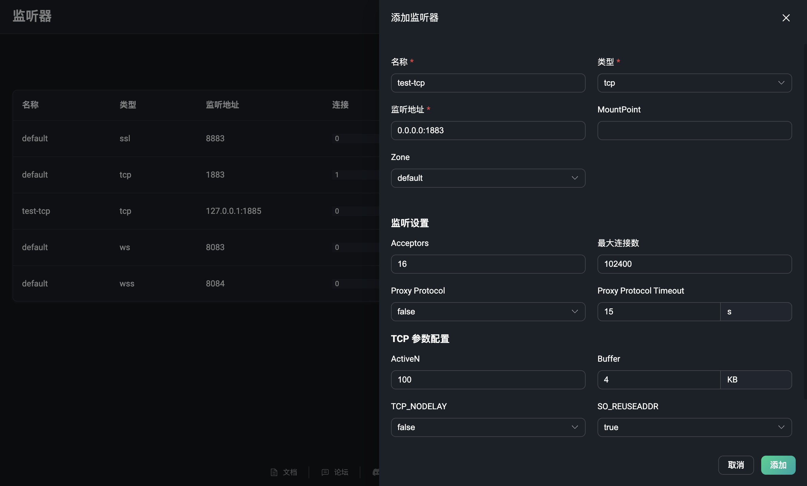
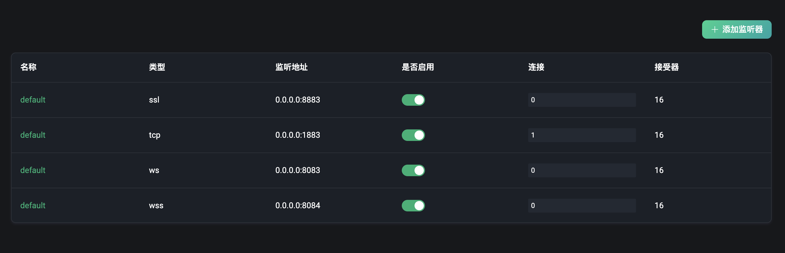
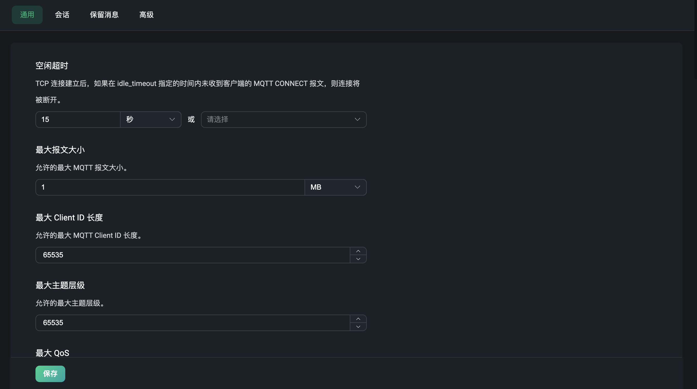
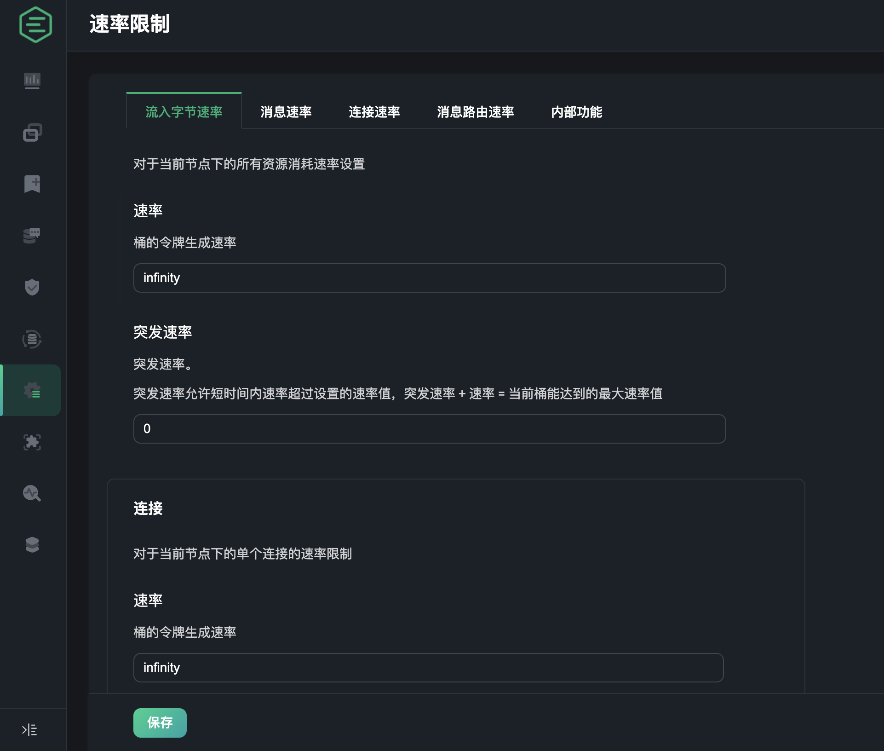
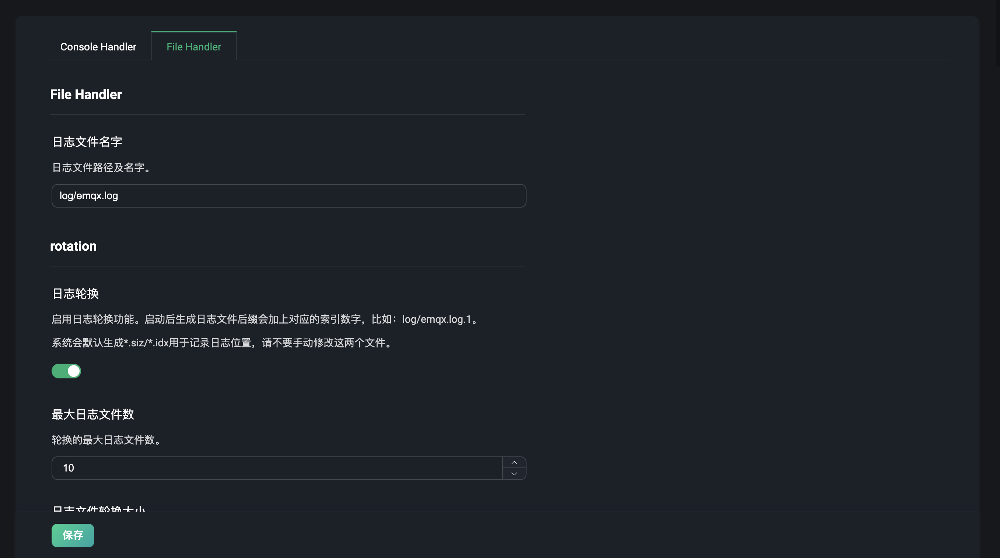
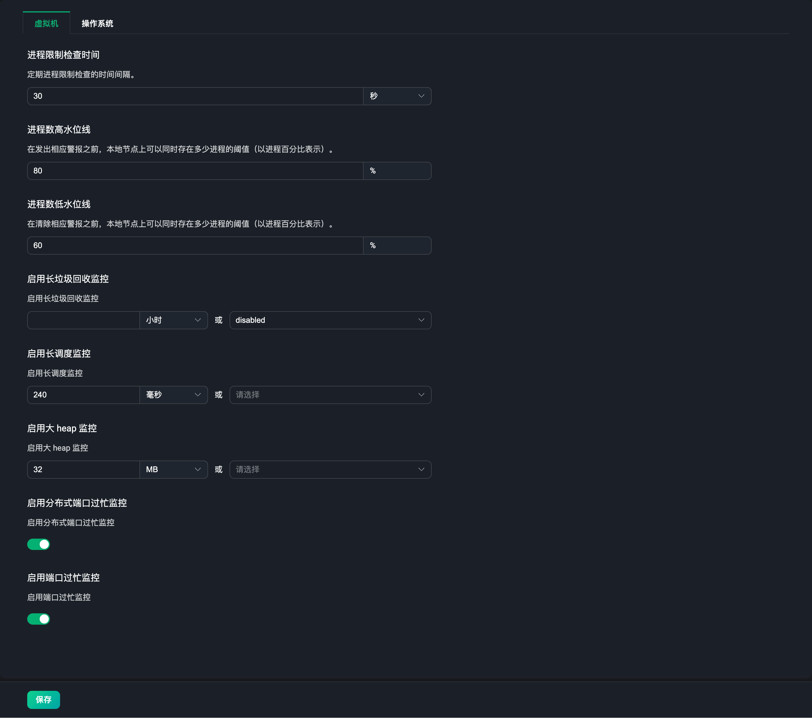

# 功能配置

EMQX 提供了热配置能力，可以在运行时动态修改配置，无需重启 EMQX 节点。在 Dashboard 页面中，我们针对热配置功能，提供了一个可视化配置页面，通过该页面，可以方便的修改 EMQX 的配置。目前提供了以下配置项：

- 监听器配置
- MQTT 配置
- 日志配置
- 监控集成配置

## 监听器

点击左侧配置菜单下的监听器，可以来到监听器页面，该页面默认是一个监听器的列表页。EMQX 默认提供了四个常用的监听器：

- 使用 1883 端口的 TCP 类型监听器
- 使用 8883 端口的 SSL/TLS 安全连接类型监听器
- 使用 8083 端口的 WebSocket 类型监听器
- 使用 8084 端口的 WebSocket 安全类型监听器

正常我们使用以上默认的监听器，输入对应端口和协议类型即可。如果需要添加其他类型的监听器，可以点击右上角的`添加监听器`按钮，添加一个新的监听器。

### 添加监听器

点击添加监听器按钮后，可以在右边的面板中看到一个添加监听器的表单，表单中包含了监听器的基本配置项，输入一个监听器名称用于标识该监听器，选择一个监听器类型，包括 tcp、ssl、ws 和 wss 类型，输入监听器地址，可以输入 IP 地址和端口号，使用 IP 地址可以限制监听器的访问范围，也可以直接输入一个端口号，然后点击`添加`按钮即可。

更多关于监听器配置的详情，请参考[监听器配置](../configuration/configuration-manual.md#brokerlisteners)。

### 管理监听器

添加完成一个监听器后，可以在列表中看到该监听器，可以点击`名称`可进入到编辑页面，在该页面下可以修改该监听器的配置或删除一个监听器。需要注意的是，监听器名称、类型和监听地址不可在设置中再次修改。

点击编辑页面中的`删除`按钮，可以删除该监听器。当删除监听器时，需要输入目前正在删除的监听器名称，以确认删除操作。列表中我们还可以点击启用开关来启用或者禁用该监听器。列表中还可以查看每个监听器下的连接数。

::: tip
修改和删除监听器是一个带有危险性的操作，需要谨慎操作。如果更新或删除了一个监听器，那么该监听器上的客户端连接将会被断开。
:::

## MQTT

点击左侧配置菜单下的 MQTT，可以来到 MQTT 协议相关的配置页面。在 MQTT 配置页面中，我们可以配置 MQTT 协议相关的配置项，包括：

### 通用

通用菜单下为 MQTT 协议的通用基础配置项，包括类似于配置空闲超时，最大报文大小，最大 Client ID 长度，主题层级和 QoS 等级等配置项。

### 会话

会话菜单下为 MQTT 协议的会话相关配置项，包括会话过期间隔（仅支持非 MQTT 5.0 连接，MQTT 5.0 连接需在客户端配置），最大订阅数量，最大飞行窗口，是否存储QoS 0 消息等相关配置。

### 保留消息

保留消息菜单下为 MQTT 协议的保留消息相关配置项，例如是否开启保留消息功能，消息的存储类型与方式，保留消息的最大数量，保留消息的负载大小，保留消息过期间隔等相关配置。当需要对保留消息进行配置修改时，就可以在这里进行配置。

> 当停用保留消息时，已有的保留消息将不会被删除。

### 系统主题

系统主题菜单下为 EMQX 内置的系统主题相关配置项，EMQX 将周期性的将运行状态，使用统计和即时客户端事件发布到 `$SYS/` 开头的系统主题，当客户端订阅该主题时，EMQX 将会将相关的信息发布到该主题下。系统主题的配置项包括消息发布周期，心跳周期等相关配置。

### 扩展

扩展菜单下为 EMQX 内置的扩展相关配置项，为使用 MQTT 协议的客户端提供了一些扩展功能，包括：主题重写，可以手动添加需要重写的主题，选择动作类型--发布订阅，输入原始主题、正则表达式及目标主题。代理订阅，可以手动添加一个代理订阅，对于已经添加过的代理订阅，可以进行删除和编辑操作。最后，支持设置延迟发布，查看已延迟发布的消息等。

更多关于 MQTT 详细的配置文档，请参考 [MQTT 配置](../configuration/configuration-manual.md#brokermqtt)。

## 速率限制

点击左侧配置菜单下的速率限制，进入到速率限制相关的配置页面。在该配置页面中，可以对 EMQX 的使用时，接入消息，分发消息的速率进行限制，包括：

- 流入的字节速率，每秒流入的消息的字节数大小
- 消息速率，每秒流入的消息条数
- 连接速率，每秒的连接数
- 消息路由速率，会话每秒派发的消息数量
- 一些内部功能的相关速率配置

配置速率提供的一系列的速率限制功能，可以防止当消息数据过载时，客户端过度请求时，确保了系统和网络的稳定性。

EMQX 支持对节点、监听器和单个连接进行速率限制，不过在 Dashboard 中进行配置时，目前仅支持对单个连接和节点级别的速率进行限制。

更多关于速率限制的详细配置文档，请参考[速率限制](../rate-limit/rate-limit.md)。

## 日志

点击左侧配置菜单下的日志，可以来到日志相关的配置页面。日志配置分为两个部分，一个是控制台日志，一个是文件日志，即 Console Handler 和 File Handler。在日志配置页面中，可以设置是否启用日志处理进程，设置日志级别，日志格式类型，text 还是 json，文件日志还可以设置日志文件的路径和日志名称。

更多关于日志详细的配置文档，请参考[日志配置](../configuration/configuration-manual.md#log)。

## 监控

点击左侧配置菜单下的监控，可以来到监控集成的配置页面。该菜单页面下包含有两个标签页：

- 系统：根据用户需要，针对[告警](./diagnose.md/#告警)功能进行一定程度的设置调整，如告警阈值、检查间隔等。
- 监控集成：提供了与第三方监控平台的集成配置。

### 系统

如当前告警触发阈值或告警监控检查间隔的默认值不符合用户的实际需要，可以在此页面进行设置调整。当前设置分为两个模块：`虚拟机`和`操作系统`，各配置项的默认值和说明可查看[告警](../observability/alarms.md)。

### 监控集成

该页面主要是提供了与第三方监控平台的集成配置，目前 EMQX 提供了与 Prometheus 的集成方式。配置页面可以快速开启该配置，并配置推送数据地址与数据上报时间间隔等。

<!--add a screenshot later-->

当使用 `Prometheus` 第三方监控服务时我们可以直接使用 EMQX 提供的 API `/prometheus/stats` 来获取监控数据，使用该 API 时不需要认证信息，具体的 API 请参考 [Prometheus](../observability/prometheus.md)。

或者可以选择配置一个 `Pushgateway` 的服务地址，来将监控数据推送到 `Pushgateway`，然后再由 `Pushgateway` 推送到 `Prometheus` 服务。通常情况下我们不需要使用 `Pushgateway` 就能监控到 EMQX 的指标数据，点击查看[何时使用 Pushgateway](https://prometheus.io/docs/practices/pushing/)。

点击底部的“帮助”按钮，选择默认或使用 `Pushgateway` 的方式，根据提供的使用步骤，配置相关所需服务的地址或 API 信息，即可快速生成对应的 `Prometheus` 配置文件，最后再使用该配置文件来启动 `Prometheus` 服务即可。

<!--add a screenshot later-->

启动 `Prometheus` 服务后，可以在帮助页面的最后，点击下载我们提供的 `Grafana` 默认的监控面板的配置文件，将该文件导入到 `Grafana` 中，我们就可以通过可视化面板来查看 EMQX 的监控数据，用户也可以根据需求在 `Grafana` 中对监控数据进行自定义修改。同时模版也可以在 [Grafana 官方网站](https://grafana.com/grafana/dashboards/17446-emqx/)中下载。

