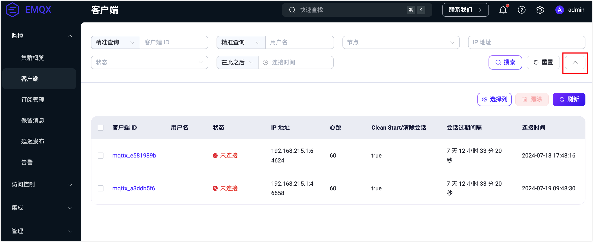
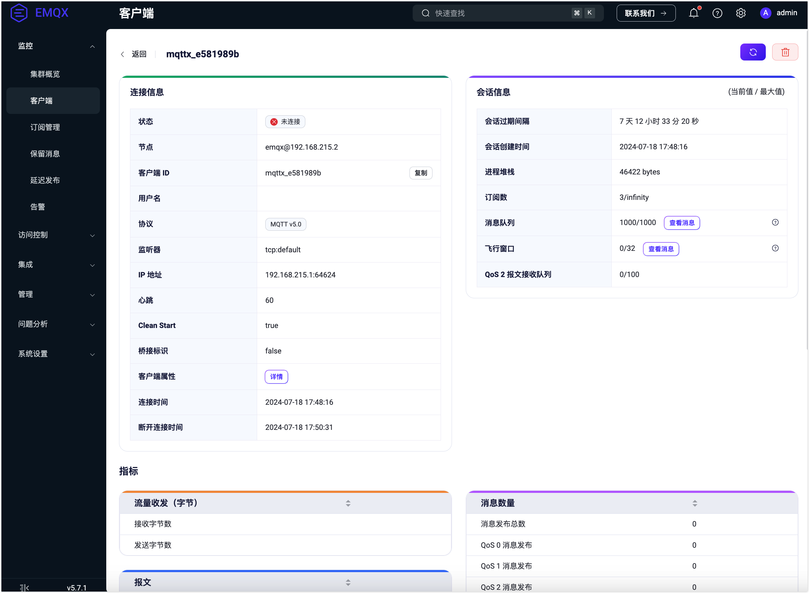

# 客户端

您可以使用 [MQTTX](https://mqttx.app/zh) 作为客户端连接到 EMQX 进行发布订阅。也可使用[各语言提供的客户端库](../../connect-emqx/introduction.md)快速实现客户端连接至 EMQX。在**客户端**页面，您可以查看到当前连接至服务器或会话尚未过期的客户端及某个客户端连接的详细信息和指标统计。

## 客户端列表

在客户端列表中，用户可查看当前客户端连接的基本信息，包括：

- 客户端连接到 EMQX 时设置的 ID 及用户名
- 当前的连接状态
- 客户端的 IP 地址
- 连接设置的心跳时长即连接最大空闲时长
- 关于连接会话的信息，包括是否清除会话及会话过期间隔
- 客户端连接至 EMQX 的时间

其中，客户端的 IP 地址数据由客户端的 IP 地址及客户端连接到 EMQX 时使用的客户端的端口拼接而成。

顶部的过滤条件字段默认只显示客户端 ID、用户名和节点，您可以使用客户端 ID 和用户名进行模糊搜索以对连接列表进行过滤。点击搜索栏右侧箭头按钮可展示所有可用于过滤的条件字段，您也可选择连接所属的节点，连接状态或连接的时间范围对列表进行过滤，或者精确输入连接客户端的 IP 过滤目标 IP 地址的客户端。

在列表上方的**选择列**可以选择需要显示的列，点击**刷新**按钮可重置所有过滤条件并重新加载连接列表。您还可以选中某个客户端，然后点击**踢除**来手动踢除该客户端。

## 客户端详情

在客户端列表中选择某一连接，点击客户端 ID 可以进入该客户端连接的详情页面，查看该连接的连接指标统计。在页面的顶部可以手动刷新该连接的连接信息，还可以手动清除会话。

除了已经在列表页面中显示的连接基本信息外，该页面还提供了一些更详细的信息供用户查看，如使用的连接使用的协议版本、结束连接后是否清除会话等，如果是状态为已断开的连接，还将显示上次断开连接的时间。**连接信息**的右侧展示了该连接的**会话信息**，包括会话过期间隔、会话创建时间、进程堆栈、订阅数、消息队列长度、飞行窗口长度和 QoS2 报文接收队列长度。

连接信息下方根据流量收发、报文和消息数量 3 个类别展示了当前连接的统计指标，用户可根据需要进行查看。

页面底部显示了当前连接已订阅的主题，用户可点击添加订阅按钮，进行较为简单的订阅操作，或在订阅列表中点击取消订阅按钮，取消当前订阅的某个主题。

