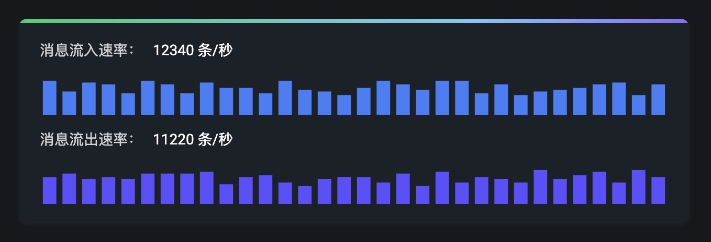
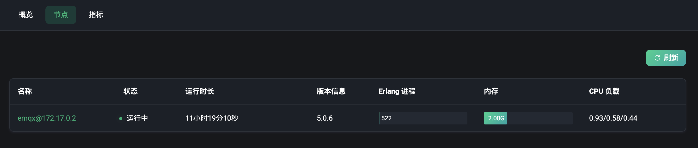
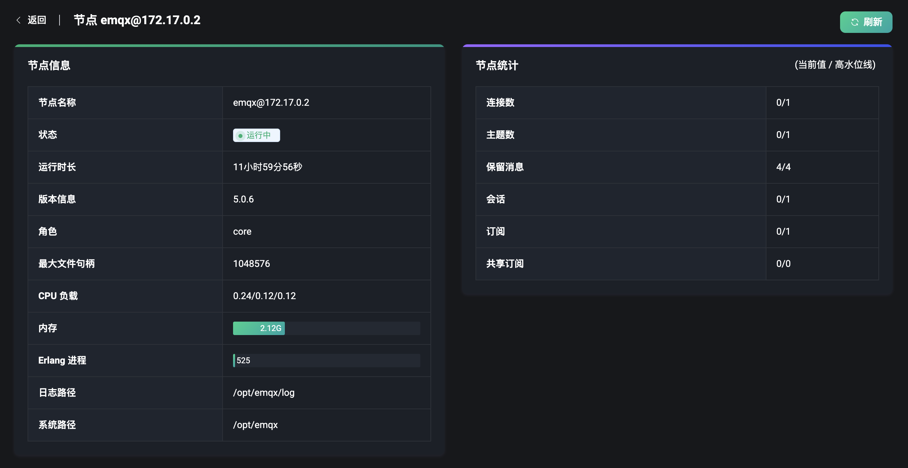
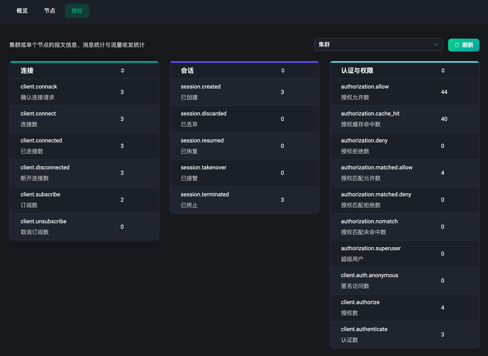
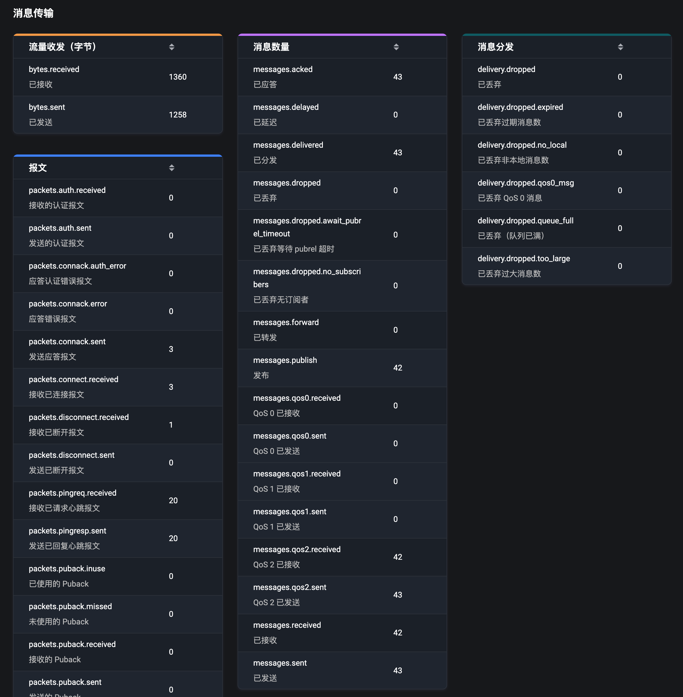

# 仪表盘

登录成功后就可以进入到 EMQX Dashboard 的首页，即仪表盘页面。该菜单页面下包含有三个标签页：

- 概览：显示整个集群内数据的概况
- 节点：查看集群中的节点列表和节点信息
- 指标：查看集群或单个节点内所有的数据指标

## 概览

该页面提供了运行中整个 EMQX 集群的数据概况，包括以下信息：

### 连接数和订阅主题数

EMQX 作为一款 MQTT 服务器，其连接数和订阅主题数是整个系统中最为重要的观测数据指标之一。连接数是指当前 MQTT 客户端或真实设备连接到 EMQX 的数量，订阅是当前每个客户端中订阅主题的总数，而主题数是当前存在于 EMQX 集群内，所有客户端订阅过的主题总数。

在概览页面的右上方的卡片里，我们可以快速的查看到整个集群内的所有的连接数，订阅数和主题数。当有连接或订阅主题更新时，卡片内的统计数据将会实时的更新。

::: tip
订阅是按客户端区分的，而主题是唯一的订阅，同一主题可能包含在不同的客户端中。
:::

除提供直观的实时数字统计的显示外，在该页面的底部还提供了可视化图表的展示，可以通过时间变化来查看历史和当前的连接、订阅主题数的变化（时间单位精确到年月日时分），从而可以更好的帮助用户能够更加清晰直观的监控到整个 EMQX 集群内连接和订阅主题数的变化趋势。

### 消息速率

了解完集群内的连接数和订阅主题数后，消息数据也是 EMQX 的一大关键指标数据。消息是指当前所有的 MQTT 客户端或真实设备连接到 EMQX 后所传输的数据内容，客户端或设备通过主题来发送或接收消息，以此来完成它们之间的数据通信。

在该概览页面左上角的卡片内，通过可视化的速率频谱图与实时的速率值展示，可以更加清晰和方便的监控当前系统内发送和接收消息量的速率变化（消息速率的统计单位为每秒多少条消息）。

### 消息数

而消息数是指客户端或设备之间传输数据的条数统计，页面中所展示的消息数包含：消息流入、消息发出和消息丢弃的数量统计。

在页面底部图表中，可以看到消息数量的可视化图表，通过时间变化来查看历史和当前的消息数（时间单位精确到年月日时分），用户通过图表能更好的动态监测到当前 EMQX 集群内，所有消息数量的实时变化。

::: tip
上述中，所有随时间变化的图表都可以在左上角选择查看：过去 1 小时、过去 6 小时、过去 12 时、过去 1 天、过去 3 天和过去 7 天的数据变化统计
:::

### 节点数据

可以通过在概览页面中间的卡片内，查看到整个 EMQX 集群的概况，包括通过拓扑图来可视化展示集群内所有节点的关联与分布，点击拓扑图中的单个节点，可以查看到当前节点的基础信息、运行状况，包括了节点名称、角色，当前单个节点上连接数、订阅数和主题数，当前节点上的 EMQX 版本（点击版本号可以查看当前版本的发布信息，以此来快速了解当前版本的内容更新），同时还可以查看到部署了该节点的操作系统的 CPU 负载与内存使用量等基础信息（内存仅支持在部署到 Linux 系统上的节点中查看）。

::: tip
当拓扑图中的绿色节点变为灰色的时候，表示该节点目前处于停止的状态
:::

## 节点

EMQX 作为一款大规模分布式物联网 MQTT 消息服务器，支持集群部署，而在集群中的每个 EMQX 即为一个节点。

### 节点列表

我们点击顶部的 `节点` 标签就可以访问到节点页面，节点页面提供了当前 EMQX 集群内所有的节点列表，列表内我们可以简单查看到每一个节点的节点名称，运行状态、时长，版本信息，Erlang 进程占用数，内存使用量和 CPU 负载等信息，点击右上角的 `刷新` 按钮，可以实时的查看当前节点列表的最新信息。

### 节点详情

在节点列表中，我们仅支持查看节点的部分基础信息，如需查看更多节点的详细信息，可以点击 `节点名称`，进入到节点的详情页面。在节点的详情页面中，我们可以在节点信息和节点统计两个卡片中，查看到更加完整的节点信息。

在节点信息卡片中，我们同样是支持查看例如：节点名称、角色，运行状态、时长，版本信息，CPU 负载，Erlang 进程数，系统内存数这些基础信息，还可以查看当前节点的最大文件句柄数，节点的系统路径和日志路径等（显示日志路径需要在配置中起用文件日志处理进程）。

在节点统计卡片中，我们可以看到一些当前节点的统计数据，包括：连接数，订阅数，主题数，保留消息数，会话数和共享订阅数等。

数据统计的数值分为两部分，通过斜杠分割，左边的数据为实时的数据展示，右边为高水位线数据，即当前数据达到过的最大值。

## 指标

在指标页面中，用户可以查看到 EMQX 集群或某个节点，在使用过程中产生的所有数据指标，包括报文信息、消息统计与流量收发统计等，根据这些指标可以了解当前的服务状态。

点击顶部的 `指标` 标签就可以访问到指标页面，我们可以在右上角选择是集群数据还是单个节点上的数据，点击旁边的 `刷新` 按钮，可以实时的监控到当前页面下指标数据。

### 连接、会话与访问

指标数据覆盖了字节、报文、消息和事件四个方面，我们在顶部的三个卡片中可以查看到事件相关的指标数据，包含了连接会话与认证授权等相关的事件的次数统计。

### 消息传输

在下方的的四个卡片中，主要是统计了在消息传输时所产生的一些数据指标，例如流量收发的统计（单位字节），连接应答、发布订阅时的各项报文数据统计，消息数量和分发消息数等。

完整的指标数据详情与内容解释，请访问[指标监控](../observability/metrics-and-stats.md)查看。
