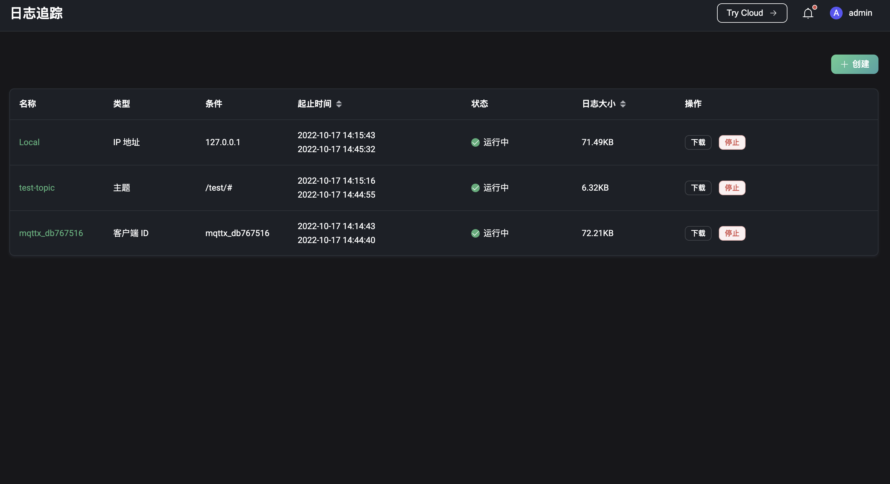

# 问题分析

可以使用问题分析模块，查看当前告警或查看之前的告警；使用 WebSocket 客户端对服务进行快速有效的功能测试；或者使用主题监控、慢订阅和日志追踪等工具，对问题进行定位。

## 告警

在告警页面中，可以查看服务器的当前告警和历史告警（已取消激活的告警）。告警信息包括包括告警名称、告警消息内容、触发告警的节点、告警级别、发生告警的时间和告警的持续时间。

在当前告警页面中，可以点击右上角的`刷新`按钮刷新列表，查看当前是否有发生新的告警。还可点击右上角的`设置`按钮，针对因虚拟机进程、操作系统 CPU 等产生的报警进行设置。在历史告警页面中，可以点击右上角的`清除历史告警`按钮，清空历史告警记录。

## WebSocket 客户端

WebSocket 客户端页面提供了一个简易但有效的 MQTT 测试工具，它包含了连接、订阅和发布功能，可用于对客户端进行快速的连接、发布和订阅功能调试，同时还能查看自己已发送和接收的消息数据。可点击页面上方`+`按钮，添加多个 WebSocket 连接；所有连接的连接状态和发送接收数据将在刷新页面时清空。

## 主题监控

在主题监控中，可以点击页面右上角的`创建`按钮，输入想要对其进行监控的主题，点击`添加`来创建新的主题指标统计。创建成功后，可以根据主题查看该主题的消息流入、流出和丢弃的数量及速率，还可在详情中查看上述指标在各个 QoS 中的数据。点击`重置`按钮，可重置某一主题已有的统计数据。监控列表可根据需要，点击表头的某项统计指标，根据该指标顺序或倒序排序显示。

> 出于整体性能考虑，目前主题指标统计功能仅支持主题名，即不支持带有 + 或 # 通配符的主题过滤器，例如 a/+ 等。

## 慢订阅

如需使用慢订阅统计，需要先对慢订阅进行基础设置后启用该功能。各个配置项的说明可查看[慢订阅](../observability/slow_subscribers_statistics.md#配置说明)。开启后，消息传输全流程的时耗超过配置的`时延阈值`的消息将参与统计。统计列表默认按照时延，从高到底依次显示订阅者和主题信息，点击 `Client ID` 将跳转至订阅者的连接详情页面，可查看连接信息来进行对产生慢订阅原因进行排查。

## 日志追踪

如果需要针对指定客户端、Topic 或 IP 实时过滤日志，来进行调试和排查错误，可使用日志追踪功能。在页面右上角点击`创建`按钮，选择想要追踪的对象，其中客户端 ID 和 IP 需要准确输入，Topic 除精确匹配外还支持通配符匹配；选择追踪的起止时间，提交数据，当时间到达追踪的开始时间时，服务将过滤追踪对象产生的日志并进行保存；追踪将在时间到达停止时间后停止，也可在列表中手动停止某个正在进行中的追踪；已停止的追踪可以在列表中对其进行删除操作。

可以在列表中看到当前所有的追踪记录，查看或下载某个追踪的日志。在集群环境下，点击列表中的`下载`按钮，下载的是 Dashboard 对应节点的日志；点击`查看`按钮，可选择某个节点进行日志的查看和下载。

