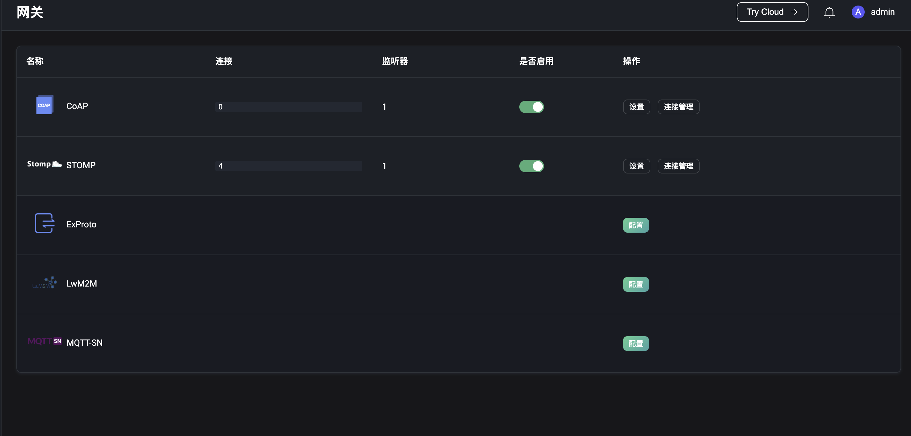
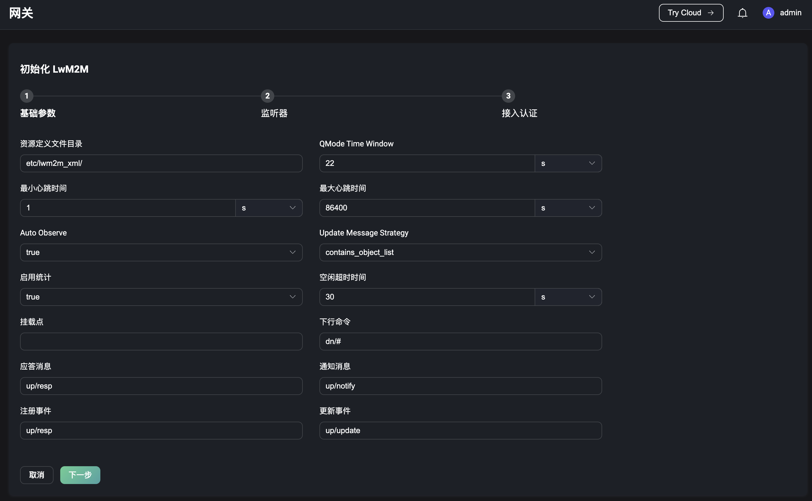
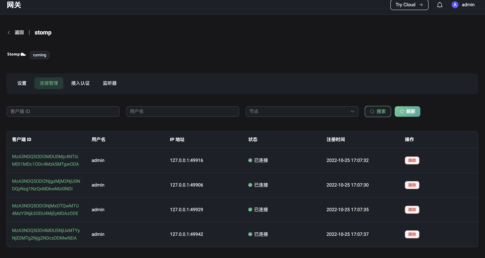
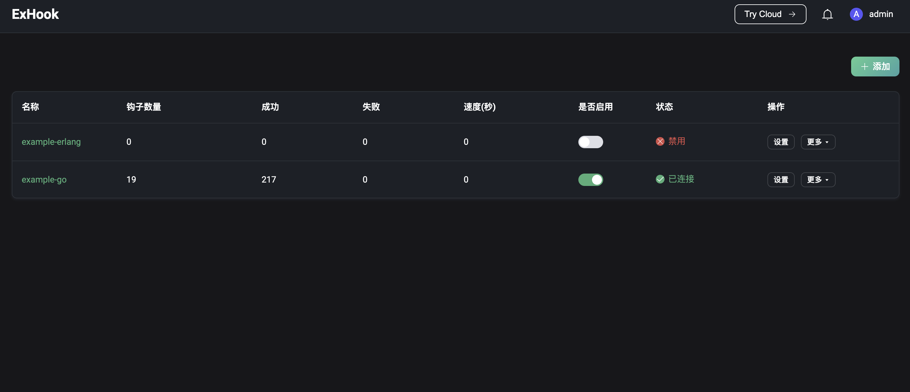
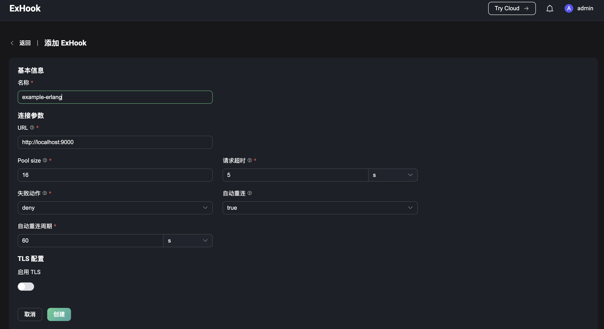
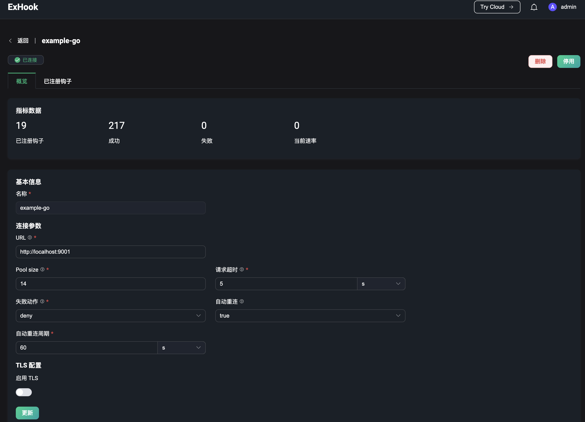
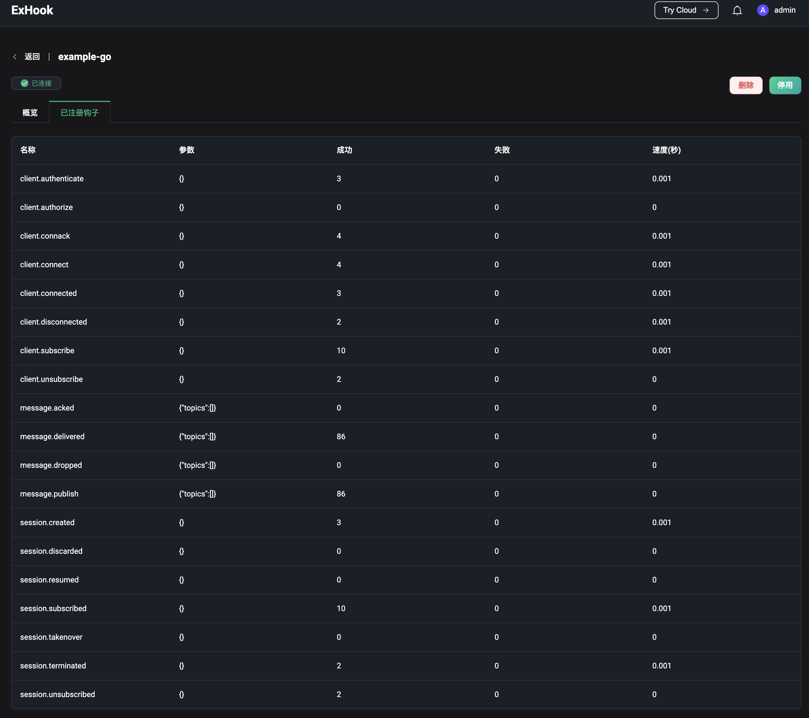
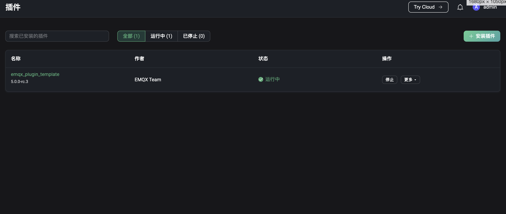
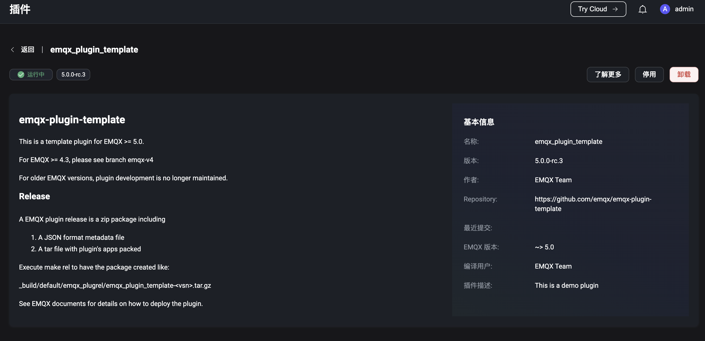

# 插件扩展

通过插件扩展模块，用户可使用网关接入非 MQTT 协议的连接和消息收发，使用插件或 ExHook 来修改和扩展系统功能。

- **网关**：负责处理所有非 MQTT 协议的连接、认证和消息收发，并为其提供统一的用户层接口和概念。
- **ExHook**：提供了使用其他语言对 EMQX 进行系统功能的修改或扩展的能力。
- **插件**：通过安装使用 Erlang 编写的插件，修改或扩展系统功能。

## 网关

点击左侧插件扩展菜单下的网关，可以来到网关页面。网关提供了非 MQTT 协议接入的能力。目前支持的协议包括

- [Stomp](https://stomp.github.io/stomp-specification-1.2.html)
- [MQTT-SN](https://www.oasis-open.org/committees/download.php/66091/MQTT-SN_spec_v1.2.pdf)
- [CoAP](https://datatracker.ietf.org/doc/html/draft-ietf-core-coap-pubsub-09)
- [ExProto](https://github.com/emqx/emqx-exproto)
- [LwM2M](https://www.openmobilealliance.org/release/LightweightM2M/)

启用网关前，需要先对网关进行配置；配置完成后，可以在网关页面上查看通过各已启用的协议网关接入的连接数，启用/停用网关。

### 网关初始化

在网关页面，选择想要启用的协议网关，点击列表右侧的`配置`按钮，进入初始化协议网关页面。初始化网关分 3 个步骤

1. 配置基础参数
2. 配置监听器
3. 配置接入认证

各个配置项都会因为协议网关的不同而不一样；配置项可在初始化完成后，进入网关详情页面进行更改。

> 通过 Dashboard 配置的网关会在整个集群中生效

#### 基础参数

基础参数配置表单会因为协议网关的不同而不同，各协议配置参数的详情可点击跳转至配置文件说明页面查看。

- [Stomp](../admin/cfg.md#gatewaystomp)
- [MQTT-SN](../admin/cfg.md#gatewaymqttsn)
- [CoAP](../admin/cfg.md#gatewaycoap)
- [ExProto](../admin/cfg.md#gatewayexproto)
- [LwM2M](../admin/cfg.md#gatewaylwm2m)

#### 监听器

配置基础参数完成，可配置网关的监听器；每个网关都可以启用多个监听器，不同协议网关对监听器的类型支持如下

|         | TCP  | UDP  | SSL  | DTLS |
| ------- | ---- | ---- | ---- | ---- |
| STOMP   | ✔︎    |      | ✔︎    |      |
| CoAP    |      | ✔︎    |      | ✔︎    |
| ExProto | ✔︎    | ✔︎    | ✔︎    | ✔︎    |
| MQTT-SN |      | ✔︎    |      | ✔︎    |
| LwM2M   |      | ✔︎    |      | ✔︎    |

#### 接入认证

配置完监听器，可根据需要，选择性的配置协议网关的接入认证，如果不配置认证器则认为允许任何客户端登录；不同协议网关对认证类型的支持如下

|         | HTTP Server | Built-in Database | MySQL | MongoDB | PostgreSQL | Redis | DTLS | JWT  | Scram |
| ------- | ----------- | ----------------- | ----- | ------- | ---------- | ----- | ---- | ---- | ----- |
| STOMP   | ✔︎           | ✔︎                 | ✔︎     | ✔︎       | ✔︎          | ✔︎     | ✔︎    | ✔︎    |       |
| CoAP    | ✔︎           | ✔︎                 | ✔︎     | ✔︎       | ✔︎          | ✔︎     | ✔︎    | ✔︎    |       |
| ExProto | ✔︎           | ✔︎                 | ✔︎     | ✔︎       | ✔︎          | ✔︎     | ✔︎    | ✔︎    |       |
| MQTT-SN | ✔︎           |                   |       |         |            |       |      |      |       |
| LwM2M   | ✔︎           |                   |       |         |            |       |      |      |       |

### 网关详情

协议网关初始化完成并启用后将返回至网关页面，选择某一初始化完成的网关，点击页面右侧`连接管理`按钮，进入网关详情页面，可以查看通过该协议网关连接至服务端的客户端列表；列表将展示各客户端连接时设置的 ID 及用户名，当前的连接状态，客户端的 IP 地址，客户端开始连接的时间；其中客户端的 IP 地址数据同连接管理页面一样，由客户端的 IP 地址及客户端连接时使用的客户端的端口拼接而成，还可在列表中对客户端进行踢除操作；客户端列表可使用客户端 ID、用户名和节点进行过滤搜索。

页面上方可点击`设置`、`接入认证`或`监听器`菜单按钮，切换至对应的页面修改相应的配置。

## ExHook

点击左侧插件扩展菜单下的 ExHook，可以来到 ExHook 页面；ExHook 提供了使用其他编程语言修改或扩展系统功能的能力。ExHook 列表页可查看当前已添加的 ExHook、每个 ExHook 挂载的钩子数量、该 ExHook 下所有钩子执行的成功和失败次数。

关于 ExHook 的定义和开发指南可查阅[钩子](../advanced/hooks)。

### 添加 ExHook

点击页面右上方的`添加`按钮，进入添加 ExHook 页面。在表单中填写需要添加的 ExHook 的基本信息及连接参数，点击`创建`按钮提交数据。创建成功后将跳转回 ExHook 列表页。

### 查看详情

创建成功后，可在 ExHook 列表页面，点击 ExHook 名称进入 ExHook 详情页。在详情页中，可查看当前 ExHook 的指标数据，包括当前 ExHook 的已注册钩子总数，所有钩子的执行成功总数、失败总数、当前执行速率。下方为 ExHook 的基本信息，可以对基本信息进行编辑然后点击`更新`按钮进行保存。

页面上方点击`已注册钩子`可查看当前 ExHook 实现的钩子列表，及各个钩子参数和执行指标数据。

## 插件

点击左侧插件扩展菜单下的插件，可以来到插件页面；用户可以根据需要，安装或开发插件来达到修改或扩展系统功能的目的。插件示例可查看 [emqx-plugin-template](https://github.com/emqx/emqx-plugin-template) 。插件列表页展示了当前已安装的插件及各个插件的版本、作者和运行状态，可在页面上方根据插件名称和运行状态对插件列表数据进行过滤搜索。

点击页面右上角的`安装插件`按钮，进入安装插件页面。上传安装包或将安装包拖拽到页面的虚线框中，点击`安装`按钮提交安装包。安装包提交成功后页面将返回至插件列表页，安装成功的插件默认为停止状态，如需启用需点击相应插件右侧的`启动`按钮进行启用，当有多个插件时，启用顺序即为插件的执行顺序；也可在页面上拖拽或点击插件右侧`更多`菜单下对应的按钮对插件进行排序，排序结果即为下次节点重启后插件的执行顺序。如果某个插件已不再需要，可点击插件右侧`更多`菜单下的`卸载`按钮卸载插件。

点击插件名称将跳转至插件详情页，详情页左侧展示插件安装包中 `README.md` 的文档内容，右侧展示插件安装包中 `release.json` 文件中提供的插件的相关信息，如果文件中还提供了插件开发者的相关网站，可以点击页面右上角的`了解更多`跳转至相关页面。

