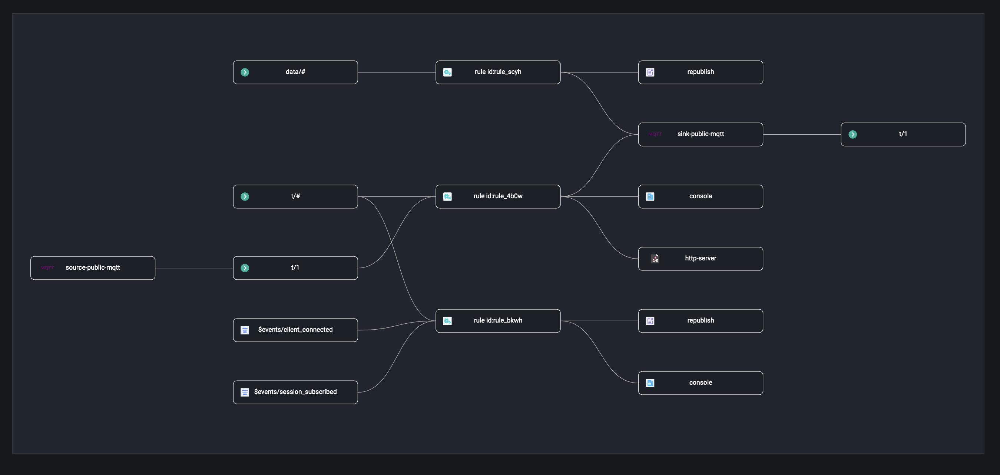

# Flows

Flows 为数据集成提供了一种可视化查看的能力，Flows 是一个有向无环图，由多个节点组成，每个节点代表一个数据处理步骤，例如从某个主题，事件或数据桥接中读取数据、通过规则转换数据，再使用动作或桥接转发数据等。通过 Flows，用户可以清晰的看到数据流向，即数据如何从设备或客户端经过规则处理后流向外部数据系统的数据流向，或者从外部数据系统经过规则处理后流向设备的数据流向。

在左侧的数据集成菜单下，用户可以进入到 Flows 页面。目前该页面仅支持查看，当有规则和数据桥接数据发生变化时，刷新该页面就能看到最新的数据集成情况。

Flows 解决了数据集成中多个规则和数据桥接难以维护和管理的问题。通过 Flows 页面，用户还可以清晰的看到每一个规则和数据桥接之间的关系，并监控这一链路中任意规则或数据桥接节点的状态。当鼠标悬浮到规则和数据桥接节点上时，可以查看每个节点的详细信息，例如规则节点上可以查看当前规则的执行统计，成功失败数，规则的启用和关闭状态，SQL 语句等，数据桥接节点中可查看到当前数据桥接转发数据的成功失败数统计，消息速率，桥接内资源的连接状态等，点击当前节点可以快速进入到规则或数据桥接的预览页面，查看更多数据统计和快速修改配置。

