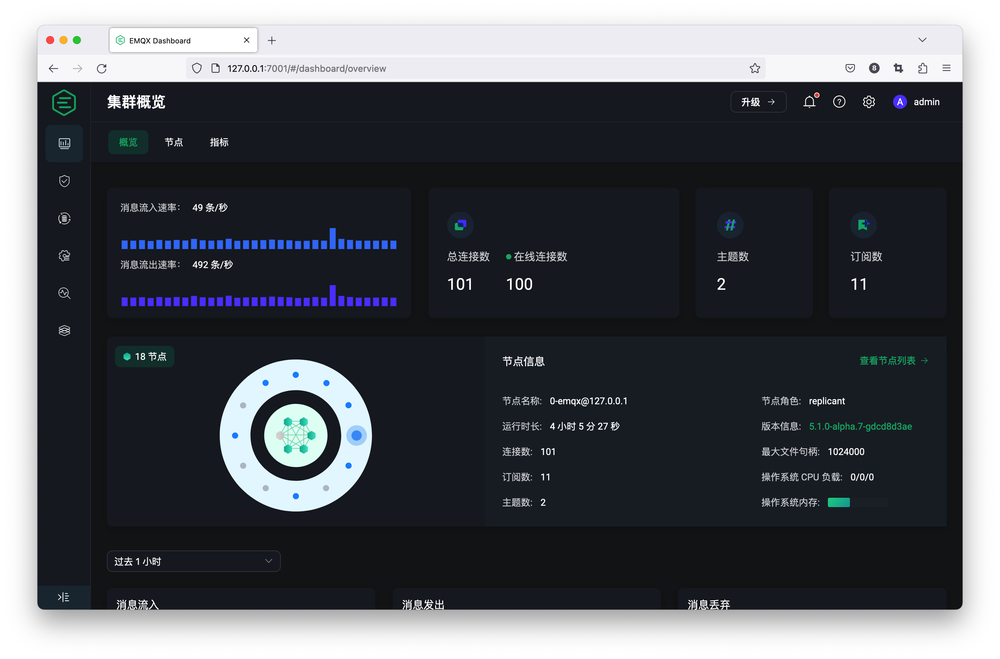

# EMQX Dashboard 介绍

EMQX 提供了一个内置的管理控制台，即 EMQX Dashboard 。方便用户通过 Web 页面就能轻松管理和监控 EMQX 集群，并配置和使用所需的各项功能。

新的 UI / UX 设计风格的 EMQX Dashboard，优化了关键数据和指标数据的显示方式与内容，在提升视觉体验的同时，也提供了更全面、强大、易用的内置功能，如对于连接、订阅和发布时的认证与权限管理，支持使用数据桥接并搭配规则引擎进行数据集成转化等。使用浏览器来快速便捷访问的方式，为用户使用 EMQX 进行更多物联网业务开发提供了便利。



## 主要功能

### 监控和管理 EMQX 集群中的相关信息与数据

支持查看运行中的 EMQX 集群的整体连接数，订阅主题数，消息收发数量和流入流出速率，还包括节点列表和节点信息和一些系统指标信息，同时也可以对一些客户端连接与订阅数据进行查看与管理。

### 访问控制（认证与授权）管理

支持通过可视化的方式来新增和配置管理 EMQX 中的认证与授权机制。

### 数据集成

使用强大的基于 SQL 的规则引擎和数据桥或流量编辑器的可视化功能进行低代码数据处理和集成，以帮助实时提取、过滤、丰富、转换和存储 MQTT 数据。

### 在线配置热更新

支持在线修改和更新包括 MQTT、日志，监听器等配置项，更新成功后即刻生效。

### 管理系统扩展能力

支持自定义插件集成，通过内置网关的管理和配置来拓展连接协议，或使用钩子拦截模块与事件之间的消息传递来修改和扩展系统功能。

### 全面的诊断工具

除通过在线的 MQTT over WebSocket 客户端连接、发布订阅来调试外，还支持使用如慢订阅查询，在线日志追踪，查看告警列表等信息来诊断和发现问题。

## 启动

EMQX Dashboard 是一个 Web 应用程序，默认监听 `18083` 端口。下载安装 EMQX 并成功启动之后，可以通过浏览器打开 <http://localhost:18083/>（如部署在非本机的，可将 localhost 替换为实际 IP 地址）来访问和使用 EMQX Dashboard。

::: tip
在不启用 Dashboard 的情况下仍然可以正常使用 EMQX，Dashboard 只是为用户提供了可视化使用的选择。
:::

### 首次登录

对于首次安装和部署好 EMQX 的用户来说，浏览器打开 Dashboard 后可以使用默认用户名 `admin` 和默认密码 `public` 来进行登录使用。

首次登录后，系统会自动检测到您正在使用默认用户名和密码登录，并会强制要求修改默认密码，这有利于访问 Dashboard 的安全性提升，注意修改的密码不能与原密码相同，且不建议再次使用 `public` 做为登录密码。

## 忘记密码

如果您忘记了 Dashboard 登录密码，可以通过 CLI 的 `admins` 命令进行重置，详情请参考 [命令行 - admins](../admin/cli.md#admins)：

```bash
./bin/emqx ctl admins passwd <Username> <Password>
```

## 配置 Dashboard

Dashboard 默认监听 HTTP 端口，端口号默认为 18083，用户可以启用 HTTPS 或更改监听器端口，更多关于 Dashboard 如何配置和修改的使用方法可参考[配置文档](../configuration/configuration-manual.md#dashboard)。
