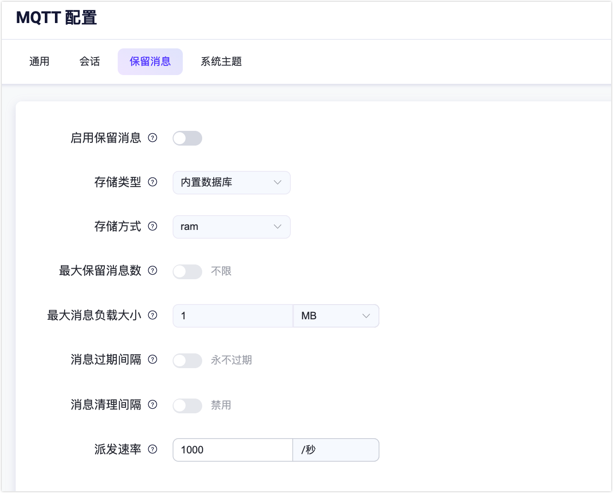

# 保留消息

在**保留消息**页面可以查看当前系统中所有的保留消息。当用户发布了一条保留消息时，EMQX 会将这条消息保存在系统中，用户可以在当前保留消息列表中查看到这条消息。当用户订阅了这条保留消息的主题时，EMQX 会将这条消息发送给用户。保留消息的有效期默认为永不过期，除非用户手动删除这条消息。

## 保留消息列表

保留消息列表呈现当前系统中所有的保留消息。列表内包含了保留消息的主题、保留消息的质量等级 QoS、发布该保留消息的客户端 ID，还有发布保留消息的时间。在列表中，您还可以点击**查看 Payload** 和**删除**按钮来查看保留消息的 payload 和删除一条保留消息。点击列表右上角的**刷新**按钮可以刷新当前保留消息列表，点击**设置**按钮可以跳转到保留消息的设置页面。

EMQX 默认将保存 3 类系统主题的保留消息，如果是集群环境，将根据不同的节点名称保存不同系统主题下的保留消息。其分别是：

- $SYS/brokers/+/sysdescr：当前 EMQX 节点的系统描述
- $SYS/brokers/+/version：当前 EMQX 节点的版本号
- $SYS/brokers：当前 EMQX 所有的节点数量及名称

### 删除保留消息

通常情况下，用户可以在客户端中删除保留消息，方法是向保留消息的主题发布一条空消息。除此之外，用户也可以在保留消息列表中点击指定保留消息的**删除**按钮进行删除，也可以通过**清除全部**按钮删除集群上所有的所有保留消息。用户还可以在保留消息的配置页面中，设置保留消息的有效期，即过期时间，当保留消息过期后，EMQX 会自动删除这条保留消息。

### 查看 Payload

如果用户想要查看保留消息的 Payload，可以在保留消息的列表页中点击**查看 Payload** 按钮来查看保留消息的 Payload。

在 **Payload** 弹窗中可以查看保留消息的具体的 Payload 内容。在弹窗的右下角，用户还可以点击**复制**按钮来快速复制保留消息的 Payload。在左下角的下拉框中还可以对 Payload 进行格式化输出，这对于一些特殊的 Payload 格式，如 JSON 或 Hex 格式的，可以更加直观的查看。

## 设置保留消息

点击页面右上角的**设置**按钮，可以快速跳转到**管理** -> **MQTT 配置** -> **保留消息**页签。在**保留消息**页签中您可以启用或关闭保留消息功能，还可以修改保留消息的配置。

::: tip
当保留消息功能被关闭时，EMQX Dashboard 会在保留消息列表页面中显示**启用**按钮，并提示保留消息功能已被禁用，可点击跳转到**保留消息**页签中再次启用。
:::

以下为各配置项的详细描述。

| 配置项         | 类型     | 可选值        | 默认值      | 描述                                                         |
| -------------- | -------- | ------------- | ----------- | ------------------------------------------------------------ |
| 存储类型       | -        | 内置数据库    | -           | -                                                            |
| 存储方式       | 枚举     | `ram`、`disc` | `ram`       | `ram`：仅存储在内存中； `disc`：存储在内存和硬盘中。    |
| 最大保留消息数 | 整数     | ≥ 0           | 0（无限制） | 0：无限制。  当设置了最大保留消息数的限制后，EMQX 在达到限制时会替换现有消息。然而，在达到限制后您不能再为新主题存储保留消息。 |
| 最大负载大小   | 字节大小 |               | 1MB         | 保留消息的最大负载大小。如果负载大小超过最大值，EMQX 将把保留的保留消息视为普通消息。 |
| 消息过期间隔   | 时长     |               | 永不过期    | 保留消息的过期时间，0 表示永不过期。如果在 PUBLISH 数据包中设置了消息过期时间间隔，则以 PUBLISH 数据包中的消息过期时间间隔为准。 |
| 消息清理间隔   | 时长     |               | 禁用        | 清理过期消息的间隔。                                         |
| 派发速率       | 整数     | ≥ 0           | 1000        | 派发保留消息的最大速率。                                     |
