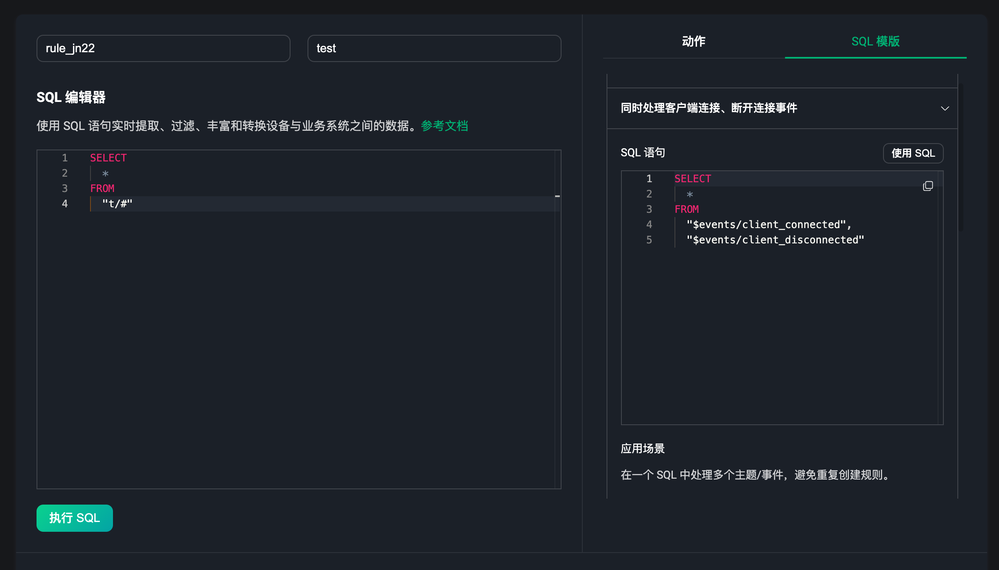
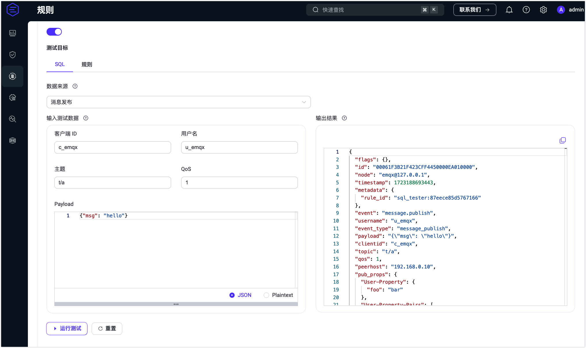
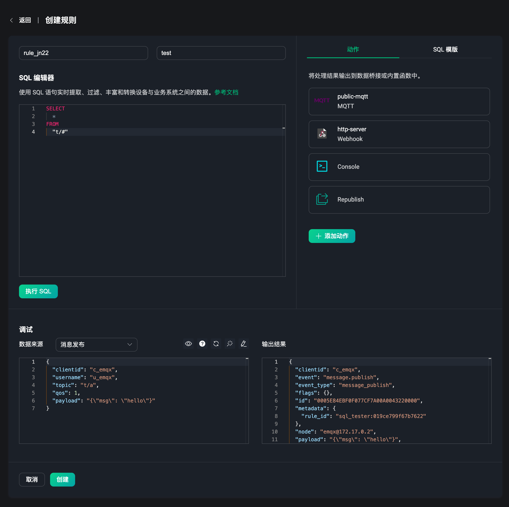
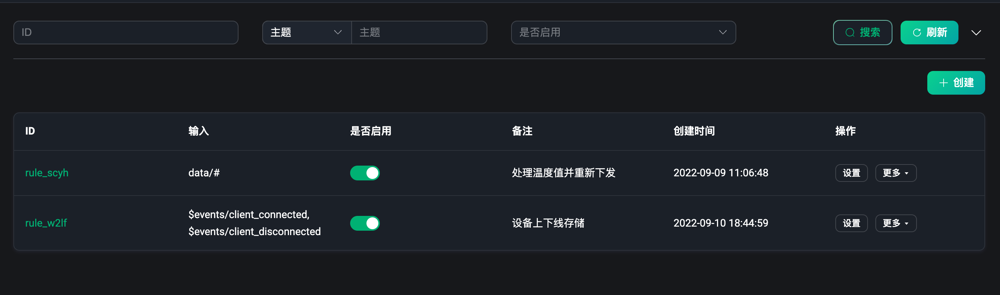
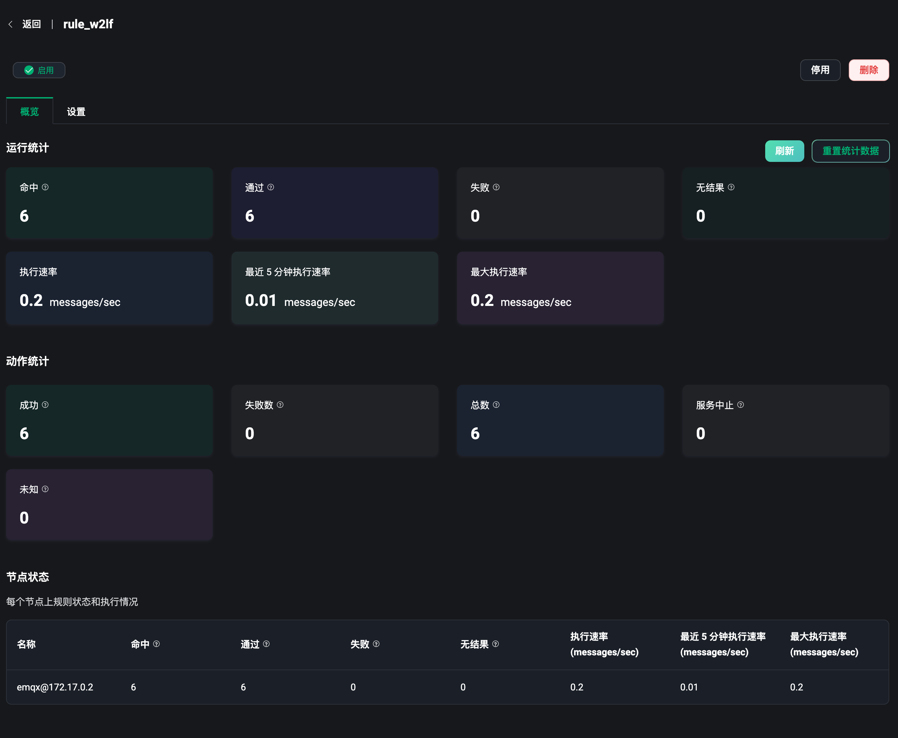
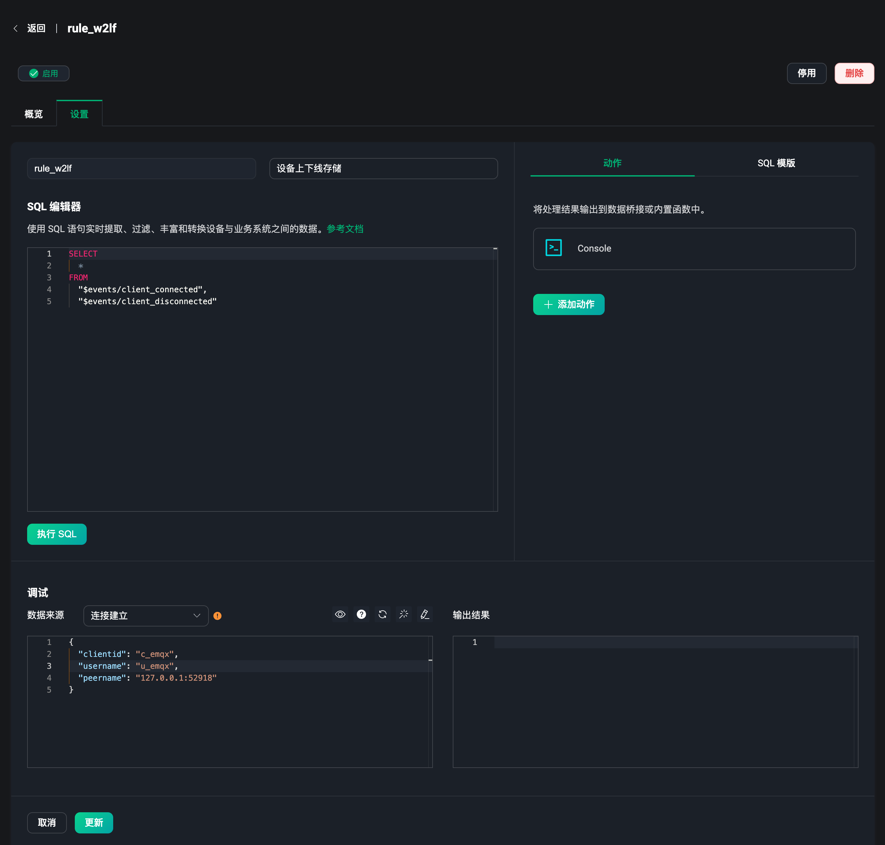

# 规则

EMQX 内置了一个强大且高效的数据处理功能，即规则引擎。通过主题，事件或支持接入数据的数据桥接来获取数据，并使用简单标准的 SQL 语句来实时的提取、过滤、丰富、和转换业务数据，最后再通过触发规则后的动作，包含内置动作和数据桥接来将数据分发或集成到外部系统中，也可以将处理过的数据重新发送到 MQTT 客户端或设备。详情请查看[规则简介](../data-integration/rules.md)。

规则是构成 EMQX 强大的数据集成能力的一部分，配合使用数据桥接的方式提供了清晰、灵活的业务集成方案，简化了业务开发流程，提升用户易用性，降低业务系统与 EMQX 的耦合度。详情请查看[数据集成简介](../data-integration/introduction.md)。

在左侧的数据集成菜单下，用户可以进入到规则页面。规则页面中用户可以创建和管理创建好的规则。

## 创建规则

创建规则可以在规则页面的右上角，点击 `创建` 即可进入到创建规则页面。也可以在数据桥接页面，使用已经创建好的数据桥接，来快速创建一个包含有设置好数据桥接动作的规则。
<!-- 可以查看[规则快速入门](../data-integration/rule-get-started.md)，来快速创建和使用一条规则。 -->

### SQL 编辑

进入到创建规则页面，我们可以看到一个 SQL 编辑器，规则是基于 SQL 语句来使用的，我们可以使用 SQL 语句来实时的查询过滤，转换和丰富客户端之间或系统业务之间的数据。顶部两个输入框分别为，规则 ID 和备注，进入创建页面后，会随机生成一个规则 ID 来标识当前规则，也可以手动输入你想要输入的规则标识，可以在备注中输入一些规则的描述信息来区分每个规则的使用。

右侧提供了一个 SQL 模版的选择，可以选择不同的 SQL 模版来快速创建规则。目前提供了 6 种比较常用的 SQL 模版，分别是：

1. 选择指定主题的消息
2. 同时处理客户端连接、断开连接事件
3. FOREACH 处理 JSON 数组并逐个输出
4. FOREACH 处理 JSON 数组选择指定字段并添加过滤条件
5. CASE-WHEN 从多个条件列表返回可能结果
6. 数组处理 - 从 JSON 格式的 payload 中获取嵌套的值

SQL 语句默认为 `SELECT * FROM "t/#"`，其含义为当客户端向 `t/#` 这个主题发送消息时，我们就取出当前事件下所有的数据信息。`SELECT` 关键词可以获取消息中的所有字段，例如可以获取当前消息的 `Payload`，则 SQL 语句可以修改为 `SELECT payload from "t/#"`，获取的内容可以使用[内置函数](../data-integration/rule-sql-builtin-functions.md)来进行处理和转化，`FROM` 关键词后面输入数据源，即事件主题，下方规则调试部分可查看到所有可选的数据源事件，使用 `WHERE` 关键词，可以添加条件判断，更多详细的 SQL 语法使用，请参考 [SQL 语法与示列](../data-integration/rule-sql-grammar-and-examples.md)。

### 规则调试

当完成 SQL 语句的编写后，可以在页面底部的调试模块选择触发规则的事件或消息来源，输入模拟的测试数据后，点击 SQL 编辑器下方的 `执行 SQL` 按钮，即可在页面底部的输出结果中看到规则的执行结果。

每次更改完成 SQL 语句后都可以通过调试模块来测试规则的执行结果，以确保规则的正确性。注意：执行 SQL 时如果出现 `412` 的错误码提示时，可能是与测试数据不匹配造成的，且当数据来源与 SQL 语句不匹配时也会提示选择与其对应的事件或消息来源。更新数据来源事件后，测试数据会自动更新为对应的数据格式。

当用户选择完成数据来源后，可以在右侧的按钮中来查看，使用当前数据源的 SQL 语句，快速访问对应的使用文档，重置模拟数据，JSON 数据格式话及将模拟数据切换为表单模式等，在表单模式下，用户可以直接输入对应的字段值来模拟数据。

调试时的数据来源与真实使用场景下的一致，包含有一些 MQTT 事件，对于消息部分，我们可以选择不同的消息来源来模拟数据，包括：

- 消息发布（mqtt topic）
- 消息投递（$events/message_delivered）
- 消息确认（$events/message_acked）
- 消息丢弃（$events/message_dropped）

对于其它事件，我们可以选择不同的客户端和会话事件来模拟数据，包括：

- 连接完成（$events/client_connected）
- 连接断开（$events/client_connected）
- 连接确认（$events/client_connack）
- 鉴权完成（$events/client_check_authz_complete）
- 订阅（$events/session_subscribed）
- 取消订阅（$events/session_unsubscribed）

此外还包括了使用数据桥接来作为数据源获取数据的方式，使用 `$bridges/*` 开头的主题来表示数据桥接的消息或事件：

- 数据桥接（$bridge/\<type>:\<name>）

对应的数据源需要与编辑器中的 SQL 语句保持一致，当需要使用上述中的一些消息事件或数据桥接来获取数据时，需要将对应的事件主题（括号中的内容）填写到 SQL 语句中， `FROM` 关键词的后面，规则支持使用多个事件。更多详细的数据源与事件解释，请参考 [SQL 数据源和字段](../data-integration/rule-sql-events-and-fields.md)。

### 规则动作

完成 SQL 语句的编辑和规则调试后，我们可以得到一个符合我们需求的输出结果，这时可以在页面右侧的 `动作` 模块中选择规则触发执行后，需要继续执行的动作。点击 `添加动作` 按钮，我们可以选择两个内置动作或使用数据桥接来继续处理规则的输出结果。其中两个内置动作包含：

1. 控制台输出，可以打印结果输出到控制台，可以用于真实场景下的调试；
2. 消息重发布，可以将规则处理后的输出结果，再次发布到指定的主题中。

选择使用数据桥接转发数据，需要选择一个已经创建好的数据桥接，也可以在当前页面重新创建一个新的数据桥接。在规则动作中添加了数据桥接后，规则的输出结果将使用数据桥接转发到对应的外部系统资源上，数据桥接的配置可参考[数据桥接](./bridge.md)部分。

更多关于规则动作的详情，请参考[动作](../data-integration/rules.md#动作)。

## 规则列表

当创建完成一个规则后，可以在规则列表中查看到该规则的基本信息，包含规则 ID、规则接入数据的输入（例如事件，主题和数据桥接等）、规则的备注、启动状态、规则创建时间, 规则列表中的规则可以进行设置、删除、启用、禁用等操作。点击规则 ID 可以查看规则的详细信息。还可以在更多操作里，选择快速复制一个规则并修改，最大程度提升规则的复用性。

列表顶部包含有一个搜索栏，我们可以使用规则的 ID，接入数据的主题，是否启用和备注来进行多条件的规则查询，帮助用户快速找到符合条件的规则并进行查看和设置等。注意：规则 ID 和备注支持模糊查询，主题支持切换为使用通配符来搜索。

## 规则概览

在规则列表页面，点击规则 ID，可以快速进入规则的概览页面，规则概览页面包含了规则的基本数据统计包括：规则的运行时的统计，当前规则下动作的执行统计。例如规则的命中数，命中并通过的数量，规则的执行速率，失败数，执行动作成功和失败数等。点击右上角的 `刷新` 可以实时的查看当前规则的运行数据统计。

## 规则设置

点击操作栏设置，可以进入到规则的设置页面，规则设置页面包含了规则的基本信息，设置页面可以进行规则的修改和调试，与创建页面相同。例如需要修改当前规则下的执行动作，修改规则的备注，重新编辑 SQL 语句等。

