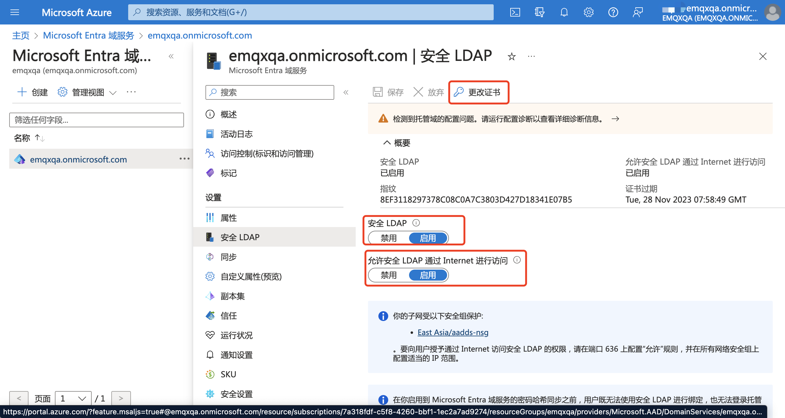
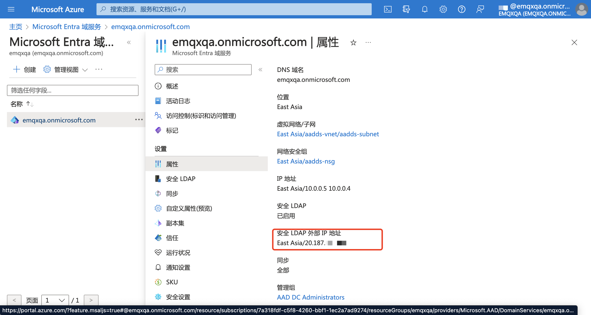
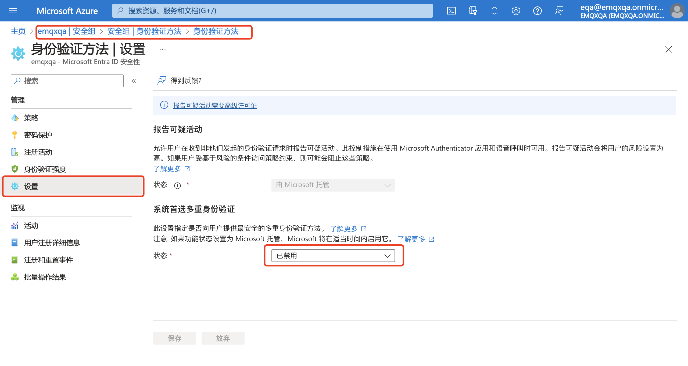
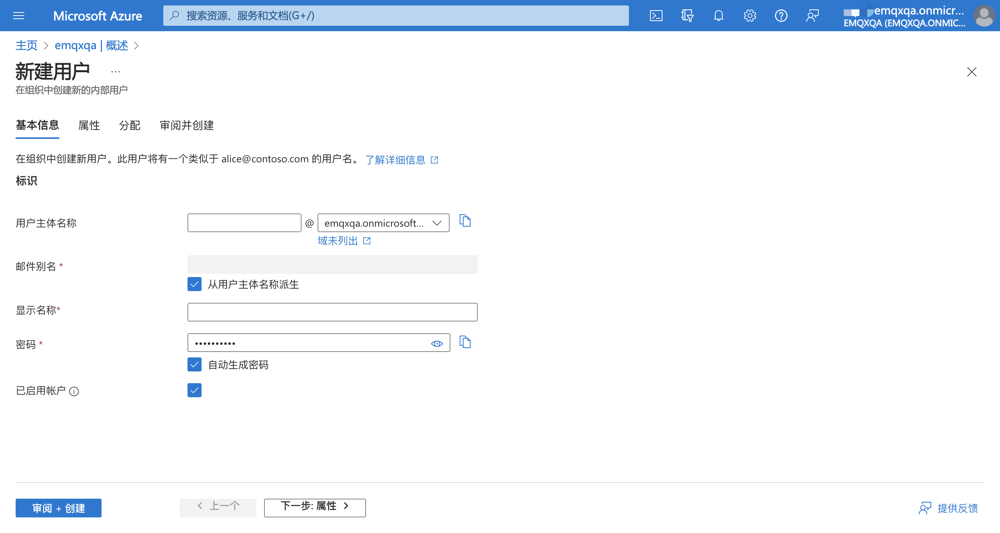

# 配置 LDAP/Azure AD 单点登录

本页介绍了如何配置和使用基于轻量级目录访问协议（LDAP）协议实施的单点登录功能。

您可以将 EMQX Dashboard 与支持 LDAPv3 协议的目录服务集成，实现基于 LDAP 的单点登录，目前支持的产品有:

- [OpenLDAP](https://www.openldap.org/)
- [Azure AD（现更名为 Microsoft Entra ID）](https://azure.microsoft.com/en-in/products/active-directory)

::: tip 先决条件

了解[单点登录（SSO）](./sso.md)的基本概念。

:::

## 配置 OpenLDAP 单点登录

本节将指导您如何在 Dashboard 启用 OpenLDAP 单点登录。

1. 转到 Dashboard **系统设置** -> **单点登录** 页面。
2. 选择 **LDAP** 选项，点击 **启用** 按钮。
3. 在配置页面中，输入 LDAP 服务器的基本信息，详见[配置参数](#配置参数)。

点击**更新**按钮，保存配置，后续使用请参照[登录与用户管理](#登录与用户管理)。

## 配置 Azure AD 单点登录

本节将指导您如何在 Dashboard 启用 Azure AD 单点登录。

1. 转到 Dashboard **系统设置** -> **单点登录** 页面。
2. 选择 **LDAP** 选项，点击 **启用** 按钮。
3. 在配置页面中，输入 LDAP 服务器的基本信息，详见[配置参数](#配置参数)。

点击 **更新** 按钮，保存配置。

### 1. Azure AD 与 Entra ID 实例 配置

1. 创建 Azure Ad 实例：打开 [Azure 门户网站](https://portal.azure.com)，按照[此文档](https://learn.microsoft.com/en-us/azure/active-directory/architecture/auth-ldap)指南创建 Azure AD 域服务。

2. 启用加密 LDAP 连接：在 Azure AD 域服务中，进入**安全 LDAP** 页面，打开启用安全 LDAP 与允许公网访问开关，按照页面指引更改证书并配置网络安全组，确保 EMQX 可以访问到 Azure AD 实例。

3. 获取连接配置：在 Azure AD 域服务中，进入**安全 LDAP** 页面，其中 **安全 LDAP 外部 IP 地址**即为实际 EMQX 的连接地址。

4. 配置 Entra ID：打开 [Azure 门户网站](https://portal.azure.com)，创建 Enter ID 示例。
5. 禁用多重身份验证：EMQX 使用 Azure AD 配置 SSO 需要关闭多重身份验证，在 Entra ID 实例中，进入**安全组** -> **身份验证方法** -> **设置** 页面，禁用多重身份验证。

6. 添加用户：在 Entra ID 实例中，进入**概述**页面，点击**添加** -> **用户** -> **新建用户**进行用户的添加。需要添加至少 2 个用户：用于连接 Entra ID 的登录用户，以及实际访问 EMQX Dashboard 的用户。用户添加完成后需要在 Azure AD 中至少登录一次并更改默认密码，之后才可以在 Dashboard 中进行 SSO 登录。

### 2. Dashboard 配置

1. 转到 Dashboard **系统设置** -> **单点登录** 页面。
2. 选择 **LDAP** 选项，点击 **启用** 按钮。
3. 在配置页面中，输入 LDAP 服务器的基本信息，完整配置请参考[配置参数](#配置参数)。：
   1. **服务**：填写 `ip:port`，其中 IP 为 Azure AD 的公网 IP 地址，端口为加密 LDAP `636`.
   2. **用户名**、**密码**：填写 Entra ID 中创建的用于连接 Entra ID 的用户以及其密码。
   3. **基本 DN**：根据 Azure AD 的域名填写，例如 `emqxqa.onmicrosoft.com` 填写为 `DC=emqxqa,DC=onmicrosoft,DC=com`。可以添加其他属性，将用户限制在某个部门或者分组内。
   4. **用户查询条件**：对于 Azure AD，默认过滤器是 `(&(objectClass=user)(sAMAccountName=${username}))`，表示通过账户名（邮箱名）登录。可以将 `sAMAccountName` 更换为 `mail` 使用邮箱地址登录。
   5. 此处使用的是 IP 地址 + 安全 LDAP直接访问，因此需要勾选**启用 TLS**，并取消勾选**验证服务器证书**。

4. 点击**更新**按钮，保存配置并启用 Azure AD SSO。后续使用请参照[登录与用户管理](#登录与用户管理)。

## 配置参数

| 选项         | 说明                                                         |
| ------------ | ------------------------------------------------------------ |
| 服务         | LDAP服务器的地址，例如`localhost:389`。                      |
| 用户名       | 访问 LDAP 服务器的绑定 DN（Bind DN）。                       |
| 密码         | 访问 LDAP 服务器的用户密码。                                 |
| 基本 DN      | LDAP 目录的基本 DN，搜索用户的起点。                         |
| 用户查询条件 | LDAP 中匹配用户的过滤器。在 LDAP 用户查询条件中,系统会自动替换 `${username}` 为实际输入的用户名，进行用户匹配。 - 对于标准 LDAP，默认过滤器是 `(&(objectClass=person)(uid=${username}))`。 - 对于 Active Directory，默认过滤器是 `(&(objectClass=user)(sAMAccountName=${username}))`。 该变量替换机制可以根据不同的用户属性灵活构造查询过滤器，进行用户名查询和匹配。有关条件格式详见 [LDAP过滤器](https://ldap.com/ldap-filters/)。 |
| 启用 TLS     | 是否启用 LDAP 访问的 TLS 安全传输。如果启用需要配置证书。    |

## 登录与用户管理

启用 LDAP 单点登录后，EMQX Dashboard 会在登录页面展示单点登录选项。点击 **LDAP** 按钮，进入 LDAP 单点登录页面，输入为用户分配的 LDAP 凭证（例如用户名与密码）并点击**登录**按钮。

成功进行 LDAP 身份验证后，EMQX 会自动添加一个 Dashboard 用户，您可以在[用户](./system.md#用户)中进行管理，例如为其分配角色与权限。

## 退出登录

用户可以在 Dashboard 顶部导航栏中点击用户名，在下拉菜单点击 **退出登录** 按钮，退出登录。
