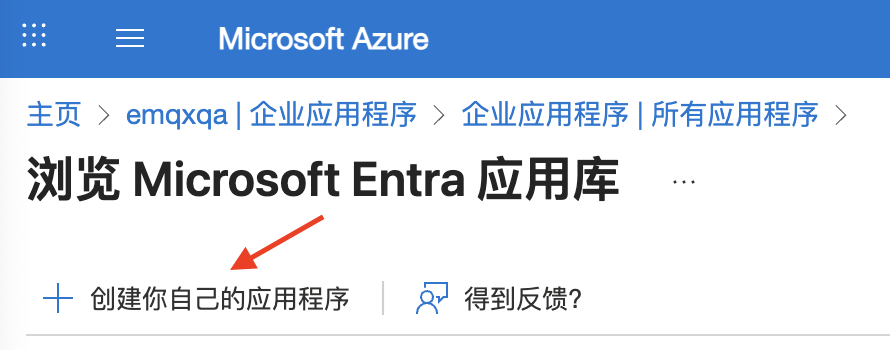
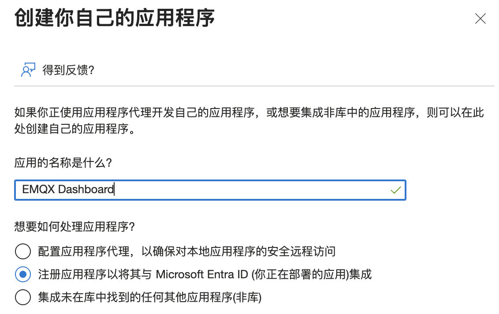
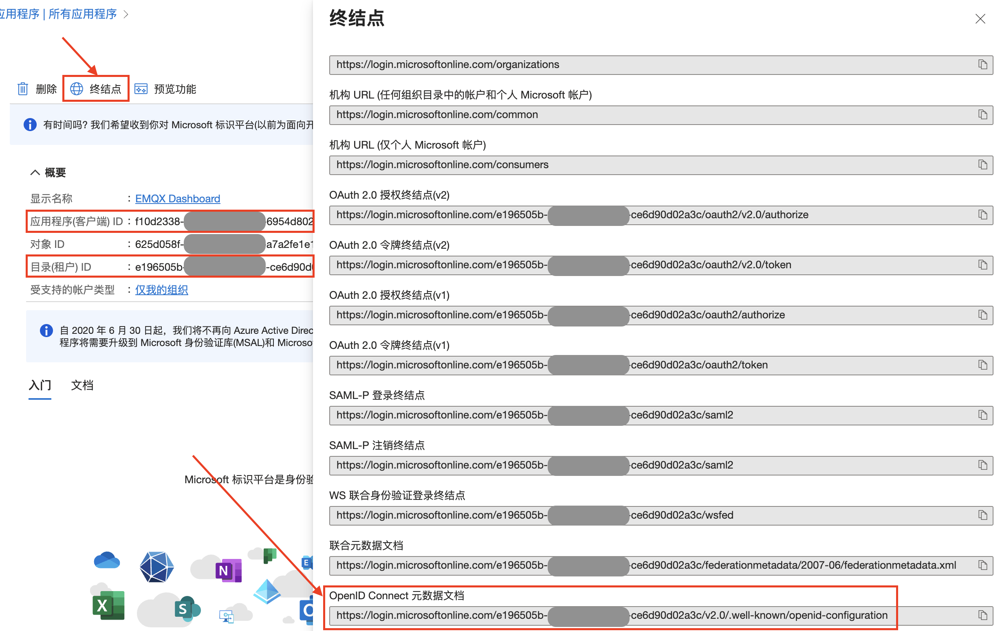
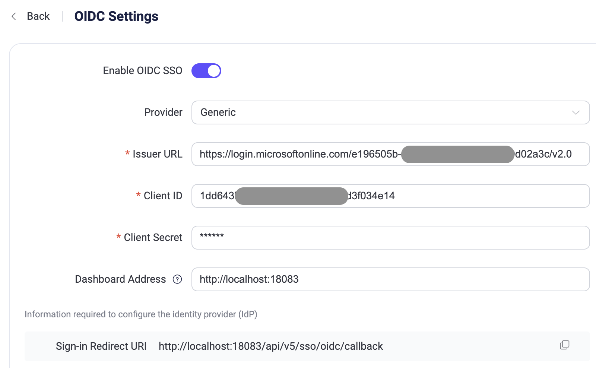
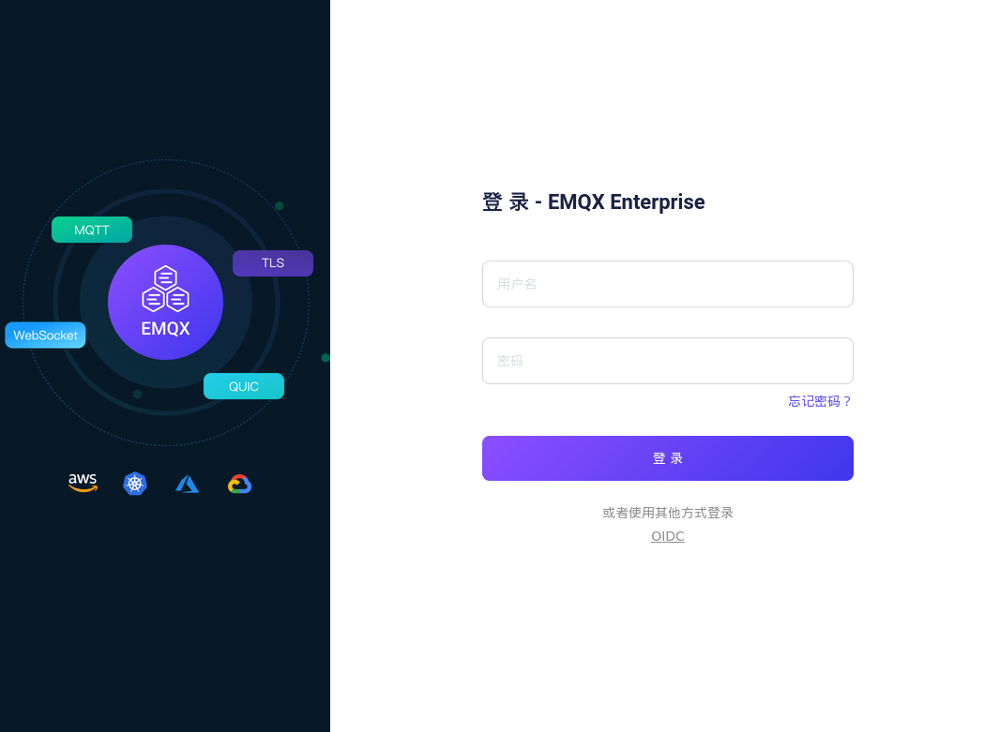
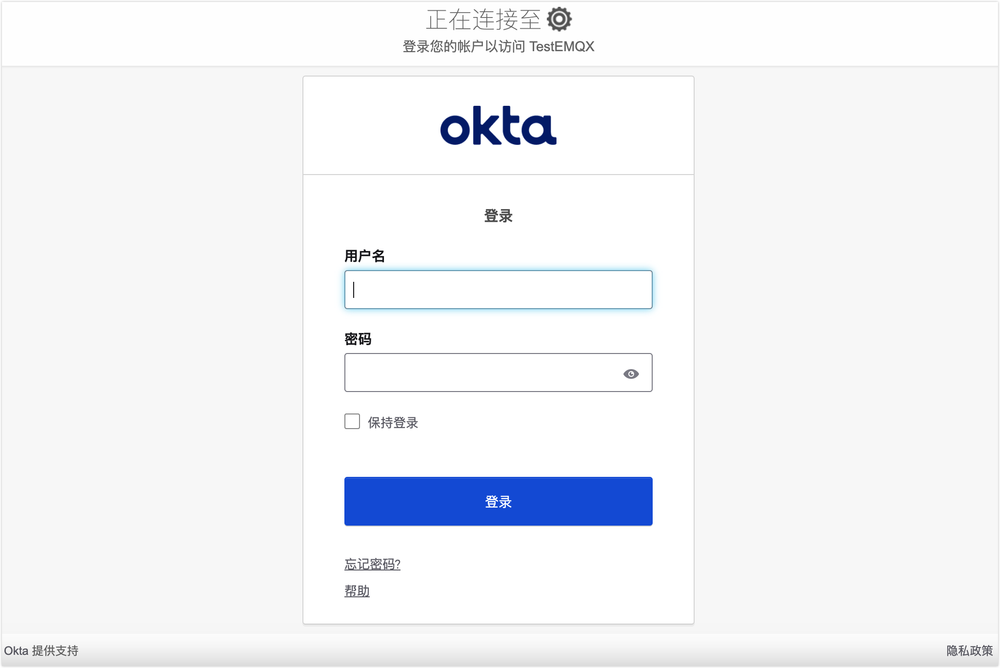

# 配置 OIDC 单点登录

本页介绍了如何配置和使用基于 OpenID Connect (OIDC) 协议实施的单点登录 (SSO) 功能。

::: tip 前提条件

请熟悉[单点登录 (SSO)](./sso.md) 的基本概念。

:::

## 支持的 OIDC 身份服务

EMQX Dashboard 可以与支持 OIDC 协议的身份服务集成，以启用基于 OIDC 的单点登录，例如

- [Microsoft Entra ID](https://www.microsoft.com/zh-cn/security/business/identity-access/microsoft-entra-id)
- [Okta](https://www.okta.com/)

## 通过集成 Microsoft Entra ID 配置 SSO

本节将指导你如何使用 Microsoft Entra ID 作为身份提供商（IdP）并配置 SSO。您需要分别完成 IdP 侧与 EMQX Dashboard 侧的配置。

### 步骤 1：在 EMQX Dashboard 中启用 OIDC

1. 在 EMQX Dashboard 中，导航到**系统设置** -> **单点登录**。
2. 点击 **OIDC** 卡片上的**启用**按钮。

### 步骤 2：注册一个应用以集成 Microsoft Entra ID

1. 以管理员身份登录 [MS Azure Portal](https://portal.azure.com/)。

2. 进入 **Microsoft Entra ID** -> **企业应用程序** -> **新建应用程序**并点击**创建你自己的应用程序**。

   

3. 输入应用名称，例如 `EMQX Dashboard`，选择**注册应用程序以将其与 Microsoft Entra ID (你正在部署的应用)集成**，然后点击**创建**。

   

4. 在**注册应用程序**页面中，选择你希望支持的账户类型，并根据 EMQX Dashboard 在**步骤 1** 中提供的信息配置**重定向 URL**：

   - **重定向 URL**：选择 `Web` 并输入 Dashboard 提供的**登录重定向地址**，例如 `http://localhost:18083/api/v5/sso/oidc/callback`。

5. 进入**证书和密码** -> **客户端密码**标签页，点击**新建客户端密码**，输入描述信息，选择过期时间，并点击**添加**。复制生成的密码值，因为你将在**步骤 3**中用到它。

### 步骤 3：完成 EMQX Dashboard 配置

1. 在配置页面中，输入以下信息：
   - **提供商**：保持为 `通用`。
   
   - **签发者 URL**：对应 **OpenID Connect 元数据文档**，你可以在**步骤 2** 的应用概览页面的**终结点**标签中找到它，但需要去掉 `/.well-known/openid-configuration` 部分，因为 EMQX 会自动添加，例如 `https://login.microsoftonline.com/<tenant_id>/v2.0`，其中 `<tenant_id>` 是你的 目录(租户) ID。
   
   - **Client ID**：对应**步骤 2** 中应用概览页面上的**应用程序(客户端) ID**。
   
     
   
   - **Client Secret**：使用在**步骤 2** 中生成的客户端密码值。
   
   - **Dashboard 地址**：输入用户可以访问 Dashboard 的基础 URL，例如 `http://localhost:18083`。此地址会被自动组合以生成用于在 IdP 侧配置的 **SSO 地址**和**元数据地址**。

2. 点击**更新**以完成配置。

## 集成 Okta 身份服务配置 SSO

本节将指导您使用 Okta 作为身份提供商 (IdP) 并配置单点登录。您需要分别完成 Okta (IdP) 侧和 EMQX Dashboard 侧的配置。

### 步骤 1：在 EMQX Dashboard 中启用 OIDC

1. 在 EMQX Dashboard 中，导航到**系统设置** -> **单点登录**。
2. 点击 **OIDC** 卡片上的**启用**按钮。

### 步骤 2：将 OIDC 应用程序添加到 Okta 的应用程序目录

1. 以管理员身份登录 Okta，并进入 **Okta 管理控制台**。
2. 转到 **Applications -> Applications** 页面，点击 **Create App integration** 按钮，并在弹出对话框中选择 `OIDC - OpenID Connect` 作为登录方式。
3. 选择 `Web Application` 作为**Application type**，然后点击 **Next**。
4. 在 **General Settings** 选项卡中，输入您的应用程序名称，例如 `EMQX Dashboard`。然后点击 **Next**。
5. 在 **LOGIN** 选项卡中，使用 EMQX Dashboard 提供的信息配置：
   - **Sign-in redirect URIs**：输入 Dashboard **OIDC 设置**页面中提供的 **Sign-in Redirect URI**，例如 `http://localhost:18083/api/v5/sso/oidc/callback`。
   - 其他设置是可选的，可以根据您的具体需求进行配置。
6. 检查设置，然后点击 **Save**。

有关更详细的说明，请参阅 [Okta 文档](https://help.okta.com/en-us/content/topics/apps/apps_app_integration_wizard_oidc.htm)。

### 步骤 3：在 EMQX Dashboard 中完成 OIDC 配置

1. 在 **OIDC 设置**页面中，输入以下信息：
   - **提供商**：选择 `Okta` 或为其他提供商选择 `通用`。
   - **签发者 URL**：这是您的 Okta 授权服务器的 URL，例如 `https://example-org.okta.com`。
   - **Client ID**：从**步骤 2** 创建的应用程序中复制。
   - **Client Secret**：从**步骤 2** 创建的应用程序中复制。
   - **Dashboard 地址**：输入用户可以访问 Dashboard 的基本 URL，例如 `http://localhost:18083`。该地址将自动组合生成 **SSO Address** 和 **Metadata Address**，用于 IdP 端的配置。
2. 点击**更新**完成配置。

## 高级设置

**高级设置**用于配置 OIDC 的一些高级参数，以控制 EMQX 如何从 OIDC 提供方获取用户信息以及认证相关行为。

| 字段名称                | 描述                                                         | 默认值                                                      |
| ----------------------- | ------------------------------------------------------------ | ----------------------------------------------------------- |
| **Scopes**              | 在认证过程中请求的 OIDC Scope，用于指定从身份提供方（IdP）获取哪些用户信息。至少需要包含 `openid` 作用域才能进行 OIDC 认证。 | `openid`                                                    |
| **名称变量**            | 用于将 OIDC 用户属性映射为 EMQX Dashboard 用户名的模板。该模板可以引用 IdP 返回的声明（claims）。 | `${sub}`                                                    |
| **名称变量来源**        | 指定从哪个来源提取用户信息以构建 Dashboard 用户名。可选值包括： **用户信息端点**：使用 `/userinfo` 端点返回的用户信息。 **ID Token**：使用认证过程中返回的 ID Token 中包含的声明。 | `用户信息端点`                                              |
| **角色来源**            | 指定从哪个来源提取用户信息以构建 Dashboard 用户角色。可选值包括： **用户信息端点**：使用 `/userinfo` 端点返回的用户信息。 **ID Token**：使用认证过程中返回的 ID Token 中包含的声明。 | `用户信息端点`                                              |
| **角色表达式**          | 用于将 OIDC 用户属性映射为 EMQX Dashboard 用户角色的 [`jq`](https://jqlang.org/manual/) 程序。该程序可以引用 IdP 返回的声明（claims）。表达式必须返回一个字符串，且必须是有效的角色值。当前有效角色为： `"viewer"` `"administrator"` 若返回结果不是上述值之一，用户将无法被创建。未设置时，将创建 viewer 角色的用户；若用户已存在，则保留其现有角色。 | 未设置                                                      |
| **命名空间来源**        | 指定从哪个来源提取用户信息以构建 Dashboard 用户的多租户命名空间。可选值包括： **用户信息端点**：使用 `/userinfo` 端点返回的用户信息。 **ID Token**：使用认证过程中返回的 ID Token 中包含的声明。 | `用户信息端点`                                              |
| **命名空间表达式**      | 用于将 OIDC 用户属性映射为 EMQX Dashboard 用户命名空间的 [`jq`](https://jqlang.org/manual/) 程序。该程序可以引用 IdP 返回的声明（claims）。表达式必须返回一个值：命名空间名称字符串（须为已存在的命名空间），或 `null`（表示全局命名空间）。若返回结果不符合上述要求，用户将无法被创建。未设置时，将在全局命名空间中创建用户；若用户已存在，则保留其现有命名空间。 | 未设置                                                      |
| **会话过期**            | 用户通过 OIDC 登录后，Dashboard 会话保持有效的时间（单位：秒）。 | `30` 秒                                                     |
| **开启 PKCE**           | 启用 Proof Key for Code Exchange（PKCE），以增强授权码流程的安全性。 | 关闭                                                        |
| **首选认证方法**        | 定义与 Token Endpoint 通信时使用的客户端认证方法。可以配置多个方法，系统会按顺序尝试。 | `client_secret_post` `client_secret_basic` `none` |
| **备用方法**            | 当身份提供方的元数据未明确指定签名算法时，用于验证 ID Token 的备用签名算法。 | `RS256`                                                     |
| **JSON Web 密钥 (JWK)** | 可选的静态 JSON Web Key 配置。当 IdP 未提供 JWKS Endpoint 时，可用于验证 Token 签名。 | `无`                                                        |

## 登录和用户管理

启用 OIDC SSO 后，EMQX Dashboard 将在登录页面显示 SSO 选项。点击 **OIDC** 按钮以转到预设的 OIDC 提供商登录页面，在该页面中您可以输入分配给用户的凭据进行登录。

 

认证成功后，EMQX 将自动添加一个 Dashboard 用户，您可以在[用户](./system.md#用户)中管理该用户，例如分配角色和权限。

## 退出登录

用户可以点击 Dashboard 顶部导航栏中的用户名，然后在下拉菜单中点击**退出登录**按钮以注销。请注意，这只是在 Dashboard 侧退出了登录。