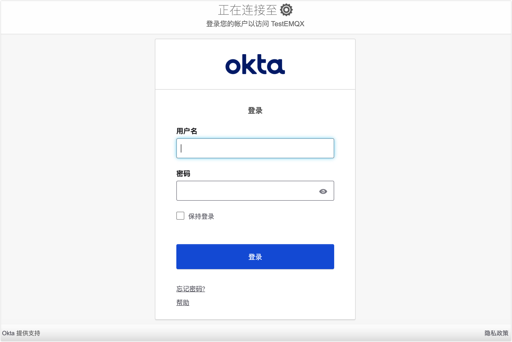

# 配置 OIDC 单点登录

本页介绍了如何配置和使用基于 OpenID Connect (OIDC) 协议实施的单点登录 (SSO) 功能。

::: tip 前提条件

请熟悉[单点登录 (SSO)](./sso.md) 的基本概念。

:::

## 支持的 OIDC 身份服务

EMQX Dashboard 可以与支持 OIDC 协议的身份服务集成，以启用基于 OIDC 的单点登录，例如 [Okta](https://www.okta.com/)。

## 集成 Okta 身份服务配置 SSO

本节将指导您使用 Okta 作为身份提供商 (IdP) 并配置单点登录。您需要分别完成 Okta (IdP) 侧和 EMQX Dashboard 侧的配置。

### 第 1 步：将 OIDC 应用程序添加到 Okta 的应用程序目录

1. 以管理员身份登录 Okta，并进入 **Okta 管理控制台**。
2. 转到 **Applications -> Applications** 页面，点击 **Create App integration** 按钮，并在弹出对话框中选择 `OIDC - OpenID Connect` 作为登录方式。
3. 选择 `Web Application` 作为**Application type**，然后点击 **Next**。
4. 在 **General Settings** 选项卡中，输入您的应用程序名称，例如 `EMQX Dashboard`。然后点击 **Next**。
5. 在 **LOGIN** 选项卡中，使用 EMQX Dashboard 提供的信息配置设置（见**第 2 步**）：
   - **Sign-in redirect URIs**：输入 Dashboard 提供的 **Sign-in Redirect URI**，例如 `http://localhost:18083/api/v5/sso/oidc/callback`。如果需要，您可以在完成**第 2 步**后更新此 URI。
   - 其他设置是可选的，可以根据您的具体需求进行配置。
6. 检查设置，然后点击 **Save**。

有关更详细的说明，请参阅 [Okta 文档](https://help.okta.com/en-us/content/topics/apps/apps_app_integration_wizard_oidc.htm)。

### 第 2 步：在 EMQX Dashboard 中启用 OIDC

1. 在 EMQX Dashboard 中，导航到 **System** -> **SSO**。
2. 在 **OIDC** 选项卡中点击**启用**按钮。
3. 在配置页面中，输入以下信息：
   - **提供商**：选择 `Okta` 或为其他提供商选择 `通用`。
   - **签发者 URL**：这是您的 Okta 授权服务器的 URL，例如 `https://example-org.okta.com`。
   - **Client ID**：从**第一步**创建的应用程序中复制。
   - **Client Secret**：从**第一步**创建的应用程序中复制。
   - **Dashboard 地址**：输入用户可以访问 Dashboard 的基本 URL，例如 `http://localhost:18083`。该地址将自动组合生成 **SSO Address** 和 **Metadata Address**，用于 IdP 端的配置。
4. 点击**更新**完成配置。

## 登录和用户管理

启用 OIDC SSO 后，EMQX Dashboard 将在登录页面显示 SSO 选项。点击 **OIDC** 按钮以转到预设的 OIDC 提供商登录页面，在该页面中您可以输入分配给用户的凭据进行登录。

 

认证成功后，EMQX 将自动添加一个 Dashboard 用户，您可以在[用户](./system.md#用户)中管理该用户，例如分配角色和权限。

## 退出登录

用户可以点击 Dashboard 顶部导航栏中的用户名，然后在下拉菜单中点击**退出登录**按钮以注销。请注意，这只是在 Dashboard 侧退出了登录。