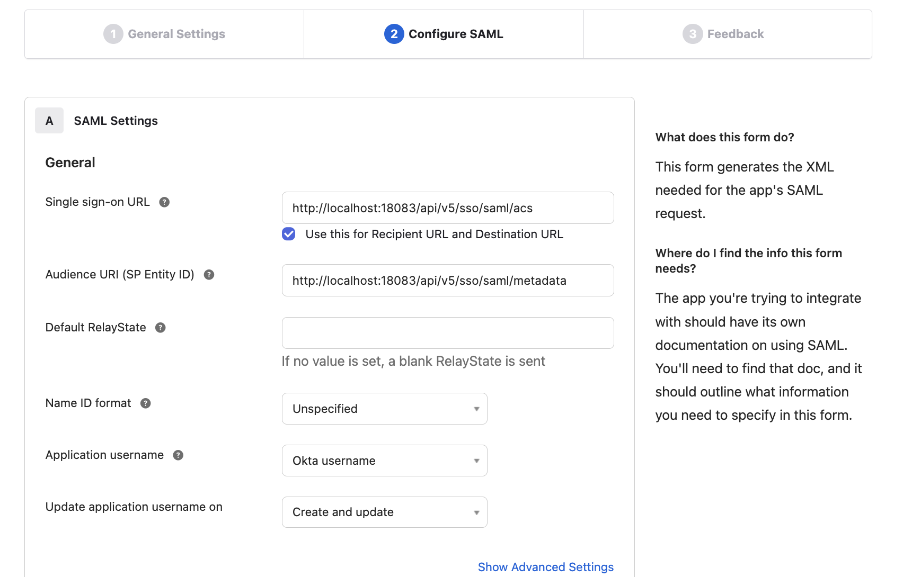
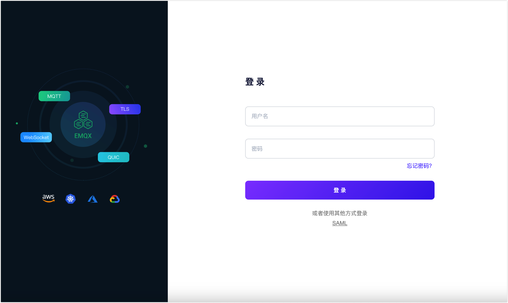
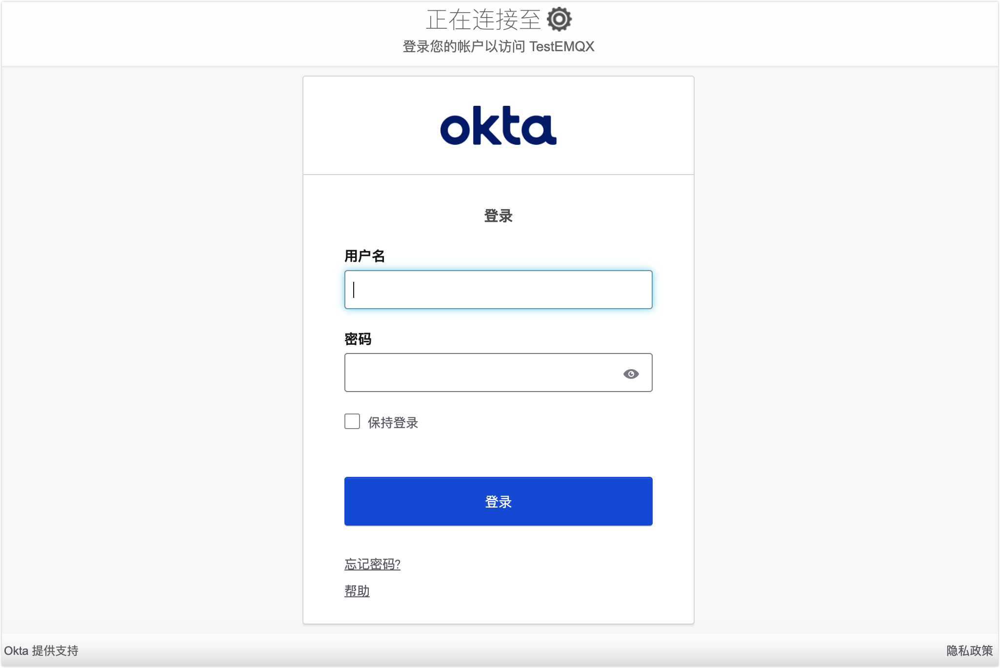

# 配置 SAML 单点登录

本页介绍了如何配置和使用基于安全断言标记语言（SAML ）2.0 标准协议实施的单点登录功能。

::: 先决条件

了解[单点登录（SSO）](./sso.md)的基本概念。

:::

## 支持的 SAML 服务

EMQX Dashboard 可以与以下支持 SAML 2.0 协议的身份服务集成，实现基于 SAML 的单点登录：

- [Okta](https://www.openldap.org/)
- [OneLogin](https://www.onelogin.com/)

其他身份提供商正在适配中，将在后续版本提供。

## 集成 Okta 身份服务配置 SSO

本节将指导您如何使用 Okta 作为身份提供商（IdP）并配置单点登录，您需要分别完成身份提供商（IdP）侧与 EMQX Dashboard 侧的配置。

### 第 1 步：在  EMQX Dashboard 中启用 Okta
1. 转到 Dashboard **系统设置** -> **单点登录**页面。
2. 选择 **SAML 2.0** 选项，点击**启用**按钮。
3. 在配置页面中，输入以下信息：
   - **Dashboard 地址**：确保用户能够访问 Dashboard 的实际访问地址，不需要带具体路径。例如 `http://localhost:18083`。该地址将自动拼接生成**单点登录地址**与**元数据地址**供 IdP 侧配置使用。
   - **SAML 元数据 URL**：暂时留空，等待第 2 步配置生成。

### 第 2 步：在 Okta 的应用程序目录添加 SAML 2.0 应用程序

1. 以管理员身份登录 Okta，然后转至 **Okta 管理控制台**。

2. 转到 **Applications ->  Applications** 页面，点击 **Create App integration** 按钮，在弹出框中选择 **Sign-in method** 为 `SAML 2.0`，点击 **Next **按钮。

3. 在新打开的 **General Settings** 页签中，**App name** 输入您的应用名称，例如 `EMQX Dashboard`，点击 **Next** 按钮。
4. 在 **Configure SAML** 页签中，配置第 1 步中 Dashboard 提供的信息：

   - **Single sign-on URL**：填写 Dashboard 中提供的**单点登录地址**，例如 `http://localhost:18083/api/v5/sso/saml/acs`。

   - **Audience URI (SP Entity ID)**：填写 Dashboard 中提供的**元数据地址**，例如 `http://localhost:18083/api/v5/sso/saml/metadata`。

     其他信息是可选的，根据实际情况配置。

5. 检查设置并点击 **Next**。

6. 在 **Feedback** 页签中，选择 **I'm an Okta customer adding an internal app**，根据实际情况填写其他信息，点击 **Finish** 按钮完成应用创建。

### 第 3 步：完成 Dashboard 配置，在 Okta 中为应用分配用户与组

1. 在 Okta 中，转到 **Sign On** 选项卡，复制 **Metadata URL**。
2. 在 Dashboard 中，粘贴复制来的  **Metadata URL** 到第 1 步中的 **SAML 元数据 URL** 中，点击**更新**按钮。
3. 在 **Okta > Assignments** 选项卡中，您现在可以将用户和组分配给 EMQX Dashboard 应用，只有分配进来的用户才能登录此应用。
## 登录与用户管理

启用 SAML 单点登录后，EMQX Dashboard 会在登录页面展示单点登录选项。点击 **SAML** 按钮，会进入到 IdP 预设值的登录页面，在新页面中输入为用户分配的凭证进行登录。

登录成功后，将跳转回到 Dashboard，EMQX 会自动添加一个 Dashboard 用户，您可以在[用户](./system.md#用户)中进行管理，例如为其分配角色与权限。

## 退出登录

用户可以在 Dashboard 顶部导航栏中点击用户名，在下拉菜单点击**退出登录**按钮退出。注意，这只是在 Dashboard 侧退出了登录，SAML 暂不支持单点退出登录。
