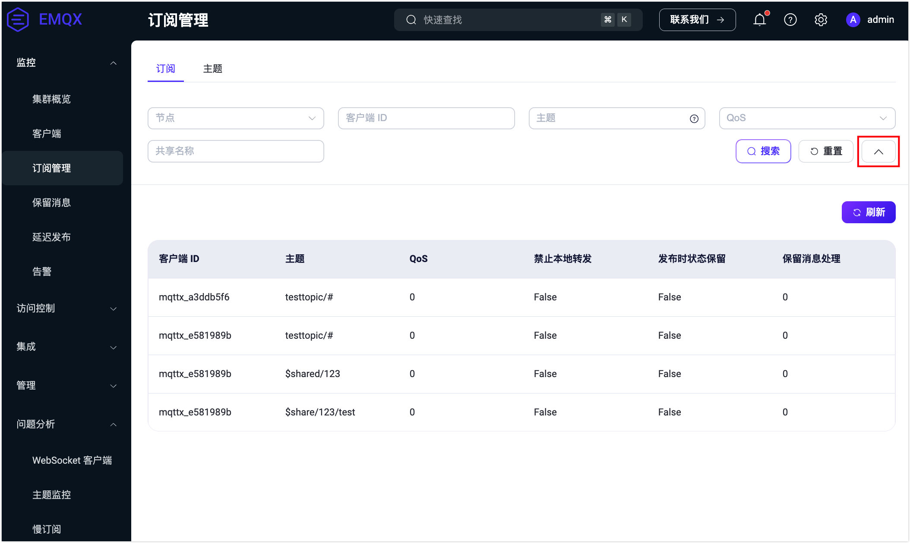
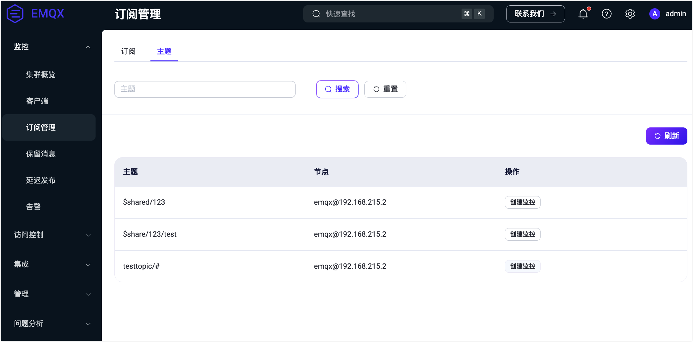

# 订阅管理

本页介绍在 EMQX Dashboard 中查看连接到 EMQX 的客户端订阅与主题。

## 订阅

订阅列表页面根据客户端 ID 与主题的映射关系，展示了所有连接订阅的主题及订阅的基本信息，除了客户端 ID、主题及 QoS 外，列表还提供了 MQTT v5 新支持的订阅特性信息：

- **禁止本地转发 （No Local）**: 在 MQTT v3.1.1 中，如果您订阅了自己发布消息的主题，那么您将收到自己发布的所有消息。而在 MQTT v5 中，如果您在订阅时将此选项设置为 `1`，那么服务端将不会向您转发您自己发布的消息。
- **发布时状态保留（Retain as Published）**: 这一选项用来指定服务端向客户端转发消息时是否要保留其中的 RETAIN 标识，注意这一选项不会影响保留消息中的 RETAIN 标识。因此当 Retain As Publish 选项被设置为 `0` 时，客户端直接依靠消息中的 RETAIN 标识来区分这是一个正常的转发消息还是一个保留消息，而不是去判断消息是否是自己订阅后收到的第一个消息（转发消息甚至可能会先于保留消息被发送，视不同消息服务器的具体实现而定）。
- **保留消息处理（Retain Handling）**: 这一选项用来指定订阅建立时服务端是否向客户端发送保留消息：
  - Retain Handling 等于 0，只要客户端订阅成功，服务端就发送保留消息。
  - Retain Handling 等于 1，客户端订阅成功且该订阅此前不存在，服务端才发送保留消息。毕竟有些时候客户端重新发起订阅可能只是为了改变一下 QoS，并不意味着它想再次接收保留消息。
  - Retain Handling 等于 2，即便客户订阅成功，服务端也不会发送保留消息。

顶部搜索栏默认显示节点、客户端 ID 和 Topic 3 个过滤搜索字段。其中节点为下拉选择框，可以选择查看连接到某个节点的客户端订阅，或使用客户端 ID 和 Topic 对订阅列表进行模糊搜索。点击搜索栏右侧箭头按钮还将显示 QoS 和共享名称过滤输入框，[共享名称](../../messaging/mqtt-shared-subscription.md)支持的是精确匹配。

## 主题

主题列表页面根据主题与节点的映射关系，展示了所有连接在各个节点订阅的主题，如果在相同节点中，不同连接订阅了同一主题，列表将进行去重处理。用户可根据主题对列表进行模糊搜索过滤查看。

> 注：订阅列表是根据客户端来区分的，而主题是当前所有已经订阅过的主题，相同的主题可能包含在不同的客户端。

点击**操作**列中的**创建监控**，将跳转到**问题分析** -> **主题监控**页面。您可以为该主题创建[主题监控](../../observability/topic-metrics.md)，用来统计该主题下的消息收发数量、速率等指标。

