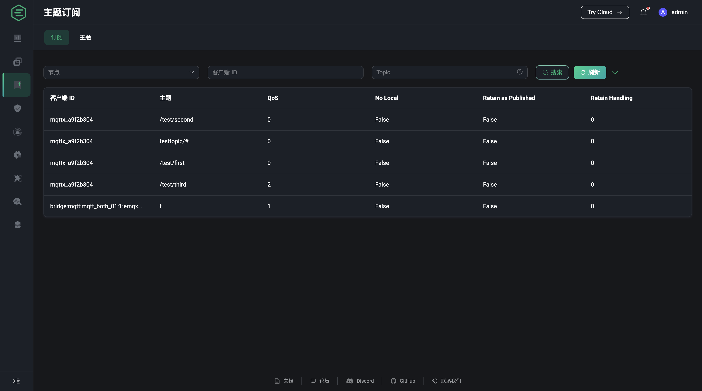

# 订阅

订阅列表页面根据客户端 ID —— 主题的映射关系，展示了所有连接订阅的主题及订阅的基本信息，除了客户端 ID、主题及 QoS 外，列表还提供了 MQTT v5 新支持的订阅特性信息

- `No Local`: 在 MQTT v3.1.1 中，如果你订阅了自己发布消息的主题，那么你将收到自己发布的所有消息。而在 MQTT v5 中，如果你在订阅时将此选项设置为 1，那么服务端将不会向你转发你自己发布的消息。
- `Retain as Published`: 这一选项用来指定服务端向客户端转发消息时是否要保留其中的 RETAIN 标识，注意这一选项不会影响保留消息中的 RETAIN 标识。因此当 Retain As Publish 选项被设置为 0 时，客户端直接依靠消息中的 RETAIN 标识来区分这是一个正常的转发消息还是一个保留消息，而不是去判断消息是否是自己订阅后收到的第一个消息（转发消息甚至可能会先于保留消息被发送，视不同 Broker 的具体实现而定）。
- `Retain Handling`: 这一选项用来指定订阅建立时服务端是否向客户端发送保留消息：
  
  - Retain Handling 等于 0，只要客户端订阅成功，服务端就发送保留消息。
  - Retain Handling 等于 1，客户端订阅成功且该订阅此前不存在，服务端才发送保留消息。毕竟有些时候客户端重新发起订阅可能只是为了改变一下 QoS，并不意味着它想再次接收保留消息。
  - Retain Handling 等于 2，即便客户订阅成功，服务端也不会发送保留消息。

搜索栏默认显示节点、客户端 ID 和 Topic 三个过滤搜索字段，其中节点为下拉选择框，可选中需要查看的节点的连接的订阅或使用客户端 ID 和 Topic 对订阅列表进行模糊搜索；点击搜索栏右侧箭头按钮还将显示 QoS 和共享名称过滤输入框，[共享名称](../../advanced/shared-subscriptions.md#带群组的共享订阅)支持的是精确匹配。

