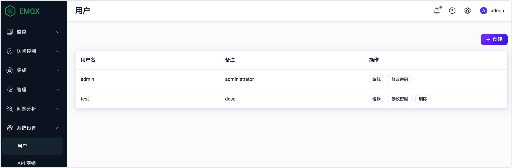
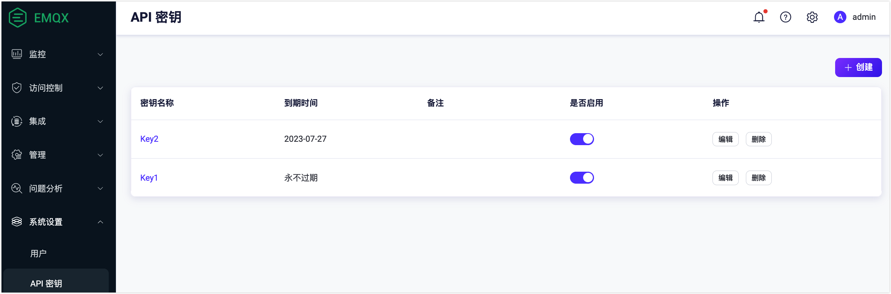
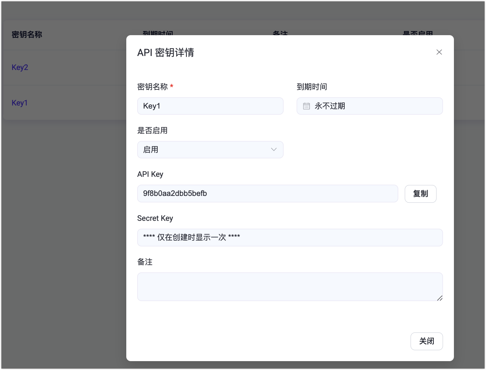
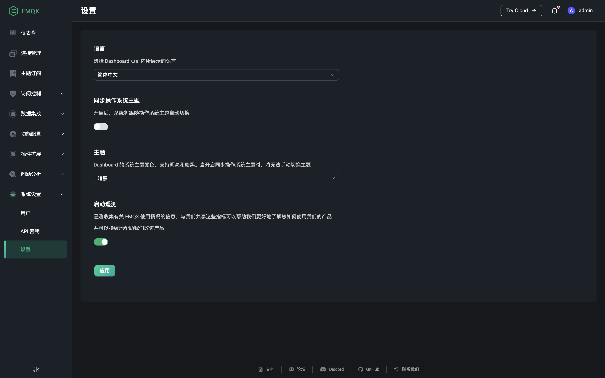

# 系统设置

如需新增或删除可用来登录 Dashboard 的用户账户、获取可用来认证以创建脚本调用 HTTP API 的 API 密钥和修改 Dashboard 的主题及语言，可以使用系统设置模块来进行操作。

## 用户

点击左侧系统设置菜单下的用户，可以来到用户页面。用户页面展示了当前所有可以登录 Dashboard 用户列表，包括使用[命令行](../admin/cli.md)创建的用户。点击页面右上角`创建`按钮，打开创建用户弹框，填入用户信息，点击`创建`按钮提交数据。提交成功的用户将添加到用户列表中，添加成功的用户可在页面上对其进行修改密码或备注操作；已不再需要的用户可在页面上进行删除。

> EMQX 现阶段不提供基于角色的权限管理能力，所有的用户都有管理员权限可删除其他用户，但无法在 Dashboard 上删除当前登录用户

## API 密钥

点击左侧系统设置菜单下的 API 密钥，可以来到 API 密钥页面。如果需要 API 密钥来创建一些脚本调用 [HTTP API](../admin/api.md)，可以在此页面进行创建获取操作。点击页面右上角`创建`按钮打开创建 API 密钥弹框，填写 API 密钥相关数据，如果`到期时间`未填写 API 密钥将永不过期，点击`确定`提交数据，提交成功后页面上将提供此次创建的 API 密钥的 API Key 和 Secret Key，**其中 Secret Key 后续将不再显示**，用户需立即将 API Key 和 Secret Key 保存至安全的地方；保存数据完毕可点击`关闭`按钮关闭弹框。

已创建的 API 密钥可在页面上进行查看和切换启用状态，点击 API 密钥名称可查看密钥详情；点击`编辑`按钮可重新设置 API 密钥的到期时间、启用状态和备注，如某 API 密钥已过期，可在此延长 API 密钥的可使用时间。如果某个 API 密钥已不再需要，可点击 API 密钥右侧`删除`按钮删除 API 密钥。

## 设置

点击左侧系统设置菜单或页面右上角用户名下拉菜单下的设置，可以来到设置页面。用户可以在设置页面修改 Dashboard 的语言及主题色，主题色可选择是否需要同步操作系统主题，如开启同步操作系统主题，Dashboard 主题将自动同步用户的操作系统主题，无法手动进行选择；页面最下方可切换是否启动遥测，如启动遥测，用户将与 EMQX 共享使用情况的信息来帮助 EMQX 研发团队了解用户如果使用 EMQX 以持续地改进产品。

