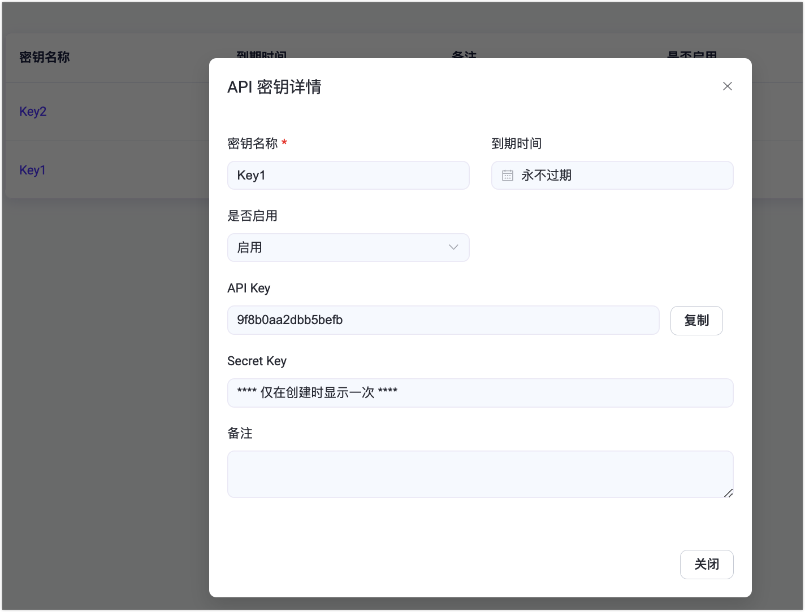

# 系统设置

EMQX Dashboard 中的**系统设置** 菜单提供一系列管理功能入口，包括用户与角色管理、审计日志、API 密钥、许可证、单点登录（SSO）、数据备份与恢复、热升级以及通用设置。

## 用户

**用户**页面提供了所有活跃的 Dashboard 用户的概览，包括通过[命令行](../admin/cli.md)生成的用户。

要添加新用户，只需点击页面右上角的**创建**按钮。一个弹出的对话框将提示您输入必要的用户详细信息。输入完毕后，点击**创建**按钮即可生成用户帐户。对于进一步的用户管理，如编辑用户信息、更新密码或删除用户，您可以通过**操作**列轻松访问这些选项。

> EMQX 开源版本不提供基于角色的权限管理能力，所有的用户都有管理员权限可删除其他用户，但无法在 Dashboard 上删除当前登录用户。
> 出于安全考虑，从 EMQX 5.0.0 开始 Dashboard 用户无法用于 REST API 认证。


### 基于角色的访问控制

从 EMQX 5.3 开始，Dashboard 用户引入了 基于角色的访问控制 （RBAC）功能。RBAC 允许根据用户在组织中的角色为其分配权限。此功能简化了授权管理，通过限制访问权限提高安全性，并改善组织合规性，因此是 Dashboard 必不可少的访问控制机制。

目前，可以为用户设置以下两种预定义角色之一。您可以在创建用户时从**角色**下拉菜单中选择角色。
+ 管理员 

    管理员拥有对 EMQX 所有功能和资源的完全管理访问权限，包括客户端管理、系统配置、API 密钥以及用户管理。

+ 查看者

    查看者可以访问 EMQX 的所有数据和配置信息，对应 REST API 中的所有 `GET` 请求，但无权进行创建、修改和删除操作。

### 命名空间角色

从 EMQX 6.0 开始，Dashboard 支持命名空间角色功能。该特性扩展了基于角色的访问控制（RBAC），以支持多租户场景：每个用户仅被授权访问特定的命名空间，实现资源隔离与权限精细化管理。

::: warning 仅适用于受信任部署

当前命名空间管理员访问仅适用于受信任的内部部署场景，例如在同一组织内隔离不同团队或业务单元，以降低误修改其他配置的风险。
它并不作为面向公共环境或其他非受信任多租户场景的安全边界。

:::

::: tip

如需了解命名空间功能的详细信息，请参阅：[命名空间](../multi-tenancy/namespace-overview.md)。

:::

#### 创建具有命名空间角色的用户

在 Dashboard 中创建新用户时，界面将新增一个**命名空间**选项。

::: tip 前提条件

1. 在 Dashboard 中预先创建一个托管命名空间（如：`namespace_01`）。参考：[创建命名空间](../multi-tenancy/create-namespace.md)。
2. 确保当前使用的 EMQX License 版本为 6.0 或更高版本，并已正确部署集群。

:::

创建步骤如下：

1. 进入**系统设置 > 用户**页面，点击 **+ 创建**。
2. 填写以下字段：
   - **用户名**：用户的唯一标识。
   - **备注**：可选说明信息。
   - **密码**：用户登录密码。
   - **角色**：选择**管理员**或**查看者**。
3. 启用**命名空间**选项，并选择一个已存在的命名空间（例如 `namespace_01`）。
4. 点击**创建**完成用户配置。

若通过 CLI 或 API 创建用户，需显式指定角色格式为：

```
ns:<NAMESPACE>::<ROLE>
```

例如：

- `ns:namespace_01::administrator`
- `ns:namespace_01::viewer`

#### 命名空间用户的行为说明

- **资源作用域限制**：命名空间用户只能查看和管理其所属命名空间下的资源，包括连接器、动作、数据源、规则等支持命名空间的模块。
- **集群级设置访问限制**：尚未支持命名空间隔离的全局配置项对命名空间用户为只读，只有系统管理员可进行修改。
- **默认登录首页**：命名空间用户登录 Dashboard 后默认进入**概览**页面，菜单项与普通用户一致，但资源数据将自动过滤，仅显示其命名空间内的数据。
- **License 管理限制**：命名空间用户不显示 License 相关提示，License 相关操作仅由系统管理员负责。

#### 命名空间内角色含义

- **管理员**：对指定命名空间下的资源拥有完整权限（创建、读取、更新、删除）。
- **查看者**：仅具备只读权限（等同于 GET 请求）权限，仅可查看资源数据。

## 审计日志

**审计日志**页面允许管理员配置审计日志功能，以实时监控 EMQX 集群中的关键操作变更。

有关审计日志功能的详细说明，请参见[审计日志](../dashboard/audit-log.md)。

## API 密钥

点击左侧**系统设置**菜单下的 **API 密钥**，可以来到 API 密钥页面。如果需要 API 密钥来创建一些脚本调用 [HTTP API](../admin/api.md)，可以在此页面进行创建获取操作。点击页面右上角**创建**按钮打开创建 API 密钥弹框，填写 API 密钥相关数据，如果**到期时间**未填写 API 密钥将永不过期，点击**确定**提交数据，提交成功后页面上将提供此次创建的 API 密钥的 API Key 和 Secret Key，**其中 Secret Key 后续将不再显示**，用户需立即将 API Key 和 Secret Key 保存至安全的地方；保存数据完毕可点击**关闭**按钮关闭弹框。

在 API 密钥页面上，您可以按照以下步骤生成用于访问 [HTTP API](../admin/api.md) 的 API 密钥和 Secret key。

1. 单击页面右上角的**创建**按钮，弹出创建 API 密钥的对话框。

2. 在创建 API 密钥对话框上，配置 API 密钥的详细信息。

   - 如果**到期时间**文本框留空，API 密钥将永不过期。
   - 您可以指定密钥的[角色](../admin/api.md#角色与权限)（可选）。

3. 单击**确认**按钮，API 密钥和密钥将被创建并显示在**创建成功**对话框中。

   ::: tip

   您需要将 API Key 和 Secret Key 保存在安全的地方，因为 Secret Key 将不再显示。

   :::

   单击**关闭**按钮以关闭对话框。


已创建的 API 密钥可在页面上进行查看和切换启用状态，点击 API 密钥名称可查看密钥详情。点击**编辑**按钮可重新设置 API 密钥的到期时间、启用状态和备注，如某 API 密钥已过期，可在此延长 API 密钥的可使用时间。如果某个 API 密钥已不再需要，可点击 API 密钥右侧**删除**按钮删除 API 密钥。



## License

点击左侧**系统设置**菜单下的 **License** 可以来到 License 页面。在该页面上可以查看当前 License 的基础信息，包括**签发对象**、 **License 使用情况**、**EMQX 版本信息**、**签发邮箱**、**签发时间**和**到期时间**。

点击**更新 License** 可以上传 License Key。在 **License 设置**区域可以设置 License 连接配额使用量的高水位线和低水位线。更多关于 License 的内容，参考[EMQX 企业版 License](../deploy/license.md)。

## 单点登录

单点登录页面为管理员提供了用户登录管理中单点登录功能的配置。有关单点登录功能的详细介绍，参阅[单点登录](./sso.md)。

## 备份与恢复

**备份与恢复**页面提供用于备份运行数据和配置文件的相关设置。您可以在此页面执行数据导入和导出操作。

有关备份与恢复功能的详细信息，请参见[备份与恢复](../operations/backup-restore.md)。

## 热升级

**热升级**页面允许您通过上传热升级包，在不中断服务的情况下升级 EMQX。如需获取升级包，请联系 [EMQX 团队](https://www.emqx.com/en/contact)。

## 设置

要访问设置，请点击 Dashboard 右上角的齿轮图标。

在**设置**菜单中，您可以自定义 Dashboard 的语言和主题样式：

- **语言**：选择您偏好的显示语言。
- **主题**：可在浅色和深色主题之间切换，或启用与操作系统主题的自动同步。当启用同步后，Dashboard 的主题将跟随操作系统设置，无法手动选择。

此外，设置菜单中还包含一个开关，用于启用或禁用**规则**页面中的 [SQL 生成器](../data-integration/rule-get-started.md#sql-generator)功能。


