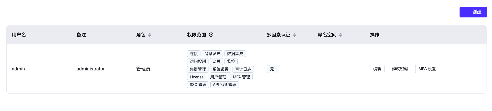
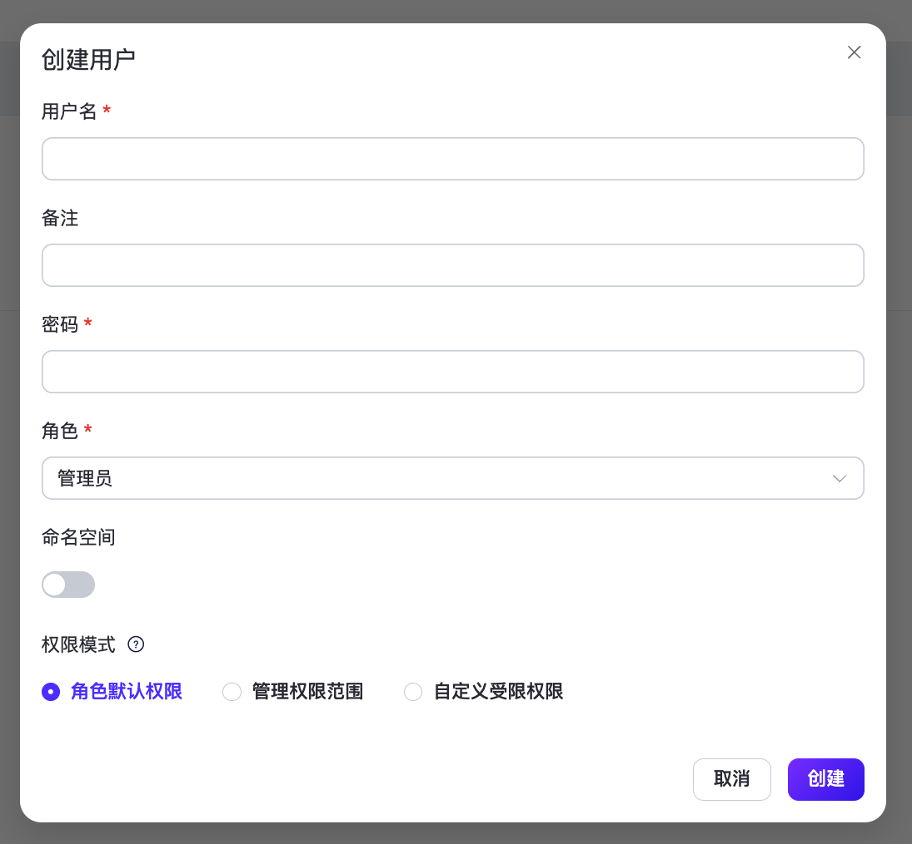

# 系统设置

EMQX Dashboard 中的**系统设置**菜单提供一系列管理功能入口，包括用户与角色管理、审计日志、API 密钥、许可证、单点登录（SSO）、数据备份与恢复以及通用设置。

## 用户

**用户**页面提供了所有活跃的 Dashboard 用户的概览，包括通过[命令行](../admin/cli.md)生成的用户。

要添加新用户，只需点击页面右上角的**创建**按钮。一个弹出的对话框将提示您输入必要的用户详细信息。输入完毕后，点击**创建**按钮即可生成用户帐户。对于进一步的用户管理，如编辑用户信息、更新密码或删除用户，您可以通过**操作**列轻松访问这些选项。

> EMQX 开源版本不提供基于角色的权限管理能力，所有的用户都有管理员权限可删除其他用户，但无法在 Dashboard 上删除当前登录用户。
> 出于安全考虑，从 EMQX 5.0.0 开始 Dashboard 用户无法用于 REST API 认证。

从 EMQX 5.3 开始，Dashboard 用户引入了 基于角色的访问控制 （RBAC）功能。RBAC 允许根据用户在组织中的角色为其分配权限。此功能简化了授权管理，通过限制访问权限提高安全性，并改善组织合规性，因此是 Dashboard 必不可少的访问控制机制。

目前，可以为用户设置以下两种预定义角色之一。您可以在创建用户时从**角色**下拉菜单中选择角色。
+ **管理员**

    管理员拥有对 EMQX 所有功能和资源的完全管理访问权限，包括客户端管理、系统配置、API 密钥以及用户管理。

+ **查看者**

    查看者可以访问 EMQX 的所有数据和配置信息，对应 REST API 中的所有 `GET` 请求，但无权进行创建、修改和删除操作。

### 登录用户权限范围（Scopes）

从 EMQX 5.10 开始，您可以为 Dashboard 登录用户分配权限范围（Scope），在角色基础上进一步限制用户可访问的 API 区域。除 [10 个 API 密钥 Scope](../admin/api.md#内置范围) 外，Dashboard 用户还拥有 4 个仅适用于浏览器会话的专属 Scope：

| Scope | 所需角色 | 用途 |
| --- | --- | --- |
| `user_management` | 管理员 | 管理 Dashboard 用户（创建 / 修改 / 删除）。 |
| `sso_management` | 管理员 | 管理 SSO 后端与 SSO 用户记录。 |
| `api_key_management` | 管理员 | 管理 API 密钥。 |
| `mfa_management` | 任意 | 管理自己的 MFA；管理员可管理其他用户的 MFA。 |

其中 `user_management`、`sso_management` 和 `api_key_management` 需要管理员角色，不能分配给查看者。`mfa_management` 是例外：可以授予查看者，但仅允许其管理自己账号的 MFA，不授予对其他用户 MFA 设置的访问权限。当您希望查看者账号能够自助重新绑定或恢复认证设备而不获得其他额外权限时，此 Scope 非常有用。

在创建或编辑用户时，**Scopes** 字段是可选的。留空时，用户会得到一个由其角色推导出的默认 Scope 集：

- **管理员**：拥有全部 Scope，包括上述 4 个登录专属 Scope。
- **查看者**：拥有全部通用 API 密钥 Scope；`mfa_management` 仅在显式分配时才会被授予。

::: warning 将宽泛 Scope 视为等同管理员权限

以下 Scope 天然覆盖范围较广，即使未分配其他 Scope，也实际上授予管理员能力：

- `system` 覆盖配置管理（`/configs*`、`/data/*` 等）。持有 `system` 的用户可以更新任意配置子树，或恢复包含已存储用户和 API 密钥记录的备份文件。
- `user_management` 允许持有者创建或修改其他 Dashboard 用户，包括具有任意 Scope 集的用户。
- `api_key_management` 允许持有者创建或修改 API 密钥，包括具有任意 Scope 集的密钥。

将其中任一 Scope 与受限 Scope 列表组合到同一个用户上，并不能可靠地强制执行该限制。该用户可通过配置变更、备份恢复，或为自己创建新的账号或密钥来访问受限区域。仅将这三个 Scope 授予您完全信任的用户，并遵循最小权限原则，只授予用户实际需要的具体 Scope。

:::

#### 角色变更与 Scope 兼容性

变更用户角色时，EMQX 会检查该用户当前的 Scope 是否与新角色兼容。如果不兼容，请求将返回 HTTP 400。要解决此问题，请在同一请求中提供一个对新角色有效的 `scopes` 列表。

例如，如果您将一个管理员降级为查看者，而该用户持有 `user_management`、`sso_management` 或 `api_key_management`，请求将被拒绝，因为这三个 Scope 需要管理员角色。请在同一请求中提供一个仅包含查看者兼容 Scope 的列表以完成变更。（`mfa_management` 不是仅限管理员的 Scope，不会导致此拒绝。）

### 默认管理员保护

`dashboard.default_username` 账号（其密码由 `dashboard.default_password` 配置）是一个应急（break-glass）账号。为了保证在其他管理员配置错误或失联时系统仍可恢复，默认用户受到下列保护，以防止误操作导致整个系统失去管理入口：

- **不能被删除**：无论是从 Dashboard 还是 REST API，**删除**按钮始终不可用。
- 角色**不能被更改**，始终保持 `administrator`。
- Scope 集**不能被自定义**，始终拥有完整的管理员 Scope。
- 描述和密码**可以**正常修改。

其他管理员不受此限制，只要系统中至少还存在一个管理员，就可以被删除。

### 自助操作边界

每个 Dashboard 用户无论持有哪些 Scope，都被允许执行以下两类自助操作：

- 修改自己的密码。
- 绑定或重新绑定自己的 TOTP / MFA。禁用 MFA 同样允许，但若管理员已为该用户账号显式要求启用 MFA，则需持有 `mfa_management` Scope 方可禁用。

其他个人信息变更（描述、角色、由管理员授予的 Scope）都需要操作者持有对应 Scope，即使目标用户就是操作者自己也不能绕过此检查。

## 审计日志

**审计日志**页面允许管理员配置审计日志功能，以实时监控 EMQX 集群中的关键操作变更。

有关审计日志功能的详细说明，请参见[审计日志](../dashboard/audit-log.md)。

## API 密钥

**API 密钥**页面用于创建和管理访问 [HTTP API](../admin/api.md) 所需的 API 密钥。有关创建和管理 API 密钥（包括角色与范围分配）的操作说明，请参见[创建 API 密钥](../admin/api.md#创建-api-密钥)。

## License

点击左侧**系统设置**菜单下的 **License** 可以来到 License 页面。在该页面上可以查看当前 License 的基础信息，包括**签发对象**、 **License 使用情况**、**EMQX 版本信息**、**签发邮箱**、**签发时间**和**到期时间**。

点击**更新 License** 可以上传 License Key。在 **License 设置**区域可以设置 License 连接配额使用量的高水位线和低水位线。更多关于 License 的内容，参考[EMQX 企业版 License](../deploy/license.md)。

## 单点登录

单点登录页面为管理员提供了用户登录管理中单点登录功能的配置。有关单点登录功能的详细介绍，参阅[单点登录](./sso.md)。

## 备份与恢复

**备份与恢复**页面提供用于备份运行数据和配置文件的相关设置。您可以在此页面执行数据导入和导出操作。

有关备份与恢复功能的详细信息，请参见[备份与恢复](../operations/backup-restore.md)。

## 设置

要访问设置，请点击 Dashboard 右上角的齿轮图标。

在**设置**菜单中，您可以自定义 Dashboard 的语言和主题样式：

- **语言**：选择您偏好的显示语言。
- **主题**：可在浅色和深色主题之间切换，或启用与操作系统主题的自动同步。当启用同步后，Dashboard 的主题将跟随操作系统设置，无法手动选择。

此外，设置菜单中还包含一个开关，用于启用或禁用**规则**页面中的 [SQL 生成器](../data-integration/rule-get-started.md#sql-generator)功能。

