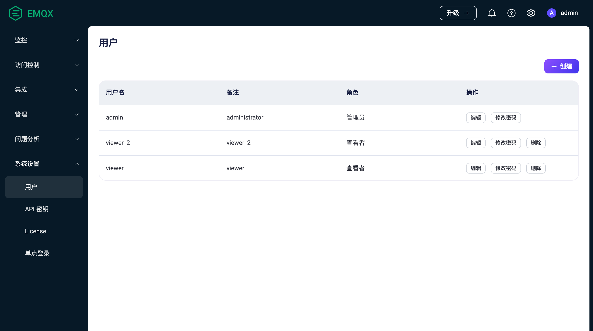
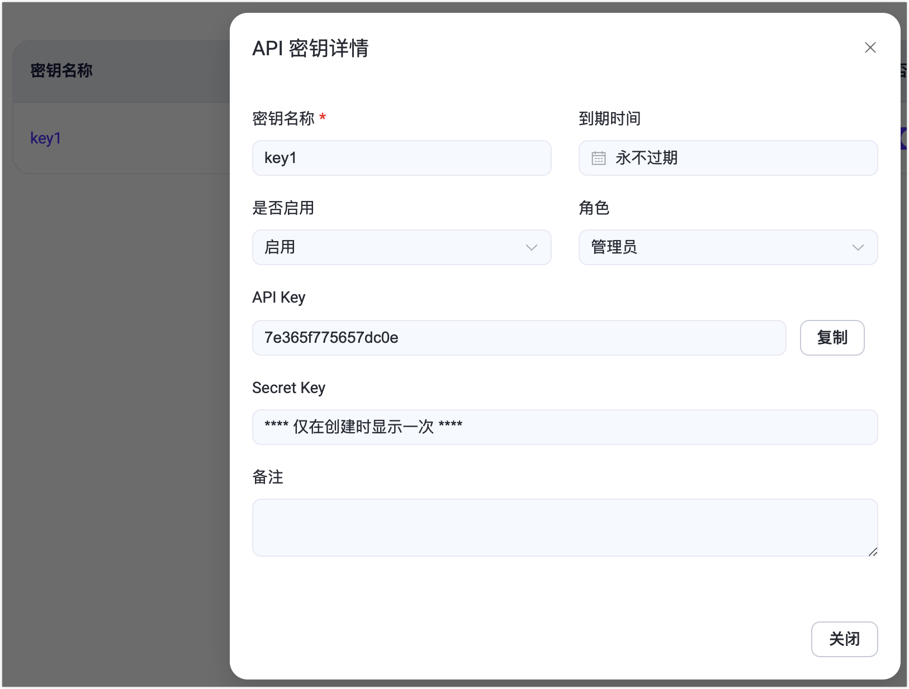
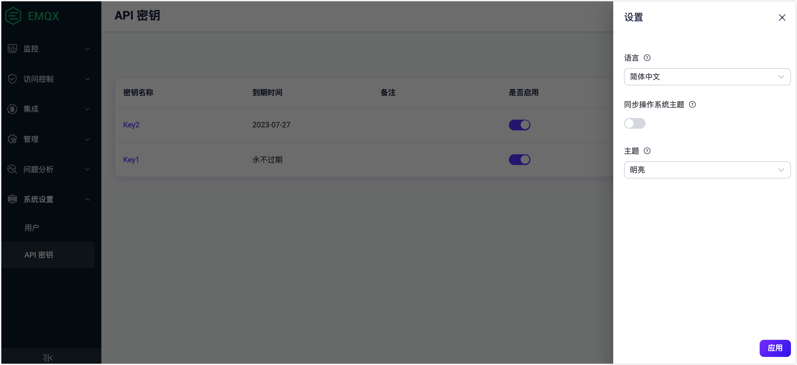

# 系统设置



EMQX Dashboard 的**系统**菜单包括**用户**、**API 密钥**和**设置**子菜单。每个子菜单都允许您在其各自的页面上高效管理和配置用户帐户、API密钥和仪表板设置首选项。





EMQX Dashboard 的**系统**菜单包括**用户**、**API 密钥**、**License** 和**单点登录**子菜单。每个子菜单都允许您在其各自的页面上高效管理和配置用户帐户、API 密钥、License 设置和单点登录选项。



## 用户

**用户**页面提供了所有活跃的 Dashboard 用户的概览，包括通过[命令行](../admin/cli.md)生成的用户。

要添加新用户，只需点击页面右上角的**+ 创建**按钮。一个弹出的对话框将提示您输入必要的用户详细信息。输入完毕后，点击**创建**按钮即可生成用户帐户。对于进一步的用户管理，如编辑用户信息、更新密码或删除用户，您可以通过**操作**列轻松访问这些选项。



> EMQX 开源版本不提供基于角色的权限管理能力，所有的用户都有管理员权限可删除其他用户，但无法在 Dashboard 上删除当前登录用户。
> 出于安全考虑，从 EMQX 5.0.0 开始 Dashboard 用户无法用于 REST API 认证。





从 EMQX 5.3 开始，Dashboard 用户引入了 基于角色的访问控制 （RBAC）功能。RBAC 允许根据用户在组织中的角色为其分配权限。此功能简化了授权管理，通过限制访问权限提高安全性，并改善组织合规性，因此是 Dashboard 必不可少的访问控制机制。

目前，可以为用户设置以下两种预定义角色之一。您可以在创建用户时从**角色**下拉菜单中选择角色。
+ 管理员 

    管理严拥有对 EMQX 所有功能和资源的完全管理访问权限，包括客户端管理、系统配置、API 密钥以及用户管理。

+ 查看者

    查看者可以访问 EMQX 的所有数据和配置信息，对应 REST API 中的所有 `GET` 请求，但无权进行创建、修改和删除操作。



## API 密钥

点击左侧**系统设置**菜单下的 **API 密钥**，可以来到 API 密钥页面。如果需要 API 密钥来创建一些脚本调用 [HTTP API](../admin/api.md)，可以在此页面进行创建获取操作。点击页面右上角**创建**按钮打开创建 API 密钥弹框，填写 API 密钥相关数据，如果**到期时间**未填写 API 密钥将永不过期，点击**确定**提交数据，提交成功后页面上将提供此次创建的 API 密钥的 API Key 和 Secret Key，**其中 Secret Key 后续将不再显示**，用户需立即将 API Key 和 Secret Key 保存至安全的地方；保存数据完毕可点击**关闭**按钮关闭弹框。

在 API 密钥页面上，您可以按照以下步骤生成用于访问 [HTTP API](../admin/api.md) 的 API 密钥和 Secret key。

1. 单击页面右上角的**+ 创建**按钮，弹出创建 API 密钥的对话框。

2. 在创建 API 密钥对话框上，配置 API 密钥的详细信息。

   如果**到期时间**文本框留空，API 密钥将永不过期。

3. 单击**确认**按钮，API 密钥和密钥将被创建并显示在**创建成功**对话框中。

   ::: 警告

   您需要将 API Key 和 Secret Key 保存在安全的地方，因为 Secret Key 将不再显示。

   :::

   单击**关闭**按钮以关闭对话框。

已创建的 API 密钥可在页面上进行查看和切换启用状态，点击 API 密钥名称可查看密钥详情。点击**编辑**按钮可重新设置 API 密钥的到期时间、启用状态和备注，如某 API 密钥已过期，可在此延长 API 密钥的可使用时间。如果某个 API 密钥已不再需要，可点击 API 密钥右侧**删除**按钮删除 API 密钥。



## License

点击左侧**系统设置**菜单下的 **License** 可以来到 License 页面。在该页面上可以查看当前 License 的基础信息，包括**签发对象**、 **License 使用情况**、**EMQX 版本信息**、**签发邮箱**、**签发时间**和**到期时间**。点击**更新 License** 可以上传 License Key。在 **License 设置**区域可以设置 License 连接配额使用量的高低水位线。





## 设置

点击左侧**系统设置**菜单或页面右上角**用户名**下拉菜单下的**设置**，可以来到设置页面。用户可以在设置页面修改 Dashboard 的语言及主题色，主题色可选择是否需要同步操作系统主题，如开启同步操作系统主题，Dashboard 主题将自动同步用户的操作系统主题，无法手动进行选择；页面最下方可切换是否启动遥测，如启动遥测，用户将与 EMQX 共享使用情况的信息来帮助 EMQX 研发团队了解用户如果使用 EMQX 以持续地改进产品。





## 单点登录

单点登录页面为管理员提供了用户登录管理中单点登录功能的配置。有关单点登录功能的详细介绍，参阅[单点登录](./sso.md)。





## 设置

点击页面右上角的设置图标可以修改系统设置，包括修改 Dashboard 的语言及主题色，主题色可选择是否需要同步操作系统主题，如开启同步操作系统主题，Dashboard 主题将自动同步用户的操作系统主题，无法手动进行选择；


