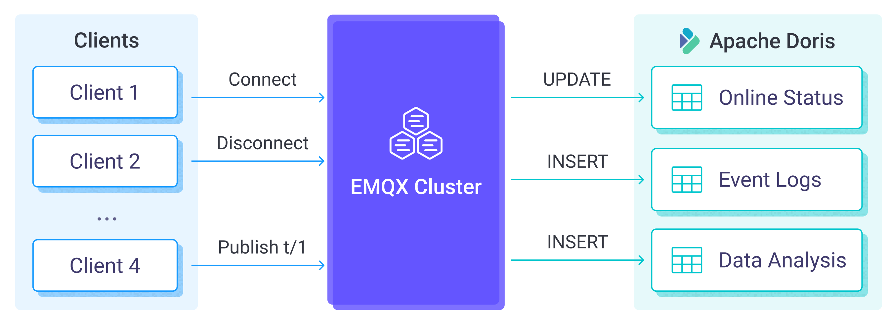

# 将 MQTT 数据写入到 Apache Doris

[Apache Doris](https://doris.apache.org/) 是一款现代化的大规模并行处理（MPP）分析型数据库系统，具有高并发、高性能、易于使用等特点。它特别适用于实时分析和数据仓库等场景。自 EMQX 5.10.0 起，您可以将 MQTT 数据集成至 Apache Doris，实现高效存储、实时分析和强大的数据可视化能力。

本页详细介绍了 EMQX 与 Apache Doris 的数据集成并提供了实用的规则和 Sink 创建指导。

## 工作原理

Apache Doris 数据集成是 EMQX 中开箱即用的功能，通过简单的配置即可实现复杂的业务开发。在一个典型的物联网应用中，EMQX 作为物联网平台，负责接入设备，进行消息传输，Apache Doris 作为数据存储平台，负责设备状态与元数据的存储，以及消息数据存储和数据分析等。



EMQX 通过规则引擎与 Sink 将设备事件和数据转发至 Apache Doris，应用读取 Apache Doris 中数据即可感知设备状态，获取设备上下线记录，以及分析设备数据。其具体的工作流程如下：

- **设备连接到 EMQX**：物联网设备通过 MQTT 协议连接成功后将触发上线事件，事件包含设备 ID、来源 IP 地址以及其他属性等信息。
- **设备消息发布和接收**：设备通过特定的主题发布遥测和状态数据，EMQX 接收到消息后将在规则引擎中进行比对。
- **规则引擎处理消息**：通过内置的规则引擎，可以根据主题匹配处理特定来源的消息和事件。规则引擎会匹配对应的规则，并对消息和事件进行处理，例如转换数据格式、过滤掉特定信息或使用上下文信息丰富消息。
- **写入到 Apache Doris**：规则触发将消息写入到 Apache Doris 的操作。借助 SQL 模板，用户可以从规则处理结果中提取数据构造 SQL 发送给 Apache Doris 执行，实现将消息特定字段写入或更新到数据库对应表和列中。

事件和消息数据写入到 Apache Doris 后，您可以连接到 Apache Doris 读取数据，进行灵活的应用开发，例如：

- 连接到可视化工具，例如 Grafana，根据数据生成图表，展示数据变化。
- 连接到设备管理系统，查看设备列表与状态，并检测设备异常行为，及时排除潜在的问题。

## 特性与优势

在 EMQX 中使用 Apache Doris 数据集成能够为您的业务带来以下特性与优势：

- **灵活的事件处理**：通过 EMQX 规则引擎，Apache Doris 可以处理设备全生命周期事件，极大的方便开发实现物联网应用所需的各类管理与监控业务。您可以通过分析事件数据，及时发现设备故障、异常行为或趋势变化，以便采取适当的措施。
- **消息转换**：消息可以写入 Apache Doris 之前，通过 EMQX 规则中进行丰富的处理和转换，方便后续的存储和使用。
- **实时数据写入**：Apache Doris 支持通过 HTTP 和 JDBC 接口进行实时数据写入。结合 EMQX 使用时，MQTT 数据可以低延迟地直接写入 Doris 表，非常适合对实时查询和分析有高要求的场景。
- **流式同步**：Apache Doris 还支持从 Flink、Kafka 以及各类事务型数据库等数据源接入实时数据流。这使得用户可以构建统一的数据处理流水线，将 EMQX 中的 MQTT 数据与其他流式数据源结合，实现全面的实时分析能力。
- **标准 SQL 与生态兼容性**：Doris 完全兼容 MySQL 语法并支持标准 SQL，使用户无需学习新语言即可执行强大的分析查询。同时，它能够轻松集成各类商业智能（BI）工具和客户端应用，用于构建仪表盘、生成报表以及实现自动化工作流程。
- **运行时指标**：支持查看每个 Sink 的运行时指标，例如消息总数、成功/失败计数、当前速率等。

通过灵活的事件处理、丰富的消息转换、灵活的数据操作以及实时监控与分析能力，您可以构建高效、可靠和可扩展的物联网应用，并在业务决策和优化方面受益。

## 准备工作

本节介绍了在 EMQX 中创建 Apache Doris Sink 之前需要做的准备工作，包括安装 Apache Doris 和创建数据表。

### 前置准备

- 了解 [规则](./rules.md)。
- 了解[数据集成](./data-bridges.md)。

### 安装 Apache Doris 服务器

请按照[官方指南](https://doris.apache.org/zh-CN/docs/dev/gettingStarted/quick-start#use-docker-for-quick-deployment)使用 Docker Compose 在本地运行 Doris。

### 创建数据表

您可以使用 MySQL 客户端连接到 Doris 的 Frontend 并执行命令。参见[官方文档](https://doris.apache.org/zh-CN/docs/dev/gettingStarted/quick-start#%E8%BF%90%E8%A1%8C%E6%9F%A5%E8%AF%A2)。

例如：

```
mysql -uroot -P9030 -h127.0.0.1
```

您需要在 Apache Doris 中创建数据库和两张数据表：

- 数据表 `emqx_messages` 存储每条消息的发布者客户端 ID、主题、Payload 以及发布时间。
- 数据表 `emqx_client_events` 存储上下线的客户端 ID、事件类型以及事件发生时间。

  ```sql
  create database mqtt;
  use mqtt;
  
  create table if not exists
    emqx_messages(
      clientid varchar,
      topic string,
      payload string,
      created_at datetime
    )
    properties (replication_num = 1);
  
  create table if not exists
    emqx_client_events(
      clientid varchar,
      event varchar,
      created_at datetime)
    properties (replication_num = 1);

## 创建连接器

在创建 Apache Doris Sink 之前，您需要创建一个 Apache Doris 连接器，以便 EMQX 与 Apache Doris 服务建立连接。以下示例假定您在本地机器上同时运行 EMQX 和 Apache Doris。如果您在远程运行 Apache Doris 和 EMQX，请相应地调整设置。

1. 转到 Dashboard **集成** -> **连接器** 页面。点击页面右上角的**创建**。
2. 在连接器类型中选择 **Doris**，点击**下一步**。
3. 在 **配置** 步骤，配置以下信息：

   - **连接器名称**：应为大写和小写字母及数字的组合，例如：`my_doris`。
   - **服务器地址**：填写 `127.0.0.1:3306`。
   - **数据库名字**：填写 `mqtt`。
   - **用户名**：填写 `root`。
   - **密码**：填写 `public`。
4. 根据需要配置高级设置选项（可选），详细请参考[高级设置](#高级设置)。
5. 点击**创建**按钮完成连接器创建。
6. 在弹出的**创建成功**对话框中您可以点击**创建规则**，继续创建规则以指定需要写入 Apache Doris 的数据和需要记录的客户端事件。您也可以按照[创建消息存储 Sink 规则](#创建消息存储-sink-规则)和[创建事件记录 Sink 规则](#创建事件记录-sink-规则)章节的步骤来创建规则。

## 创建消息存储 Sink 规则

本节演示了如何在 Dashboard 中创建一条规则，用于处理来自源 MQTT 主题 `t/#` 的消息，并通过配置的 Sink 将处理后的结果写入到 Apache Doris 的数据表 `emqx_messages` 中。

1. 转到 Dashboard **集成** -> **规则**页面。

2. 点击页面右上角的**创建**。

3. 输入规则 ID `my_rule`，在 SQL 编辑器中输入规则，此处选择将 `t/#` 主题的 MQTT 消息存储至 Apache Doris，请确保规则选择出来的字段（SELECT 部分）包含所有 SQL 模板中用到的变量，此处规则 SQL 如下：

   ```sql
   SELECT 
     *
   FROM
     "t/#"
   ```

   ::: tip

   如果您初次使用 SQL，可以点击 **SQL 示例** 和**启用调试**来学习和测试规则 SQL 的结果。

   :::

4. 点击右侧的**添加动作**按钮，为规则在被触发的情况下指定一个动作。通过这个动作，EMQX 会将经规则处理的数据发送到 Apache Doris。

5. 在**动作类型**下拉框中选择 Apache Doris，保持**动作**下拉框为默认的“创建动作”选项，您也可以选择一个之前已经创建好的 Apache Doris Sink。此处我们创建一个全新的 Sink 并添加到规则中。

6. 输入 Sink 名称，要求是大小写英文字母或数字组合。

7. 从**连接器**下拉框中选择刚刚创建的 `my_doris`。您也可以通过点击下拉框旁边的按钮创建一个新的连接器。有关配置参数，请参见[创建连接器](#创建连接器)。

8. 配置 **SQL 模板**，使用如下 SQL 完成数据插入，此处为[预处理 SQL](./data-bridges.md#sql-预处理)，字段不应当包含引号，SQL 末尾不要带分号 （`;`）:

   ```sql
   INSERT INTO emqx_messages(clientid, topic, payload, created_at) VALUES(
     ${clientid},
     ${topic},
     ${payload},
     FROM_UNIXTIME(${timestamp}/1000)
   )
   ```

   如果在模板中使用未定义的占位符变量，您可以切换**未定义变量作为 NULL** 开关（位于 **SQL 模板** 上方）来定义规则引擎的行为：

   - **关闭**（默认）：规则引擎可以将字符串 `undefined` 插入数据库。

   - **启用**：允许规则引擎在变量未定义时将 `NULL` 插入数据库。

     ::: tip

     如果可能，应该始终启用此选项；禁用该选项仅用于确保向后兼容性。

     :::

9. **备选动作（可选）**：如果您希望在消息投递失败时提升系统的可靠性，可以为 Sink 配置一个或多个备选动作。当 Sink 无法成功处理消息时，将触发这些备选动作。更多信息请参见：[备选动作](./data-bridges.md#备选动作)。

10. 展开**高级设置**，根据需要配置高级设置选项（可选），详细请参考[高级设置](#高级设置)。

11. 点击**创建**按钮完成 Sink 创建，新建的 Sink 将被添加到规则动作中。

12. 回到创建规则页面，对配置的信息进行确认，点击**创建**。一条规则应该出现在规则列表中。

至此您已经完成整个创建过程，可以前往 **集成** -> **Flow 设计器** 页面查看拓扑图，此时应当看到 `t/#` 主题的消息经过名为 `my_rule` 的规则处理，处理结果交由 Apache Doris 进行存储。

## 创建事件记录 Sink 规则

本节展示如何创建用于记录客户端上/下线状态的规则，并通过配置的 Sink 将记录写入 Apache Doris 的数据表 `emqx_client_events` 中。除 SQL 模板与规则外，其他操作步骤与[创建消息存储 Sink 规则](#创建消息存储-sink-规则)章节完全相同。

您可以使用以下规则 SQL 创建规则：

```sql
SELECT
  *
FROM 
  "$events/client/connected", "$events/client/disconnected"
```

您可以使用以下 SQL 模板创建实现设备上下线记录的 Sink，请注意字段不应当包含引号，SQL 末尾不要带分号 `;`:

```sql
INSERT INTO emqx_client_events(clientid, event, created_at) VALUES (
  ${clientid},
  ${event},
  FROM_UNIXTIME(${timestamp}/1000)
)
```

## 测试规则

使用 MQTTX 向 `t/1` 主题发布消息，此操作同时会触发上下线事件：

```bash
mqttx pub -i emqx_c -t t/1 -m '{ "msg": "hello Apache Doris" }'
```

分别查看两个 Sink 运行统计，命中数和发送成功次数应各增加 1 次，上下线记录 Sink 命中和成功次数应增加 2 次。

查看数据是否已经写入表中，`emqx_messages` 表：

```bash
mysql> select * from emqx_messages;
+----+----------+-------+--------------------------+---------------------+
| id | clientid | topic | payload                  | created_at          |
+----+----------+-------+--------------------------+---------------------+
|  1 | emqx_c   | t/1   | { "msg": "hello Apache Doris" } | 2022-12-09 08:44:07 |
+----+----------+-------+--------------------------+---------------------+
1 row in set (0.01 sec)
```

`emqx_client_events` 表：

```bash
mysql> select * from emqx_client_events;
+----+----------+---------------------+---------------------+
| id | clientid | event               | created_at          |
+----+----------+---------------------+---------------------+
|  1 | emqx_c   | client.connected    | 2022-12-09 08:44:07 |
|  2 | emqx_c   | client.disconnected | 2022-12-09 08:44:07 |
+----+----------+---------------------+---------------------+
2 rows in set (0.00 sec)
```

## 高级设置

本节将深入介绍可用于 Apache Doris Sink 的高级配置选项。在 Dashboard 中配置 Sink 时，您可以根据您的特定需求展开**高级设置**，调整以下参数。

| 字段名称             | 描述                                                         | 默认值   |
| -------------------- | ------------------------------------------------------------ | -------- |
| **连接池大小**       | 指定在与 Apache Doris 服务进行接口时，可以维护在连接池中的并发连接数。此选项有助于通过限制或增加 EMQX 与 Apache Doris 之间的活动连接数量来管理应用程序的可扩展性和性能。<br /> 注意：设置适当的连接池大小取决于诸多因素，如系统资源、网络延迟以及应用程序的具体工作负载等。过大的连接池大小可能导致资源耗尽，而过小的大小可能会限制吞吐量。 | `8`      |
| **启动超时时间**     | 确定连接器在回应资源创建请求之前等待自动启动的资源达到健康状态的最长时间间隔（以秒为单位）。此设置有助于确保连接器在验证连接的资源（例如 Apache Doris 中的数据库实例）完全运行并准备好处理数据事务之前不会执行操作。 | `5` 秒   |
| **缓存池大小**       | 指定缓冲区工作进程数量，这些工作进程将被分配用于管理 EMQX 与 Apache Doris 的出口 （egress）类型 Sink 中的数据流，它们负责在将数据发送到目标服务之前临时存储和处理数据。此设置对于优化性能并确保出口（egress）场景中的数据传输顺利进行尤为重要。对于仅处理入口 （ingress）数据流的桥接，此选项可设置为 `0`，因为不适用。 | `16`     |
| **请求超期**         | “请求 TTL”（生存时间）设置指定了请求在进入缓冲区后被视为有效的最长持续时间（以秒为单位）。此计时器从请求进入缓冲区时开始计时。如果请求在缓冲区内停留的时间超过了此 TTL 设置或者如果请求已发送但未能在 Apache Doris 中及时收到响应或确认，则将视为请求已过期。 | `45` 秒  |
| **健康检查间隔**     | 指定 Sink 对与 Apache Doris 的连接执行自动健康检查的时间间隔（以秒为单位）。 | `15` 秒  |
| **缓存队列最大长度** | 指定可以由 Apache Doris Sink 中的每个缓冲器工作进程缓冲的最大字节数。缓冲器工作进程在将数据发送到 Apache Doris 之前会临时存储数据，充当处理数据流的中介以更高效地处理数据流。根据系统性能和数据传输要求调整该值。 | `256` MB |
| **最大批量请求大小** | 指定可以在单个传输操作中从 EMQX 发送到 Apache Doris 的数据批处理的最大大小。通过调整此大小，您可以微调 EMQX 与 Apache Doris 之间数据传输的效率和性能。<br />如果将“最大批处理大小”设置为“1”，则数据记录将单独发送，而不会分组成批处理。 | `1`      |
| **请求模式**         | 允许您选择`同步`或`异步`请求模式，以根据不同要求优化消息传输。在异步模式下，写入 Apache Doris 不会阻塞 MQTT 消息发布过程。但是，这可能导致客户在它们到达 Apache Doris 之前就收到了消息。 | `异步`   |
| **请求飞行队列窗口** | “飞行队列请求”是指已启动但尚未收到响应或确认的请求。此设置控制 Sink 与 Apache Doris 通信时可以同时存在的最大飞行队列请求数。<br/>当 **请求模式** 设置为 `异步` 时，“请求飞行队列窗口”参数变得特别重要。如果对于来自同一 MQTT 客户端的消息严格按顺序处理很重要，则应将此值设置为 `1`。 | `100`    |

