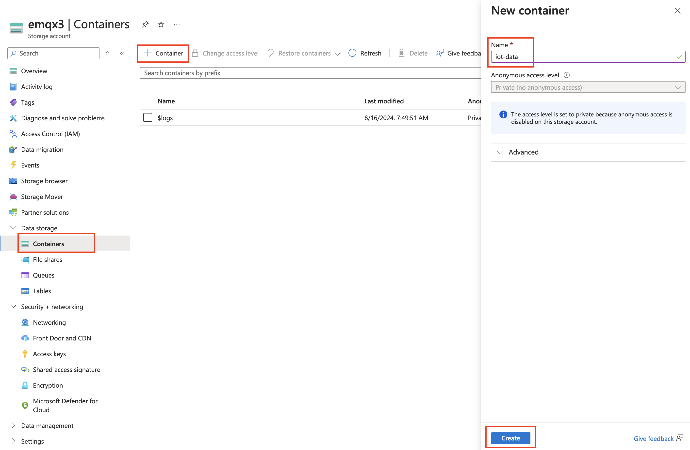

# 将 MQTT 数据导入 Azure Blob Storage

::: tip

Azure Blob Storage 数据集成是 EMQX 企业版功能。

:::

[Azure Blob Storage](https://azure.microsoft.com/en-us/products/storage/blobs/) 是微软基于云的对象存储解决方案，专为处理大量非结构化数据而设计。非结构化数据指的是不遵循特定数据模型或格式的数据类型，例如文本文件或二进制数据。EMQX 可以高效地将 MQTT 消息存储在 Blob Storage 容器中，为物联网 (IoT) 数据存储提供了一个多功能的解决方案。

本页面详细介绍了 EMQX 与 Azure Blob Storage 之间的数据集成，并提供了规则和 Sink 的创建指南。

## 工作原理

Azure Blob Storage 数据集成是 EMQX 中一个开箱即用的功能，可以轻松配置以应对复杂的业务发展。在典型的 IoT 应用中，EMQX 作为负责设备连接和消息传输的物联网平台，而 Azure Blob Storage 则作为数据存储平台，处理消息数据的存储。


EMQX 利用规则引擎和数据接收器将设备事件和数据转发到 Azure Blob Storage。应用程序可以从 Azure Blob Storage 中读取数据，用于进一步的数据应用。具体工作流程如下：

1. **设备连接到 EMQX**：IoT 设备通过 MQTT 协议成功连接后触发上线事件。该事件包括设备 ID、来源 IP 地址以及其他属性信息。
2. **设备消息发布和接收**：设备通过特定主题发布遥测和状态数据。EMQX 接收这些消息，并在规则引擎中进行匹配。
3. **规则引擎处理消息**：内置规则引擎根据主题匹配处理来自特定来源的消息和事件。它匹配相应的规则，并处理消息和事件，如数据格式转换、过滤特定信息或用上下文信息丰富消息。
4. **写入 Azure Blob Storage**：规则触发一个动作，将消息写入存储容器。使用 Azure Blob Storage Sink，用户可以从处理结果中提取数据并发送到 Blob Storage。根据消息内容和 Sink 中的配置，消息可以以文本或二进制格式存储，或将多行结构化数据汇总到单个 CSV 文件中。

事件和消息数据写入存储容器后，可以连接到 Azure Blob Storage 读取数据，以实现灵活的应用开发，例如：

- 数据存档：将设备消息作为对象存储在 Azure Blob Storage 中，以实现长期保存，满足合规要求或业务需求。
- 数据分析：将存储容器中的数据导入分析服务，如 Snowflake，用于预测性维护、设备效率评估等数据分析服务。

## 功能和优势

在 EMQX 中使用 Azure Blob Storage 数据集成可以为您的业务带来以下功能和优势：

- **消息转换**：消息在写入 Azure Blob Storage 之前，可以在 EMQX 规则中进行广泛的处理和转换，以便后续存储和使用。
- **灵活的数据操作**：通过 Azure Blob Storage Sink，可以方便地将特定字段的数据写入 Azure Blob Storage 容器中，支持动态设置容器和对象键，实现灵活的数据存储。
- **集成的业务流程**：Azure Blob Storage Sink 允许设备数据与 Azure Blob Storage 丰富的生态系统应用结合，实现更多业务场景，如数据分析和存档。
- **低成本的长期存储**：与数据库相比，Azure Blob Storage 提供了一种高可用性、可靠且成本效益高的对象存储服务，适合长期存储需求。

这些功能使您能够构建高效、可靠且可扩展的 IoT 应用，并从业务决策和优化中受益。

## 准备工作

本节介绍在 EMQX 中创建 Azure Blob Storage Sink 之前需要完成的准备工作。

### 前置准备

- 了解[规则](./rules.md)。
- 了解[数据集成](./data-bridges.md)。

### 在 Azure Storage 中创建容器

1. 要访问 Azure Storage，您需要一个 Azure 订阅。如果您还没有订阅，请在开始之前创建一个[免费账户](https://azure.microsoft.com/free/)。

2. 所有对 Azure Storage 的访问都通过存储账户进行。对于本指南，请使用 [Azure 门户](https://portal.azure.com/)、Azure PowerShell 或 Azure CLI 创建一个存储账户。有关创建存储账户的帮助，请参阅[创建存储账户](https://learn.microsoft.com/en-us/azure/storage/common/storage-account-create)。

3. 要在 Azure 门户中创建容器，请导航到您的新存储账户。在存储账户的左侧菜单中，滚动到数据存储部分，然后选择 **Container**。选择 + **Container** 按钮，使用 `iot-data` 作为新容器的名称，然后点击 **Create** 以创建容器。

   

4. 导航到存储账户中的 **Security + networking** -> **Access keys**，并复制 **Key**。您将需要此密钥来配置 EMQX 中的 Sink。

   

## 创建连接器

在添加 Azure Blob Storage 数据 Sink 之前，您需要创建相应的连接器。

1. 转到 Dashboard **集成** -> **连接器** 页面。
2. 点击右上角的**创建**按钮。
3. 选择 **Azure Blob Storage** 作为连接器类型，然后点击**下一步**。
4. 输入连接器名称，名称应为大小写字母和数字的组合。在这里，输入 `my-azure`。
5. 输入连接信息。
   - **账户名称**：您的存储账户名称
   - **访问密钥**：之前创建的存储账户的 Key
6. 在点击**创建**之前，您可以点击**测试连接**测试连接器是否能够连接到 Azure Storage。
7. 点击底部的**创建**按钮，完成连接器的创建。

现在您已完成连接器的创建，将继续创建规则和 Sink，以指定要写入 Azure Storage 服务的数据。

## 创建 Azure Blob Storage Sink 规则

本节演示如何在 EMQX 中创建规则，以处理来自源 MQTT 主题 `t/#` 的消息，并通过配置的 Sink 将处理结果写入 Azure Storage 中的 `iot-data` 容器。

1. 转到 Dashboard **集成** -> **规则**页面。

2. 点击右上角的**创建**按钮。

3. 输入规则 ID `my_rule`，并在 SQL 编辑器中输入以下规则 SQL：

   ```sql
   SELECT
     *
   FROM
       "t/#"
   ```

   ::: tip

   如果您初次使用 SQL，可以点击 **SQL 示例** 和**启用调试**来学习和测试规则 SQL 的结果。

   :::

4. 点击右侧的**添加动作**，从**动作类型**下拉列表中选择 `Azure Blob Storage`，将动作下拉菜单保持为默认的 `create action` 选项，或者从动作下拉菜单中选择先前创建的 Azure Blob Storage 动作。此处，创建一个新的 Sink 并将其添加到规则中。

5. 输入 Sink 的名称和描述。

6. 从连接器下拉列表中选择之前创建的 `my-azure` 连接器。您也可以点击下拉框旁的创建按钮，在弹出框中快速创建一个新连接器。所需的配置参数可以在[创建连接器](#创建连接器)中找到。

7. 设置**容器**，输入 `iot-data`。

8. 设置 **Blob**，输入 `iot-data-blob`。

9. 选择 **上传方式**。两种方式的区别如下：

   - **直接上传**：每次触发规则时，数据会根据预设的对象键和值直接上传到 Azure Storage。这种方式适合存储二进制或大型文本数据，但可能会生成大量文件。
   - **聚合上传**：此方式将多个规则触发结果打包到一个文件（如 CSV 文件）中，并上传到 Azure Storage，适合存储结构化数据。它可以减少文件数量并提高写入效率。

   每种方式的配置参数不同。请根据选择的方式进行配置：

   :::: tabs type

   ::: tab 直接上传

   直接上传需要配置以下字段：

   - **Blob 名称**：定义要上传到容器的对象位置。支持使用 `${var}` 格式的占位符，并可以使用 `/` 来指定存储目录。还需要设置对象的后缀以便管理和区分。在此处，输入 `msgs/${clientid}_${timestamp}.json`，其中 `${clientid}` 是客户端 ID，`${timestamp}` 是消息的时间戳。这确保每个设备的消息被写入不同的对象中。
   - **对象内容**：默认是包含所有字段的 JSON 文本格式，支持使用 `${var}` 格式的占位符。在此处，输入 `${payload}`，以将消息体作为对象内容。对象的存储格式取决于消息体的格式，支持压缩文件、图像或其他二进制格式。

   :::

   ::: tab 聚合上传

   聚合上传需要配置以下参数：

   - **Blob 名称**：用于指定对象的存储路径。可以使用以下变量：

     - **`${action}`**：操作名称（必需）。
     - **`${node}`**：执行上传的 EMQX 节点名称（必需）。
     - **`${datetime.{format}}`**：聚合的开始日期和时间，格式由 `{format}`字符串指定（必需）：
       - **`${datetime.rfc3339utc}`**：UTC 格式的 RFC3339 日期和时间。
       - **`${datetime.rfc3339}`**：本地时区格式的 RFC3339 日期和时间。
       - **`${datetime.unix}`**：Unix 时间戳。
     - **`${datetime_until.{format}}`**：聚合的结束日期和时间，格式选项同上。
     - **`${sequence}`**：同一时间间隔内聚合上传的序列号（必需）。

     请注意，如果模板中未使用所有标记为必需的占位符，这些占位符将自动添加到 Blob 名称作为路径后缀，以避免重复。所有其他占位符被视为无效。

   - **增强类型**：目前仅支持 CSV。数据将以逗号分隔的 CSV 格式写入 Azure Storage。

   - **列排序**：通过下拉选择调整规则结果列的顺序。生成的 CSV 文件将首先按所选列排序，未选择的列按字母顺序排列在所选列之后。

   - **最大记录数**：当达到最大记录数时，将完成单个文件的聚合并上传，重置时间间隔。

   - **时间间隔**：当达到时间间隔时，即使未达到最大记录数，也将完成单个文件的聚合并上传，重置最大记录数。

   :::

   ::::

10. 展开**高级设置**，根据需要配置高级设置选项（可选）。有关详细信息，请参阅[高级设置](#advanced-settings)。

11. 其余设置使用默认值。点击**创建**按钮完成数据接收器的创建。创建成功后，页面将返回到规则创建，新的数据接收器将被添加到规则操作中。

12. 返回到规则创建页面，点击**创建**按钮完成整个规则创建过程。

现在您已成功创建规则。您可以在**规则**页面上看到新创建的规则，以及在**动作 (Sink)** 选项卡上的新 Azure Blob Storage Sink。

您还可以点击**集成** -> **Flow 设计器**查看拓扑。拓扑图形化地展示了主题 `t/#` 下的消息如何在被规则 `my_rule` 解析后写入 Azure Storage 容器中。

## 测试规则

本节展示如何测试配置了直接上传方式的规则。

使用 MQTTX 将消息发布到主题 `t/1`：

```bash
mqttx pub -i emqx_c -t t/1 -m '{ "msg": "Hello Azure" }'
```

发送几条消息后，访问 Azure 门户查看 `iot-data` 容器中上传的对象。

登录 [Azure 门户](https://portal.azure.com/)，导航到存储账户，并打开 `iot-data` 容器。您应该在容器中看到上传的对象。

## 高级设置

本节深入介绍 Azure Blob Storage Sink 可用的高级配置选项。在 Dashboard 中配置数据接收器时，您可以展开**高级设置**以根据您的具体需求调整以下参数。

| 字段名称             | 描述                                                         | 默认值 |
| -------------------- | ------------------------------------------------------------ | ------ |
| **缓存池大小**       | 指定缓冲工作进程的数量，这些工作进程被分配来管理 EMQX 和 Azure Storage 之间的数据流。这些工作进程在将数据发送到目标服务之前暂时存储和处理数据，这对于优化性能和确保平稳的数据传输至关重要。 | `16`   |
| **请求超期 (TTL)**   | "请求生存时间"（TTL）配置设置指定请求进入缓冲区后被认为有效的最长时间（以秒为单位）。此计时器从请求进入缓冲区的那一刻开始计时。如果请求在缓冲区中停留的时间超过此 TTL 设置，或者请求已发送但未及时收到来自 Azure Storage 的响应或确认，则该请求将被视为已过期。 |        |
| **健康检查间隔**     | 指定数据接收器与 Azure Storage 连接进行自动健康检查的时间间隔（以秒为单位）。 | `15`   |
| **缓冲队列最大长度** | 指定 Azure Blob Storage 数据接收器中每个缓冲工作进程可以缓冲的最大字节数。缓冲工作进程在将数据发送到 Azure Storage 之前临时存储数据，充当中介角色以更高效地处理数据流。根据系统性能和数据传输需求调整此值。 | `256`  |
| **最大批量请求大小** | 指定在单次传输操作中从 EMQX 传输到 Azure Storage 的数据批次的最大大小。通过调整批次大小，可以微调 EMQX 和 Azure Storage 之间的数据传输效率和性能。<br />如果将“批量大小”设置为“1”，则数据记录会单独发送，不会被分组到批次中。 | `1`    |
| **请求模式**         | 允许您在 `同步` 或 `异步` 请求模式之间进行选择，以根据不同需求优化消息传输。在异步模式下，写入 Azure Storage 不会阻塞 MQTT 消息发布过程。然而，这可能导致客户端在消息到达 Azure Storage 之前收到消息。 | `异步` |
| **飞行窗口**         | “飞行队列请求”是指已启动但尚未收到响应或确认的请求。此设置控制数据接收器与 Azure Storage 通信期间可以同时存在的飞行队列请求的最大数量。<br/>当**请求模式**设置为 `异步` 时，“请求飞行队列窗口”参数变得尤为重要。如果严格按顺序处理来自同一 MQTT 客户端的消息至关重要，那么此值应设置为 `1`。 | `100`  |