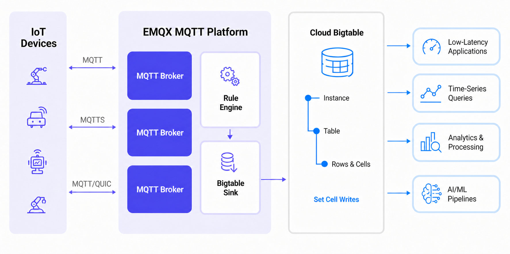

# 将 MQTT 数据导入 Bigtable

[Cloud Bigtable](https://cloud.google.com/bigtable?hl=zh-cn) 是 Google Cloud 提供的全托管宽列 NoSQL 数据库服务，适用于大规模、低延迟的工作负载，例如时序数据、遥测数据存储、事件记录以及高吞吐物联网数据写入场景。

EMQX 支持通过规则引擎和 Bigtable Sink 与 Bigtable 集成。您可以使用规则 SQL 处理 MQTT 消息，将规则输出字段映射为 Bigtable 的行键和单元格变更，并将处理后的数据实时写入 Bigtable 表。

本页面介绍 Bigtable 数据集成的工作原理，并提供在 EMQX Dashboard 中创建和验证该集成的操作流程。

## 工作原理

Bigtable 数据集成是 EMQX 6.3 提供的开箱即用功能，可帮助用户将 MQTT 数据流写入 Google Cloud，并将设备遥测数据或事件数据存储到 Bigtable 中，用于后续查询、分析或下游处理。



EMQX 通过规则引擎和 Sink 将 MQTT 数据转发至 Bigtable，完整流程如下：

1. **物联网设备发布消息**：设备向 MQTT 主题发布遥测、状态或事件数据。
2. **规则引擎处理消息**：规则引擎按主题匹配 MQTT 消息，并通过 SQL 提取或转换 Bigtable 写入所需的字段。
3. **写入 Bigtable**：Bigtable Sink 根据配置的行键和 `set_cell` 变更字段，将规则输出的每条记录作为行变更写入 Bigtable 表。下游应用和服务随后可以查询或处理这些数据，用于低延迟应用、时序查询、分析处理或 AI/ML 流程。

## 特性与优势

将 EMQX 与 Bigtable 集成可提供以下优势：

- **高吞吐 IoT 数据写入**：将 MQTT 消息写入 Bigtable，适用于大规模遥测和事件数据场景。
- **灵活字段映射**：通过规则 SQL 显式选择字段并设置别名，用作 Bigtable 的行键、列族、列限定符、时间戳和单元格值。
- **批量与异步写入**：支持通过批量模式和异步请求模式提升写入吞吐量，并降低对 MQTT 消息发布流程的影响。
- **集成 Google Cloud 生态**：将 MQTT 数据存储到 Bigtable 后，可结合其他 Google Cloud 服务进行分析、处理或应用开发。

## 准备工作

本节介绍创建 Bigtable 数据集成前需要完成的准备工作。

### 前置准备

- 了解 EMQX 数据集成[规则](./rules.md)
- 了解[数据集成](./data-bridges.md)
- 已启用 Bigtable 的 Google Cloud 项目
- Bigtable 实例、表，以及至少一个列族
- 已准备您计划使用的认证方式所需的信息：
  - **服务账号 JSON**：服务账号密钥 JSON 文件。
  - **工作负载身份联合 (WIF)**：工作负载身份池、提供商、GCP 项目 ID、项目编号、服务账号邮箱，以及外部身份提供商的 OAuth 2.0 客户端凭证。
  - **附加服务账号**：EMQX 运行在满足[附加服务账号前提条件](#附加服务账号前提条件)的 GCP Compute Engine 实例上。

### 创建服务账号凭证

如需使用**服务账号 JSON**认证方式，您需要在 Google Cloud 中创建一个服务账号，并生成 JSON 格式的密钥。

1. 在您的 GCP 账户中创建一个[服务账号](https://developers.google.com/identity/protocols/oauth2/service-account#creatinganaccount)。
2. 授予该服务账号写入 Bigtable 实例和表所需的权限。例如，分配允许对目标表执行数据读写操作的 Bigtable 角色。
3. 点击已创建服务账号的电子邮件地址。
4. 点击**密钥**选项卡，在**添加密钥**下拉列表中选择**创建新密钥**，并以 JSON 格式下载密钥。

   ::: tip

   请妥善保存服务账号密钥。后续创建 Bigtable 连接器时需要使用该密钥。

   :::

### 配置工作负载身份联合

工作负载身份联合（WIF）允许 EMQX 无需持有长期有效的服务账号密钥文件即可访问 GCP 资源。EMQX 会将从外部身份提供商（如 Microsoft Azure）获取的 token 通过 GCP Security Token Service 交换为临时 GCP token，再使用该 token 模拟指定的 GCP 服务账号。Token 续期由 EMQX 自动处理。

如需使用 WIF，请在创建连接器前在 GCP 项目中完成以下配置：

1. 在 Google Cloud 控制台中，进入 **IAM 和管理** -> **工作负载身份联合**，创建工作负载身份池，并记录**池 ID** 和**项目编号**。
2. 向该池添加提供商并记录**提供商 ID**。如使用基于 OIDC 的认证，请从外部身份提供商获取 OAuth 2.0 客户端凭证，包括客户端 ID、客户端密钥、令牌端点 URI 和请求范围。
3. 授予工作负载身份池权限，使其能够模拟具有 Bigtable 实例和表访问权限的 GCP 服务账号，并记录服务账号邮箱。
4. 记录 Bigtable 资源所在项目的 **GCP 项目 ID**。

::: tip

详细配置步骤请参阅[配置工作负载身份联合](https://cloud.google.com/iam/docs/workload-identity-federation-with-other-providers?hl=zh-cn)。

:::

示例：Microsoft Azure（Entra ID）

在 [Microsoft Entra ID](https://portal.azure.com/) 中注册一个公开 API 的应用程序，并为其创建客户端密钥。配置连接器时使用以下值：

| 连接器字段 | 值 |
| --- | --- |
| **OAuth Token 端点 URI** | `https://login.microsoftonline.com/<租户 ID>/oauth2/v2.0/token` |
| **OAuth 客户端 ID** | 应用程序（客户端）ID，格式为 `api://<应用程序 ID>` |
| **OAuth 客户端密钥** | 为该应用程序生成的客户端密钥 |
| **OAuth 请求范围** | `api://<应用程序 ID>/.default` |

::: note

**OAuth 请求范围**必须与应用程序的受众（`aud`）完全匹配，否则与 GCP STS 的令牌交换将会失败。向 WIF 池授予服务账号访问权限时，请使用**对象 ID**（而非应用程序 ID）作为主体标识符（Subject）。对象 ID 显示在 Azure 门户**企业应用程序**下对应应用的概述页面中。

:::

### 附加服务账号前提条件

要使用**附加服务账号**认证，EMQX 必须运行在已附加服务账号的 GCP Compute Engine 实例上。确保该实例的 OAuth 访问范围允许访问 Bigtable。Google 建议使用 `cloud-platform` 访问范围（`https://www.googleapis.com/auth/cloud-platform`），并通过 IAM 角色限制服务账号的权限。该服务账号必须具有访问目标 Bigtable 实例和表的权限。详情参见 Google Cloud 文档中的[服务账号](https://cloud.google.com/compute/docs/access/service-accounts?hl=zh-cn)。

目标 Bigtable 实例和表必须位于该 Compute Engine 实例所属的 GCP 项目中。在 EMQX 集群中，每个节点都必须满足上述要求，并运行在该项目的 Compute Engine 实例上。

连接器启动时，EMQX 会自动从实例元数据端点获取 GCP 项目 ID 和访问令牌，无需上传服务账号密钥文件。

### 在 GCP 中创建和管理 Bigtable 资源

在 EMQX 中配置 Bigtable 数据集成前，请先在 Google Cloud 中创建目标 Bigtable 资源。

1. 在 Google Cloud 控制台中，进入 **Bigtable** 页面。
2. 创建或选择一个 Bigtable 实例。创建实例时，**实例名称**仅用于在 Google Cloud 控制台中显示，可填写易于识别的名称，例如 `EMQX MQTT Messages`；**实例 ID** 是后续在 EMQX 中配置的值，建议使用简单的唯一标识，例如 `emqxinst`。
3. 创建一张表，并记录表 ID，例如 `mqtt_messages`。
4. 在表中创建至少一个列族，例如 `cf`。

   ::: tip

   EMQX 中使用的是**实例 ID** 和**表 ID**，不是 Google Cloud 控制台中的实例显示名称，也不是 `projects/<project-id>/instances/<instance-id>` 这类完整资源名称。

   :::

## 创建 Bigtable 连接器

在添加 Bigtable Sink 动作前，您需要先创建 Bigtable 连接器，以建立 EMQX 与 Bigtable 之间的连接。

1. 进入 EMQX Dashboard，点击**集成** -> **连接器**。
2. 点击页面右上角的**创建**按钮，选择 **Bigtable**，然后点击**下一步**。
3. 输入连接器名称和描述，例如 `my_bigtable`。该名称用于将 Bigtable Sink 与连接器关联，且在集群内必须唯一。
4. 配置认证选项：
   - **认证**：选择 EMQX 连接 GCP 时使用的认证方式。
     - **服务账号 JSON**：上传您在[创建服务账号凭证](#创建服务账号凭证)中导出的 JSON 格式服务账号密钥。您可以点击**选择文件**上传 JSON 文件。
     - **工作负载身份联合 (WIF)**：填写以下字段。此方式无需服务账号 JSON 文件。前置条件请参见[配置工作负载身份联合](#配置工作负载身份联合)。
       - **GCP 项目 ID**：连接器所访问资源的 GCP 项目 ID。
       - **GCP 项目编号**：连接器所访问资源的 GCP 项目编号。
       - **服务账号邮箱**：需要模拟的服务账号电子邮件地址。
       - **工作负载身份池 ID**：WIF 令牌交换中使用的工作负载身份池 ID。
       - **工作负载身份提供商 ID**：WIF 令牌交换中使用的工作负载身份提供商 ID。
       - **凭证类型**：外部身份提供商使用的凭证类型，目前支持 OIDC 客户端凭证，选择后填写以下字段：
         - **OAuth 客户端 ID**：用于向 OAuth 服务器请求令牌的客户端 ID。
         - **OAuth 客户端密钥**：用于向 OAuth 服务器请求令牌的客户端密钥。
         - **OAuth Token 端点 URI**：OIDC 提供商的 OAuth Token 端点 URI。
         - **OAuth 请求范围**：向 OAuth 服务器请求访问令牌时指定的 `scope`（如提供商要求则需填写）。
         - **OAuth 请求受众 (Audience)**：向 OAuth 服务器请求访问令牌时指定的 `audience`（如提供商要求则需填写）。
     - **附加服务账号**：无需填写额外字段。EMQX 会自动从实例元数据端点获取 GCP 项目 ID 和访问令牌。前提条件请参见[附加服务账号前提条件](#附加服务账号前提条件)。
   - **启用 TLS**：如果您的部署需要 TLS，可启用该选项。
   - **高级设置**：展开该区域可配置高级连接选项。
5. 在点击**创建**之前，您可以点击**测试连接**，验证 EMQX 是否能够连接到 Bigtable。
6. 点击**创建**按钮完成连接器设置。此时会出现**创建成功**对话框，询问是否立即创建规则。点击**创建规则**可直接进入规则创建流程，并自动预选该连接器；点击**返回连接器列表**可返回列表，稍后再创建规则。

## 创建 Bigtable Sink 规则

本节演示如何创建一条规则，将 MQTT 消息写入 Bigtable。

1. 如果您在上一步点击了**创建规则**，系统会自动打开**添加动作**面板，并将**动作类型**设置为 `Bigtable`，同时预选刚创建的连接器。此时可跳至第 5 步先配置动作；动作创建完成后，返回规则页面补充规则 ID 和 SQL 设置。否则，请在 Dashboard 中进入**集成** -> **规则**页面，并点击右上角的**创建**按钮。
2. 在规则 ID 中输入 `my_rule`。
3. 在 **SQL 编辑器**中输入规则 SQL。Bigtable Sink 会根据 Sink 中配置的字段名，从规则输出中查找对应值。因此，SQL 必须显式选择并设置 Bigtable 变更所需的所有字段别名。

   示例：

   ```sql
   SELECT
     clientid AS rk,
     'cf' AS fn,
     '' AS cq,
     payload AS v,
     publish_received_at * 1000 AS tm
   FROM
     "t/bigtable"
   ```

   在该示例中：

   - `rk` 用作 Bigtable 行键。
   - `fn` 用作列族名称。
   - `cq` 用作列限定符。
   - `tm` 用作以微秒为单位的时间戳。
   - `v` 用作单元格值。

   ::: tip

   Bigtable Sink 中的字段是用于引用规则输出字段的键名，不是模板表达式。如果规则 SQL 未选择某个必需字段，Sink 将无法为该消息构造 Bigtable 变更。

   :::

4. 点击**添加动作**。在**添加动作**面板中，从**动作类型**下拉列表中选择 `Bigtable`。
5. 保持**动作**为`创建动作`，或选择一个已有 Bigtable Sink。如果您是从连接器创建成功对话框进入规则创建流程，请确认**动作类型**已设置为 `Bigtable`，且连接器已自动预选。
6. 在**名称**中输入 Sink 名称。您也可以在**描述**中输入说明。
7. 在**连接器**中选择在[创建 Bigtable 连接器](#创建-bigtable-连接器)中创建的 Bigtable 连接器。如果连接器尚未创建，也可以点击加号图标从当前面板新建连接器。
8. 配置 Bigtable 动作参数：

   | 字段 | 说明 | 示例 |
   | --- | --- | --- |
   | **实例 ID** | Bigtable 实例标识符。请填写 `emqxinst` 这样的简单 ID，而不是 `projects/.../instances/...` 这样的完整标识符。 | `emqxinst` |
   | **表 ID** | Bigtable 表标识符。请填写 `mqtt_messages` 这样的简单 ID，而不是 `projects/.../instances/.../tables/...` 这样的完整标识符。 | `mqtt_messages` |
   | **行键** | 包含消息行键的字段名。 | `rk` |
   | **变更列表** | 对单条接收消息执行的单元格变更列表。点击**添加**可添加变更。 | - |
   | **变更类型** | 变更操作类型。当前集成支持 Set Cell 变更。 | `Set Cell` |
   | **列族** | 包含变更列族的字段名。 | `fn` |
   | **列限定符** | 包含变更列限定符的字段名。 | `cq` |
   | **时间戳（微秒）** | 包含变更时间戳（微秒）的字段名。 | `tm` |
   | **值** | 包含变更值的字段名。 | `v` |

9. 如需提升消息投递失败时的可靠性，可配置**备选动作**。参见[备选动作](./data-bridges.md#备选动作)。
10. 根据需要配置**高级设置**。参见[高级设置](#高级设置)。
11. 在点击**创建**之前，您可以点击**测试连接**，验证 Sink 是否能够连接到 Bigtable。
12. 点击**创建**完成 Sink 配置。
13. 返回**创建规则**页面，点击**创建**创建规则。

## 测试规则

1. 使用 MQTTX 向主题 `t/bigtable` 发布消息：

   ```bash
   mqttx pub -i emqx_c -t t/bigtable -m '{ "msg": "hello Bigtable" }'
   ```

2. 检查规则和 Sink 指标，命中数和成功数应增加。
3. 在 Google Cloud 中查询目标 Bigtable 表，确认已写入一行数据：
   - 行键：MQTT 客户端 ID，例如 `emqx_c`
   - 列族：`cf`
   - 列限定符：空字符串
   - 单元格值：MQTT 消息负载

## 高级设置

本节介绍 Bigtable 连接器和 Sink 的常用高级设置。

### 连接器高级设置

| 字段 | 说明 | 默认值 |
| --- | --- | --- |
| **连接池大小** | 连接到 Bigtable 的连接池大小。 | `8` |
| **连接超时** | 建立 Bigtable 连接的超时时间。 | `5s` |
| **启动超时时间** | 启动连接器的超时时间。 | `5s` |
| **健康检查间隔** | Bigtable 连接健康检查间隔。 | `15s` |
| **健康检查超时** | 连接器健康检查超时时间。 | `60s` |

### Sink 高级设置

| 字段 | 说明 | 默认值 |
| --- | --- | --- |
| **缓存池大小** | 用于处理并发送数据到 Bigtable 的缓存工作进程数量。 | `16` |
| **调度策略** | 将请求分发到缓存工作进程的策略。默认策略按 MQTT 客户端 ID 分发请求。 | `按客户端 ID` |
| **请求超期** | 请求进入缓存区后的最长有效时间。如果请求在发送或收到确认前过期，则视为已过期。 | `45s` |
| **健康检查间隔** | Bigtable 连接健康检查间隔。 | `15s` |
| **健康检查间隔抖动** | 添加到健康检查间隔的随机抖动时间。 | `0ms` |
| **健康检查超时** | 连接器健康检查超时时间。 | `60s` |
| **缓存队列最大长度** | 每个缓存工作进程的最大缓存队列大小。 | `256MB` |
| **最大批量请求大小** | 单次批量写入的最大记录数。设置为 `1` 可禁用批量写入。 | `1000` |
| **请求模式** | 请求模式。异步模式下，写入 Bigtable 不会阻塞 MQTT 消息发布流程。 | `异步` |
| **请求飞行队列窗口** | 异步模式下允许的最大飞行请求数。如需严格保证同一 MQTT 客户端消息的处理顺序，请设置为 `1`。 | `100` |

对于高吞吐部署，请结合预期的集群负载调整**连接池大小**、**缓存池大小**、**调度策略**、**最大批量请求大小**和**请求飞行队列窗口**。例如，如果目标负载约为集群总计每 2 分钟 11,000,000 条消息、5,000 到 10,000 个 MQTT 连接，请在生产使用前通过接近实际场景的基准测试验证配置。
