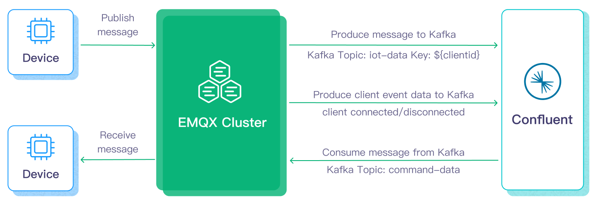
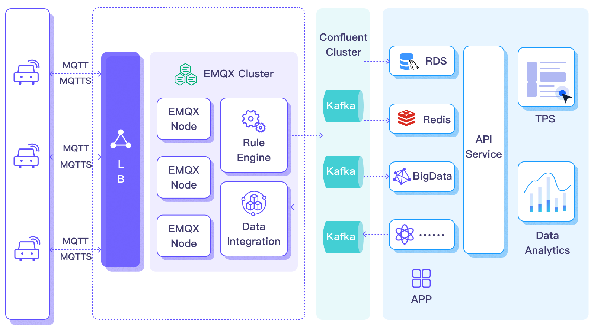
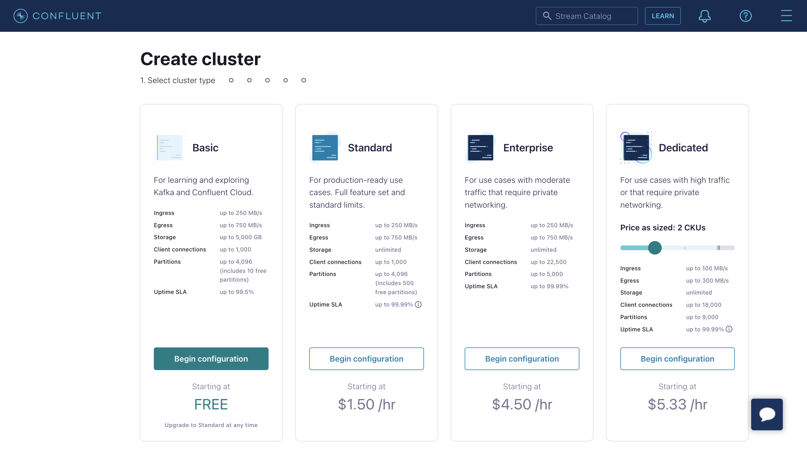
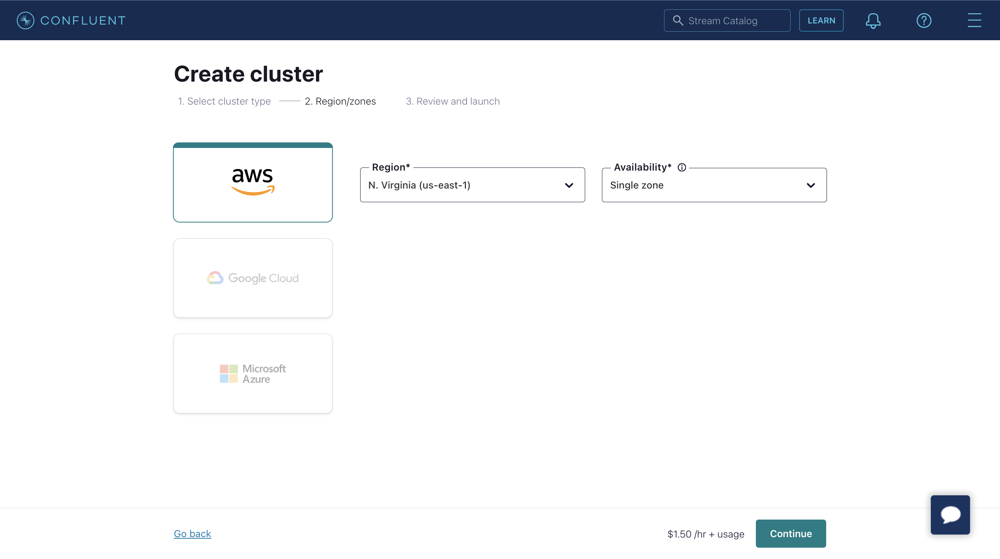
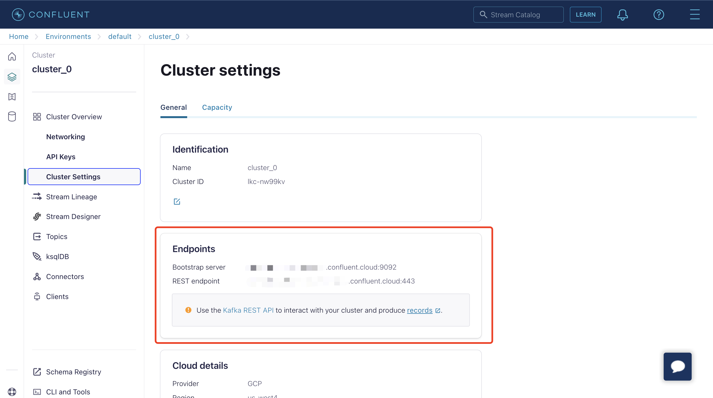

# 将 MQTT 数据传输到 Confluent



:::tip

Confluent Sink 是 EMQX 企业版的功能。EMQX 企业版可以为您带来更全面的关键业务场景覆盖、更丰富的数据集成支持，更高的生产级可靠性保证以及 24/7 的全球技术支持，欢迎[免费试用](https://www.emqx.com/zh/try?product=enterprise)。

:::



[Confluent Cloud](https://www.confluent.io/) 基于 Apache Kafka，是一项弹性、可扩展、并完全托管的流式数据服务。EMQX 支持通过规则引擎与 Sink 实现与 Confluent 的数据集成，使您能够轻松将 MQTT 数据流式传输到 Confluent，实现数据的实时处理、存储和分析。



本页面主要为您介绍了 Confluent 集成的特性和优势，并指导您如何配置 Confluent Cloud 以及如何在 EMQX 中创建 Confluent 消费者 Sink。

## 工作原理

Confluent 数据集成是 EMQX 的开箱即用功能，能够在基于 MQTT 的物联网数据和 Confluent 强大的数据处理能力之间架起桥梁。通过内置的[规则引擎](./rules.md)组件，集成简化了两个平台之间的数据流和处理过程，无需复杂编码。

下图展示了 EMQX 与 Confluent 的数据集成在汽车物联网中的典型架构。



将数据流入或流出 Confluent 涉及 Confluent Sink（向 Confluent 发送消息）和 Confluent Source（从 Confluent 接收消息）。假如您创建 Confluent Sink，其工作流程如下：

1. **消息发布和接收**：连接车辆的物联网设备通过 MQTT 协议成功连接到 EMQX，并通过 MQTT 定期发布包含状态数据的消息。当 EMQX 收到这些消息时，它启动其规则引擎内的匹配过程。
2. **消息数据处理**：通过内置规则引擎与消息服务器的协同工作，这些 MQTT 消息可以根据主题匹配规则进行处理。当消息到达并通过规则引擎时，规则引擎将评估针对该消息事先定义好的处理规则。如果任何规则指定消息载荷转换，则应用这些转换，例如转换数据格式、过滤特定信息或使用额外上下文丰富载荷。
3. **桥接到 Confluent**：规则引擎中定义的规则触发将消息转发到 Confluent 的动作。使用 Confluent Sink 功能，MQTT 主题被映射到预定义的 Confluent 中的 Kafka 主题，所有处理过的消息和数据被写入主题中。

车辆数据被输入到 Confluent 后，您可以灵活地访问和利用这些数据：

- 您的服务可以直接与 Confluent 集成，从特定主题消费实时数据流，实现定制化的业务处理。
- 利用 Kafka Streams 进行流处理，并通过在内存中聚合和相关联车辆状态进行实时监控。
- 通过使用 Confluent Stream Designer 组件，您可以选择各种连接器将数据输出到外部系统，如 MySQL、ElasticSearch，以进行存储。

## 特性与优势

与 Confluent 的数据集成为您的业务带来以下特性和优势：

- **大规模消息传输的可靠性**：EMQX 和 Confluent Cloud 均采用了高可靠的集群机制，可以建立稳定可靠的消息传输通道，确保大规模物联网设备消息的零丢失。两者都可以通过添加节点实现水平扩展、动态调整资源来应对突发的大规模消息，保证消息传输的可用性。
- **强大的数据处理能力**：EMQX 的本地规则引擎与 Confluent Cloud 都提供了可靠的流式数据处理能力，作用在物联网数据从设备到应用的不同阶段，可以根据场景选择性地进行实时的数据过滤、格式转换、聚合分析等处理，实现更复杂的物联网消息处理流程，满足数据分析应用的需求。
- **强大的集成能力**：通过 Confluent Cloud 提供的各种 Connector，可以帮助 EMQX 轻松集成其他数据库、数据仓库、数据流处理系统等，构建完整的物联网数据流程，实现数据的敏捷分析应用。
- **高吞吐量场景下的处理能力**：支持同步和异步两种写入模式，您可以区分实时优先和性能优先的数据写入策略，并根据不同场景实现延迟和吞吐量之间的灵活平衡。
- **有效的主题映射**：通过桥接配置，可以将众多 IoT 业务主题映射到 Kakfa 主题。EMQX 支持 MQTT 用户属性映射到 Kafka Header，并采用多种灵活的主题映射方式，包括一对一、一对多、多对多，还支持 MQTT 主题过滤器（通配符）。

这些特性增强了集成能力和灵活性，有助于您建立有效和稳健的物联网平台架构。您日益增长的物联网数据可以在稳定的网络连接下传输，并且可以进一步有效地存储和管理。

## 准备工作

本节描述了在 EMQX Dashboard 上配置 Confluent 集成需要完成的准备工作。

### 前置准备

- 了解[规则引擎](./rules.md)
- 了解 [Sink](./data-bridges.md)

### 配置 Confluent Cloud

在创建 Confluent 数据集成之前，您必须在 Confluent Cloud 控制台中创建 Confluent 集群，并使用 Confluent Cloud CLI 创建主题和 API 密钥。

#### 创建集群

1. 登录到 Confluent Cloud 控制台并创建一个集群。选择 Standard 集群作为示例，然后点击 **Begin configuration**。



2. 选择 Region/zones。确保部署区域与 Confluent Cloud 的区域匹配。然后点击 **Continue**。



3. 输入您的集群名称，然后点击 **Launch cluster**。


#### 使用 Confluent Cloud CLI 创建主题和 API 密钥

现在，您已在 Confluent Cloud 中运行集群，并且可以在 **Cluster Overview** -> **Cluster Settings** 页面中获取 **Bootstrap server** URL。



您可以使用 Confluent Cloud CLI 来管理集群。以下是使用 Confluent Cloud CLI 的基本命令。

#### 安装 Confluent Cloud CLI

```bash
curl -sL --http1.1 https://cnfl.io/cli | sh -s -- -b /usr/local/bin
```

如果您已经安装了，您可以使用以下命令来进行更新：

```bash
confluent update
```

#### 登录到您的帐户

```bash
confluent login --save
```

#### 选择环境

```bash
# list env
confluent environment list
# use env
confluent environment use <environment_id>
```

#### 选择集群

```bash
# list kafka cluster
confluent kafka cluster list
# use kafka
confluent kafka cluster use <kafka_cluster_id>
```

#### 使用 API 密钥和 Secret

如果您想使用现有的 API 密钥，请使用以下命令将其添加到 CLI：

```bash
confluent api-key store --resource <kafka_cluster_id>
Key: <API_KEY>
Secret: <API_SECRET>
```

如果您没有 API 密钥和 Secret，可以使用以下命令创建：

```bash
$ confluent api-key create --resource <kafka_cluster_id>

It may take a couple of minutes for the API key to be ready.
Save the API key and secret. The secret is not retrievable later.
+------------+------------------------------------------------------------------+
| API Key    | YZ6R7YO6Q2WK35X7                                                 |
| API Secret | ****************************************                         |
+------------+------------------------------------------------------------------+
```

将它们添加到 CLI 后，您可以通过执行以下命令使用 API 密钥和 Secret：

```bash
confluent api-key use <API_Key> --resource <kafka_cluster_id>
```

#### 创建主题

您可以使用以下命令创建一个名为 `testtopic-in` 的主题：

```bash
confluent kafka topic create testtopic-in
```

您可以使用以下命令检查主题列表：

```bash
confluent kafka topic list
```

#### 向主题生成消息

您可以使用以下命令创建生产者。启动生产者后，输入一条消息并按 Enter 键。消息将被生成到相应的主题中。

```bash
confluent kafka topic produce testtopic-in
```

#### 从主题消费消息

您可以使用以下命令创建消费者。它将输出相应主题中的所有消息。

```bash
confluent kafka topic consume -b testtopic-in
```

## 创建连接器

在添加 Confluent Sink 动作前，您需要创建 Confluent 生产者连接器，以便 EMQX 与 Confluent Cloud 建立连接。

1. 进入 EMQX Dashboard，并点击 **集成** -> **连接器**。
2. 点击页面右上角的**创建**，在连接器选择页面，选择 **Confluent 生产者**，点击下一步。
3. 输入名称与描述，例如 `my-confluent`，名称用于 Confluent Sink 关联选择连接器，要求在集群中唯一。
4. 配置连接到 Confluent Cloud 所需的参数：
   - 主机列表：对应 Confluent 集群设置页面中的 Endpoints 信息。
   - 用户名与密码：填入您之前用 Confluent Cloud CLI 创建的 API 密钥和 Secret。
   - 将其他选项保留为默认值，或根据您的业务需求进行配置。
5. 点击**创建**按钮完成连接器的创建。

创建成功后，连接器将自动连接到 Confluent Cloud。接下来，我们将基于此连接器创建一条规则，将数据转发到连接器所配置的 Confluent 集群中。

## 创建 Confluent Sink 规则

本节演示了如何在 EMQX 中创建规则，以处理来自源 MQTT 主题 `t/#` 的消息，并通过配置的 Confluent Sink 发送处理结果以产生数据到 Confluent 的 `testtopic-in` 主题。

1. 进入 EMQX Dashboard，并点击 **集成** -> **规则**。

2. 点击页面右上角的**创建**。

3. 输入一个规则 ID，例如 `my_rule`。

4. 如果您想将主题 `t/#` 的 MQTT 消息转发到 Confluent，可以在 **SQL 编辑器** 中输入以下语句。

   注意：如果您想指定自己的 SQL 语法，请确保在 `SELECT` 部分包含了 Sink 所需的所有字段。

   ```sql
   SELECT
     *
   FROM
     "t/#"
   ```

   注意：如果您是初学者，可以点击 **SQL 示例** 和 **启用测试** 学习和测试 SQL 规则。

5. 点击 + **添加动作** 按钮来定义规则触发的动作。从**动作类型**下拉列表中选择 **Confluent 生产者**，保持**动作**下拉框为默认的”创建动作“选项，您也可以从**动作**下拉框中选择一个之前已经创建好的 Confluent 生产者动作。此处我们创建一个全新的规则并添加到规则中

6. 在下方的表单中输入 Sink 的名称与描述。

7. 在**连接器**下拉框中选择刚刚创建的 `my-confluent` 连接器。您也可以点击下拉框旁边的 `+` 按钮，在弹出框中快捷创建新的连接器，所需的配置参数按照参照[创建连接器](#创建连接器)。

8. 配置 Sink 的数据发送方式，包括：

   - **Kafka 主题名称**：输入 `testtopic-in`。注意：此处不支持变量。

   - **Kafka Headers**：输入与 Kafka 消息相关的元数据或上下文信息（可选）。占位符的值必须是一个对象。您可以从 **Kafka Headers 值编码类型** 下拉列表中选择 Header 的值编码类型。您还可以通过点击 **添加** 来添加更多键值对。

   - **消息的键**：Kafka 消息键。在此输入一个字符串，可以是纯字符串或包含占位符 (${var}) 的字符串。

   - **消息的值**：Kafka 消息值。在此输入一个字符串，可以是纯字符串或包含占位符 (${var}) 的字符串。

   - **分区选择策略**：选择生产者向 Kafka 分区分发消息的方式。
   - **压缩**：指定是否使用压缩算法压缩/解压 Kafka 消息中的记录。

9. 高级设置（可选）：请参阅 [高级配置](#高级配置)。

10. 点击 **创建** 按钮完成 Sink 的创建，创建成功后页面将回到**创建规则**，新的 Sink 将添加到规则动作中。
11. 点击 **创建** 按钮完成整个规则创建。

现在您已成功创建了规则，你可以点击**集成** -> **规则**页面看到新建的规则，同时在**动作(Sink)** 标签页看到新建的 Confluent 生产者 Sink。

您也可以点击 **集成** -> **Flow 设计器** 查看拓扑，通过拓扑可以直观的看到，主题 `t/#` 下的消息在经过规则 `my_rule` 解析后被发送并保存到 Confluent。

### 测试 Confluent 生产者规则

为了测试 Confluent 生产者规则是否按照您的预期工作，您可以使用 [MQTTX](https://mqttx.app/zh) 来模拟客户端向 EMQX 发布 MQTT 消息。

1. 使用 MQTTX 向主题 `t/1` 发送消息：

   ```bash
   mqttx pub -i emqx_c -t t/1 -m '{ "msg": "Hello Confluent" }'
   ```

2. 在 **Sink** 页面上点击 Sink 的名称查看统计信息。检查数据桥的运行状态，应该有一个新的传入消息和一个新的传出消息。

3. 使用以下 Confluent 命令检查消息是否被写入 `testtopic-in` 主题：

   ```bash
   confluent kafka topic consume -b testtopic-in
   ```

## 高级配置

本节描述了一些高级配置选项，这些选项可以优化您的连接器与 Sink/Source 性能，并根据您的特定场景定制操作，在创建对应的对象时，您可以展开 **高级设置** 并根据业务需求配置以下设置。

### 连接器配置

<!-- TODO -->

### Confluent 生产者 Sink 配置

<!-- TODO -->

### Confluent 消费者 Source 配置

<!-- TODO -->

## 更多信息

EMQX 提供了大量关于与 Confluent/Kafka 的数据集成的学习资源。请查看以下链接以了解更多信息：

**博客：**

- [使用 MQTT 和 Kafka 三分钟构建车联网流数据管道](https://www.emqx.com/zh/blog/building-connected-vehicle-streaming-data-pipelines-with-mqtt-and-kafka)
- [MQTT 与 Kafka ｜物联网消息与流数据集成实践](https://www.emqx.com/zh/blog/mqtt-and-kafka)
- [MQTT Performance Benchmark Testing: EMQX-Kafka Integration](https://www.emqx.com/en/blog/mqtt-performance-benchmark-testing-emqx-kafka-integration)

**基准测试报告：**

- [EMQX Enterprise Performance Benchmark Testing: Kafka Integration](https://www.emqx.com/zh/resources/emqx-enterprise-performance-benchmark-testing-kafka-integration)
