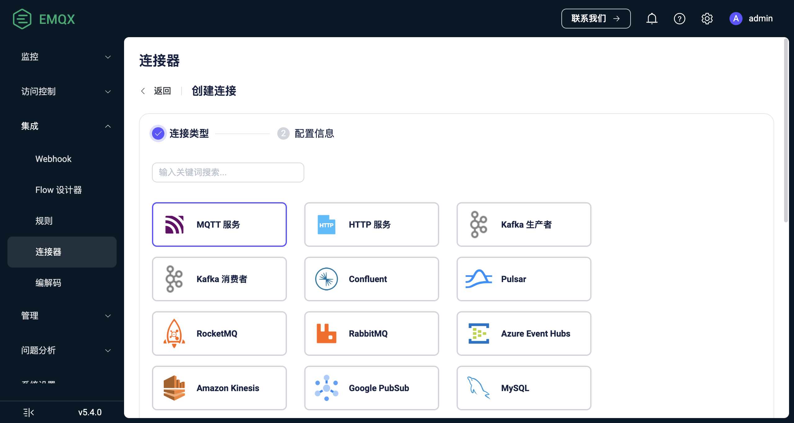
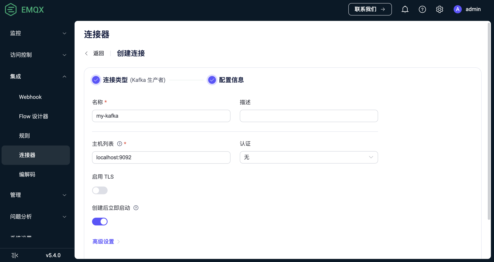

# 连接器

EMQX 连接器是数据集成的关键概念，它作为 Sink/Source 的底层连接通道，用于连接到外部数据系统。

## 基本概念

连接器仅关注与外部数据系统的连接，用户可以为不同的外部数据系统创建不同的连接器，一个连接器可以为多个 Sink/Source 提供连接。

以 MySQL Sink 为例，连接器与规则、Sink 的关系如下图所示：

### 特性与优势

在创建 Sink/Source 时，用户选择一个已经创建好的连接器即可，而不必关心底层连接的细节。这种设计带来的好处是：

- 将连接配置从数据处理和数据映射配置中分离出来，数据处理流的设计更加模块化和灵活。
- 连接器的创建和配置不会影响到数据处理流的设计，如果需要更改连接信息，只需在连接器中修改，这有助于简化配置和维护工作。
- 对于一些需要连接到多个 Sink/Source 的外部数据系统，可以通过创建一个连接器来实现，避免了重复配置的工作。

## 创建连接器

用户可以通过 Dashboard 创建并管理连接器，创建连接器的步骤如下：

:::tip
您也可以在创建 Sink/Source 时再创建连接器，这将会自动进入连接器创建流程。
:::

1. 在 Dashboard 页面，点击左侧导航目录中的**集成** -> **连接器**。

2. 点击页面右上角的**创建**按钮，进入连接器创建流程。

3. 在连接器类型选择页面，选择所需的连接器，点击**下一步**填写连接参数。支持的连接器参考[此处](./data-bridges.md#支持的集成)。

   :::tip
在 EMQX 开源版中，仅支持 HTTP 与 MQTT 连接器。
   :::
   
   

4. 在连接器配置信息页面，填写连接器的基本信息，包括连接器名称、描述，以及连接器的连接参数，此处内容请参考各个 Sink/Source 使用文档中的连接器参数部分，不在此处赘述。

   

## 更新连接器

在连接器创建完成后，用户可以在 Dashboard 上对连接器进行更新，包括连接器的基本信息和连接参数。

如果连接器被 Sink/Source 使用，更新连接器配置会导致 Sink/Source 重新加载，可能会造成数据处理中断，建议在业务低峰期进行更新。

无法删除正在使用的连接器，如果需要删除连接器，需要先删除使用该连接器的 Sink/Source。

## 连接器状态

您可以在 Dashboard 上查看连接器运行状态，以进行故障排查和监控。

连接器具有以下状态：

- 连接中（connecting）：在进行任何健康检查之前的初始状态，连接器仍在尝试连接到外部数据系统。
- 已连接（connected）：连接器已成功连接到外部数据系统。在此状态下，如果健康检查失败，桥接可能会转换为 connecting 或 - disconnected 状态，具体取决于故障的严重程度。
- 已断开（disconnected）：连接器未通过健康检查，处于不健康状态。根据其配置，它可能会定期尝试自动重新连接。
- 不一致（inconsistent）：集群节点之间的连接器状态不一致。例如连接器在某些节点上处于连接状态，而在其他节点上处于断开状态。

## 注意事项 - 连接池

部分连接器提供了连接池的概念，连接池是一组可重用的连接对象。通过连接池，用户无需在为每个请求重新创建连接，有助于降低资源消耗，提高连接效率和并发能力。

连接池的大小表示的是每个 EMQX 节点上的大小，EMQX 会在每个节点创建一个单独的连接池。鉴于 EMQX 通常以集群方式部署，这可能导致实际的连接数量超出外部数据系统的限制。

例如，一个包含 3 个节点的 EMQX 集群，如果连接器的连接池大小设置为 8，那么 EMQX 将创建 3 x 8 = 24 个连接。
