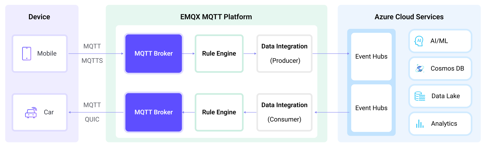

# 将 MQTT 数据传输到 Azure Event Hubs


::: tip

EMQX 企业版功能。EMQX 企业版可以为您带来更全面的关键业务场景覆盖、更丰富的数据集成支持，更高的生产级可靠性保证以及 24/7 的全球技术支持，欢迎[免费试用](https://www.emqx.com/zh/try?product=enterprise)。

:::


[Azure Event Hub](https://azure.microsoft.com/en-us/products/event-hubs) 是一个用于数据摄取的实时托管事件流平台。EMQX 与 Azure Event Hub 的集成为用户在高吞吐量情况下提供了可靠的数据传输和处理能力。Azure Event Hubs 可作为 EMQX 与 Azure 丰富的云服务应用之间的数据通道，将物联网数据集成到 Azure Blob Storage、Azure Stream Analytics 以及部署在 Azure 虚拟机上的各类应用和服务当中。目前，EMQX 支持使用 SASL/PLAIN 身份验证、通过与 Kafka 协议兼容的 Apache Kafka 终端点进行 Azure Event Hub 集成。

本页详细介绍了 EMQX 与 Azure Event Hubs 的数据集成并提供了实用的规则和 Sink 创建指导。

## 工作原理

Azure Event Hubs 数据集成是 EMQX 的一个开箱即用功能，旨在帮助用户无缝集成 MQTT 数据流与 Azure Event Hubs，利用其丰富的服务和能力进行物联网应用开发。



EMQX 通过规则引擎和 Sink 将 MQTT 数据转发到 Azure Event Hubs。完整的过程如下：

1. **物联网设备发布消息**：设备通过特定主题发布遥测和状态数据，触发规则引擎。
2. **规则引擎处理消息**：使用内置规则引擎，基于主题匹配处理来自特定来源的 MQTT 消息。规则引擎匹配相应的规则并处理消息，例如转换数据格式、过滤特定信息或用上下文信息丰富消息。
3. **桥接到 Azure Event Hubs**：规则触发将消息转发到 Azure Event Hubs 的动作，允许轻松配置数据属性、排序键，并将 MQTT 主题映射到 Azure Event Hubs 消息头。这为数据集成提供了更丰富的上下文信息和顺序保证，使得物联网数据处理更加灵活。

在 MQTT 消息数据写入 Azure Event Hubs 之后，您可以进行灵活的应用开发，例如：

- 实时数据处理和分析：利用 Azure Event Hubs 强大的数据处理和分析工具及其自身的流处理能力，对消息数据进行实时处理和分析，获取有价值的洞察和决策支持。
- 事件驱动功能：触发 Azure 事件处理，实现动态灵活的功能触发和处理。
- 数据存储和共享：将消息数据传输到 Azure Event Hubs 存储服务，安全存储和管理大量数据。这使您能够与其他 Azure 服务共享和分析这些数据，以满足各种业务需求。

## 特性与优势

EMQX 与 Azure Event Hubs 的数据集成可以为您的业务带来以下功能和优势：

- **高性能海量消息吞吐**：EMQX 支持海量 MQTT 客户端连接，每秒数百万条消息能够持续引入 Azure Event Hubs，可以获得极低的消息传输与存储延迟时间，并在 Azure Event Hubs 上配置保留时间实现消息量的控制。
- **灵活的数据映射**：通过配置的 Azure Event Hubs，可以实现 MQTT 主题与 Azure Event Hubs 事件中心的灵活映射，并且支持 MQTT 用户属性与 Azure Event Hubs 消息头的映射，这为数据集成提供了更丰富的上下文信息和顺序保证。
- **弹性伸缩支持**：EMQX 与 Azure Event Hubs 均可以支持弹性伸缩，能够随着应用规格进行扩展，轻松将物联网数据规模从数 MB 轻松扩展到数 TB。
- **丰富的生态系统**：得益于采用标准 MQTT 协议以及各类主流物联网传输协议的支持，EMQX 能够实现各类物联网设备的接入。结合 Azure Event Hubs 在 Azure Functions、各类编程语言 SDK 以及 Kafka 生态系统中的支持，能够轻松打通设备到云端的数据通道，实现无缝物联网数据接入与处理。

这些功能增强了集成能力和灵活性，可以帮助用户快速实现海量物联网设备数据与 Azure 的连接。让用户更便捷的获得云计算带来的数据分析和智能化能力，构建功能强大的数据驱动型应用。

## 准备工作

本节介绍了在 EMQX 中创建 Azure Event Hubs 数据集成之前需要做的准备工作，包括如何设置 Azure Event Hubs。

### 前置准备

- 了解[规则](./rules.md)。
- 了解[数据集成](./data-bridges.md)。

### 设置 Azure Event Hubs

为了使用 Azure Event Hub 数据集成，必须在 Azure 账户中设置命名空间和事件中心。以下 Azure 官方文档详细介绍了如何进行设置。

- [什么是适用于 Apache Kafka 的 Azure 事件中心](https://learn.microsoft.com/zh-cn/azure/event-hubs/azure-event-hubs-kafka-overview)
- [快速入门：使用 Azure 门户创建事件中心](https://learn.microsoft.com/zh-cn/azure/event-hubs/event-hubs-create)
- [快速入门：使用 Azure 事件中心和 Apache Kafka 流式传输数据](https://learn.microsoft.com/zh-cn/azure/event-hubs/event-hubs-quickstart-kafka-enabled-event-hubs?tabs=connection-string)
  - 遵循“连接字符串”说明，这是 EMQX 用于连接的方式。
- [获取事件中心连接字符串](https://learn.microsoft.com/zh-cn/azure/event-hubs/event-hubs-get-connection-string)

## 创建连接器

在添加 Azure Event Hubs Sink 前，您需要创建连接器用于将 Sink 连接到 Azure Event Hubs 服务器。

1. 进入 EMQX Dashboard，点击**集成** -> **连接器**。

2. 点击页面右上角的**创建**。

3. 在**创建连接器**页面，点击选择 **Azure Event Hubs**，然后点击**下一步**。

4. 为连接器输入一个名称，名称应为大小写字母和数字的组合，此处我们输入 `my-azure-event-hubs`。

5. 配置连接信息。

   - **引导主机**：输入命名空间的主机名。默认端口为 `9093`。其他字段按实际情况设置。
   - **连接字符串**：输入命名空间的连接字符串。可以在命名空间共享访问策略的“连接字符串 - 主键”中找到。有关详细信息，请参阅 [获取事件中心连接字符串](https://learn.microsoft.com/zh-cn/azure/event-hubs/event-hubs-get-connection-string)。
   - **启用 TLS**：连接到 Azure Event Hub 时默认启用 TLS。有关 TLS 连接选项的详细信息，请参阅 [外部资源访问的 TLS](../network/overview.md#启用-tls-加密访问外部资源)。

6. 点击最下方创建按钮完成规则创建。至此您已经完成连接器创建，接下来将继续创建一条规则和 Sink 来指定需要写入的数据。

现在，Azure Event Hubs 应该在连接器列表（**集成** -> **连接器**）中显示，**连接状态**为**已连接**。

## 创建 Azure Event Hubs Sink 规则

本节演示了如何在Dashboard 中创建规则和 Azure Event Hubs Sink，并将 Sink 添加到规则中。

1. 转到 Dashboard **集成** -> **规则页面**。

2. 点击页面右上角的创建。

3. 输入规则 ID，例如  `my_rule`。

4. 在 SQL 编辑器中输入规则，例如我们希望将 `t/#` 主题的 MQTT 消息存储至 Azure Event Hubs，可通过如下规则实现：

   注意：如果要自定义 SQL 语句，请确保 `SELECT` 字段包含 Sink 中所需的所有字段。

   ```sql
   SELECT
   *
   FROM
   "t/#"
   ```

5. 点击**添加动作**按钮，从**动作类型**下拉列表中选择 Azure Event Hubs，保持动作下拉框为默认的`创建动作`选项，您也可以从动作下拉框中选择一个之前已经创建好的 Azure Event Hubs 动作。此处我们创建一个全新的 Sink 并添加到规则中。
6. 在下方的表单中输入 Sink 的名称与描述。

7. 在连接器下拉框中选择刚刚创建的 `my-azure-event-hubs` 连接器。您也可以点击下拉框旁边的创建按钮，在弹出框中快捷创建新的连接器，所需的配置参数按照参照[创建连接器](#创建连接器)。

8. 配置 Sink 信息，完成数据的写入：

   - **事件中心名称**：输入要使用的事件中心的名称。注意：此处不支持变量。
   - **Azure Event Hub 头部**：输入一个占位符，作为将在发布到 Azure Event Hub 时添加到消息中的消息标头。
   - **Azure Event Hub 头部值编码模式**：选择消息标头的值编码模式；可选值为 `none` 或 `json`。
   - **额外的 Azure Event Hub 头部信息**：您可以点击**添加**为 Azure Event Hub 消息标头提供更多的键值对。
   - **消息键**：事件中心消息键。在此处插入一个字符串，可以是纯字符串或包含占位符（${var}）的字符串。
   - **消息值**：事件中心消息值。在此处插入一个字符串，可以是纯字符串或包含占位符（${var}）的字符串。
   - **消息时间戳**：指定要使用的时间戳类型。

9. 高级设置（可选）：根据业务需求设置 **最大批次字节数**、**所需确认** 和 **分区策略**等。

10. 在点击**创建**之前，您可以点击**测试连接**测试 Sink 是否能够连接到 Azure Event Hubs 服务器。

11. 点击**创建**按钮完成 Sink 的创建，创建成功后页面将回到创建规则，新的 Sink 将添加到规则动作中。

12. 回到规则创建页面，点击**创建**按钮完成整个规则创建。

现在您已成功创建了规则，你可以点击**集成** -> **规则**页面看到新建的规则，同时在**动作(Sink)** 标签页看到新建的 Azure Event Hubs Sink。

您也可以点击 **集成** -> **Flow 设计器**查看拓扑，通过拓扑可以直观的看到，主题 **t/#** 下的消息在经过规则 my_rule 解析后被写入到 Azure Event Hubs 中。

## 测试规则

您可以使用 [MQTTX](https://mqttx.app/zh) 来模拟客户端向 EMQX 发送 MQTT 消息来测试 Sink 和规则的运行。

1. 使用 MQTTX 向 `t/1` 主题发布消息：

```bash
   mqttx pub -i emqx_c -t t/1 -m '{ "msg": "Hello Azure Event Hub" }'
```

2. 在 **规则** 页面点击规则名称查看 Sink 运行统计，命中、发送成功次数应当 +1。

3. 在 Azure 门户仪表板中检查是否将消息写入配置的事件中心。使用任何兼容 Kafka 的消费者，检查消息是否被写入配置的事件中心。有关使用 Kafka CLI 的更多信息，请参阅 [Use the Kafka CLI to Send and Receive Messages to/from Azure Event Hubs for Apache Kafka Ecosystem](https://github.com/Azure/azure-event-hubs-for-kafka/tree/master/quickstart/kafka-cli)。
