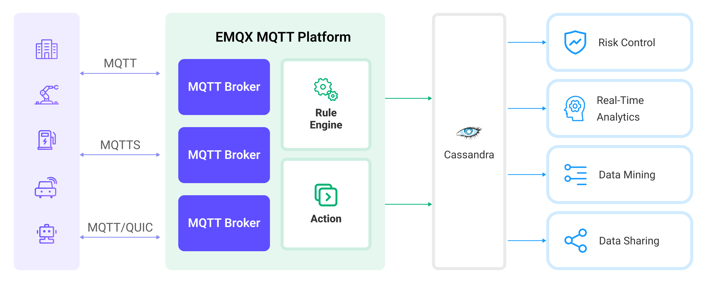

# 将 MQTT 数据写入到 Cassandra


::: tip

EMQX 企业版功能。EMQX 企业版可以为您带来更全面的关键业务场景覆盖、更丰富的数据集成支持，更高的生产级可靠性保证以及 24/7 的全球技术支持，欢迎[免费试用](https://www.emqx.com/zh/try?product=enterprise)。

:::


[Apache Cassandra](https://cassandra.apache.org/_/index.html) 是一种流行的开源分布式 NoSQL 数据库管理系统，旨在处理大规模数据集并用于构建高吞吐量的应用程序。EMQX 与 Apache Cassandra 的集成提供了将消息和事件存储在 Cassandra 数据库中的能力，实现时间序列数据存储、设备注册和管理以及实时数据分析等功能。

本页详细介绍了 EMQX 与 Cassandra 的数据集成并提供了实用的规则和 Sink 创建指导。



当前实现中：

- 仅支持 Cassandra v3.x，不兼容 v4.x。
- 仅支持同步方式存储数据。



## 工作原理

Cassandra 数据集成是 EMQX 的开箱即用功能，结合了 EMQX 的设备连接和消息传输能力以及 Cassandra 强大的数据存储能力。通过内置的[规则引擎](./rules.md)组件，集成简化了从 EMQX 到 Cassandra 的数据摄取过程，无需复杂的编码。

下图展示了 EMQX 和 Cassandra 之间的数据集成的典型架构：



将 MQTT 数据摄取到 Cassandra 的工作流程如下：

1. **消息发布和接收**：无论是连接车辆、工业物联网 (IIoT) 系统还是能源管理平台的物联网设备，都通过 MQTT 协议成功连接到 EMQX，并向特定主题发布 MQTT 消息。当 EMQX 接收到这些消息时，它将在其规则引擎中启动匹配过程。
2. **消息数据处理**：当消息到达时，它会通过规则引擎进行处理，然后由 EMQX 中定义的规则处理。规则根据预定义的标准确定哪些消息需要路由到 Cassandra。如果任何规则指定了载荷转换，那么这些转换将被应用，例如转换数据格式、过滤出特定信息，或用额外的上下文丰富载荷。
3. **数据写入到 Cassandra**：一旦规则引擎识别出一条消息需要存储到 Cassandra，它将触发一个将消息转发到 Cassandra 的动作。处理过的数据将被无缝写入 Cassandra 数据库的集合中。
4. **数据存储和利用**：数据现存储在 Cassandra 中，企业可以利用其查询能力应用于各种用例。例如，在连接车辆的领域，存储的数据可以用于通知车队管理系统关于车辆健康状况、根据实时指标优化路线规划或跟踪资产。类似地，在工业物联网 (IIoT) 设置中，数据可能用于监控机械运行状态、预测维护或优化生产计划。

## 特性与优势

与 Cassandra 的数据集成提供了一系列特性和优势，确保了数据传输、存储和利用的高效性：

- **大规模时序数据存储**：EMQX 能够处理海量设备连接与消息传递，借助 Cassandra 高度可扩展性和分布式存储的特性，能够实现大规模数据集包括时序数据的存储和管理，并支持基于时间范围的查询和聚合操作。
- **实时数据流**：EMQX 专为处理实时数据流而构建，确保了从源系统到 Cassandra 的数据传输的高效性和可靠性。它使组织能够实时捕获和分析数据，非常适合需要立即洞察和行动的用例。
- **高可用性保障**：EMQX 与 Cassandra 均提供了集群能力，两者结合使用的情况下，设备连接以及数据可以分布在多台服务器上，当一个节点发生故障时，系统可以自动切换到其他可用节点，从而实现高度可扩展性和容错性。
- **数据转换的灵活性**：EMQX 提供了强大的基于 SQL 的规则引擎，允许组织在将数据存储到 Cassandra 之前进行预处理。它支持各种数据转换机制，如过滤、路由、聚合和丰富，使组织能够根据他们的需求塑造数据。
- **灵活的数据模型**：Cassandra 使用基于列的数据模型，支持灵活的数据模式和动态添加列，适用于存储和管理结构化的设备事件与消息数据，能够轻松存储不同的 MQTT 消息数据。

## 准备工作

本节介绍了在 EMQX 中创建 Cassandra 数据集成之前需要做的准备工作，包括如何设置 Cassandra 服务器、创建 Keyspace 和 Table。

### 前置准备

- 了解 [规则](./rules.md)
- 了解[数据集成](./data-bridges.md)

### 安装 Cassandra

使用 docker 启动一个简单的 Cassandra 服务：

```bash
docker run --name cassa --rm -p 9042:9042 cassandra:3.11.14
```

### 创建 Keyspace 和 Table

使用 Docker 命令行创建名为 `mqtt` 的 Keyspace：

```bash
docker exec -it cassa cqlsh "-e CREATE KEYSPACE mqtt WITH REPLICATION = {'class': 'SimpleStrategy', 'replication_factor': 1}"
```

使用 Docker 命令行创建名为 `mqtt_msg` 的 Table：

```bash
docker exec -it cassa cqlsh "-e \
    CREATE TABLE mqtt.mqtt_msg( \
        msgid text, \
        topic text, \
        qos int,    \
        payload text, \
        arrived timestamp, \
        PRIMARY KEY(msgid, topic));"
```

## 创建连接器

在创建 Cassandra Sink 之前，您需要创建一个 Cassandra 连接器，以便 EMQX 与 Cassandra 服务建立连接。以下示例假定您在本地机器上同时运行 EMQX 和 Cassandra。如果您在远程运行 Cassandra 和 EMQX，请相应地调整设置。

1. 转到 Dashboard **集成** -> **连接器** 页面。点击页面右上角的**创建**。

2. 在连接器类型中选择 **Cassandra**，点击**下一步**。

3. 在 **配置** 步骤，配置以下信息：

   - 输入连接器名称，应为大写和小写字母及数字的组合，例如：`my_cassandra`。
   - 对于 **服务器**，输入 `127.0.0.1:9042`，`mqtt` 作为 **键空间**，其它保留为默认。
   - 决定是否启用 TLS。有关 TLS 连接选项的详细信息，请参见[启用 TLS 加密访问外部资源](../network/overview.md#启用-tls-加密访问外部资源)。

4. 高级配置（可选），根据情况配置同步/异步模式，队列与批量等参数，详细请参考 [Sink 的特性](./data-bridges.md#sink-的特性)。

6. 点击**创建**按钮完成连接器创建。

7. 在弹出的**创建成功**对话框中您可以点击**创建规则**，继续创建规则以指定需要写入 Cassandra 的数据。您也可以按照[创建 Cassandra Sink 规则](#创建-cassandra-sink-规则)章节的步骤来创建规则。

## 创建 Cassandra Sink 规则

本节演示了如何为 Cassandra Sink 创建一条规则以指定需要转发至 Cassandra 的数据。

1. 转到 Dashboard **集成** -> **规则**页面。

2. 点击页面右上角的**创建**。

3. 输入规则 ID `my_rule`，在 **SQL 编辑器**中输入规则，例如选择将 `t/#` 主题的 MQTT 消息转发至 Cassandra，规则 SQL 如下：

   注意：如果您希望制定自己的 SQL 语法，需要确保规则选出的字段（SELECT 部分）包含所有 SQL 模板中用到的变量。

   ```sql
   SELECT
     *
   FROM
     "t/#"
   ```

4. 点击右侧的**添加动作**按钮，为规则在被触发的情况下指定一个动作。

5. 在**动作类型**下拉框中选择 `Cassandra`，保持**动作**下拉框为默认的`创建动作`选项，您也可以选择一个之前已经创建好的 Cassandra Sink。此处我们创建一个全新的 Sink 并添加到规则中。

6. 输入名称，要求是大小写英文字母和数字组合。

7. 从**连接器**下拉框中选择刚刚创建的 `my_cassandra`。您也可以通过点击下拉框旁边的按钮创建一个新的连接器。有关配置参数，请参见[创建连接器](#创建连接器)。

8. 配置 CQL 模版，将字段 `topic`, `id`, `clientid`, `qos`, `palyload` 和 `timestamp` 存储到 Cassandra 数据库中。该模板将通过 Cassandra 查询语言执行，对应模板如下：

   ```sql
   insert into mqtt_msg(msgid, topic, qos, payload, arrived) values (${id}, ${topic},  ${qos}, ${payload}, ${timestamp})
   ```

9. 高级配置（可选），根据情况配置同步/异步模式，队列与批量等参数，详细请参考 [Sink 的特性](./data-bridges.md)。

10. 点击**创建**按钮完成 Sink 的创建，创建成功后页面将回到创建规则，新的 Sink 将添加到规则动作中。

11. 回到规则创建页面，点击**创建**按钮完成整个规则创建。

现在您已成功创建了规则，你可以点击**集成** -> **规则**页面看到新建的规则，同时在**动作(Sink)** 标签页看到新建的 Cassanadra Sink。

至此已经完成整个创建过程，可以前往 **集成** -> **Flow 设计器** 页面查看拓扑图，此时应当看到 `t/#` 主题的消息经过名为 `my_rule` 的规则处理，处理结果转发至 Cassandra。

## 测试规则

使用 MQTTX 向 `t/1` 主题发布消息：

```bash
mqttx pub -i emqx_c -t t/1 -m '{ "msg": "Hello Cassandra" }'
```

查看 Sink 运行统计，命中、发送成功次数应当 +1。

通过 Cassandra 命令查看消息是否已经写入 `mqtt_msg` 表中：

```bash
docker exec -it cassa cqlsh "-e SELECT * FROM mqtt.mqtt_msg;"
```
