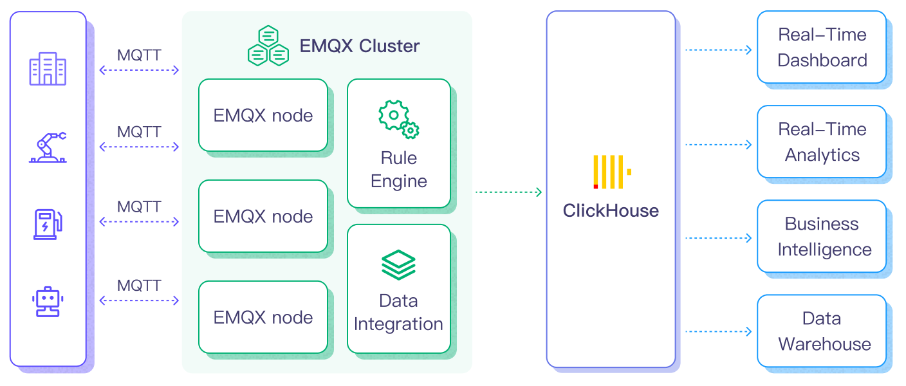

# 将 MQTT 数据写入到 ClickHouse

::: tip

ClickHouse 数据集成是 EMQX 企业版功能。

:::

[ClickHouse](https://clickhouse.com/) 是一种高性能的列式 SQL 数据库管理系统（DBMS），用于在线分析处理（OLAP），擅长以最小延迟处理和分析大量数据。它具有出色的查询性能、灵活的数据模型和可扩展的分布式架构，适用于各种数据分析场景。EMQX 支持与 ClickHouse 的数据集成，使您能够将 MQTT 消息和事件数据导入 ClickHouse 进行进一步的分析和处理。

## 工作原理

ClickHouse 数据集成是 EMQX 中的开箱即用功能，旨在结合 MQTT 的实时数据捕获和传输能力与 ClickHouse 的强大数据处理功能。借助内置的规则引擎组件，集成简化了将数据从 EMQX 导入 ClickHouse 进行存储和分析的过程，无需复杂的编码。

下图展示了 EMQX 与 ClickHouse 之间数据集成的典型架构。



将 MQTT 数据导入 ClickHouse 的过程如下：

1. **消息发布和接收**：工业物联网设备通过 MQTT 协议成功连接到 EMQX，并基于其操作状态、读数或触发事件，从机器、传感器和生产线发布实时 MQTT 数据到 EMQX。当 EMQX 收到这些消息时，它启动其规则引擎中的匹配过程。
2. **消息数据处理**：消息到达后，经过规则引擎处理，然后由 EMQX 中定义的规则处理。基于预定义标准的规则确定哪些消息需要路由到 ClickHouse。如果任何规则指定了有效载荷转换，则应用这些转换，例如转换数据格式、过滤特定信息或使用额外上下文丰富有效载荷。
3. **数据导入 ClickHouse**：一旦规则引擎识别出一个消息用于 ClickHouse 存储，它就会触发一个动作，将消息转发到 ClickHouse。处理过的数据将被无缝写入 ClickHouse 数据库的集合中。
4. **数据存储和利用**：随着数据现在存储在 ClickHouse 中，企业可以利用其查询能力应用于各种用例。例如，在物流和供应链管理领域，可以监控和分析 IoT 设备（如 GPS 跟踪器、温度传感器和库存管理系统）的数据，进行实时跟踪、路线优化、需求预测和高效库存管理。

## 功能和优势

与 ClickHouse 的数据集成提供了一系列功能和优势，以确保高效的数据传输、存储和利用：

- **实时数据流处理**：EMQX 专为处理实时数据流而构建，确保从源系统到 ClickHouse 的高效可靠数据传输。它使组织能够实时捕获和分析数据，非常适合需要立即洞察和行动的用例。
- **高性能和可扩展性**：EMQX 的分布式架构和 ClickHouse 的列式存储格式实现随着数据量增加的无缝扩展。这确保了即使在大数据集下也能保持一致的性能和响应能力。
- **灵活的数据转换**：EMQX 提供了强大的基于 SQL 的规则引擎，允许组织在将数据存储

到 ClickHouse 之前对数据进行预处理。它支持各种数据转换机制，如过滤、路由、聚合和丰富，使组织能够根据其需求塑造数据。

- **易于部署和管理**：EMQX 提供了用户友好的界面，用于配置数据源、预处理数据规则和 ClickHouse 存储设置。这简化了数据集成过程的设置和持续管理。
- **高级分析**：ClickHouse 强大的基于 SQL 的查询语言和对复杂分析函数的支持，使用户能够从物联网数据中获得宝贵洞察力，实现预测分析、异常检测等。

## 准备工作

本节描述了您在开始在 EMQX Dashboard 中创建 ClickHouse 数据集成之前需要完成的准备工作。

### 前置准备

- 了解 EMQX 数据集成[规则](./rules.md)
- 了解[数据集成](./data-bridges.md)
- 掌握 UNIX 终端和命令的基础知识

### 启动 ClickHouse 服务器

本节将介绍如何通过 [Docker](https://www.docker.com/) 启动 ClickHouse 服务器。

1. 创建一个 `init.sql` 文件并包含以下初始化 SQL 命令：

   ```bash
   cat >init.sql <<SQL_INIT
   CREATE DATABASE IF NOT EXISTS mqtt_data;
   CREATE TABLE IF NOT EXISTS mqtt_data.messages (
      data String,
      arrived TIMESTAMP
   ) ENGINE = MergeTree()
   ORDER BY arrived;
   SQL_INIT
   ```

2. 运行以下命令通过 Docker 启动 ClickHouse 服务器，其中定义了数据库的名称、端口号、用户名和密码，方便后续通过 EMQX 创建 Sink 时配置连接信息。同时我们还将 `init.sql` 文件映射为容器内的一个文件。

   ```bash
   docker run \
   --rm \
   -e CLICKHOUSE_DB=mqtt_data \
   -e CLICKHOUSE_USER=emqx \
   -e CLICKHOUSE_DEFAULT_ACCESS_MANAGEMENT=1 \
   -e CLICKHOUSE_PASSWORD=public \
   -p 18123:8123 \
   -p 19000:9000 \
   --ulimit nofile=262144:262144 \
   -v $pwd/init.sql:/docker-entrypoint-initdb.d/init.sql \
   clickhouse/clickhouse-server
   ```

有关如何通过 Docker 运行 ClickHouse 服务器的更多信息，可阅读 [Docker - ClickHouse Server](https://hub.docker.com/r/clickhouse/clickhouse-server)。

## 创建连接器

在创建 ClickHouse Sink 之前，您需要创建一个 ClickHouse 连接器，以便 EMQX 与 ClickHouse 服务建立连接。以下示例假定您在本地机器上同时运行 EMQX 和 ClickHouse。如果您在远程运行 ClickHouse 和 EMQX，请相应地调整设置。

1. 转到 Dashboard **集成** -> **连接器** 页面。点击页面右上角的**创建**。
2. 在连接器类型中选择 **ClickHouse**，点击**下一步**。
3. 在 **配置** 步骤，配置以下信息：

   - **连接器名称**：应为大写和小写字母及数字的组合，例如：`my_clickhouse`。
   - **服务器 URL**： `http://127.0.0.1:18123`
   - **数据库名称**：`mqtt_data`
   - **用户名**：`emqx`
   - **密码**：`public`
4. 高级设置（可选）：具体可阅读[ 高级配置](#高级配置)。
5. 点击**创建**按钮完成连接器创建。
6. 在弹出的**创建成功**对话框中您可以点击**创建规则**，继续创建规则以指定需要写入 ClickHouse 的数据。您也可以按照[创建 ClickHouse Sink 规则](#创建-clickhouse-sink-规则)章节的步骤来创建规则。

## 创建 ClickHouse Sink 规则

本节演示了如何在 Dashboard 中创建一条规则，用于处理来自源 MQTT 主题 `t/#` 的消息，并通过配置的 Sink 将处理后的结果写入到 ClickHouse 中。

1. 转到 Dashboard **集成** -> **规则**页面。

2. 点击页面右上角的**创建**。

3. 输入规则 ID，例如 `my_rule`。

4. 在 SQL 编辑器中输入规则，例如我们希望将 `t/#` 主题的 MQTT 消息转发至 ClickHouse，可通过如下规则 SQL 实现：

   ```sql
   SELECT
     payload as data,
     now_timestamp() as timestamp
   FROM
     "t/#"
   ```

   ::: tip

   如果您初次使用 SQL，可以点击 **SQL 示例**和**启用调试**来学习和测试规则 SQL 的结果。

   :::

5. 点击右侧的**添加动作**按钮，为规则在被触发的情况下指定一个动作。通过这个动作，EMQX 会将经规则处理的数据发送到 ClickHouse。

6. 在**动作类型**下拉框中选择 `ClickHouse`，保持**动作**下拉框为默认的`创建动作`选项，您也可以选择一个之前已经创建好的 ClickHouse Sink。此处我们创建一个全新的 Sink 并添加到规则中。

7. 输入 Sink 名称，名称应为大/小写字母和数字的组合。

8. 从**连接器**下拉框中选择刚刚创建的 `my_clickhouse`。您也可以通过点击下拉框旁边的按钮创建一个新的连接器。有关配置参数，请参见[创建连接器](#创建连接器)。

9. **批量值分隔符**（可选）：用于区分多个输入项，本示例中可保留默认的 `,` 。注意：您只需在启用[批量模式](./data-bridges.md)、且使用其他 [ClickHouse 数据格式](https://clickhouse.com/docs/en/sql-reference/statements/insert-into)时才需更改设置。

10. 在 SQL 模版中输入以下命令（您可通过[规则引擎](./rules.md)确保输入 SQL 语句中的字符串能被正确转义，以防 SQL 注入攻击）：

   ```sql
   INSERT INTO messages(data, arrived) VALUES ('${data}', ${timestamp})
   ```

   其中，`${data}` 和 `${timestamp}` 分别代表消息内容和时间戳，即稍后将在[规则](#创建数据转发规则)时进行配置的消息转发内容。EMQX 在进行消息转发前会按照设定将其替换为相应内容。

11. 高级设置（可选）：具体可阅读[ 高级配置](#高级配置)。

12. 点击**创建**前，您可点击**测试连接**按钮确保能连接到 ClickHouse 服务器。

13. 点击**创建**按钮完成 Sink 的创建，创建成功后页面将回到创建规则，新的 Sink 将添加到规则动作中。

14. 回到规则创建页面，点击**创建**按钮完成整个规则创建。

现在您已成功创建了规则，你可以点击**集成** -> **规则**页面看到新建的规则，同时在**动作(Sink)** 标签页看到新建的 ClickHouse Sink。

至此已经完成整个创建过程，可以前往 **集成** -> **Flow 设计器** 页面查看拓扑图，此时应当看到 `t/#` 主题的消息经过名为 `my_rule` 的规则处理，处理结果转发至 ClickHouse。

## 测试规则

您可通过 EMQX Dashboard 内置的 WebSocket 客户端进行规则和 Sink 的验证。在 Dashboard 页面，点击左侧导航目录中的 **问题分析** -> **WebSocket 客户端**。

按照以下步骤建立 WebSocket 客户端并通过该客户端向主题 `t/test` 发送一条消息：

1. 填写当前 EMQX 的连接信息。由于本教程中的 EMQX 在本地运行，因此除您修改过配置外（如修改过访问规则的配置，需要输入用户名和密码），可直接使用默认配置。
2. 点击**连接**，建立该 MQTT 客户端与 EMQX 的连接。
3. 前往发布区域，并进行如下配置：
   - 主题：`t/test`
   - Payload：`Hello World ClickHouse from EMQX`
   - QoS：2
4. 点击**发布**完成消息的发送。

此时，该消息应该已被转发至 ClickHouse 服务器的 `mqtt_data` 数据库中，并插入 `messages` 表中。你可在命令行中输入如下命令进行确认：

```bash
curl -u emqx:public -X POST -d "SELECT * FROM mqtt_data.messages" http://localhost:18123
```

如消息被正确转发，将能看到类似的返回结果：

```bash
Hello World Clickhouse from EMQX        2024-01-17 09:40:06
```

## 高级配置

本节深入探讨了 EMQX ClickHouse 数据结成的高级配置选项。在 Dashboard 中配置 ClickHouse 连接器时，导航至**高级设置**以根据您的特定需求调整以下参数。

| **字段**                | **描述**                                                     | **推荐值** |
| ----------------------- | ------------------------------------------------------------ | ---------- |
| **连接池大小**          | 指定与 ClickHouse 服务交互时连接池中可以维护的并发连接数量。此选项通过限制或增加 EMQX 与 ClickHouse 之间的活动连接数量，帮助管理应用的可伸缩性和性能。<br/>**注意**：设置合适的连接池大小取决于多种因素，如系统资源、网络延迟和您应用的特定工作负载。过大的池大小可能导致资源耗尽，而过小的大小可能限制吞吐量。 | `8`        |
| **Clickhouse 超时时间** | 指定连接器尝试与 ClickHouse 服务器建立连接时的最大等待时间（以秒为单位）。<br/>**注意**：谨慎选择超时设置对于平衡系统性能和资源利用至关重要。建议在各种网络条件下测试系统，以找到适合您特定用例的最佳超时值。 | `15`       |
| **启动超时时间**        | 确定连接器在响应资源创建请求之前等待自动启动资源达到健康状态的最大时间间隔（以秒为单位）。此设置有助于确保连接器在验证连接的资源 - 如 ClickHouse 中的数据库实例 - 已完全运行并准备处理数据事务之前，不会继续进行操作。 | `5`        |
| **缓冲池大小**          | 指定将为管理 EMQX 和 ClichHouse 之间的 egress （出口）模式数据集成的数据流分配的缓冲工作进程数量。这些工作进程负责在数据发送到目标服务之前临时存储和处理数据。此设置特别适用于优化性能和确保出口场景中的平稳数据传输。对于仅处理 ingress（入口）数据流的数据集成，此选项可以设置为 "0"，因为它不适用。 | `16`       |
| **请求 TTL**            | “请求 TTL”（生存时间）配置设置指定请求进入缓冲后被视为有效的最大持续时间（以秒为单位）。此计时器从请求被缓冲的那一刻开始计时。如果请求在缓冲区中停留的时间超过此 TTL 设置，或者被发送但没有从 ClickHouse 收到及时的响应或确认，请求将被视为已过期。 | `45`       |
| **健康检查间隔**        | 指定连接器对 ClickHouse 连接执行自动健康检查的时间间隔（以秒为单位）。 | `15`       |
| **最大缓冲队列大小**    | 指定 ClickHouse 连接器中每个缓冲工作进程可以缓冲的最大字节数。缓冲工作进程在数据发送到 ClickHouse 之前临时存储数据，作为中介以更有效地处理数据流。根据您的系统性能和数据传输需求调整该值。 | `256`      |
| **最大批处理大小**      | 指定从 EMQX 到 ClickHouse 的单次传输操作中可以传输的数据批次的最大大小。通过调整大小，您可以微调 EMQX 和 ClickHouse 之间数据传输的效率和性能。<br />如果“最大批处理大小”设置为“1”，则数据记录将单独发送，而不会分组到批次中。 | `1`        |
| **查询模式**            | 允许您选择 `asynchronous` 或 `synchronous` 查询模式，根据不同需求优化消息传输。在异步模式下，写入 ClickHouse 不会阻塞 MQTT 消息发布过程。然而，这可能导致客户端在消息到达 ClickHouse 之前就接收到消息。 | `Async`    |
| **Inflight 窗口**       | “in-flight 查询”是指已启动但尚未收到响应或确认的查询。此设置控制连接器与 ClickHouse 通信时可以同时存在的最大 in-flight 查询数量。<br/>当 **查询模式** 设置为 `async`（异步）时，“Inflight 窗口”参数获得特殊重要性。如果对于来自同一 MQTT 客户端的消息按严格顺序处理至关重要，您应将此值设置为 1。 | `100`      |

## 更多信息

点击以下链接了解更多：

**博客**：

- [EMQX + ClickHouse 实现物联网数据接入与分析](https://www.emqx.com/zh/blog/emqx-and-clickhouse-for-iot-data-access-and-analysis)
- [MQTT 与 ClickHouse 集成：激发实时物联网数据分析的潜能](https://www.emqx.com/zh/blog/mqtt-to-clickhouse-integration)
