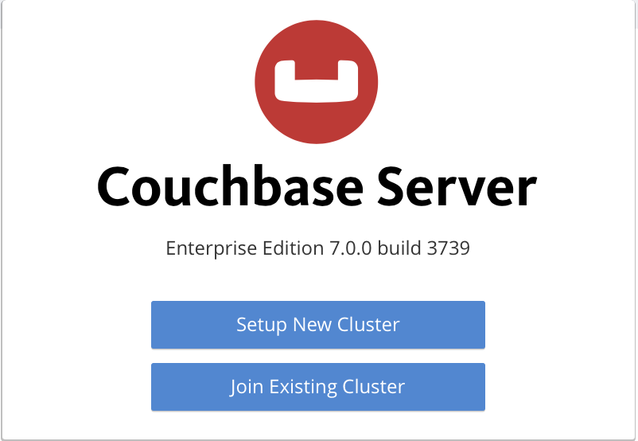
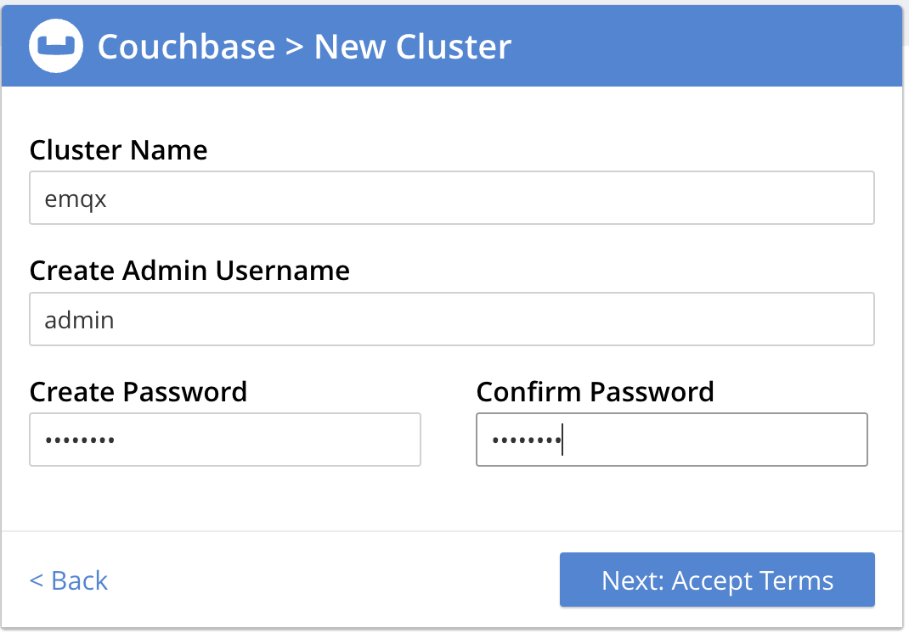

# 将 MQTT 数据写入到 Couchbase

::: tip

Couchbase 数据集成是 EMQX 企业版功能。

:::

[Couchbase](https://couchbase.com/) 是一个多用途的分布式数据库，它结合了关系型数据库的优势（如 SQL 和 ACID 事务）与 JSON 的多功能性。Couchbase 的基础架构性能极高且可扩展，广泛应用于各行业的用户画像、动态产品目录、生成式 AI 应用、向量搜索、高速缓存等场景。

## 工作原理

Couchbase 数据集成是 EMQX 中开箱即用的功能，旨在将 MQTT 的实时数据捕获和传输能力与 Couchbase 的强大数据处理功能结合在一起。通过内置的[规则引擎](./rules.md)组件，这种集成简化了将数据从 EMQX 导入 Couchbase 进行存储和分析的过程，无需复杂的编码。

下图展示了 EMQX 与 Couchbase 数据集成的典型架构。


将 MQTT 数据导入 Couchbase 的工作流程如下：

1. **消息发布和接收**：工业物联网设备通过 MQTT 协议成功连接到 EMQX，并基于其操作状态、读数或触发事件，将机器、传感器和生产线的实时 MQTT 数据发布到 EMQX。当 EMQX 接收到这些消息时，它会启动其规则引擎中的匹配过程。
2. **消息数据处理**：消息到达后，它会通过规则引擎并由 EMQX 中定义的规则进行处理。这些规则基于预定义的条件，决定哪些消息需要路由到 Couchbase。如果规则指定了负载转换，则会进行相应的转换，如数据格式转换、过滤特定信息或用额外的上下文丰富负载。
3. **数据导入到 Couchbase**：一旦规则引擎识别出某条消息需要存储到 Couchbase，它会触发一个操作，将消息转发到 Couchbase。处理后的数据将无缝地写入 Couchbase 数据库的数据集中。
4. **数据存储和利用**：数据存储在 Couchbase 中后，企业可以利用其强大的查询能力支持各种用例。例如，在动态产品目录的场景中，企业可以使用 Couchbase 高效管理和检索产品信息，支持实时库存更新，并向客户提供个性化推荐，从而提升购物体验并增加销售额。

## 功能和优势

与 Couchbase 的数据集成提供了一系列功能和优势，旨在确保数据传输、存储和利用的高效性：

- **实时数据流**：EMQX 专为处理实时数据流而设计，确保从源系统到 Couchbase 的数据传输高效且可靠。它使组织能够实时捕获和分析数据，非常适合需要即时见解和行动的使用场景。
- **高性能和可扩展性**：EMQX 的分布式架构和 Couchbase 的列式存储格式在数据量增加时实现无缝扩展。这确保了即使在处理大数据集时，性能和响应速度也能保持一致。
- **数据转换的灵活性**：EMQX 提供了强大的基于 SQL 的规则引擎，允许组织在将数据存储到 Couchbase 之前进行预处理。它支持多种数据转换机制，如过滤、路由、聚合和丰富，帮助组织根据自身需求调整数据。
- **易于部署和管理**：EMQX 提供了一个用户友好的界面，用于配置数据源、预处理数据规则和 Couchbase 存储设置。这简化了数据集成过程的设置和持续管理。
- **高级分析功能**：Couchbase 强大的基于 SQL 的查询语言和对复杂分析功能的支持，使用户能够从物联网数据中获得有价值的见解，实现预测性分析、异常检测等功能。

## 准备工作

本节介绍在 EMQX Dashboard 中创建 Couchbase 数据集成之前需要完成的准备工作。

### 前置准备

- 了解 EMQX 数据集成[规则](./rules.md)
- 了解[数据集成](./data-bridges.md)
- 具备 UNIX 终端和命令的基础知识

### 启动 Couchbase 服务器

本节介绍如何使用 [Docker](https://www.docker.com/) 启动 Couchbase 服务器。

1. 使用以下命令启动 Couchbase 服务器。

   ```bash
   docker run -t --name db -p 8091-8096:8091-8096 -p 11210-11211:11210-11211 couchbase/server:enterprise-7.2.0
   ```

   运行该命令时，Docker 会下载并安装 Couchbase 服务器。Couchbase 服务器在 Docker 虚拟环境中启动后，您应该会看到以下消息：

   ```
   Starting Couchbase Server -- Web UI available at http://<ip>:8091
   and logs available in /opt/couchbase/var/lib/couchbase/logs
   ```

2. 在浏览器中打开 Couchbase Web 控制台，访问 `http://localhost:8091`。



1. 点击 **Setup New Cluster** 并为您的集群命名。为了便于入门，将完整管理员凭据设置为 `admin` 和 `password`。



1. 接受条款和条件，然后点击 **Finish with Defaults**，使用默认值完成配置。

2. 输入完配置信息后，点击右下角的 **Save & Finish** 按钮。这将根据配置设置服务器，并打开 Couchbase Web 控制台仪表板。在左侧导航面板中选择 **Buckets**，然后点击 **ADD BUCKET** 按钮。

   

3. 输入 bucket 的名称，例如 `emqx`，然后点击 **Create** 以创建 bucket。

4. 为默认集合创建主索引：

   ```bash
   docker exec -t db /opt/couchbase/bin/cbq -u admin -p password -engine=http://127.0.0.1:8091/ -script "create primary index on default:emqx_data._default._default;"
   ```

您可以在[官方文档页面](https://docs.couchbase.com/server/current/getting-started/do-a-quick-install.html)找到有关在 Docker 中运行 Couchbase 的更多信息。

## 创建连接器

本节演示如何创建一个连接器，将 Sink 连接到 Couchbase 服务器。

以下步骤假设您在本地机器上运行 EMQX 和 Couchbase。如果 Couchbase 和 EMQX 远程运行，请相应调整设置。

1. 进入 EMQX Dashboard，点击**集成** -> **连接器**。
2. 点击页面右上角的**创建**。
3. 在**连接器类型**中，选择 **Couchbase**，然后点击 **下一步**。
4. 在**配置信息**步骤中，配置以下信息：
   - **连接器名称**：输入连接器名称，名称应为大小写字母和数字的组合，例如：`my_couchbase`。
   - **服务器地址**：`127.0.0.1`
   - **用户名**：`admin`
   - **密码**：`password`
5. 高级设置（可选）：请参阅[高级配置](#advanced-configurations)。
6. 在点击**创建**之前，您可以点击**测试连接**按钮，测试连接器是否能连接到 Couchbase 服务器。
7. 点击页面底部的**创建**按钮，完成连接器的创建。在弹出对话框中，您可以点击**返回连接器列表**或点击**创建规则**继续创建规则和接收器，以指定要转发到 Couchbase 的数据。有关详细步骤，请参阅[创建 Couchbase Sink 规则](#创建-couchbase-sink-规则)。

## 创建 Couchbase Sink 规则

本节演示如何在 Dashboard 中创建规则，以处理来自源 MQTT 主题 `t/#` 的消息，并通过配置的接收器将处理后的结果转发到 Couchbase。

1. 进入 EMQX Dashboard，从左侧导航菜单点击**集成** -> **规则**。

2. 点击页面右上角的**创建**。

3. 输入规则 ID，例如 `my_rule`。

4. 在 SQL 编辑器中输入规则，例如希望将 `t/#` 主题的 MQTT 消息转发至 Couchbase，可通过如下规则 SQL 实现：

   ```sql
   SELECT 
     *
   FROM
     "t/#"
   ```

5. 点击 + **添加动作** 按钮，定义规则触发时将执行的操作。通过此操作，EMQX 将规则处理后的数据发送到 Couchbase。

6. 从**动作类型**下拉列表中选择 `Couchbase`。保持**动作**下拉框为默认的`创建动作`选项，您也可以选择一个之前已经创建好的 Couchbase Sink。此处将创建一个全新的 Sink 并添加到规则中。

7. 输入 Sink 名称。名称应为大小写字母和数字的组合。

8. 从**连接器**下拉框中选择刚创建的 `my_couchbase`。您也可以通过点击下拉框旁的按钮创建新的连接器。有关配置参数，请参阅[创建连接器](#创建连接器)。

9. 在 SQL 模板中输入以下命令：

   ```sql
   insert into emqx_data (key, value) values (${.id}, ${.payload})
   ```

   其中，`${.id}` 和 `${.payload}` 分别表示 MQTT 消息的 id 和 payload。在转发消息之前，EMQX 会用相应的内容替换它们。

10. 高级设置（可选）：请参阅[高级配置](#高级配置)。

11. 在点击**创建**之前，您可以点击**测试连接**按钮，确保能够连接到 Couchbase 服务器。

12. 点击**创建**按钮完成 Sink 配置。在**创建规则**页面，您将在**动作输出**选项卡下看到新的 Sink。

13. 在**创建规则**页面，验证配置信息并点击**创建**按钮生成规则。您创建的规则将显示在规则列表中，**状态**应为已连接。

现在，您已成功创建规则，您可以在**规则**页面上看到新规则。点击 **动作 (Sink)** 选项卡，您会看到新的 Couchbase Sink。

您还可以点击 **集成** -> **Flow 设计器** 查看拓扑。您可以看到主题 `t/#` 下的消息在被规则 `my_rule` 解析后，被发送并保存到 Couchbase。

## 测试规则

您可以使用 EMQX Dashboard 内置的 WebSocket 客户端来测试规则是否按预期工作。

点击 Dashboard 左侧导航菜单中的 **问题分析** -> **WebSocket 客户端**，访问 WebSocket 客户端。按照以下步骤设置 WebSocket 客户端并向主题 `t/test` 发送消息：

1. 填写当前 EMQX 实例的连接信息。如果您在本地运行 EMQX，您可以使用默认值，除非您更改了 EMQX 的默认配置（例如，您可能已配置了身份验证，这可能需要输入用户名和密码）。

2. 点击**连接**连接客户端到 EMQX 实例。

3. 向下滚动到发布区域并输入以下内容：

   - **主题**: `t/test`
   - **Payload**: `Hello World Couchbase from EMQX`
   - **QoS**: `2`

4. 点击**发布**发送消息。Couchbase 服务器中的 `emqx_data` bucket 中应已插入一个条目。您可以通过在终端运行以下命令来检查：

   ```bash
   docker exec -t db /opt/couchbase/bin/cbq -u admin -p password -engine=http://127.0.0.1:8091/ -script "SELECT * FROM emqx_data._default._default LIMIT 5;"
   ```

5. 如果一切正常，上述命令应输出类似以下内容（`requestID` 和指标可能有所不同）：

   ```json
   {
       "requestID": "88be238c-5b63-453d-ac16-c0368a5be2bc",
       "signature": {
           "*": "*"
       },
      "results": [
      {
          "_default": "Hello World Couchbase from EMQX"
      }
      ],
      "status": "success",
      "metrics": {
          "elapsedTime": "3.189125ms",
          "executionTime": "3.098709ms",
          "resultCount": 1,
          "resultSize": 61,
          "serviceLoad": 2
      }
   }
   ```

## 高级配置

本节深入探讨 EMQX Couchbase 连接器可用的高级配置选项。在 Dashboard 中配置连接器时，导航到 **高级设置**，根据您的具体需求调整以下参数。

| **字段**          | **描述**                                                     | **推荐值** |
| ----------------- | ------------------------------------------------------------ | ---------- |
| **HTTP 流水线**** | 指定可以在不等待单个响应的情况下连续发送到服务器的 HTTP 请求数量。此选项取一个正整数值，表示将被流水线化的 HTTP 请求的最大数量。<br />设置为 `1` 时，表示传统的请求-响应模型，其中每个 HTTP 请求都会发送，然后客户端会等待服务器响应，然后再发送下一个请求。较高的值可以通过允许批量发送多个请求来更有效地使用网络资源，从而减少往返时间。 | `100`      |
| **连接池大小**    | 指定与 Couchbase 服务对接时连接池中可以维持的并发连接数。此选项通过限制或增加 EMQX 和 Couchbase 之间的活动连接数，有助于管理应用程序的可扩展性和性能。<br/>**注意**：设置适当的连接池大小取决于多种因素，如系统资源、网络延迟和应用程序的特定工作负载。过大的池大小可能导致资源耗尽，而过小的大小可能限制吞吐量。 | `8`        |
| **连接超时**      | 指定连接器在尝试与 Couchbase 服务器建立连接时将等待的最长时间（以秒为单位）。<br/>**注意**：精心选择的超时设置对于平衡系统性能和资源利用率至关重要。建议在各种网络条件下测试系统，以找到适合您的特定用例的最佳超时值。 | `15`       |
| **启动超时时间**  | 确定连接器在响应资源创建请求之前，将等待自动启动的资源达到健康状态的最长时间间隔（以秒为单位）。此设置有助于确保连接器在验证连接资源（例如 Couchbase 中的数据库实例）完全运行并准备好处理数据事务之前，不会继续进行操作。 | `5`        |
| **健康检查间隔**  | 指定连接器对 Couchbase 连接执行自动健康检查的时间间隔（以秒为单位）。 | `15`       |